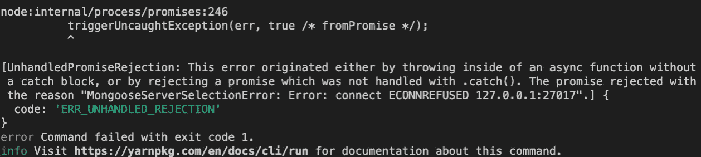
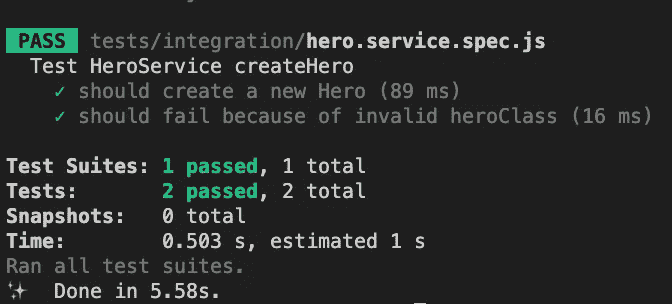
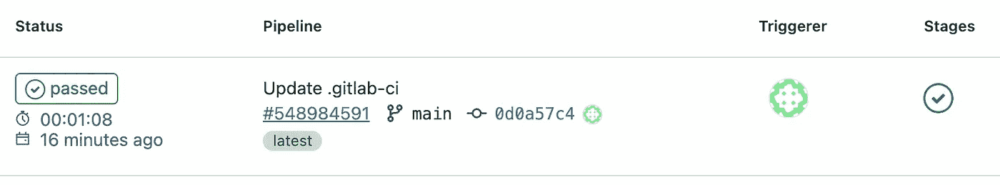

# 通过自动化集成测试提高 Dx 和代码质量

> 原文：<https://betterprogramming.pub/improve-dx-and-code-quality-with-automated-integration-tests-a94249a0ee2e>

## 通过这篇**NodeJs**+**Jest**+**Database**+**Docker**+**GitlabCI**教程，学会减少软件中的缺陷


卡斯帕·卡米尔·鲁宾在 [Unsplash](https://unsplash.com?utm_source=medium&utm_medium=referral) 上拍摄的照片

# 介绍

开发者体验是一个相对较新的术语，用来描述技术团队在开发产品时的体验。好的 DX 会提高你团队的生产力和幸福感。不好的 DX 最有可能导致你团队的人员流动。

这就是你如何快速提高你的团队的 DX，同时提高你的软件质量:自动化集成测试。

在本文中，我将使用 NodeJS + Jest 作为测试框架。测试将与 MongoDB 数据库集成，并将在 GitlabCI 中自动运行。

我们还将通过在启动测试时自动启动 MongoDB 的 Docker 实例来本地运行测试。

我在我的文章中使用 MongoDB，但是这个过程对于任何其他数据库(MySQL、PostgreSQL 等)都是一样的。).

好了，让我们开始写代码吧！(完整的代码可以在 GitLab 的找到)

# 地方发展

Nodejs + Jest + Docker

## NodeJs

首先，让我们用 mongoose 和 babel 设置我们的 NodeJs 项目，以便我们可以使用 ES6 语法。

```
mkdir jest-mongo-docker
cd jest-mongo-docker
yarn init
yarn add mongoose
yarn add -D @babel/core @babel/node @babel/preset-env
```

下面的代码是`.babelrc`。将此放在项目的根目录下:

。/.babelrc 配置文件

# 密码

对于我们的例子，我们将有一个`Hero`模型。

。/英雄/hero.model.js

我添加了一些约束，只是为了利用 mongoose 验证和编写失败的测试。

让我们在 `service`中添加一些调用 mongoose 模型的代码。

。/hero/hero.service.js

好了，现在我们有了自己的域代码，让我们设置 Jest 并编写一些测试！

# 玩笑

让我们使用以下命令将 Jest 安装为 devDependencies:

```
yarn add -D jest
```

将这个脚本命令添加到您的`package.json`文件中:

```
"test": "jest --config ./jest.config.js --detectOpenHandles"
```

这告诉 jest 使用一个名为`jest.config.js`的配置文件，它位于项目的根目录下。`--detectOpenHandles`选项在测试中处理定时器和异步代码时非常有用，正如它的名字所表明的，例如检测遗留的打开的连接或未解决的承诺。

现在，我们将编写一些数据库实用程序，我们将在每个测试中使用它们。

。/tests/utils.js

我们的实用程序名称非常简单:

*   `dbConnect`用于初始化与数据库的连接。如你所见，`process.env.CI`有点小意思。如果您有自己的 MongoDB 实例，只需将它的 URI 放到`uri`常量中即可。
*   `dbDisconnect`用于破坏我们的数据库并关闭连接。
*   因为我们希望我们所有的测试相互独立，所以我们使用来自我们集合的`dbClear`到`deleteAll`数据。

现在，这里是实际的测试:

。/测试/集成/hero.service.spec.js

正如您所看到的，我们在 jest 挂钩中使用了不同的实用程序来确保在测试之前创建到数据库的连接，在测试之后关闭，并且在每次测试之后清理数据库。

如果您在`utils.js`文件中指定了一个已经启动并运行的 MongoDB 服务器的 URL，那么两个测试都应该已经变绿了。

但是，如果您没有进行任何更改，您应该会得到以下错误:



测试失败

让我们在下一节中解决这个问题！

# Docker + GitLabCI

我们将在 jest 和 GitlabCI 中启动一个 MongoDB docker 实例。

首先，在项目的根目录下添加这个 jest 配置:

。/jest.config.js

`globalSetup`和`globalTeardown`是用于指定 jest 执行整个测试系列之前和之后要执行的文件路径的字段。

`globalSetup`目标是:

*   检测测试是在本地还是在 GitLab 中运行
*   如果在本地，启动 MongoDB 的 docker 实例
*   等待创建到 MongoDB 的连接

。/tests/setup/globalSetup.js

如您所见，在文件的开头有一个`environmentKeysToDelete`常量。这是一个由`strings`组成的数组，您可以用它来删除`.env`键，以确保您不会在不同的环境(开发、试运行、生产等)中运行您的测试。).

`globalTeardown`目标很简单:在 jest 运行完所有测试之后，如果我们正在本地主机中执行测试，那么删除 MongoDB docker 实例。

。/tests/setup/globalTeardown.js

现在，如果你运行`yarn test`(没有设置你自己的蒙戈 URI)，一切都应该变成绿色！



后续测试

既然一切都是为了本地开发而设置的，那就让我们转向 GitLab 吧！
在项目的根目录下创建`.gitlab-ci.yml`文件。发生的情况是，GitLab 在每次推送到你不同的分支时，GitLab 会根据你的脚本运行管道。你可以运行测试，构建你的应用，在不同的云提供商上部署它，等等。

。/gitlab-ci.yml

这里我们只关注测试。

`stages`是您为管道指定的数组名。

`automated-tests`是一个`job`的名字跑我的`test` `stage`。

我告诉它使用`node:16-alpine` docker 图像。然后我告诉它使用一个`mongo`服务来完成这项工作。注意别名`mongo-test`与`MONGO_TEST_HOST`变量相同。

这是因为，在我们的`tests`设置脚本中，当我们在 CI 管道中时，我们使用这个变量连接到正确的主机。

如果您推送此文件，您现在应该会在项目的管道中看到:



恭喜你！您已经成功地在您的本地主机中设置了集成测试，并在您的配置项中自动化了它们。

请注意，如果您想要运行集成测试，这个过程可以用于您可以对接的任何系统。

*感谢阅读，敬请期待更多！*

[](https://sevrain-chea.medium.com/membership) [## 通过我的推荐链接加入 Medium-sevrin Chea

### 阅读 Sevrain Chea(以及媒体上成千上万的其他作家)的每一个故事。您的会员费直接支持…

sevrain-chea.medium.com](https://sevrain-chea.medium.com/membership)