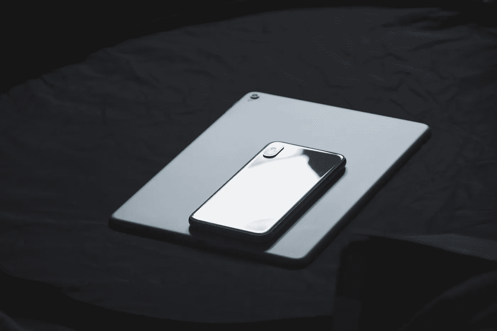
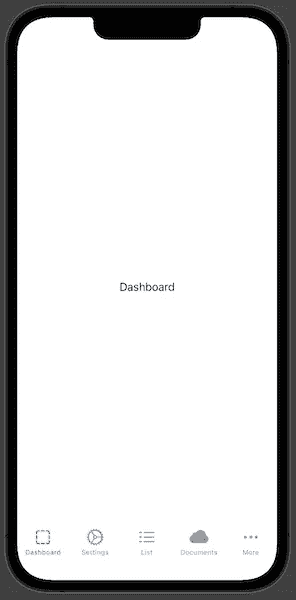

# 使用 SwiftUI 改进 iPhone 上的 iPad 侧边栏导航

> 原文：<https://betterprogramming.pub/improve-ipad-sidebar-navigation-on-the-iphone-with-swiftui-953d85acfc14>

## 使用选项卡视图的强大功能进行导航



[熊燕](https://unsplash.com/@slothxbear)在 [Unsplash](https://unsplash.com/?utm_source=medium&utm_medium=referral) 上拍照。

在之前的博客文章中，我们学习了如何为 iPad 添加侧边栏，但是这种方法对于 iPhone 来说并不太好。

它看起来很奇怪，一旦我们配置了一个默认视图，一旦 iPhone 应用程序启动，它就会自动导航到这个视图。这在手机上不太好，但在 iPad 上完全说得通。我们可以通过在 iPad 上显示侧边栏和在 iPhone 上显示标签视图来改善这一点。

# 检查设备是否为 iPad

首先，我们需要区分一个应用是在 iPhone 上运行还是在 iPad 上运行。为此，我们应该使用`UIUserInterfaceIdiom`枚举。它可以回答应用程序在什么类型的设备上运行的问题，从手机开始，到 carplay 内的汽车结束。

这次我们对两个枚举案例感兴趣:

*   `phone` -用于 iPhone 或 iPod touch 的接口；
*   `pad`-iPad 的接口。

要获取当前设备接口，我们需要从代表当前运行设备的 UIDevice 类中访问它。要检索用户界面习语，我们需要从 UIDevice 类的现有类变量中获取它。然后从`userInterfaceIdiom`变量中，我们得到当前设备习语。

为了以更好的方式访问它，我们可以扩展`UIDevice`类并添加一个新的静态变量，这将是之前解释的过程的简化版本。

```
extension UIDevice {
  static var idiom: UIUserInterfaceIdiom {
    UIDevice.current.userInterfaceIdiom
  }
}
```

为了让它更加糖衣，我们可以添加两个静态变量来查看设备是 iPhone 还是 iPad。

```
extension UIDevice {
static var isIpad: Bool {
    idiom == .pad
  }

  static var isiPhone: Bool {
    idiom == .phone
  }
}
```

# 分割导航

现在我们知道了我们的 app 用户有什么样的设备，我们就可以划分导航了。这意味着我们将使用`TabView`和 iPhone 的 iPad 侧边栏。

在用 Xcode 创建了一个新的 SwiftUI 项目之后，我们可以在`ContentView.swift`文件中分离导航。然后就在`body`中，我们可以添加逻辑语句来检查设备是否是 iPad，换句话说，它可以是一个电话视图。

```
struct ContentView: View {
  var body: some View {
    if UIDevice.isIpad {
     // iPad view
    } else {
	    // iPhone view
    }
  }
}
```

现在我们需要仔细检查这两个步骤，为 iPad 添加一个[侧边栏，为 iPhone](https://kristaps.me/blog/swiftui-sidebar/) 添加一个[标签视图。我们之前已经研究过如何完成这两项任务，所以我们不再深入研究。完整的代码可以在](https://kristaps.me/blog/swiftui-tabview/)[示例项目](https://github.com/fassko/SwiftUITabViewSidebar)中查看。

```
struct ContentView: View {
  var body: some View {
    if UIDevice.isIpad {
      NavigationView {
        List {
          NavigationLink(destination: DashboardView()) {
            Label("Dashboard", systemImage: "square.dashed")
          } // ...
        }

        DashboardView()
      }
    } else {
      TabView {
        DashboardView()
          .tabItem {
            Label("Dashboard", systemImage: "square.dashed")
          } // ...
      }
	  }
  }
}
```

我们能做的是将这两个步骤提取到结构变量中，以分离关注点。

```
struct ContentView: View {
  var body: some View {
    if UIDevice.isIpad {
      sidebar
    } else {
      tabview
    }
  }

  private var sidebar: some View {
    NavigationView {
      List {
        NavigationLink(destination: DashboardView()) {
          Label("Dashboard", systemImage: "square.dashed")
        }
        // ...
    }

      DashboardView()
    }
  }

  private var tabview: some View {
    TabView {
      DashboardView()
        .tabItem {
          Label("Dashboard", systemImage: "square.dashed")
        } // ..
    }
  }
}
```

# 限制

生活不仅仅是彩虹和蝴蝶。这种方法有一些限制。iPhone 标签视图最多可以容纳五个项目。如果有更多选项卡，则它位于更多选项卡下。



我们需要考虑这种方法，为 iPhone 显示标签视图而不是导航列表。另一种方法是显示一个自定义视图，这不是我们在本文中要研究的。

# TL；速度三角形定位法(dead reckoning)

边栏是在 iPad 上快速浏览多个视图的好方法。遗憾的是，它在 iPhone 上看起来是错误的列表，会自动导航到默认视图。我们可以通过显示 iPhone 的标签视图和 iPad 用户界面的侧边栏来改善这一点。我们需要记住，在一部 iPhone 上，一个标签视图最多可以容纳五个项目。

# 链接

*   [样本代码](https://github.com/fassko/SwiftUITabViewSidebar)
*   [UIUserInterfaceIdiom 文档](https://developer.apple.com/documentation/uikit/uiuserinterfaceidiom)
*   [ui 设备文档](https://developer.apple.com/documentation/uikit/uidevice/)
*   [带 SwiftUI 的 iOS 中隐藏的 TabView 秘密](https://kristaps.me/blog/swiftui-tabview/)
*   [侧边栏如何在 iPad 上使用 SwiftUI](https://kristaps.me/blog/swiftui-sidebar/)