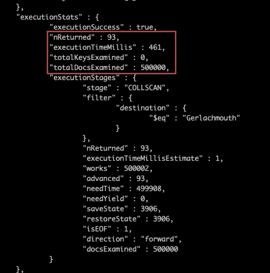
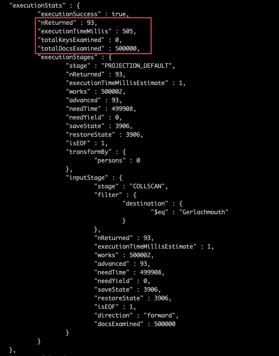
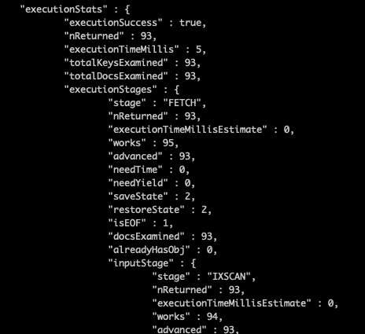

# 使用投影提高 MongoDB 性能

> 原文：<https://betterprogramming.pub/improve-mongodb-performance-using-projection-c08c38334269>

## 提高 Mongo 数据库的性能

照片由[格雷格·罗森克](https://unsplash.com/@greg_rosenke?utm_source=medium&utm_medium=referral)在 [Unsplash](https://unsplash.com?utm_source=medium&utm_medium=referral) 拍摄

本文记录了我关于在 MongoDB 中使用投影提高了多少性能的所有发现和分析。在本文的最后，我们将能够知道 MongoDB 查询性能是否会通过利用投影得到改善。

事不宜迟，我们开始吧。

# 问题陈述

这篇文章的灵感来自于我的工作时间，当我从 MongoDB 检索数据时，我使用了[投影](https://docs.mongodb.com/manual/reference/glossary/#term-projection)。Projection 是*“指定 MongoDB 在结果集中返回哪些字段的查询文档。”*根据 MongoDB 官方[文档](https://docs.mongodb.com/manual/reference/glossary/#term-projection)。

这就像在麦当劳点一个巨无霸，我们可以选择点菜，而不是全套的饮料和薯条。

因此，我想知道—如果使用投影，查询性能会提高多少。以下是我在这项研究中想要达到的主要目标:

## 主要目标

*   发现如果在 MongoDB 查询中使用投影，性能是否会提高。
*   发现在 MongoDB 查询中使用投影的最佳场景。

# 溶液分析

为了继续研究，我总是从找到我需要的东西开始。这些是我需要的东西:

*   拥有超过 500K 个文档的集合，这样我就可以找出使用和不使用投影时查询时间的差异。
*   子文档架构。这是因为我怀疑带有子文档的文档会增加大量的查询时间。让我们也为实验准备这个。

关于数据准备的结果，请参考下面的截图。查看这篇[文章](https://medium.com/@tcguy/mongodb-performance-101-how-to-generate-millions-of-data-for-performance-optimization-cf45d3556693)关于我如何为性能优化生成数百万个虚拟数据。

从这个截图中，我们知道我们已经生成了 50 万个文档，包含以下字段:

*   `booking_no` -航班的预订号码
*   `origin` -出发城市
*   `destination`——到达城市
*   `persons` -由`first_name`、`last_name`和`dob`字段组成的人员数组

# 性能实验

在我们开始任何实验之前，让我们确保设置是正确的。除了默认的`_id`字段，集合中还没有创建索引。

我想在这里进行的实验是:

*   实验 1:如果我投影更少的字段，查询性能会提高吗？
*   实验二:如果实验一结果为否，还有哪些场景可以发现投影将如何提高查询性能？

# 实验 1:如果我投影更少的字段，查询性能会提高吗？

可惜答案是**没有**。然而，如果那些返回的字段都被索引，性能将会提高，我们将在下一节中讨论这一点。

在本实验中，我们将检索目的地为“Gerlachmouth”的所有航班预订。在 50 万份预订中，有 93 份预订的目的地是“Gerlachmouth”。让我们检查一下归还这 93 份文件花了多长时间。

我使用 Mongo Shell Explain 函数执行性能分析，这使我们能够发现在查询和所使用的查询策略上花费的时间。

上面的截图显示了在没有投影的情况下进行检索时的结果。完成该查询需要 461 毫秒。虽然下面的屏幕截图显示了我们利用投影的结果，但该查询花了 505 毫秒才完成。

因此，性能并没有提高——相反，当我们使用投影时，处理查询需要更长的时间。

实验 1 的结论—当您在查询中实现投影时，性能并没有提高。👎👎

# 实验 2:如果实验 1 的结果是否定的，寻找其他关于投影如何提高查询性能的场景

由于我的第一个假设是错误的，于是我试着做了一些研究，重新访问了 MongoDB 大学提供的表演[课程](https://university.mongodb.com/courses/M201/about)。该课程是免费的——如果您对学习 MongoDB 性能感兴趣，请查看该课程。

我发现了覆盖查询。Covered Query 是一个*“完全使用索引就可以满足的查询，不需要检查任何文档”，*根据 MongoDB 的官方[文档](https://docs.mongodb.com/manual/core/query-optimization/#covered-query)。

我们可以用烹饪的比喻来理解覆盖查询。想象一下，你正在做饭，所有的食材都准备好了，放在冰箱里。基本上什么都有盖，你只要煮就行了。

在我们为数据库创建任何索引之前，让我们先问一个问题:我们要返回给应用程序的字段是什么？让我们给出以下场景:

*   管理员想知道所有飞往特定目的地的航班预订情况。管理员想知道的信息是他们各自的`booking_no`、`origin`和`destination`。

鉴于上面的场景，让我们从创建索引开始。我们可以创建两个索引。

*   目标—仅在目标字段上创建索引。
*   目的地、始发地和订房号——我们可以用序列`destination`、`origin`和`booking_no`字段创建一个复合索引。

关于如何创建索引，请参考下面的命令。

## 无投影查询

首先，我们开始查询目的地为“Gerlachmouth”的预订。下面的屏幕截图显示了查询的执行时间。如你所见，总执行时间减少到了 **5ms** 。与没有索引的相比，它几乎快了 100 倍。

您可能对这种性能感到满意，但这并不是优化的终点。我们可以提高查询性能，使用**覆盖的查询**比没有索引的查询**快 250 倍。**

# 带投影的查询(覆盖查询)

使用覆盖查询意味着我们正在查询被索引的字段。

使用上面的命令，我们能够将查询优化到 **2ms** ，这比**快了大约 60%**,而无需在索引字段上使用投影。

除了改进执行时间，我们还改进了查询策略。从截图中，我们可以看到我们没有检查任何文档，这意味着索引本身已经足以满足查询。因此，这总体上提高了查询性能，因为我们不必获取文档。

# 结论

以下是这篇文章的要点。

*   除非使用索引可以满足所有返回的字段，否则投射较少的字段不会提高查询性能。
*   索引可以提高性能，但是覆盖查询可以提升查询性能。
*   覆盖查询的执行速度比使用索引扫描的普通优化查询快 60%。

感谢您的阅读。下一篇文章再见。

# 参考

*   查询中的项目字段— MongoDB [文档](https://docs.mongodb.com/manual/tutorial/project-fields-from-query-results/)
*   来自 [StackOverflow](https://dba.stackexchange.com/questions/198444/how-mongodb-projection-affects-performance) 的详尽解释
*   解释输出— MongoDB [文档](https://docs.mongodb.com/manual/reference/explain-results/#executionstats)