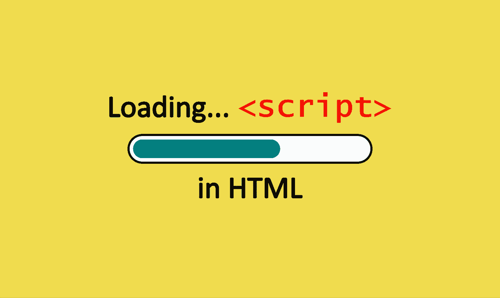
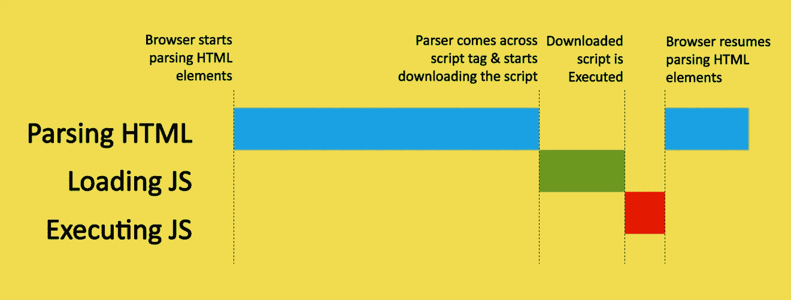
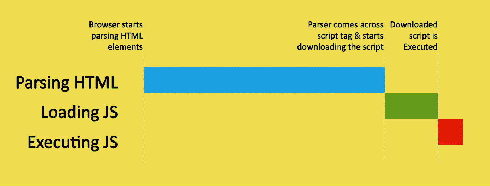
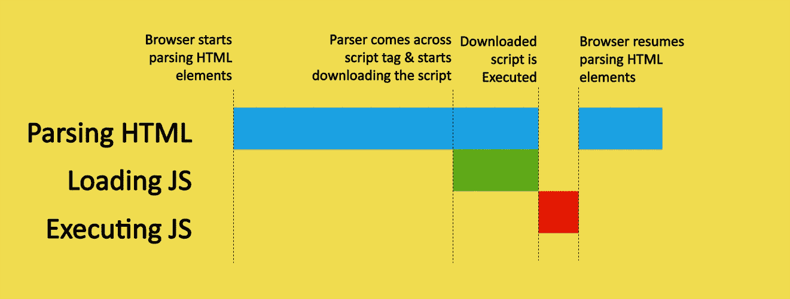
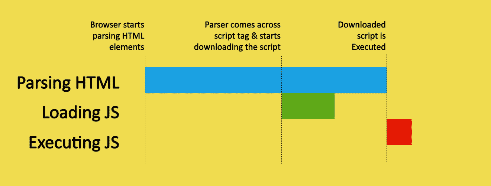
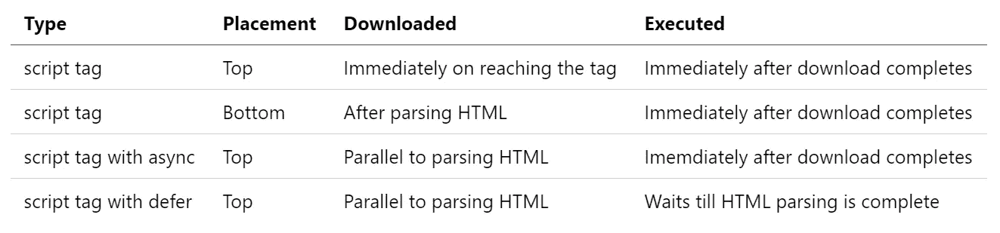

# 使用这些不同的脚本加载技术提高页面加载性能

> 原文：<https://betterprogramming.pub/improve-page-load-performance-with-these-different-script-loading-techniques-b0d912eae7b1>

## 将 JavaScript 加载到 HTML 页面的不同方式

将 JavaScript 加载到你的 HTML 页面中(图片由作者提供)

当您考虑提高页面加载性能时，您会尝试优化后端代码、数据库连接等等。但是提高页面加载速度的最简单的方法之一是对如何在 HTML 页面中使用`script`标签加载 JavaScript 进行一些小的调整。

# 加载 JavaScript 的正常方式有问题

当您将 JavaScript 加载到 HTML 页面时，您在 web 页面的 head 部分添加了`script`标记。这里有一个问题，但是为了更好地理解它，您需要理解网页是如何呈现的。

当浏览器打开一个网页时，它开始一个标签一个标签地呈现页面，并开始构造 DOM。每当解析器看到要加载图像和样式表的标签时，这些请求都会与呈现并行处理。

但是当解析器遇到一个`script`标签时，HTML 呈现过程就会停止，等待所有的脚本被获取并执行。然后继续呈现 HTML 页面的其余部分。通过查看下面的代码和可视化效果，您可以更好地理解这个过程。

## **页面头部的脚本标签示例**

## 当脚本标签在页面的头部时呈现流

当脚本在页面的开头时(作者提供的照片)

这会影响页面加载时间，因为脚本可能很大，这会影响执行它们所需的时间。并且在大多数情况下，HTML 页面本身的实际内容可能很大。因此，所有这些加载和解析时间都会影响用户在等待时间方面的体验。

在本文中，您将看到三种不同的方法，通过以更有效的方式在 web 页面上加载 JavaScript 来提高页面的加载性能。

# 1.将脚本标签放在页面底部

当你把`script`标签放在页面底部主要内容之后，会有一些性能提升。页面的内容将被加载和解析，因为不存在呈现 HTML 的阻塞行为，因为您将脚本放在了最后。只有当页面内容的所有呈现完成时，下载和执行才会发生。

## 页面底部的脚本标签示例

## 当脚本标签位于页面底部时呈现流程

当脚本位于页面末尾时(作者提供照片)

与将`script`标签放在页面的 head 部分相比，这种技术在性能上有所提高。在这里，您还需要等待一段时间，因为在页面内容呈现出来之前，脚本的下载不会开始。这种方法解决了内容加载问题，但是仍然需要等待脚本被下载和执行。HTML 解析完成，然后下载并执行脚本，最后触发`document ready`事件。

我们仍然可以根据用户需求，通过使用其他两种技术来提高页面的性能。

# **2。在脚本标签中添加异步属性**

当解析器遇到带有`async`属性的`script`标签时，脚本的下载与 HTML 页面的解析并行进行。下载完成后，立即执行脚本，暂停 HTML 解析。一旦脚本执行完成，解析就会继续。

## 具有异步属性的脚本标记示例

## 具有异步属性的脚本标记的呈现流

加载带有异步属性的脚本(作者提供照片)

由于脚本可能有不同的大小，而且`async`会在获取脚本后立即执行，所以无法保证它们会按照编写的顺序执行。因此，如果脚本之间存在任何依赖关系，并且一个脚本需要依次执行，那么您应该避免使用这个属性。在这种情况下，您不会清楚解析何时完成，或者何时触发`document ready`事件。

# 3 **。在脚本标签中添加延迟属性**

当解析器遇到带有`defer`属性的`script`标签时，脚本的下载与 HTML 页面的解析并行发生。只有当 HTML 解析完成时，脚本才会执行。

## 具有 defer 属性的脚本标签示例

## 具有延迟属性的脚本标记的呈现流程

加载具有延迟属性的脚本(作者提供照片)

当我们使用一个`defer`属性时，执行的顺序是基于页面上的顺序来保存的。在触发`document ready`事件之前，该属性在所有 HTML 解析完成之后执行脚本。

# 结论

让我们总结一下你在这篇文章中学到了什么:

1.  将`script`标签放在页面底部以停止页面呈现的阻塞行为，然后加载脚本并在 HTML 内容解析完成后执行。
2.  使用`script`标记中的`async`属性下载脚本，与 HTML 元素的呈现并行，并在脚本可用时立即执行。
3.  使用`script`标记中的`defer`属性下载脚本，与 HTML 元素的呈现并行，并且仅当整个 HTML 页面呈现完成时才执行脚本。

各种装载技术的区别(作者摄影)

# 资源

*   移除 [Chrome DevTools 文档](https://developers.google.com/speed/docs/insights/BlockingJS)中的渲染阻塞 JS
*   [MDN webdocs](https://developer.mozilla.org/en-US/docs/Web/HTML/Element/script) 中的异步和延迟
*   [JavaScript.info](https://javascript.info/script-async-defer) 中的异步和延迟

感谢️reading 和快乐学习！

## 喜欢这篇文章吗？这里还有一些你可能会喜欢的文章

 [## 使用？性格；角色；字母

### 无效合并、可选链接和三元运算符

javascript.plainenglish.io](https://javascript.plainenglish.io/3-ways-to-write-cleaner-javascript-code-using-the-character-ce034386dfbb)  [## JavaScript 中使用模板文字可以做的 5 件有用的事情

### javascript 中模板文字的不同用法

javascript.plainenglish.io](https://javascript.plainenglish.io/5-useful-things-you-can-do-with-template-literals-in-javascript-cae8e6df836f)