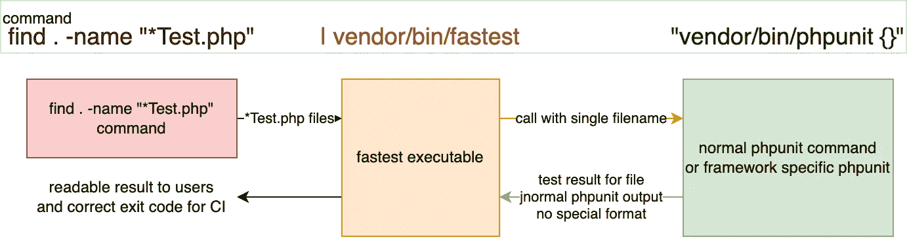
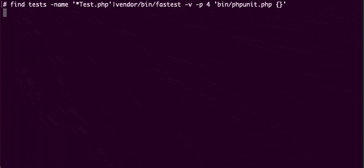

# 使用 Liuggio-fast 通过并行化提高 PHPUnit 性能

> 原文：<https://betterprogramming.pub/improve-phpunit-performance-by-parallelization-using-liuggio-fastest-ff0abc111078>

## 最后，使用您的多核 CPU 以数倍的速度运行您的测试，即使是复杂的测试设置。

费伦茨·阿尔马西在 [Unsplash](https://unsplash.com?utm_source=medium&utm_medium=referral) 拍摄的照片

有多种方法可以并行化 PHPUnit 测试。

*   **并行测试**:[https://github.com/paratestphp/paratest](https://github.com/paratestphp/paratest)
*   **最快**:[https://github.com/liuggio/fastest](https://github.com/liuggio/fastest)

让我们首先来看看为什么要使用 fast 而不是 Paratest

# 比较的可用解决方案

## [并行测试](https://github.com/paratestphp/paratest)

*   ✅可以给你一个代码覆盖率的测试结果
*   ✅简单的设置:因为它使用与 PHPUnit 相同的 API 和`--filter`等。
*   对于已经包装了 PHPUnit 可执行文件的更复杂的测试设置，❌可能会有问题

## [最快](https://github.com/liuggio/fastest)

*   ✅与其他 PHPUnit 抽象配合得很好，比如 symfony 的 phpunit-bridge 或 numut/testing-framework，因为它可以调用任何脚本
*   ⚠️需要一些设置，因为它只是一个 CLI 实用程序
*   ❌:摘要没有那么好，而且你不能综合报道结果。

## 选择什么

根据我的经验，它几乎总是以最快的**结束**，因为我使用的框架通常已经有了围绕 PHPUnit 的包装脚本。但是如果你需要的话，你将会丢失漂亮的覆盖报告。

# 最快是如何工作的？

这是一个 CLI 实用程序。

*   你给它一个所有测试类的列表~通常使用 find 命令
*   对每个文件运行 PHPUnit 命令，然后解析结果
*   您将获得可以在 CI 中使用的成功或失败的单一结果

图表显示最快的控制流

下面是运行密集测试套件的样子:

跑得最快

# 示例:与 symfony 的 phpunit 桥一起使用

Symfony 有一个`bin`文件夹，里面已经有一个`phpunit`二进制文件，它下载一个 PHPUnit 副本，然后运行测试。这意味着它已经比一个简单的 PHPUnit 脚本更复杂，paratest 不能在那里工作。

我喜欢在它旁边创建一个类似这样的外壳脚本

有了这个，您可以运行您的整个测试套件或者您的测试套件的一部分:

*   `bin/fastest`
    —运行所有测试
*   `bin/fastest controller`
    —运行所有名称中带有“控制器”的测试类

您可以在这里添加任何您想要的复杂性，甚至可以在 want 内运行另一个 shell 脚本。例如，如果不同的测试需要不同的配置文件，这可能会很有用。