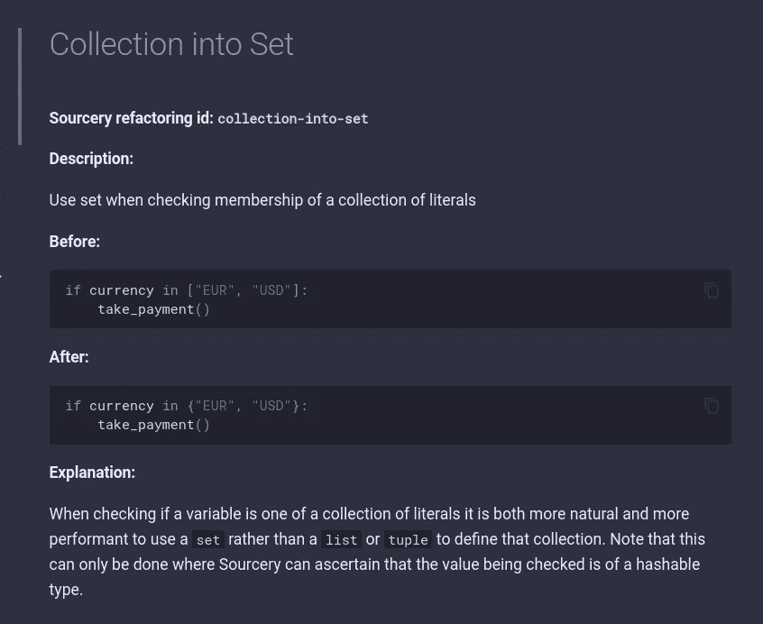
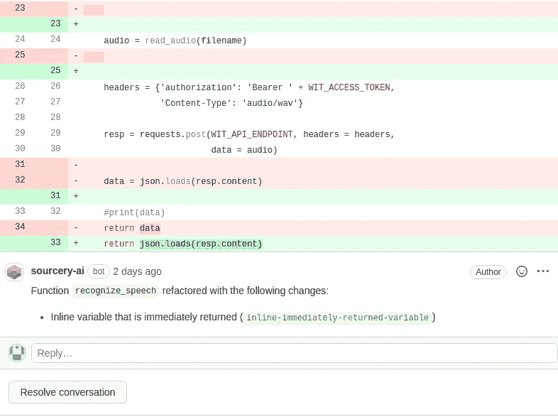
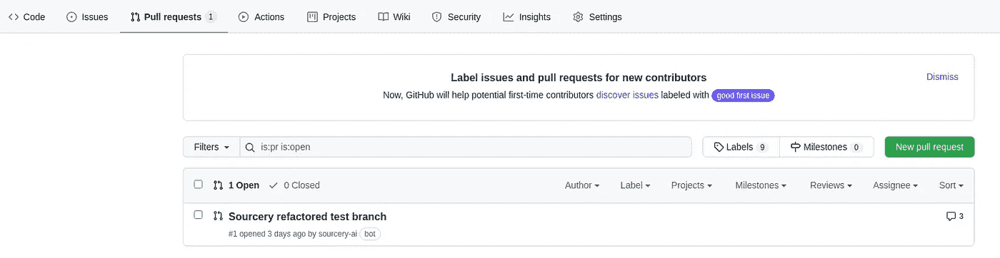
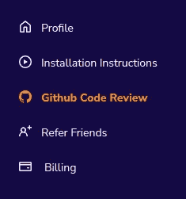
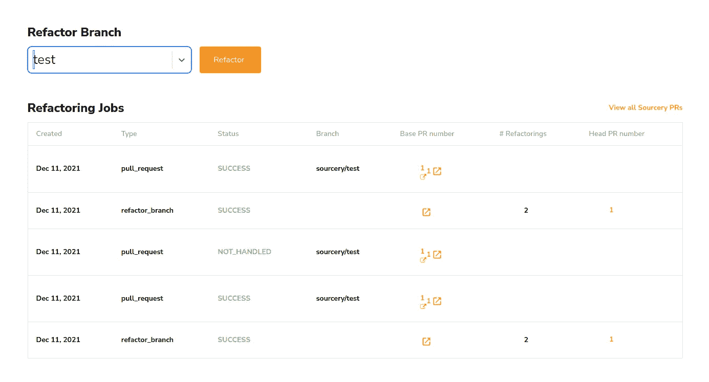
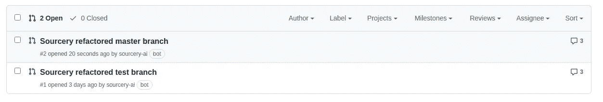

# 使用 Sourcery 自动提高 Python 代码质量

> 原文：<https://betterprogramming.pub/improve-python-code-quality-automatically-using-sourcery-ee2d44d4f841>

## 如何使用人工智能工具 Sourcery 自动重构代码


亚历杭德罗·埃斯卡米拉在 [Unsplash](https://unsplash.com?utm_source=medium&utm_medium=referral) 上的照片

代码分析工具帮助我们识别代码库中的问题。这样，我们就知道应该修复什么来提高整体代码质量。

很有可能，你已经遇到过这样的建议——不赋值就立即返回变量，删除多余的异常处理程序，等等。通常，这些问题很容易修复，但是重构仍然是一项耗时的任务。如果有人能为我们做这些不是很好吗？

幸运的是，这个问题有一个解决方案。 [Sourcery](https://docs.sourcery.ai/) 是一个人工智能驱动的工具，可以代替我们重写代码。目前，它支持 Python。您可以在 IDE 中运行它，并在编码时接受建议。或者您可以分析您的 GitHub 存储库并合并建议的更改。

在本文中，我们将介绍 Sourcery 的基本特性。您将学习如何从修复重复的代码问题中腾出时间。

我们开始吧！

# Sourcery 功能概述

Sourcery 是一个免费增值工具——你可以注册一个免费计划，并在公共项目中使用它进行基本的重构。如果你想把它用在有更高级建议的私人项目上，你必须付费。查看[定价](https://sourcery.ai/pricing/)了解更多信息。我一直在用免费计划做我的爱好项目，我很满意。

## 综合

有几种方法可以使用 Sourcery——在您的 IDE 中，比如 PyCharm，在 GitHub 中，或者通过 CLI(一个付费选项)。

## 它是如何工作的

Sourcery 扫描代码以寻找改进的可能性，并自动从您的分支创建一个 Pull 请求。如果您对这些更改感到满意，您可以合并它们。您也可以触发对特定分支的扫描。默认情况下，该工具会分析每个新的 PR。

您还可以将它作为插件集成到您的 IDE 中，并在编码时查看/接受建议。

## 重构建议

有一个为什么要改代码的详细解释。下面是一个代码改进的例子:



sourcery.ai 上的重构规则示例

要查看所有重构的列表，请访问[文档](https://docs.sourcery.ai/refactorings/)。注意，有些需要付费版本。

## 质量报告

在每个 PR 的末尾，你可以找到一个[质量报告](https://docs.sourcery.ai/GitHub/Quality-Report/)，它显示合并变更后代码质量是会下降还是会上升。

## 自定义配置

您可以将 Sourcery 配置为:

*   忽略特定的重构建议
*   自定义质量指标
*   为 PRs 设置默认分支名称
*   向某人请求审查
*   禁用对文件或路径的检查

它从项目目录的`.sourcery.yaml` 中读取这些设置。

例如，要请求所有者进行审查，配置应该如下所示:

```
github:
request_review: owner
```

查看[配置文件](https://docs.sourcery.ai/Configuration/)了解所有可能性。

# 演示

在本文中，我将在 GitHub 上使用它来演示重构功能。

要使用 Sourcery，首先，注册一个免费帐户。

然后使用这个[直接链接](https://github.com/settings/installations/21241999)来添加用于分析的 Python 存储库。

我有一个 Python 库，Sourcery 在那里找到了改进的机会。例如，考虑以下建议:



如您所见，间距已被更正，行内变量已被立即返回。

您可以在 GitHub 的 **Pull requests** 部分找到自动创建的 PR:



Sourcery bot 发出的拉请求

要从 Sourcery 仪表板管理存储库扫描，请导航到 **Github Code Review** :



Github 代码审查

以下是 git 存储库仪表板的概述:



源文件库仪表板

正如你在上面看到的，这个工具在我的**测试**分支上运行。我可以在另一个上触发分析，然后单击**重构**。这次选了**大师**。不久，我的 GitHub 上出现了一个新的 PR:



按源提取主测试分支的请求

# 结论

在本文中，您了解了如何配置 Sourcery 来扫描 Python 代码，以获得可能的改进。即使是免费计划也可以节省你大量的重构时间，因此你可以专注于你的开发任务。

然而，我们应该始终小心自动生成的代码建议。我会小心翼翼地审查每一份公关，以避免在生产中出现任何意外。

我希望你喜欢这篇文章。感谢您的阅读，下次再见！