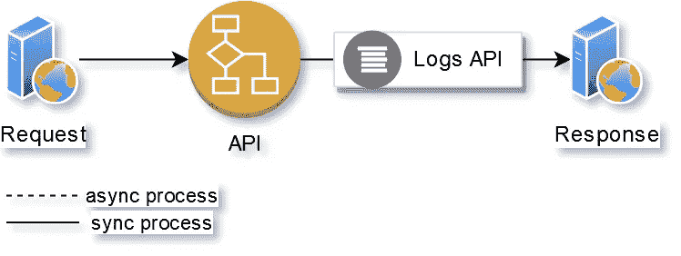
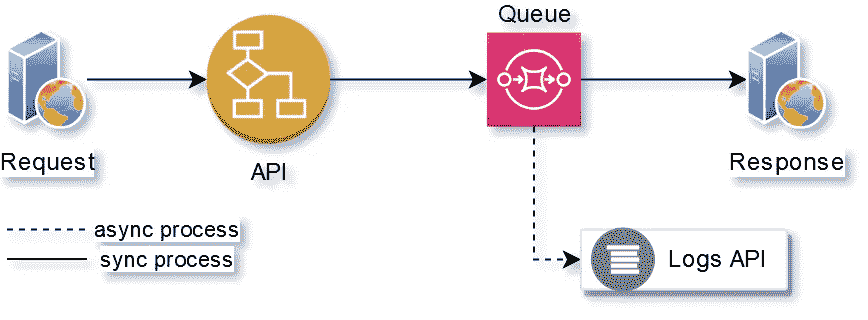
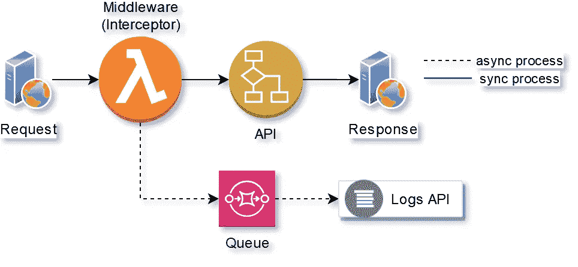
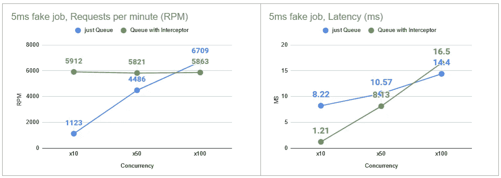
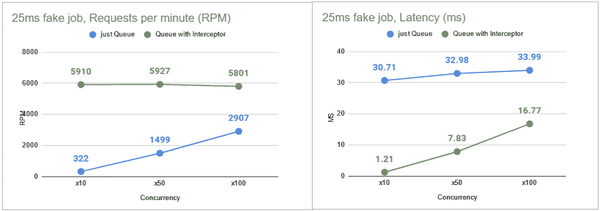
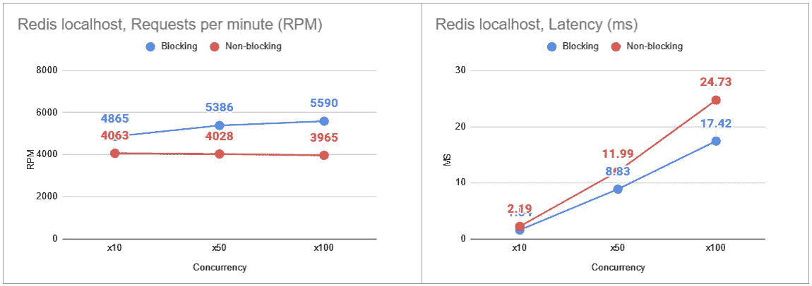
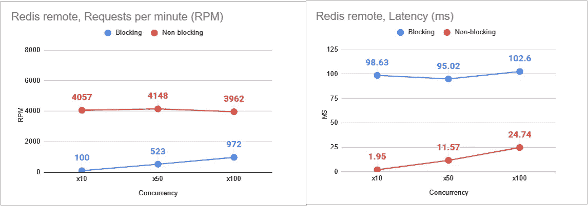

# 通过在 Nest.js 中引入拦截器，将响应时间提高 10 倍

> 原文：<https://betterprogramming.pub/improve-response-time-10x-by-introducing-an-interceptor-in-nestjs-590695692360>

## 带有基准比较的实际实施

照片由 [Aron 视觉效果](https://unsplash.com/@aronvisuals?utm_source=medium&utm_medium=referral)在 [Unsplash](https://unsplash.com?utm_source=medium&utm_medium=referral) 上拍摄

编写可伸缩的快速 API 可能是一项挑战，今天我想向您介绍我在必须处理大量传入请求的 [NestJS](https://nestjs.com/) (Node.js)应用程序中实现的一项技术。

这种方法用于特定的用例——当您的 API 在客户端请求期间执行一些非业务逻辑时。我们将回顾卸载这些工作的方法，并将改进您的 API 可以处理的总体响应时间和每分钟请求数。

示例使用案例:

*   记录
*   指标收集
*   后台作业队列
*   客户端将通过 WebSocket 或 WebHook 接收响应

我有一个[演示应用程序，准备运行一些基准测试](https://github.com/dkhorev/nestjs-interceptor-benchmark-demo)。这是一个条件可变的简单 API 路径。

我的例子是围绕 [Redis 数据库](https://redis.com)和 [Bull queue](https://www.npmjs.com/package/bull) 模块构建的。尽管这种技术的其他应用也是可能的，这取决于您选择的服务:Redis Streams、SNS、SQS、RabbitMQ、Kafka 或任何常规的 DB。

# 问题是

Node.js 是后端 JavaScript 代码的单线程运行时。我们的首要任务是不要在不必要的时候阻塞主线程。

那是什么意思？

让我们回顾一个简单的例子，一个请求进来，它击中你的控制器，你做一些工作，并返回一个响应。

基本的 API 请求-响应工作流

本例中的所有操作都是同步执行的，因此事件循环在此时被阻塞。访问 API 的请求越多，每个新客户机等待响应的时间就越长(假设资源有限)。

在这个图中有一点很突出:客户不关心我们用`Logs API`做的任何后台工作，那么他为什么要等待它完成呢？如果`Logs API`是对第三方服务的调用，那么它增加了另一个可能影响您的客户端的故障点。

## 解决方案 1 —将日志处理卸载到队列中

我们知道 Redis 很快，所以排队作业也很快，对吗？

让我们介绍一个简单的队列，并在后台发送这些日志。

客户端不必等待日志 API 完成的工作流

众所周知，Redis 是一种非常快速的内存存储，将作业插入 Redis DB 大多数情况下可以在 1 毫秒内完成。

与数据库`INSERT` 或第三方 API 调用相比，Redis 的写入速度要快几倍。光是这个变化就能给你带来很多表现。

但是我们知道这个操作也阻止了客户端接收响应，它非常快，但是仍然在阻止。

这种控制器的一个例子是:

将会发生的是，一旦我们在控制器中点击`line 3`，下面的任何代码的执行将被推迟到下一个滴答，在此之后`queueFake`的承诺被解决。

## 解决方案 2 —将日志处理卸载到拦截器

`Interceptor`也就是后端开发者所说的`Middleware`。

**什么是中间件？**

它是位于请求和响应之间的一段代码。从这个意义上说，我们的路由处理器也是中间件，但是 NestJS 使用了稍微不同的命名方式— `Interceptors`。

您可以在请求到达控制器之前执行定制代码，而且中间件可以在响应发送之后执行，这是一件很棒的事情。

高层次的想法是——拦截器获取请求信息，并仅在响应被发送时执行阻塞操作。这样一来，Node.js 进程繁忙时不会限制传入的请求，应用程序可以在后台进行异步处理(与 i/o 相关)。

客户端不必等待日志 API 和队列完成的工作流

当然，这增加了通过另一个代码块传输请求的开销，但是在大多数情况下，这进一步提高了应用程序的可伸缩性。

所以我们来看一些数字。

# **测试工具和场景**

自动扫描——一个加载测试 API 的好工具

[Redis](https://redis.io/) —一个内存数据库，主要用于缓存、队列和发布/订阅，但它有许多其他很酷的模块，可以作为应用程序的全栈数据库。

我将在 4 种不同的场景中运行这两种解决方案:

*   用`setTimeout`模拟延迟`5ms`的任务添加
*   用`setTimeout`模拟延迟`25ms`的任务添加
*   本地主机 Redis 队列(零网络延迟)
*   远程 Redis 队列(一些网络延迟)

有三种不同的并发级别:

*   每秒 x10 个请求
*   每秒 x50 个请求
*   每秒 x100 个请求

基准的图例:

*   `RPM` —每分钟请求的 API 句柄(越高越好)
*   `Latency`—API 路线的响应时间(越短越好)

## 测试套件—作业添加延迟 5 毫秒

具有 5 毫秒合成延迟的测试套件结果。RPM —越高越好。延迟—越低越好。

看起来这里没有明显的赢家，但是拦截器的路线在 x10 并发上执行*8 倍(延迟)和 5 倍(RPM)。其他并发性测试——是我的单节点进程资源达到极限的地方，所以两种方法的结果非常相似(阻塞进程导致非常高的并发性)。*

想象一下分布式/负载平衡部署(或集群节点应用程序)。每个进程将在 x10 结果区的某个地方动作，所以在我看来拦截器解决方案是一个明显的赢家。

# 测试套件—作业添加延迟 25 毫秒

25 毫秒合成延迟的测试套件结果。RPM —越高越好。延迟—越低越好。

随着我们第三方服务响应时间的增长，阻止解决方案会遇到越来越多的问题。

请注意，与`5ms`试运行相比，`x2-x3`的转速已经下降。最低延迟也增加到了`x2`。

拦截器解决方案的数字看起来是一样的——太好了！无论我们的第三方服务响应时间有多长，我们的 API 仍然很快。

# **越来越真实**

现在让我们做一些接近真实世界的测试。我们知道 DB 插入很慢，所以我希望这种测试的结果是相似的。

但是我想查一下 Redis，它通常很快，可以在 1ms 以内插入数据。

我的设置: [NestJS](https://nestjs.com/) ， [Bull](https://www.npmjs.com/package/bull) 队列管理器，异步任务将作业插入 Redis 队列。

## 测试套件— Redis 队列，本地主机

Redis localhost 的测试套件结果。RPM —越高越好。延迟—越低越好。

令人惊讶的是，Redis localhost 似乎没有太大的区别，阻塞控制器中的作业队列甚至更快。

请记住，我们是在网络延迟为 0 的情况下进行测试的，因此这在这种情况下会发挥作用。

## 测试套件— Redis remote， **EU 到 EU**

在真正的 prod 部署中，您可能会使用 Redis 的托管版本，并且它不会与您的应用程序位于同一主机上，因此网络延迟很重要。最好的情况是同一个地区/VPC。

我使用过 Redislabs 的一个 8 美元的集群。

Redis remote 的测试套件结果。RPM —越高越好。延迟—越低越好。

这些结果再次证实了我最初的合成延迟运行。非阻塞工作流比阻塞好得多，即使对于非常高速的插入也是如此。

现在，网络延迟成为最大的限制因素，请注意在所有测试案例中，阻塞版本的*延迟时间*几乎增加到了*100 毫秒*。

这里最引人注目的一点是低 x10 并发性。带有拦截器的路由*响应速度几乎快了 x50，可以处理 x40 个以上的请求*。

您可以注意到，拦截器版本的控制器的 RPM 在所有测试套件中都是相似的——这是因为它正好达到了我的 Node.js (1 个 CPU)资源限制。因此，在使用集群应用版本时，还有更大的改进潜力。

# 结论

我们已经看到*延迟在 8 倍到 50 倍*的范围内有所改善。对于 *RPM，它在 6x 到 40x* 的范围内。

保守地说，对于日志、度量和后台作业等非关键任务的工作负载，使用拦截器(中间件)至少可以获得 10 倍的性能提升。

如果你正在做一个中型或大型的项目，回顾一下你的一些控制器是很好的，这样可以节省处理资源。

对于一个低 RPM 的小项目，我不会打扰，但要记住这个解决方案，以备将来使用。

包含测试代码的库在这里:[https://github . com/dk horev/nestjs-interceptor-benchmark-demo](https://github.com/dkhorev/nestjs-interceptor-benchmark-demo)

基准记录可在此 [google 工作表](https://docs.google.com/spreadsheets/d/1oGZdzZ6qbJRvCNqaiw5jtvR2uQOSE5ZgAfmiIW5IzTE/edit?usp=sharing)中找到。

希望这对你有帮助。祝好运，工程快乐！