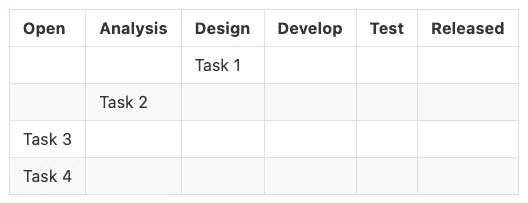

# 看板是如何工作的，为什么我更喜欢它而不是 Scrum

> 原文：<https://betterprogramming.pub/improve-the-productivity-by-using-agile-development-778c7f069c6a>

## 通过使用敏捷开发提高工作效率

[拉拉·阿兹利](https://unsplash.com/@lazizli?utm_source=medium&utm_medium=referral)在 [Unsplash](https://unsplash.com?utm_source=medium&utm_medium=referral) 上的照片

我们已经讨论过使用[基于主干的开发](https://lazypro.medium.com/trunk-based-development-can-help-4bb425595c00)来提高软件开发的生产率。事实上，要大幅提高生产率，你必须应用多种方法，这就是为什么有这么多敏捷方法的原因，其中两种是众所周知的敏捷方法:Scrum 和看板。

Scrum 目前是大多数组织使用最多的。尽管如此，用好 Scrum 并不容易。在众多敏捷方法论中，Scrum 是变化最大的，可以说一百个组织中有一百种 Scrum 实践。

这是因为最初的 Scrum 有很多“规则”，无法完美匹配每个组织现有的组织结构。根据[康威定律](https://en.wikipedia.org/wiki/Conway%27s_law)，大多数软件架构都与组织结构密切相关，导致各种敏捷方法只能提供原型，不能完全应用。

本文将简要介绍敏捷方法和 Scrum 的目的，以及运行 Scrum 遇到的问题，然后描述主要话题:看板。

# 为什么不是瀑布？

> *为什么我们需要敏捷方法？
> 到底什么需要敏捷？*

首先，让我们定义什么是敏捷。

敏捷的目的是“更快”产生价值。那么，价值是什么？坦白说是能赚钱的东西。换句话说，它通常以产品特征的形式存在。也就是说，只有当功能或产品交付给客户时，才能产生真正的价值，而敏捷开发的目的就是加速这种价值流的交付。

当我们评估价值流的交付速度时，通常使用一个指标:交付时间。从特性请求生成到需求实际交付给客户的整个时间称为交付周期。

在传统的瀑布开发中，这个交付周期可能需要几个月，这听起来一点也不敏捷。而且，如果这个要求实现了一半，结果发现这不是客户想要的，那么投入的所有资源都浪费了。

所以现代软件开发注重把需求分成小块，每个小块都有自己的价值。通过持续交付这些小价值，产品迭代周期可以更快。

# 混乱

我相信你们大多数人都听说过，甚至经历过 Scrum 开发过程。从上一节的结论，我们可以知道 Scrum 的核心精神是通过一个预设的短周期:Sprint，将大需求分解成小需求。并且，每个小的需求都以用户故事的形式映射。在每个冲刺阶段结束时都有可交付的产出是很重要的。

Scrum 中有三个角色。

1.  产品所有者:很明显，这个角色就是产品的所有者。他就像传统的 PM 和销售，作为开发团队和客户之间的门户，去发现客户想要什么。
2.  Scrum Master:Scrum 团队中最熟悉 Scrum 过程的人，负责主持每一个“Scrum 定义的”事件，还必须充当产品需求和开发团队的协调员。
3.  功能团队:这个角色代表开发团队，实现产品需求的人。根据团队的规模和性质，有许多不同的部门，如前端、后端、QA 等。

短跑包括几个不同的项目。

1.  规划:这个事件用于决定在这个 Sprint 中应该采取什么需求。在这个阶段，通常会将每个小需求制作成一张卡片，上面有其成本点。每个固定的冲刺都配有固定的点数，也就是说，在这个循环中，要根据点数和轻重缓急完成哪些任务。
2.  发展:每个成员收到分配的卡后，他们开始工作。
3.  追溯:在 Sprint 结束时，回顾每个人的卡的状态并确保这个 Sprint 能够交付的价值，以及回顾这个 Sprint 的表现。

上面的描述简要描述了一个完整的 Scrum 开发过程。据我们所知，Scrum 很复杂，有很多专门的角色和事件，而且 Scrum 有很多开销。以我以前工作的团队为例，策划要半天，追溯也要半天，再加上上午还有单口相声等常规会议，光是基本开销就能花两个工作日。

此外，估算点数也是一种不精确的做法。谁应该制定价格？谁来分配？一个周期能处理多少分？需要很长一段时间互相适应，才能逐渐走上正轨。

再者，角色的分配应该如何配置？每个组织通常已经有了一个基本的组织架构，提取出能够适应 Scrum 的角色是极其困难的。

如果有几个并行的 Scrums，上面所有的情况会更糟。尤其是当某人在多个 Scrum 团队中时，定期会议可能会占用大部分时间。

# 看板法

综上所述，Scrum 对于小团队来说效率不高。因此，我领导的团队使用另一种敏捷方法:看板。

与 Scrum 相比，看板被更少的团队使用。主要原因是大多数团队没有正确使用看板，因此看不到看板的好处。大多数人只是计划看板的各个阶段，然后像 Scrum 一样把卡片放在通道上，然后一步一步地移动它们。最后他们也没有得到什么好处，只是形式上用了看板，然后又回到 Scrum，毕竟制卡方法是一样的。

正因为如此，在这一节我将首先介绍看板的目的，然后解释使用看板的关键，最后描述看板的开发过程。

# 目标

看板

看板就像它的外观一样，它实际上是价值流的一种视图，价值流的每个阶段都应该在看板中呈现。假设您的组织的开发过程是，分析、设计、实现、测试和发布，那么在看板上应该有五个阶段。

如第一节所述，敏捷方法是加速价值流；因此，看板将整个价值流以具体的方式呈现出来，也可以看到每项任务的花费时间。当出现长时间无法进入下一阶段的卡片时，说明出现了问题，应立即检查任务状态，并立即采取适当的措施。

比如卡片覆盖的任务内容过大，就要马上把卡片一分为二。并且，让人把分出来的小牌接过来。通过检查每张卡的状态，可以加速价值的传递。

# 键

在没有任何已定义事件的情况下，正确使用看板只有三个关键点。

1.  卡片只能向后移动，不能向前移动。看板的每个阶段都代表价值流的一个阶段。就像水的流动一样，水只向下流动，价值只向上流向客户。例如，假设一个阶段是开发阶段，另一个阶段是测试阶段，即使在测试过程中发现了 bug，卡片也不会返回到开发阶段，而是应该留在测试阶段。
2.  定义完成(DoD)的定义:DoD 对看板很重要，从一个阶段到下一个阶段必须满足什么条件是关于质量的。再以开发测试为例，如果 DoD 的条件是单元测试覆盖率达到 80%，那么在满足这个条件之前，卡不能进入测试阶段。另一方面，定义一个“可测量的”国防部也很重要。建议把每个阶段的 DoD 变成一个检查表，可以确保每一个卡的动作都是合规合格的。
3.  确定在制品(WIP): WIP 可以说是使用看板的最重要的概念。每个阶段必须定义其 WIP，即可以接受的最大卡片数量。如果下一阶段的 WIP 已满，即使 DoD 已经完成，卡片仍然不能移动到下一阶段。WIP 的目的是能够一眼看出价值流卡在哪里。如前所述，一旦价值流停滞，必须立即采取行动。你怎么知道卡住了？某张卡的消费时间是一个指标，但是当卡数较多的时候，这个指标很容易被忽略。所以 WIP 是一个比较有效的强制措施，只要你看到 WIP 满了，卡被强制等待，那么就是有东西堵了。

# 工作流程

在这一部分，我将解释我的团队如何使用看板。首先，我们用的看板是:开放、待办、设计、开发、测试、发布、关闭。

*   开放:所有的功能需求发布后都会放在这里。这个时候这张卡的内容会很庞大，耗时之类的就不估计了。
*   待办事项:根据优先级，从打开中取出卡片，进行评估和拆分，一张大卡片会被拆分成若干张小卡片，放入待办事项中。每张卡的工作时间约为 1-2 周。待办事项的 WIP 会设置的稍微大一点，代表我团队的产能。我们会排队去做。如果待办事项已满，说明我的团队目前已经超负荷了。
*   设计:在待办阶段，要规划好每张卡的到期日，设计阶段会进一步确定卡在每个阶段的花费时间。如果以后卡在某个阶段，说明出问题了。设计阶段的 DoD 将产生包含在我的前一篇文章中提到的用户故事和用例中的设计文档。
*   开发:进入开发阶段后，就是特性开发的时候了。这时候重点是是否超过预计时间和在制品。WIP 在这里被定义为团队规模的大约两倍。至于 DoD，单元测试完成，本地环境上的集成测试必须通过。
*   测试:此阶段的卡实际上已经部署到试运行或预生产环境中。由于[基于主干的开发](https://lazypro.medium.com/trunk-based-development-can-help-4bb425595c00)，每个代码都提交到主干中，每个测试环境都从主干中释放出来。它由 QA 在预生产环境中进行测试，完成后，就可以进入发布阶段。
*   已发布:该功能已部署到生产环境中。在这个阶段，我们会关注一段时间来明确特性是否正常工作，时间是 DoD。如果观察时间满足，卡片进入最后阶段:关闭。
*   已关闭:此阶段的功能基本正常工作，每隔一段时间，我们将审查交付的数量作为我们的绩效，然后实现。

# 为什么我更喜欢看板？

正如您在前面章节的描述中所知道的，看板的使用是灵活的，无论组织结构如何，都可以很容易地应用。不会有固定的例会，也不会有专门的角色，大家还是可以像以前一样发展。看板只是一个可视化工具，为管理者提供工作进度的直观视图。

整个看板方法没有复杂的规则，只有价值流、DoD 和 WIP，由每个组织根据他们现有的工作流程定义。通过掌握看板的目的和原则，组织很容易在看板上实现自己的定制，这也是看板的好处。

作为一个对 Scrum 和看板有经验的领导者，我将在未来继续用看板方法领导我的团队。毕竟，会议是如此浪费时间。