# 如何提高 Xcode 的编译时间和运行时间

> 原文：<https://betterprogramming.pub/improve-xcode-compile-and-run-time-8b8f812c17f8>

## 通过提高构建速度来增强您的 iOS 开发


[维里·伊万诺娃](https://unsplash.com/@veri_ivanova?utm_source=medium&utm_medium=referral)在 [Unsplash](https://unsplash.com?utm_source=medium&utm_medium=referral) 上的照片。

想知道你编译或运行一个项目多少次吗？是的，这是一个大数字。如果你能让它快一点，那将会节省大量的时间。在本文中，我准备了一些简单的方法来帮助你做到这一点。

# **项目设置**

## **1。确保使用新的构建系统**

进入“文件”->“菜单”->“工作区设置”(如果您没有使用工作区，则进入“项目设置”)。

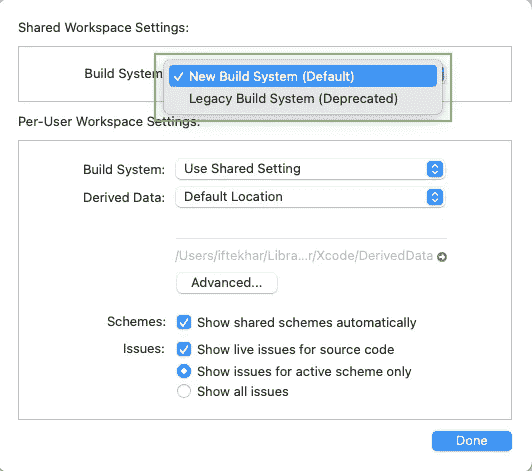

## **2。**仅构建活动架构

*   在项目的构建设置中导航到“仅构建活动架构”。
*   确保将“调试”设置为“是”，将“发布”设置为“否”


## **3。优化 dSYM 文件生成**

*   确保您将“调试信息格式”设定为总是为您的发布版本创建 dSYM 文件。
*   对于调试版本，您可能不需要它。

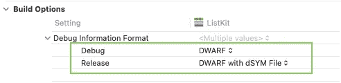

## **4。优化级别**

*   确保将“调试”设置为“-Onone”，将“发布”设置为“-O”或“-Osize。”

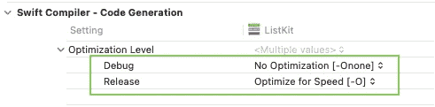

对于 CocoaPods，通过将以下内容添加到 Podfile 的末尾来优化所有依赖项:

## **5。编译模式**

*   确保将“调试”设置为“增量”，将“发布”设置为“整个模块”

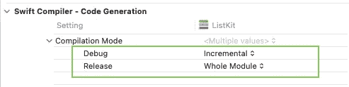

对于 CocoaPods，通过将以下内容添加到 Podfile 的末尾来优化所有依赖项:

## **6。仅在需要时运行运行脚本**

下面的脚本将*总是*运行，不管构建配置如何。


我们只需要为调试配置执行它，因此我们可以将其更改为如下所示，以便只为调试版本执行:

如果您只想为发布版本执行运行脚本，反之亦然:

# **Xcode 设置**

## **1。正确测量你的编译时间 **️****

在终端中输入以下命令:

```
defaults write com.apple.dt.Xcode ShowBuildOperationDuration YES
```

关闭 Xcode，再次打开它，构建您的项目，您将能够在编译成功消息的末尾看到项目的编译时间。


## **2。**识别编译缓慢的代码 **️**

在“其他 Swift 标志”下，添加以下几行:

```
-Xfrontend -warn-long-function-bodies=100
-Xfrontend -warn-long-expression-type-checking=30
```

*注:*`*100*`*`*30*`*单位为毫秒(ms)。也可以根据需要换成别的。**

*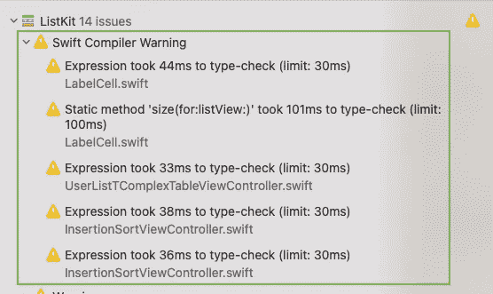*

*现在，您将能够看到在您的项目中哪些代码需要更多的时间来编译。然后，您可以通过重写来专注于改进该领域。*

*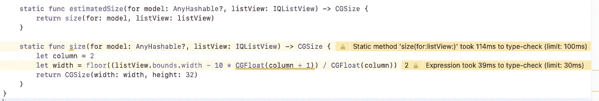*

**注意:为了获得最准确的编译时间，清理您的 Xcode 项目(包括带有-⌘+⌥+K 的构建文件夹)并删除您的派生数据。**

## ***3。识别函数的编译时间***

*在“其他 Swift 标志”下，添加这一行:*

```
*-Xfrontend -debug-time-function-bodies*
```

*您将能够看到项目中每个函数的编译时间:*

*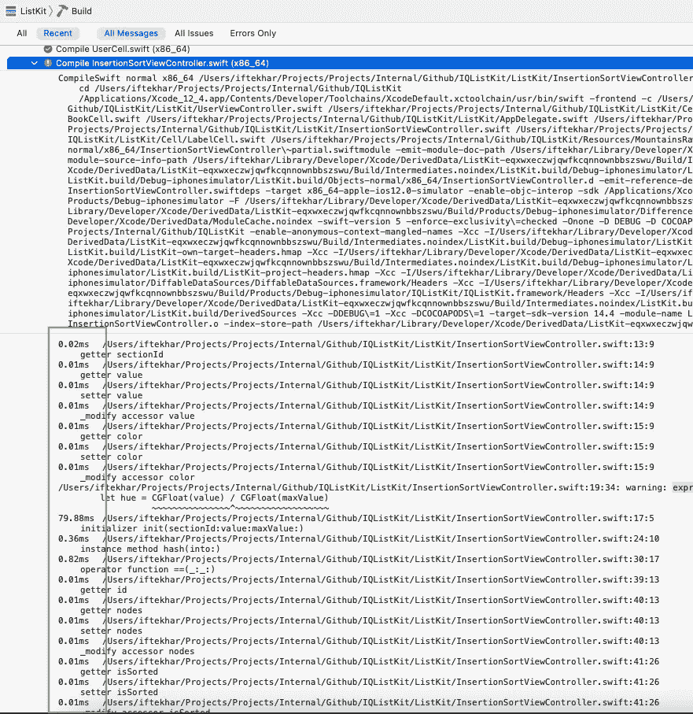*

## ***4。启用 Xcode 并发构建(需要高 RAM)***

*在终端中输入以下命令:*

```
*defaults write com.apple.dt.Xcode BuildSystemScheduleInherentlyParallelCommandsExclusively -bool NO*
```

*要禁用它，请在终端中输入以下命令:*

```
*defaults delete com.apple.dt.Xcode BuildSystemScheduleInherentlyParallelCommandsExclusively*
```

**注意:如果你没有足够的内存，它也会减慢你的一些项目。**

# ***代码优化***

## ***1。再利用，再利用，再利用***

*假设您有一个包含变量`isValidEmail`的`String`扩展，如下面的代码所示。如果一份代码需要 50 毫秒来编译，那么另一份也需要同样的时间来编译。编译这两份代码大约需要 100 毫秒。*

*我们可以重写这段代码来引入一个新的扩展文件，并编写一个可以在两个文件中使用的代码副本。代码的单个副本只需要 50 毫秒。*

*我还注意到有些人多次复制粘贴代码，即使它们是相似的。这给编译器带来了不必要的工作，因为从它的角度来看，所有的代码都是不同的。*

*让我们看一个例子，我们在四个地方有相同类型的代码。如果编译器编译一个副本需要 50 毫秒，那么编译四个副本需要 200 毫秒。*

*我们必须避免这个问题。*

*一个解决方案是编写一些逻辑方法来优化这部分代码，如下所示。我们的逻辑减少了代码，所以如果前一个副本需要 50 毫秒，它不会超过 60 毫秒。*

## ***2。删除不必要的空白代码***

*根本不做任何事情的代码也是由编译器编译的，所以删除这样的代码是个好主意。*

## ***3。尽可能使用字母***

## ***4。尽可能让你的课程结束***

## ***5。在项目中避免公共和开放(除了库/框架)——尽可能使用私有***

## ***6。如果在同一文件中，尽可能将扩展名标记为私有或文件私有***

## *7 .**。明确指定类型***

*不要让编译器推断。*

*如果你不指定类型，那么编译器必须寻找类型，这需要时间。最好指定类型，以减少编译器的工作。*

*也不要不指定类型就直接使用`.init`。*

*如果我们没有在`.init`中指定类型，那么编译器需要一些时间来确定 init 调用的类型，所以最好指定它。*

*此外，如果编译需要大量时间，请避免简写 enum。*

## ***8。避免 Objective-C 类型***

## ***9。避免单行中的长计算***

*如果在一行中有几个计算，那么编译器就很难判断那里发生了什么。如果我们将代码分成几个简单的语句，那么它将有助于编译器识别这些语句，并且将花费更少的时间来编译。*

## ***10。尽可能避免字符串插值***

*根据我的观察，字符串连接比插值编译得更快。因此，当所有应该连接的变量都是`String`类型时，使用连接。*

**注:也有人说字符串插值比字符串串联快。我发现事实正好相反。**

## ***11。避免==假和==真。使用！运算符代替== false***

## ***12。避免零判断。？操作员***

*使用`??`操作符求解`nil`判断比用`if-else`或几个语句求解同一个语句要花费更多的编译时间。*

## ***13。尽可能避免惰性属性***

*声明`lazy`属性的编译速度也比其他非`lazy`属性慢。*

## *14。尽可能减少类型转换和 C 方法*

*我不知道为什么，但是编译器讨厌类型转换。带有类型转换的简单语句需要大量的时间来编译。最好避免或至少减少类型转换的使用。*

*下面的语法看起来很简单，但是编译起来太费时间了:*

## *15。避免长功能*

# ***清除不用的东西***

*编译这些东西也需要大量的时间——即使它们没有被使用。*

## ***1。删除未使用的代码***

*找到未使用的代码并删除它是一个好主意。*

*外围应用程序是一个寻找未使用代码的好工具。我发现它几乎 99%正确。您可以使用它来查找未使用的代码并删除它，以减少不必要的编译器工作。*

*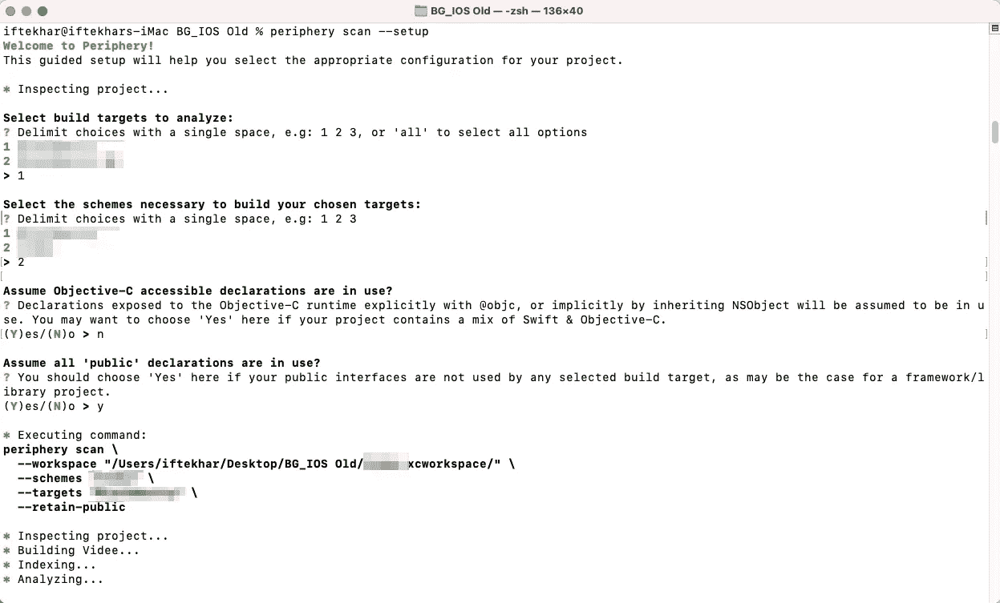**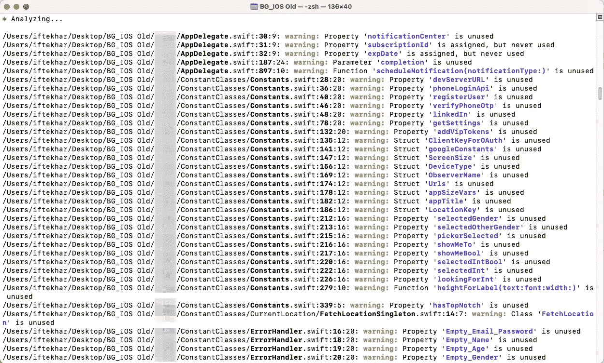*

*[这个 Swift 脚本](https://github.com/PaulTaykalo/swift-scripts/blob/master/unused.rb)也能够确定未使用的代码。*

*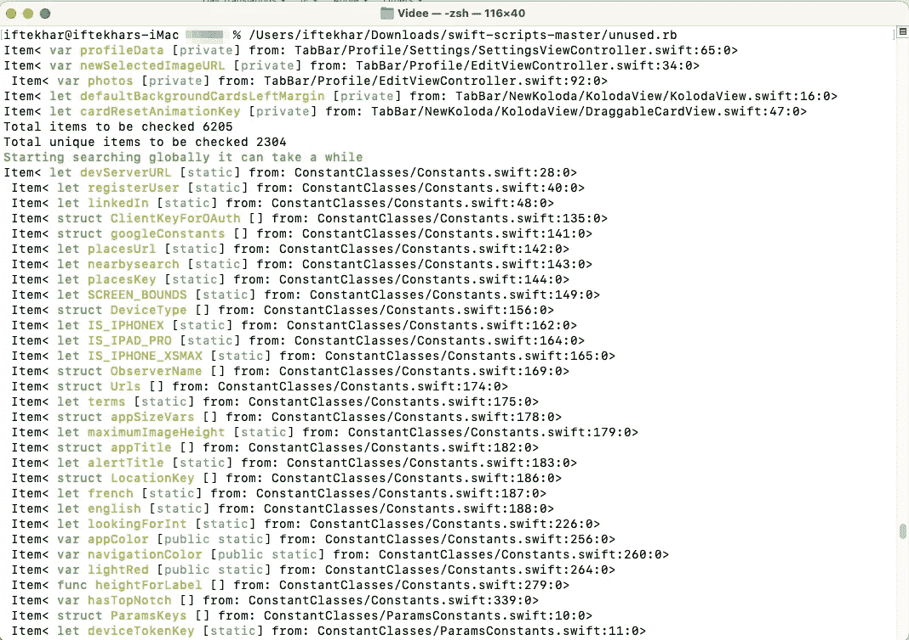*

## ***2。移除未使用的资产/图标***

*编译资产也需要大量的时间。删除不必要的资产可以提高编译时间。风鸟工具是一个从资产中找到未使用图标的伟大工具。*

*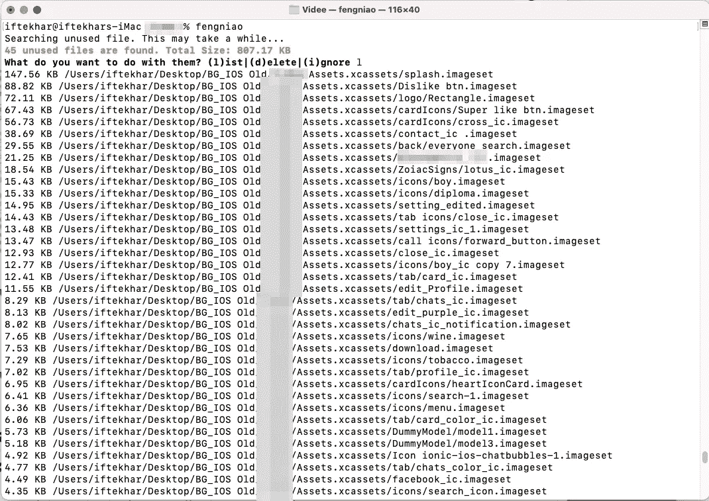*

## ***3。移除未使用的故事板控制器***

*故事板是让编译器变慢的罪魁祸首。在大多数情况下，有一个单独的故事板，它需要大约 40-60%的总编译时间。*

*减少这个时间的一个方法是删除未使用的控制器，或者将它们移动到一个单独的故事板，并取消选中它们的目标成员资格，这样它们就不会被编译。*

*如果我们有当前未使用的屏幕/控制器，请将其移至“未使用”。*

**

# ***故事板优化***

## ***1。将大故事板分割成多个小故事板***

*一个单独的故事板需要花费大量的时间来编译。如果我们把它分成多个故事板，它们都将并行编译，并且在编译时间上有很大的不同。拆分故事板总是更好。*

*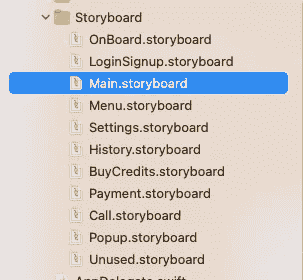*

## ***2。避免在一个控制器中有太多项目***

*在一个控制器中添加太多的视图需要花费大量的时间来编译。下面是一个单个控制器包含太多视图的例子。我们应该避免这种情况，并尝试将其分成多个控制器，以提高编译时间。*

**

## ***3。避免在故事板中创建一个大的列表风格的用户界面***

*具有大量 UI 元素列表的控制器需要花费大量的时间来编译。最好使用`UITableView`或`UICollectionView`来构建。下面是一个我们应该避免的例子:*

*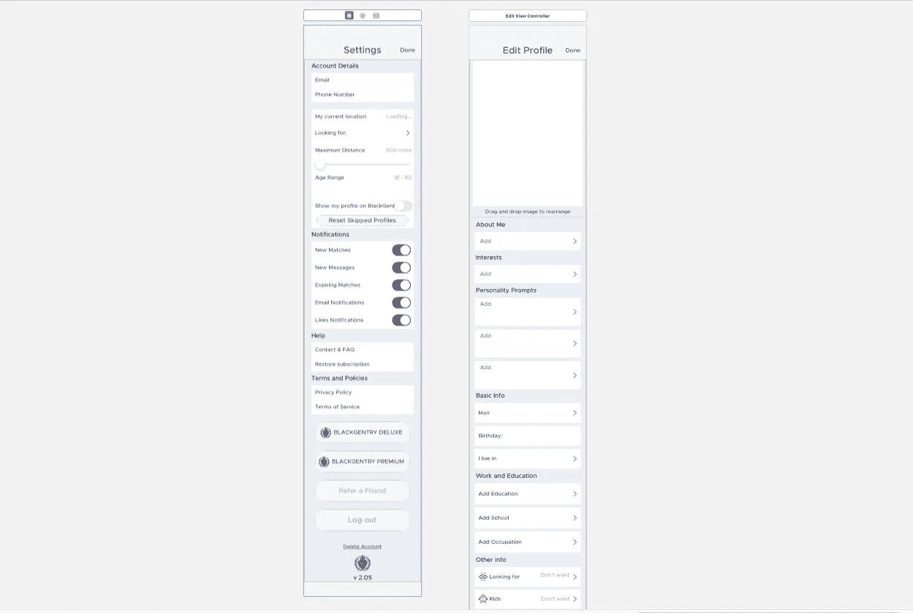*

# ***椰子大战迦太基***

*简而言之，如果您经常进行干净的构建并且关心构建时间，Carthage 是一个更好的选择。*

## ***椰子退税***

*CocoaPods 会导致更长的编译时间，因为在大多数情况下，第三方库的源代码会在每次执行干净的构建时被编译。一般来说，您不应该经常这样做，但实际上，您必须这样做。*

## ***袁绍的优势***

*它从不在干净的构建上重新构建，所以您跳过了所有的依赖项构建时间。只有当你改变了依赖列表中的一些东西(添加一个新的框架，更新一个框架到一个新的版本，等等)时，你才构建外部依赖。).这可能需要一些时间来完成，但是这比构建嵌入了 CocoaPods 的代码要少得多。*

# ***构建时间分析器***

## ***1。带计时摘要的构建***

*内置的构建时间摘要将给出编译时摘要的总体粗略概念。*

*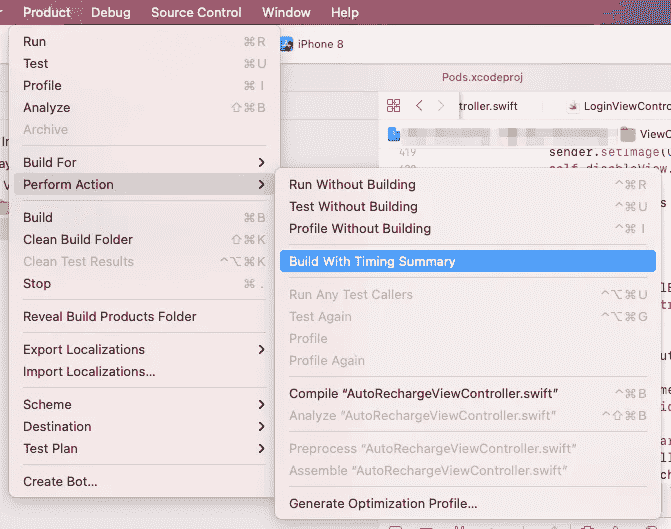**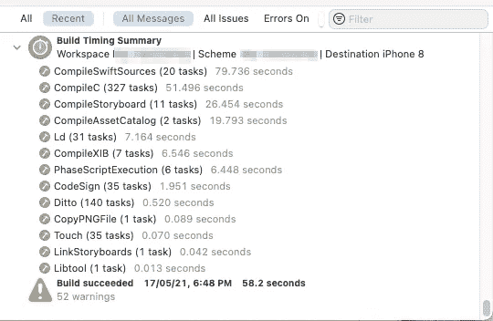*

## ***2。使用 Xcode 的构建时间分析器***

*要确定编译需要大量时间的代码部分，请使用[构建时间分析工具](https://github.com/RobertGummesson/BuildTimeAnalyzer-for-Xcode)。它还按累积时间对函数进行排序。*

*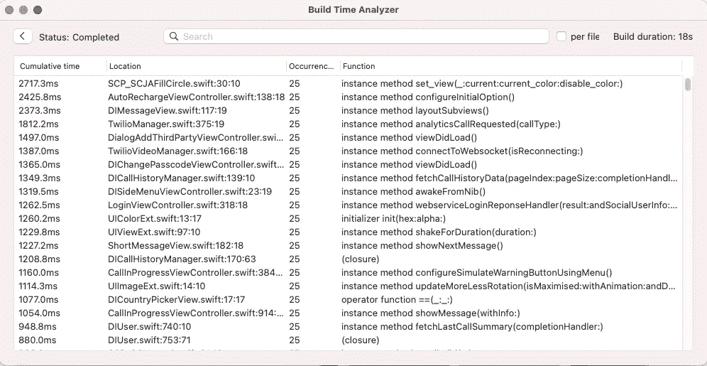*

# ***机器硬件问题***

## ***1。升级到最新的硬件***

*如果你的系统有一个好的处理器(CPU ),那么编译你的代码将会比旧的 CPU 花费更少的时间。*

*例如，在一台使用了五年的机器上，一个项目可能需要 15 分钟来编译。在最新一代的机器上，相同的项目可能需要大约两分钟来编译。*

*另外，Xcode 使用大量 RAM 来运行。*

*根据我的观察，现在至少需要 16 GB 的 DDR4 RAM 才能在良好的稳定状态下运行 Xcode 12。32 GB 内存将很快成为新的标准。*

## ***2。笔记本电脑与台式机***

*简而言之，台式机是更好的选择，因为它的 CPU 性能更好。*

*笔记本电脑的缺点:*

*   *笔记本电脑 CPU 的功率通常较低，因为它们的主要用途是便携性，而不是其他。第二个是节省电池电量和寿命。这就是为什么笔记本电脑有低端移动 CPU，没有太多的权力来快速编译项目。*
*   *笔记本电脑通常不容易用新硬件升级。*

*桌面优势:*

*   *桌面 CPU 有不同的风格和不同的性能。选择一个好的 CPU 可以极大地提高整个系统的性能。*
*   *建议使用最新一代的英特尔 i5 CPU，以使整个系统高效工作。*
*   *台式机可根据您的需求进行高度升级和定制。*

# *磁盘空间不足时运行*

*这与编译时间没有直接关系，而是让整个系统高效地工作。如果您的磁盘剩余空间少于 20GB，那么您的整个电脑将会由于磁盘空间不足而变慢，并且您可能会发现很难在电脑上进行日常工作。*

**

*为了获得流畅的工作体验，您必须保持磁盘空间空闲。*

*为了清理一些空间，您可以删除未使用的模拟器、档案、派生数据等。*

# ***结论***

1.  *优化您的构建设置。*
2.  *仅在特定环境中需要时执行运行脚本。*
3.  *分析花费太多时间编译的代码区域。*
4.  *明确指定类型，而不是让编译器推断您在代码中使用的类型。这样会节省很多时间。*
5.  *减少让编译器困惑的代码。尽量写得简单明了。*
6.  *如果一个表达式看起来很复杂，试着把它分成几行。*
7.  *使用多个故事板。*
8.  *避免在故事板的控制器上放置过多的 UI。*
9.  *使用`UIScrollView`避免使用长列表的控制器。尝试使用`UITableView`。*
10.  *如果使用较旧的机器，如果可能，尝试切换到最新一代的机器。*
11.  *始终确保您的系统有足够的内存和可用磁盘空间。*

*感谢阅读。我希望这有所帮助。如果你有任何问题，请随时回复。*