# 使用 Profiler 提高应用的性能

> 原文：<https://betterprogramming.pub/improve-your-apps-performance-with-profiler-67e65153d5d9>

## 100 天代码的第九天——性能至关重要

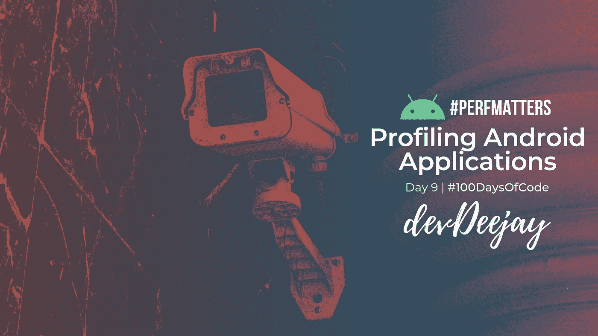

在如此努力地开发应用程序后，你不会想发布一个占用大量内存、不稳定的应用程序来加热用户的手机。

在 Android Studio 3.0 之前，有一些可用的监控工具，以及传统的日志记录。但是，检查您的代码日志记录语句，并使用旧的工具，对开发人员来说并没有多大帮助。

Android Studio 3.0 自带的 [Android Profiler](https://developer.android.com/studio/profile/android-profiler) 出现了。开发人员可以使用它来监控他们的 CPU、内存、电池消耗，以及监控应用程序发出的网络请求。是的，您仍然可以在 Logcat 中打印日志语句。

我总是忙于学习和试验最新的 Android 概念，从来没有时间深入剖析。我知道它就在那里，但总是拖延去了解更多，尽管它是 Android 应用程序开发的一个如此重要的方面。

您可以跟踪活动，这一过程可能是您的应用程序出现性能问题的根本原因。

# 让我们看看侧写员

你需要(至少)在设备上安装 Android Studio 3.0 和 SDK。

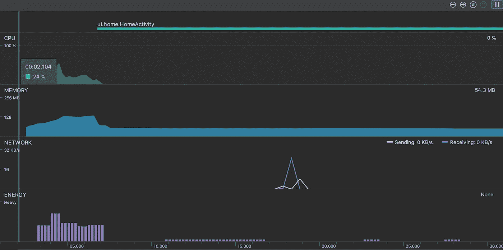

一旦你启动你的应用程序，点击底部的*分析器*标签，它将靠近*日志目录*。你会看到这样一个连续的图表，是实时更新的。它将在前台运行的活动显示在顶部。

当你点击任何一个图表，你会看到一个详细的细分。

更多地运行您的应用程序，进行互动，打开多个活动，并进行网络请求，您将观察到这些图表正在更新，这真的很有趣。

而且，如果您很想了解并看到哪些函数消耗了更多的资源，您甚至可以看到这一点。

单击图表的任意位置，查看更多详细信息。将鼠标指针移到它上面，可以查看资源消耗的详细明细。

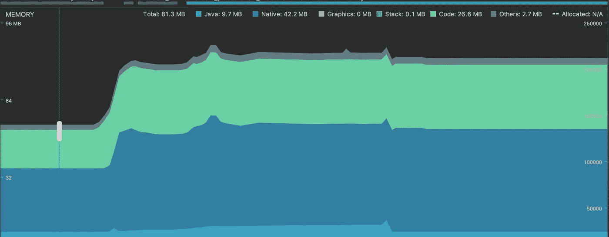

我们才刚刚开始。再次单击以查看更详细的屏幕。

在这里，您可以选择查看调用堆栈、调用的各种类、涉及的线程，这对于一些人来说可能会有点令人不知所措。但是一旦你学会了，它真的是一个很好的工具。

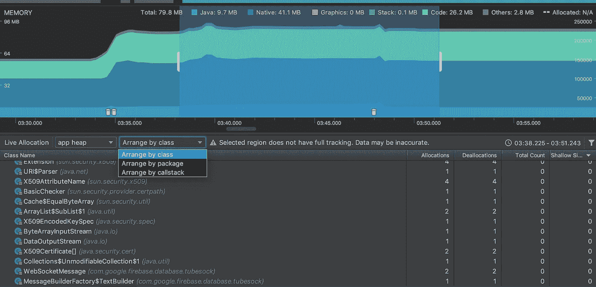

我们还没完呢。你甚至可以记录一段时间内的读数。在你完成记录后，Android Studio 会向你展示一些真正深入的内存消耗统计数据，精确到每一个字节。太神奇了！

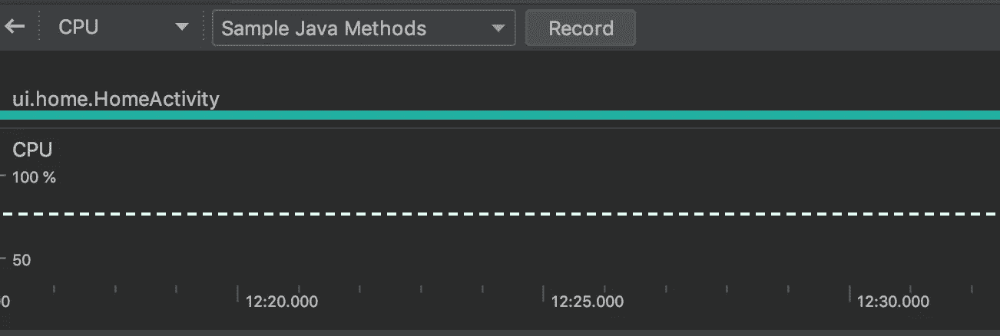

请确保您在记录会话时进行了一些互动，因为它确实需要数据来生成见解。一旦停止记录，底部将会充满数据。

## ***调用图表***

它以自上而下的方式显示所有呼叫者及其呼叫。方法调用将有不同的调用供您轻松识别。

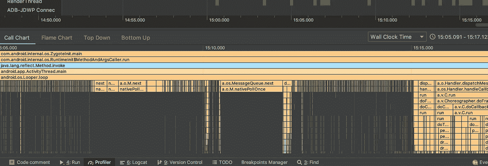

## *火焰图*

它揭示了哪些方法占用了我们设备宝贵的 CPU 时间。它与调用堆栈聚合相同，颠倒了前一个选项卡中的图表。

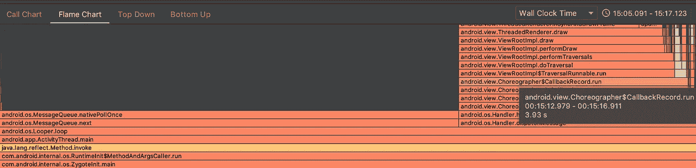

## 自上而下

以自顶向下的方式显示方法调用。

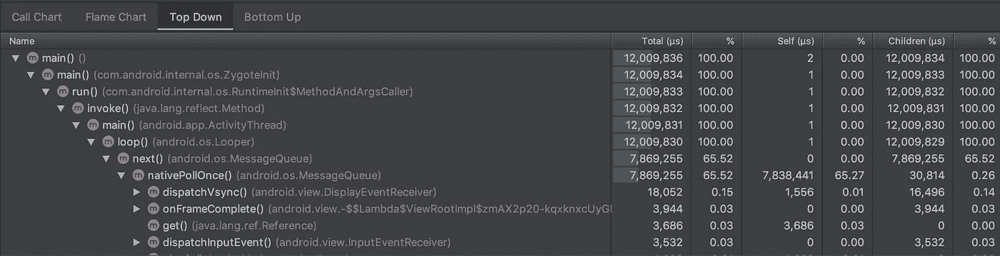

## 自下而上

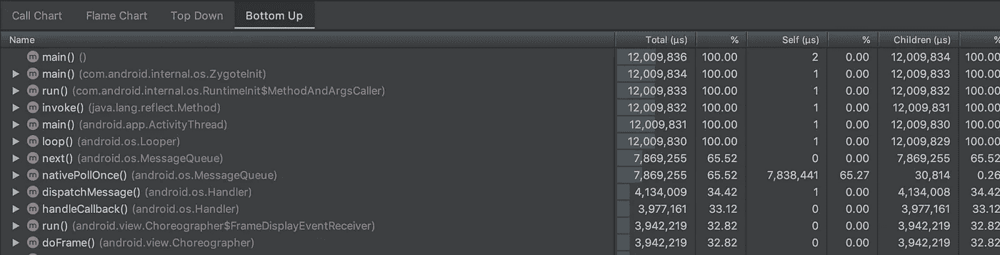

# 从这些图表中你能得出什么结论？

1.  如果你的内存图表持续增长，并且没有内存被释放，那么你的 Android 操作系统将只分配有限的内存给你的应用程序，之后你的应用程序将抛出一个`OutOfMemory`错误。(要看到这一点，可以创建一个无限增长的列表视图。孩子们不要在家里尝试这个！)然后，也许用回收器视图替换你的列表视图，看看在使用回收器视图后你是否节省了内存。
2.  如果您的图形波动很快，这意味着您的内存正在被消耗，垃圾收集也在频繁地释放内存，这也会对 UX 造成影响。

这里的主要目标应该是在尽可能低的读数下保持图形尽可能的平坦。不要把它保持在 800 兆字节。

# 一个个人的例子和你在剖析时应该期待什么

今天，当我在做我的一个项目时，我查看了 Android Profiler，发现应用程序的内存消耗出现了巨大的峰值，看到如此巨大的内存峰值，我感到非常惊讶，尽管应用程序在开始时几乎什么也没有做。

因此，我想将我已经在运行的应用程序与一个什么都不做的全新应用程序进行比较，所以我创建了默认的*我的应用程序* Android Studio 项目，并在我的 Oppo Realme 2 上运行，运行 Android Oreo。

这是默认新项目的概要分析器的样子:

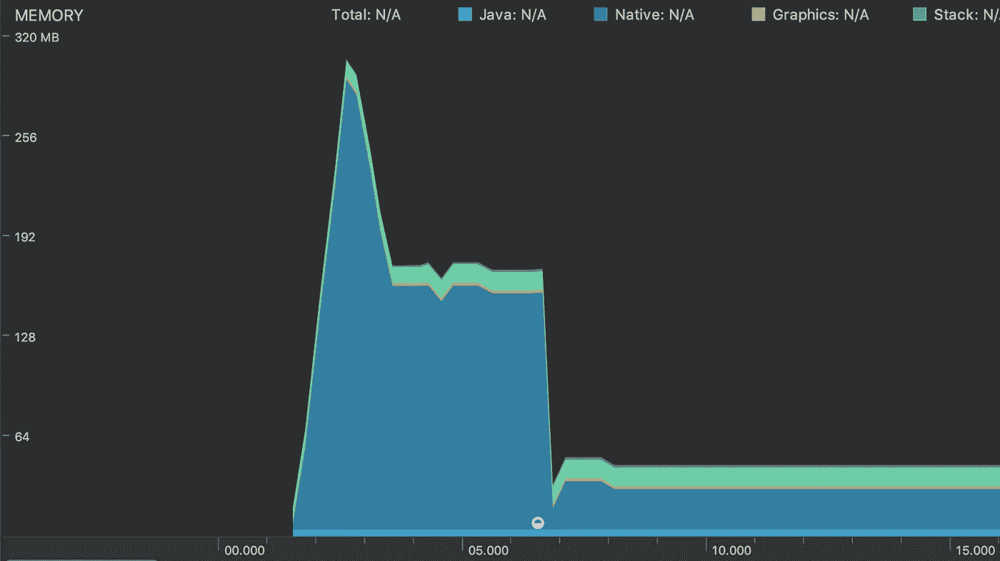

查看峰值，它显示了正在使用的内存的明细。

于是，我试着在一个运行 API 28 的仿真设备 Nexus 6 上运行同样的*我的应用*，这是它的概要文件。

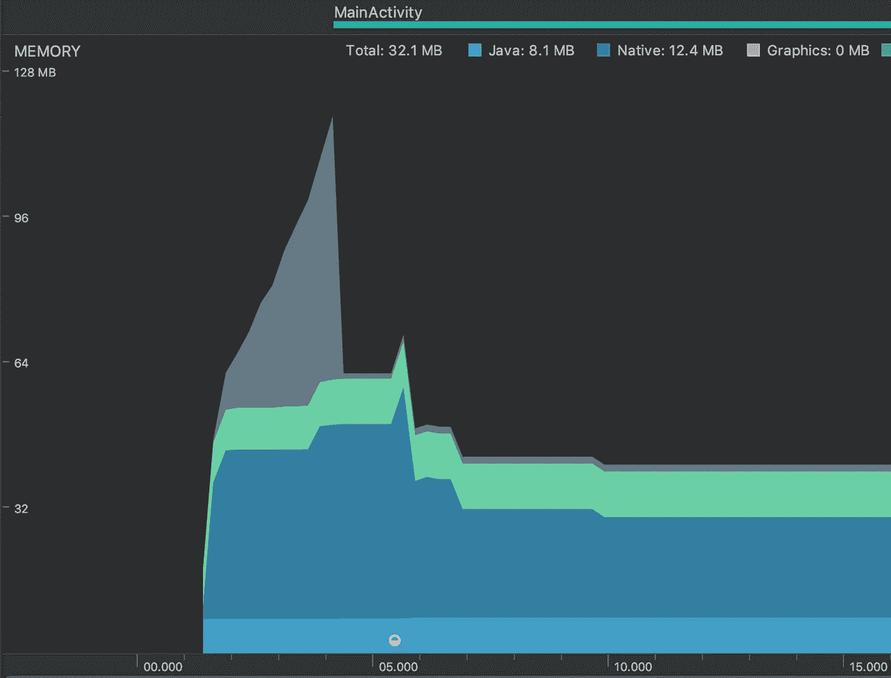

详细地说:

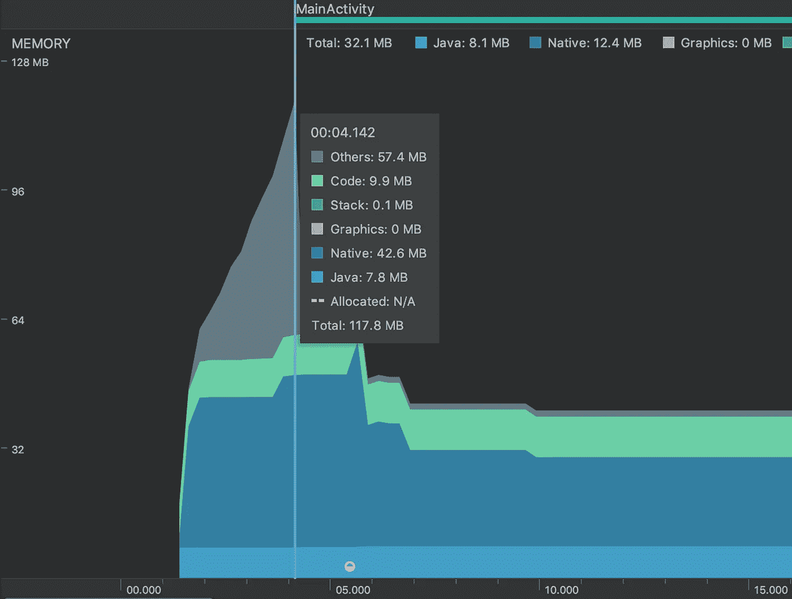

所以，运行你的应用程序的 Android 设备确实会影响你的应用程序的性能，并且可能会给你一些像这样令人震惊的结果！

仿真设备的本机内存消耗为 42MB，而 Oppo Realme 2 的本机内存消耗为 283.5MB。非常明显的结论是，我不应该使用我的手机在 Profiler 中检查应用程序的性能。

这只是刚刚触及表面。在未来的一个故事中，我们将深入探索它的产品，以及我们如何利用它来构建美丽而高性能的应用程序。

那是给第八天的人的！我希望你能和我一起学习这个系列。让我知道你的想法，或者分享任何反馈，这样我才能给你带来更多的价值。明天见！