# 如何用 Async 和 Await 改进异步 JavaScript 代码

> 原文：<https://betterprogramming.pub/improve-your-asynchronous-javascript-code-with-async-and-await-c02fc3813eda>

由 [Max Nelson](https://unsplash.com/@maxcodes?utm_source=medium&utm_medium=referral) 在 [Unsplash](https://unsplash.com?utm_source=medium&utm_medium=referral) 上拍摄的照片

如果你有机会观察现代 JavaScript 代码，你很有可能在某个地方见过`async`和`await`语法。

`Async/await`可以说是该语言中最受欢迎的新词之一。 **Async/await** 使**异步**代码像同步代码一样出现和运行。**异步/等待是基于承诺的。**

在我们进入 async/await 之前，我们必须理解什么是承诺以及它们扮演的角色。

# 承诺

`[Promise](https://developer.mozilla.org/en-US/docs/Web/JavaScript/Reference/Global_Objects/Promise)`是代表异步操作最终完成或失败的对象。

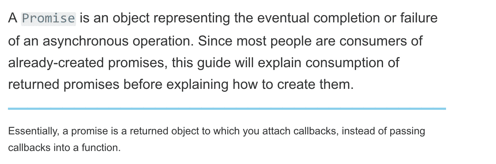

[https://developer . Mozilla . org/en-US/docs/Web/JavaScript/Guide/Using _ promises](https://developer.mozilla.org/en-US/docs/Web/JavaScript/Guide/Using_promises)

## 我们为什么需要异步代码呢？

JavaScript 是单线程语言——这意味着 JavaScript 一次只能做一件事。想象一下，同步调用我们的 API 并在 API 调用期间阻塞整个线程——我们的用户将不得不等待 30 秒或网络请求解决所需的时间——这是一大禁忌！

如果您有兴趣了解更多，这里有一个关于 JavaScript 异步编程的更深入的解释。

 [## 异步编程::雄辩的 JavaScript

### 两个重要的 JavaScript 编程平台——浏览器和 node . js——进行操作可能需要一段时间…

eloquentjavascript.net](https://eloquentjavascript.net/11_async.html) 

我们过去处理异步 JavaScript 代码的方式是通过回调。你很有可能会遇到回调。

## 什么是回调？

回调函数也称为高阶函数，是传递给另一个函数的函数。函数在 JavaScript 中是一级公民——这意味着它们可以作为参数传递给函数。

您可能已经见过类似这样的 jQuery 特定代码。

下面的代码在我们的按钮上附加了一个事件监听器，一旦被触发就调用`alert`。

*回调在哪里？你能看出来吗？*

你或许可以——它是在`click`函数括号内的匿名`function`。

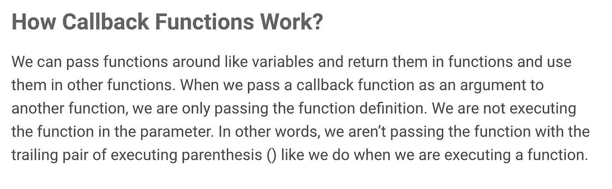

[https://JavaScript sexy . com/understand-JavaScript-callback-functions-and-use-them/](https://javascriptissexy.com/understand-javascript-callback-functions-and-use-them/)

简单地说，回调:我们触发一个函数，做一些事情，然后调用另一个函数。

回调也不全是坏事；他们成功了——现在仍然如此。但是，如果回调中有回调，回调中有回调，会发生什么——你明白了。很快就会变得很乱很难维护。

上述问题被命名为*“回调地狱”*

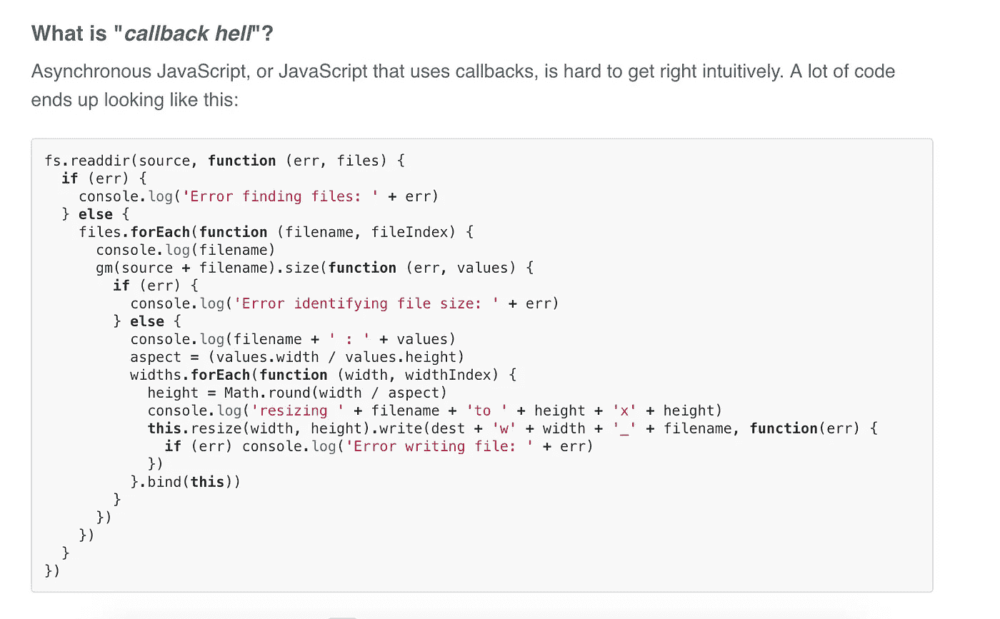

[http://callbackhell.com/](http://callbackhell.com/)

这里还有一个例子来密封回调的情况。

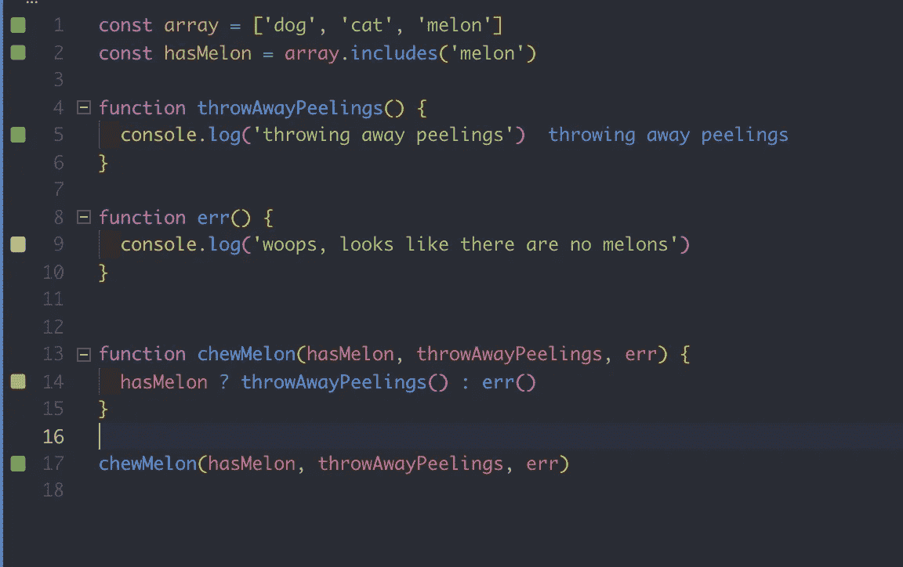

我们有一个甜瓜！

我们检查数组中是否有甜瓜——如果有，我们咀嚼甜瓜。嚼完之后，我们把瓜扔掉。我们还用`err`回调处理异常。

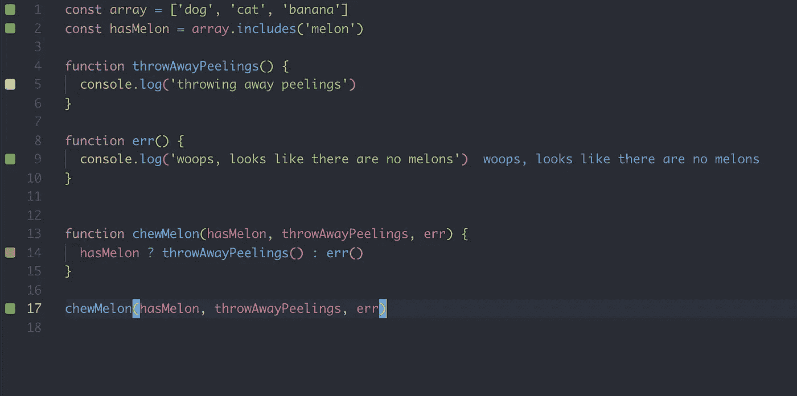

嘿——我们改吃香蕉了！

*注意:*`err`回调总是节点世界中的第一个参数— [最佳实践](https://stackoverflow.com/a/40512067/5073961)！

只是为了让你不那么困惑——我尽可能地让前面的代码可读性更好。以下是更常见的情况:

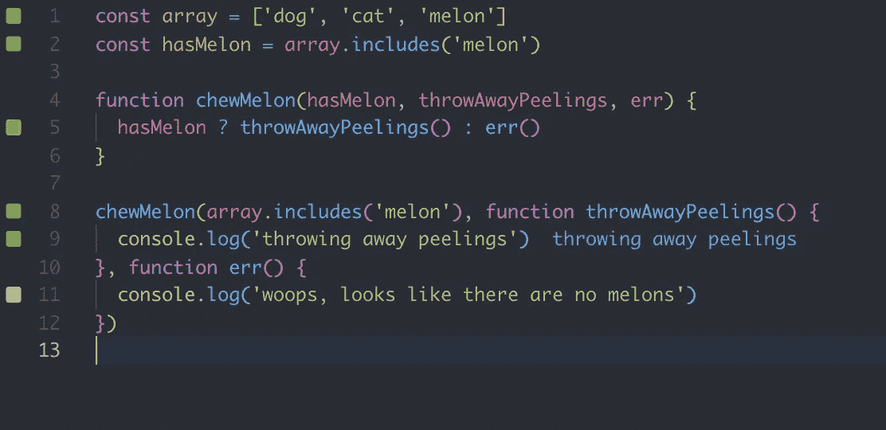

迷你回调地狱；从技术上讲，使用匿名箭头函数是一种补救措施，但仍然不是完美的解决方案。

你可以想象，再有几次回调，我们就要踏上通往地狱的高速公路了——双关语！

# 承诺救援！

承诺是编写异步代码的一种干净的方式。承诺只有一个参数，即回调。

回调有两个参数，即`reject`和`resolve`条件。

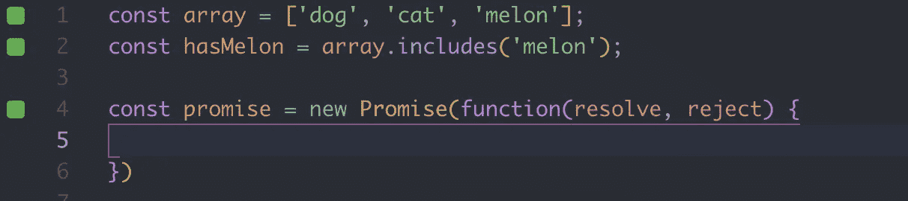

如果我们使用箭头函数来缩短代码:

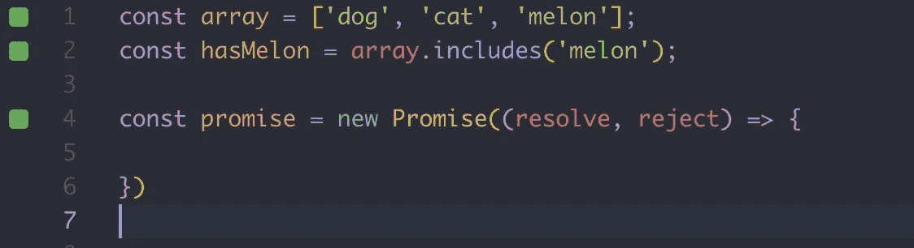

在承诺块中，我们可以决定何时解决，何时拒绝承诺。

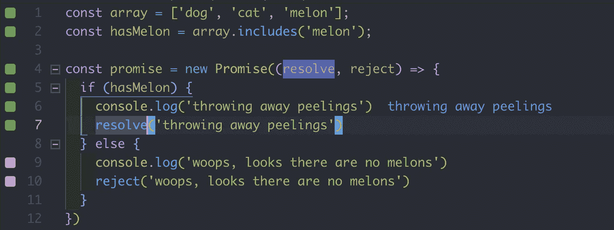

在承诺中，我们检查我们是否有一个甜瓜。如果我们这样做了，让我们用传递给`resolve`的值来`resolve`这个函数——我们可以传递任何值给`resolve`。

承诺被立即调用/解决，这就是为什么我们看到了`console.log` 而没有调用承诺。

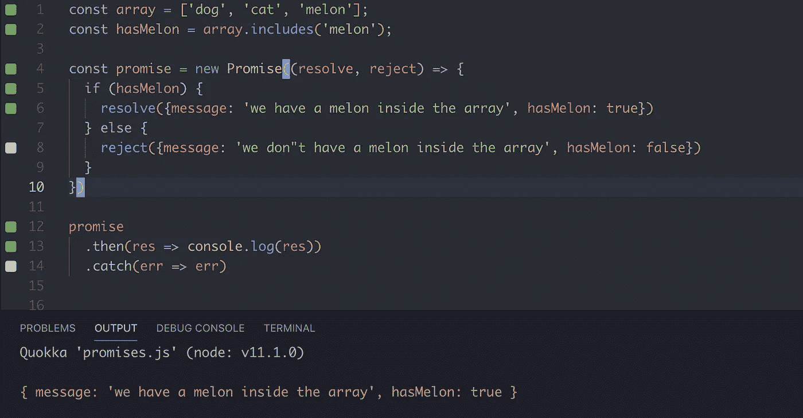

用`then`和`catch`方法调用和链接承诺。可以这样想:承诺已经有了一个值——我们该怎么处理它呢？

这就是`then`和`catch`语法出现的地方。它们都是接受一个参数的回调，这个参数是在承诺内部传递的返回值。

以下是我们如何处理拒绝承诺的情况:

用 catch()处理承诺拒绝

对，现在我们的承诺不是很有活力——为什么？

因为我们有一个非动态的 if 语句。当包装在一个函数中时，承诺是非常强大的。我们称之为高阶函数。

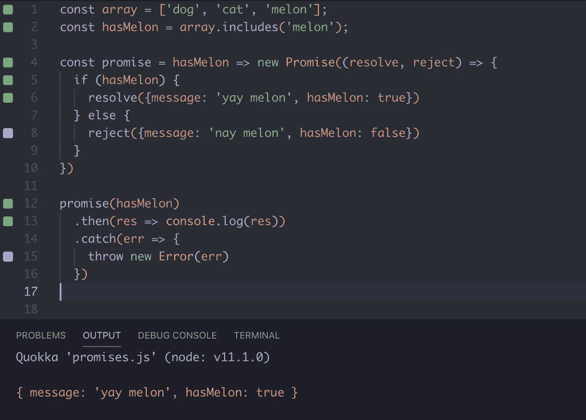

将我们的承诺包装在函数中

你注意到这个小变化了吗？在这种情况下，我们将承诺包装在一个接受一个参数的函数中。这给了我们的承诺巨大的灵活性。我们可以将任何条件传递给我们的承诺，基于这个条件，它要么被拒绝，要么被解决。

这是得到解决的完全有效的承诺。

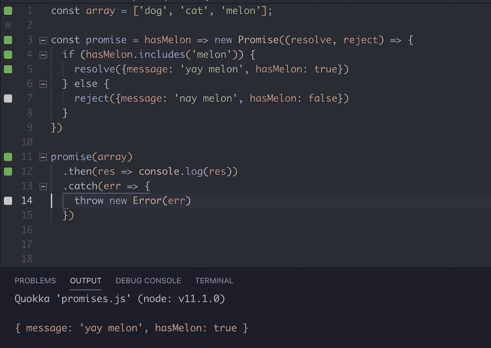

坚定的承诺

和被拒绝的承诺。

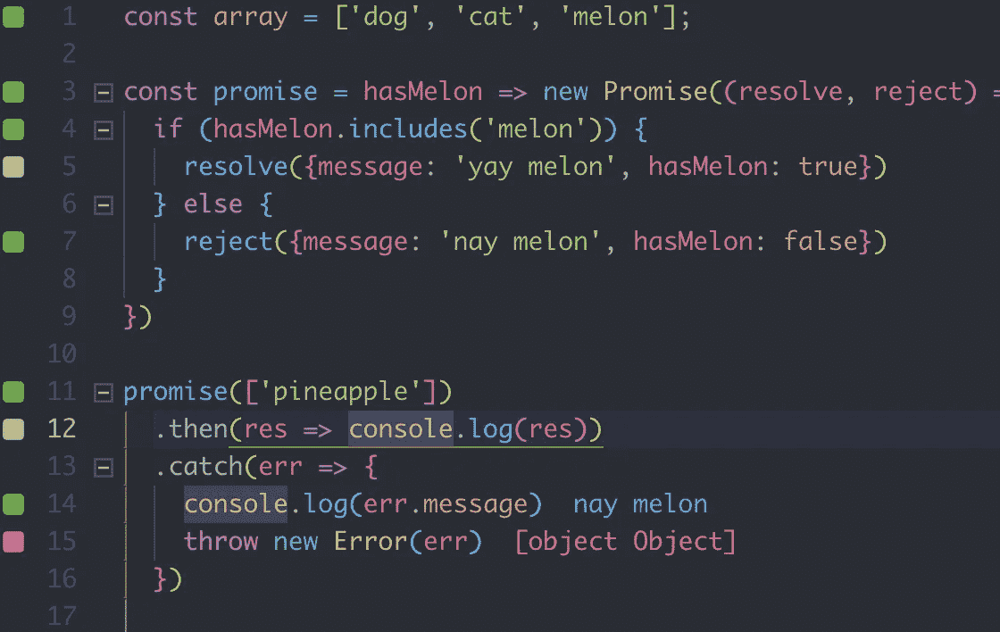

被拒绝的承诺

开始变得熟悉？你可能见过类似下面这样的 [Axios](https://www.npmjs.com/package/axios) API 调用。

Axios API 调用示例(基于承诺)

或者 fetch API 调用；

获取 API 调用示例(基于承诺)

他们有什么共同点？

首先，它们都是承诺。他们基本上是在利用“兜帽”下的承诺。就像我们将承诺包装在函数中一样，这两个例子也是如此。

其次，它们都是异步代码。承诺自然是异步的。

下面是异步 API 调用的样子:

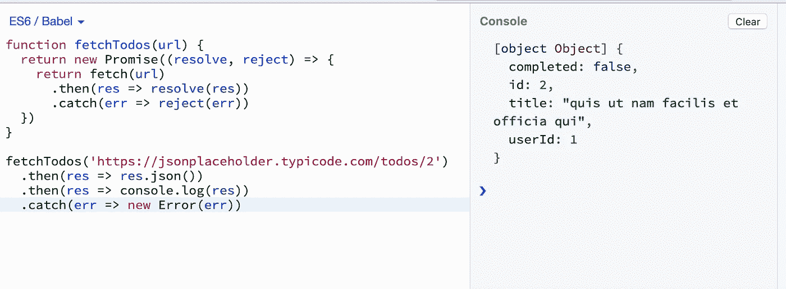

可以肯定地说，承诺比回访好得多。尽管承诺也有自己的缺陷——承诺会很快失控。

如果有更好的方法，更干净的方法呢。**异步/等待**救援！

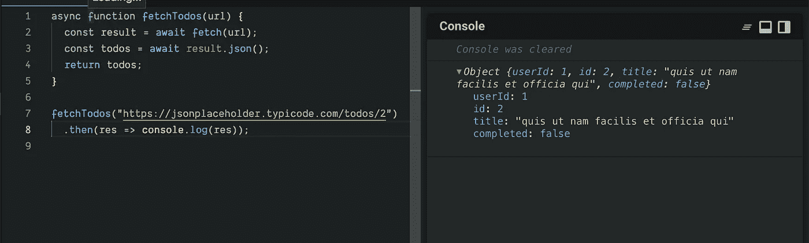

[https://codesandbox.io/s/p9mr3jzwp0?autoresize=1&扩展工具=1 &隐藏导航=1](https://codesandbox.io/s/p9mr3jzwp0?autoresize=1&expanddevtools=1&hidenavigation=1)

我们将函数标记为`async`——在函数内部，我们将异步代码标记为`await`。JavaScript 将解析承诺，然后继续下一行。简而言之，我们将异步代码改为像同步代码一样阅读，同时仍然异步运行。

请注意，我们不再调用 promise 构造函数，并且`then()`和`catch()`方法也少了很多。

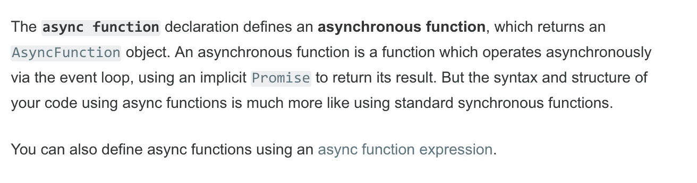

[https://developer . Mozilla . org/en-US/docs/Web/JavaScript/Reference/Statements/async _ function](https://developer.mozilla.org/en-US/docs/Web/JavaScript/Reference/Statements/async_function)

# 错误处理呢？

我们当前的 async/await 不处理异常。这可能会导致灾难性的错误，使你的应用程序崩溃。

`Try…catch`来救援了！

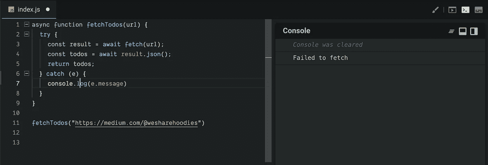

在 try catch 块中包装我们的异步函数

try catch 块尝试执行代码，如果遇到任何异常/问题，它会将错误对象传递给 catch 块，并执行 catch 块内的代码。

 [## 尝试...捕捉

### 尝试...catch 语句标记要尝试的语句块，并指定在引发异常时的响应。

developer.mozilla.org](https://developer.mozilla.org/en-US/docs/Web/JavaScript/Reference/Statements/try...catch) 

下面是我们的异步/等待获取在错误处理时的样子。

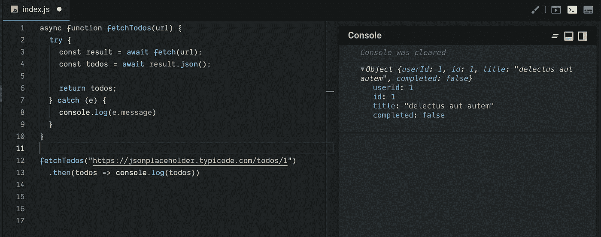

这只是许多例子中的一个，有许多方法可以利用 **async/await** 。如果你很好奇，这里有一个很好的例子，StackOverflow 回答探索替代方案。

 [## 带有异步/等待的 try/catch 块

### 感谢贡献一个堆栈溢出的答案！你过去的一些回答不太受欢迎，你…

stackoverflow.com](https://stackoverflow.com/a/40886720/5073961) 

如果你真的想知道如何管理承诺以及异步 JavaScript 代码是如何工作的，我推荐通读“[带承诺的 JavaScript:管理异步代码](https://amzn.to/2K8WUYR)”这本书。

感谢阅读，我希望你发现这是有用的！❤