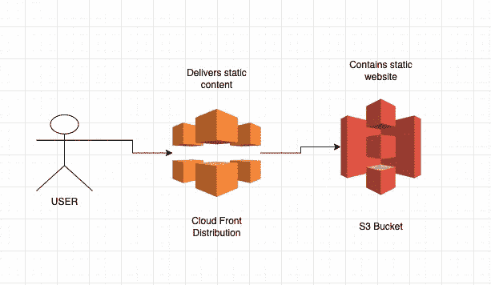
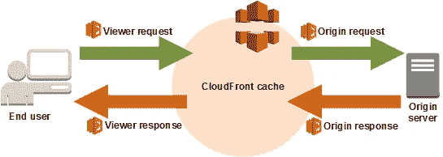
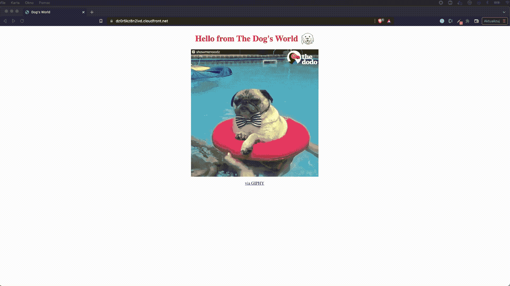
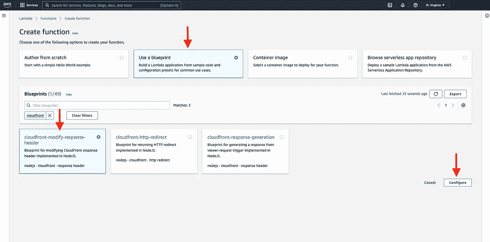
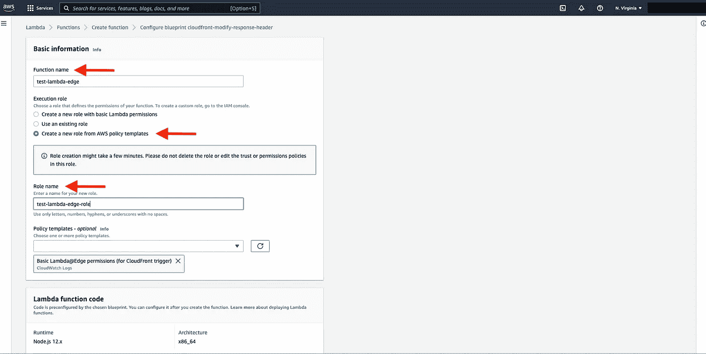
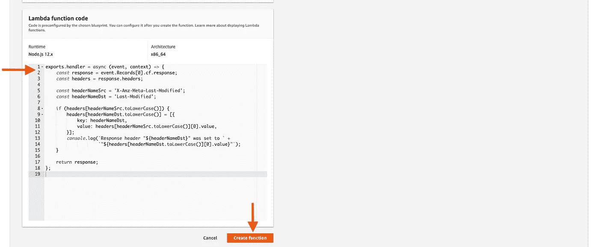
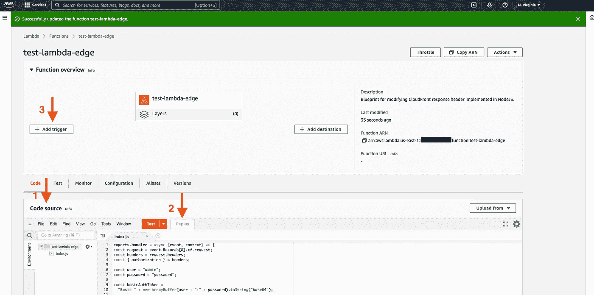
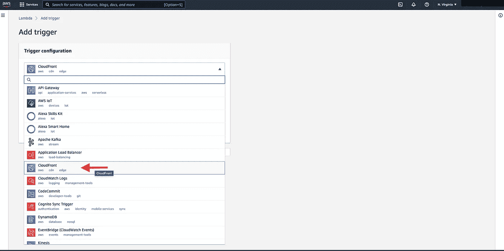
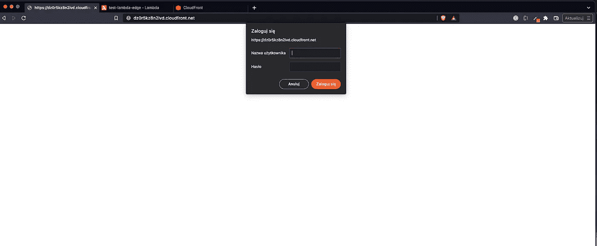

# 使用 AWS Lambda@Edge 改进您的内容交付

> 原文：<https://betterprogramming.pub/improve-your-content-delivery-using-aws-lambda-edge-1c9815f5527f>

## 了解如何将 Lambda 功能附加到您的 CloudFront 发行版中

由 [Safar Safarov](https://unsplash.com/@safarslife?utm_source=medium&utm_medium=referral) 在 [Unsplash](https://unsplash.com?utm_source=medium&utm_medium=referral) 上拍摄的照片

AWS Lambdas 是亚马逊云中最知名的服务之一。使用 Lambda 函数，您可以创建无服务器 API，也可以对系统中的特定事件做出反应，比如消息被推送到队列中，或者`DynamoDB`表中的项目被更新。

但是 Lambda 函数还有一个不太为人所知的应用。而且，这个解决方案有自己的名字，叫做`Lambda@Edge`。`Lambda@Edge`是 Amazon CloudFront 的一个特性，它让你在更接近应用程序用户的地方运行代码，从而提高性能并减少延迟。

在本文中，我将描述一些`Lambda@Edge`有用的用例。我还将向您展示如何创建一个`Lambda@Edge`函数。所以，像往常一样，拿起你的咖啡，舒服地坐着，跟着我一起走:)

为了充分理解`Lambda@Edge`能给我们带来什么，我们必须后退一步，描述一下它是什么。

> “Amazon CloudFront 是一项网络服务，可以加速静态和动态网络内容的分发，例如。html，。css，。js 和图像文件。CloudFront 通过名为 edge locations 的全球数据中心网络提供您的内容。当用户请求您通过 CloudFront 提供的内容时，请求会被路由到延迟最低的边缘位置。”

CloudFront 是一个普通的 CDN(内容交付网络)。它帮助我们以更好的用户体验提供内容。在一个基本的用例中，我们可以将静态页面放在 s3 bucket 中，并将 CloudFront 发行版设置为服务于这个页面。

CloudFront + S3 设置

太好了，现在我们知道什么是云锋了。那么，在这个内容交付网络中，Lambda 函数的位置在哪里？我可以用它们做什么？

`Lambda@Edge`是 CloudFront 中附加到请求或响应的函数，可能在四种情况下被触发:

*   应观众请求(CF 收到终端用户的请求后)
*   在原点请求时(在 CF 将请求传播到原点之前，例如 s3 存储桶)
*   关于原点响应(从原点到 CF 的响应之后)
*   查看者响应时(在 CF 向最终用户发送响应之前)

[来源]https://docs . AWS . Amazon . com/lambda/latest/DG/lambda-edge . html

这听起来很有趣，但是你可能会说，我仍然看不到这些功能的任何好处。有很多好处和应用。我现在就分享它们。

`Lambda@Edge`的第一个应用可能是 A/B 测试。这个想法很简单。将有两个 s3 存储桶托管一个静态页面。Lambda 的代码会随机将用户重定向到特定的前端版本。然后，我们将为每个请求分配一个 cookie，以确保相同的用户每次都能看到相同版本的页面。

其次，我们可以使用`Lambda@Edge`进行动态内容生成。我们可以根据请求属性来调整图像的大小，或者根据一些无逻辑的模板来呈现页面，比如 Mustache。

另一个`Lambda@Edge`用例是 URL 操作。我们可以美化它们，或者映射 URL 以匹配原始目录结构。CloudFront 和 s3 被设计为支持每个 s3 存储桶一个静态页面。如果需要，我们可以绕过它。我们可以将多个页面部署到 s3，并将它们与一个 CloudFront 发行版连接起来，但是，我们需要`Lambda@Edge`。

最后，我们可以使用`Lambda@Edge`来增加我们应用程序的安全性。我们可以将请求分配给实施访问控制的自定义源。我们可以从用户那里过滤掉机器人，或者我们可以直接在 Lambda@Edge 代码中创建一个查看器验证器。

太好了。现在，当我们开始了解一些用例时，我们就可以看到如何创建 Lambda@Edge 的例子了。我已经准备好了 CloudFront 发行版和 s3 bucket。s3 桶中有一个静态页面。

部署到 s3 和 CloudFront 的测试网站

让我们想象“狗的世界”应该是秘密的。世界不能知道我们的秘密迷因。我们想保护我们的宝藏。为此，我们将添加`Lambda@Edge`，并通过添加基本的 auth 来保护访问。是的，我知道基本授权不是最好的保护，但我们正在学习如何添加`Lambda@Edge`而不是如何设置高级授权。

在我们开始之前，有一个免责声明。只能在`us-east-1`区域创建 CloudFront 函数，并且必须使用 node 或 python 作为 Lambda 运行时。现在不支持其他语言。

要创建`Lambda@Edge`，请转到 AWS 控制台，搜索 Lambda 函数并单击`create function`。在创建函数表单内，选择`Use a blueprint`选项，然后搜索`CloudFront`。在那里，您应该可以找到三个模板。其实你挑哪个都无所谓。我们会修改代码。我们使用模板来确保为`Lambda@Edge`创建一个合适的 IAM 角色。

使用蓝图创建 Lambda@Edge

当您点击`configure`时，您必须设置函数的名称以及将要创建的 IAM 角色的名称。

基本 Lambda 信息

在页面底部，你会看到 Lambda 函数代码。这是我们正在使用的模板中的代码。不用麻烦了。我们马上删除，自己设置。请单击创建函数。

确认 Lambda 创建

单击创建函数按钮后，您将被重定向到 Lambda 控制台。您还会看到一个弹出窗口，要求您设置 CloudFront 触发器。请点击`cancel`。我们还没有正确的代码。然后向下滚动一点，找到源代码。现在，删除 Lambda 代码，并用下面的代码替换它:

代码非常简单。在这里，我搜索授权标头，并将该标头与预期的标头进行比较。用户和密码是用代码硬编码的。我知道。我知道。那很糟糕。但这只是如何创建 Lambda 的一个例子，而不是如何用 secrets 认证:)。

最后，如果 auth 头与要求的不匹配，我将使用`Lambda@Edge`回调来拒绝请求并询问用户密码。

酷，已经设置好代码，请点击`deploy`按钮。现在，代码将被部署，但它还没有连接到 CloudFront。为此，让我们点击`add trigger`按钮。

更改 lambda 代码并添加触发器

然后，我们必须选择`CloudFront`服务:

从服务列表中选择 CloudFront

最后，我们可以选择想要扩展的 CloudFront `Distribution`。在表格中，保持`Cache behavior` 设置不变，但请将`CloudFront event`改为`Viewer request`。我们希望在最终用户点击端点时触发该函数。我们还必须确认我们想要将该功能部署到`Lambda@Edge`。

λ@边沿触发设置

这需要一段时间来触发。您将被重定向到 lambda 控制台，您将看到如下信息:

成功部署 Lambda@Edge 信息

如您所见，AWS 创建了该函数的新版本。这是`Lambda@Edge`的另一个限制——我们不能使用`$latest` 标签。它必须被版本化。

等待几分钟后，我们可以检查 lambda 是否工作。当输入 CloudFront URL 时，取决于浏览器和您使用的语言。您应该会看到与我类似的结果。如果页面被屏蔽，你必须先登录。这就是我们想要做的。干得好！

阻止公众访问 CloudFront 页面

在今天的教程中，我们浏览了`Lambda@Edge`的基本用例。我还向您展示了如何创建一个。现在，您可以轻松地将`Lambda@Edge`集成到您的应用程序中。无论您是否有相同或不同的用例。将`Lambda@Edge`添加到 CloudFront 发行版总是一样的。

编码快乐，下次见！