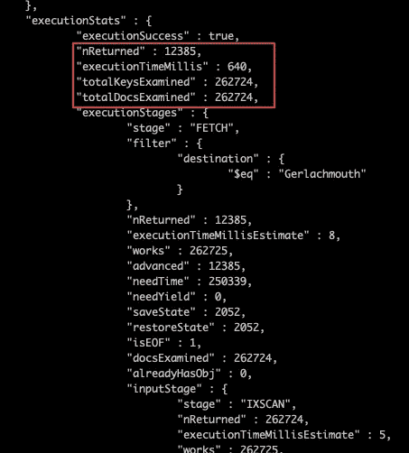
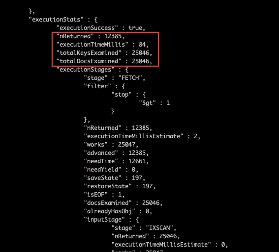
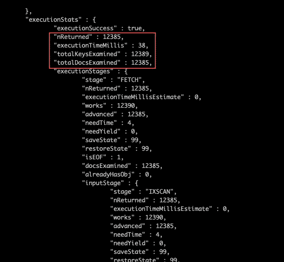

# 使用索引选择性提高 MongoDB 的性能

> 原文：<https://betterprogramming.pub/improve-your-mongodb-performance-using-index-selectivity-17a3747ea437>

## 因为搜索集合中的每个文档既浪费又缓慢

照片由[凯勒·琼斯](https://unsplash.com/@gcalebjones?utm_source=medium&utm_medium=referral)在 [Unsplash](https://unsplash.com?utm_source=medium&utm_medium=referral) 上拍摄

本文记录了如何使用索引选择性来提高 [MongoDB](https://www.mongodb.com/) 查询性能。在本文结束时，您将了解索引选择性的重要性，以及如何利用它来提高查询性能。

# 问题陈述

让我们探讨一下我们目前面临的情况。我们有一个包含`booking`集合的航班数据库。请参考下面的截图了解该模式。

预订模式

给定一个包含`booking`集合的航班数据库，航空公司的管理员希望我们研究一下查询性能。管理员会这样做:

*   管理员想知道如何查询到一个特定目的地的所有航班预订，该目的地有多个经停站。管理员想知道的信息是他们各自的`booking_no`、`origin`、`destination`和`stop`的号码。

接下来，我将分析并列出为了开展研究我需要的东西。

# 溶液分析

为了继续研究，我总是先找出我需要什么。这些项目是我需要的:

*   超过 50 万个文档的集合，以使查询时间更有意义
*   25，000 预订目的地“Gerlachmouth”
*   到目的地“Gerlachmouth”的 12K 预订超过一站。

在文章的最后，我们将知道索引选择性在查询性能中的重要性。

事不宜迟，让我们开始实验来检查性能。

# 性能实验

在我们开始任何实验之前，让我们确保设置是正确的。除了默认的`_id`字段，还没有为集合创建索引。

我想在这里进行的实验是:

*   实验一。使用`destination`和`stop`索引评估查询性能
*   实验二。索引选择性如何影响复合索引

## 实验一。使用创建的索引评估查询性能

在开始查询和评估性能之前，让我们为`stop`字段创建一个索引。

使用下面的命令为`stop`字段创建索引。

接下来，我们将看到查询目的地为“Gerlachmouth”且有多个站点的预订的表现。从下面的截图中，我们可以看到查询性能并不高效，因为我们正在扫描 262K 的索引键和文档，最终，它只返回了 12K 的文档。

我们只需要我们检查的 4%,这并不酷。

现在让我们尝试索引目标字段。使用以下命令为`destination`字段创建一个索引。

使用目标索引的查询性能

与使用上面创建的`stop`索引相比，使用目的索引的查询性能更高。参考上面的截图。现在，我们只检查 25K 个索引键和文档，比使用的`stop`索引少了近 10 倍。

如果你仔细想想，当我们使用 destination 进行查询时，这是可以接受的，也是很普通的常识。与停靠站的数量是否超过一个相比，目的地更加具体。这就是我们在 MongoDB 中所说的*索引选择性*。

这意味着索引选择性越高，MongoDB 就越容易缩小查询结果的范围，这相当于对 MongoDB 性能的重大改进。在这个例子中，这个查询的执行时间比使用`stop`索引快 7.6 倍。

## 实验二。索引选择性如何影响复合索引

在此之前，您可能会认为我们可以通过使用复合索引来解决这种索引选择性。我们可以用`stop`和`destination`字段创建一个复合索引。

让我们通过使用下面的命令创建一个复合索引来尝试一下。

使用复合索引 stop_destination 的查询性能

从上面的截图来看，与我们在实验 1 中创建的索引相比，性能和执行时间似乎非常好。然而，很奇怪的是，与返回的全部文档相比，我们要多检查四个键。

你可能会想这只是多了四把钥匙。但是我见过这样的场景，检查了 90K 个索引键，但是只返回了 10K 文档。因此，这不是很好，我们可以使用索引选择性理论来解决它。

让我们继续，创建一个基于强度指数选择性的复合指数。我们从最强的选择性开始。

我们可以使用下面的命令创建索引，从`destination`开始，然后是`stop`。

从下面的截图中，我们得到的结果是，检查的索引键等于返回的文档数。虽然这只是一个很小的改进，在这个例子中可以忽略不计，但是根据索引选择性创建索引是一个很好的实践。

使用 destination_stop 复合索引的查询性能

# 结论

以下是这篇文章的要点:

*   索引选择性在创建索引时起着重要的作用。更强的选择性带来更好的查询性能。
*   索引选择性对我们如何创建复合索引也有重大影响。在创建复合索引时，首先放置更强的选择性字段，这允许我们检查更弱的索引键。
*   最后，根据索引选择性的强度创建一个索引。记住:相等，排序，范围。相等提供最强的选择性，而范围提供最弱的选择性。

感谢您的阅读。下一篇文章再见。

# 参考

*   [创建确保选择性的查询](https://docs.mongodb.com/manual/tutorial/create-queries-that-ensure-selectivity/?jmp=university) — MongoDB 文档
*   [M201 MongoDB 性能](https://university.mongodb.com/courses/M201/about) — MongoDB 大学