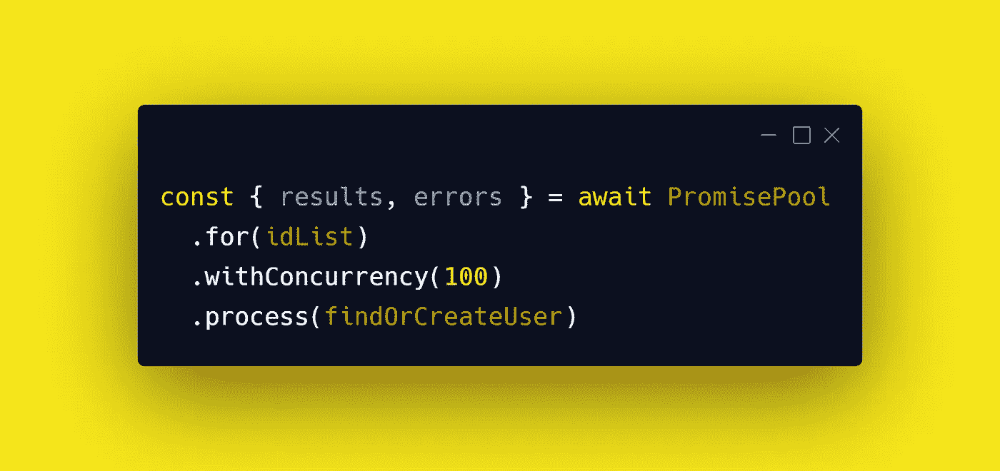

# 使用承诺池提高 Node.js 性能

> 原文：<https://betterprogramming.pub/improve-your-node-js-performance-with-promise-pools-65615bee2adb>

## 停止使用 Promise.all()

作者通过[碳](http://carbon.now.sh)拍照。

*先决条件:要理解这篇文章，你需要了解* [*承诺*](https://developer.mozilla.org/en-US/docs/Web/JavaScript/Reference/Global_Objects/Promise) *的基础知识。*

在 [Node.js](https://nodejs.org/en/) 中，实现并发的典型方式是使用`promise`方法之一——最常见的是`Promise.all()`。

假设您想要查询一个带有用户列表 ID 列表的数据库，并且想要对返回的数据进行操作(例如，如果 ID 没有返回用户，则创建一个新用户)。

一种方法是:

在这个例子中，注意每个`findOrCreateUser`都被顺序调用。效率不是很高

让我们通过使用`Promise.all()`来改进这一点:

请注意，我们不会等待每个`findOrCreateUser`承诺转化为用户。相反，我们等待所有问题使用`Promise.All()`解决。这具有允许它们并发运行的效果。

但是这里有一个问题:假设您想要控制并发性(例如，只允许四个承诺并发运行，以避免给数据库带来压力)。你会怎么做？

`Promise.all()`在这方面受到限制。

解决方法是使用承诺池。

有很多 promise pool 库，但是[@ super charge/promise-pool](https://www.npmjs.com/package/@supercharge/promise-pool)提供了一个我喜欢的 API。

下面是它的使用方法:

在这个例子中，我已经指定了 100 的并发性，因此在任何给定的时间，最多只能解决承诺的数量。

注意，我们可以通过分别指定并发性 1 和`idList.length`来模拟前面的例子。

我是否已经说服您从使用`Promise.all`转向使用承诺池？如果没有，为什么？我很想知道你的意见。

感谢阅读！