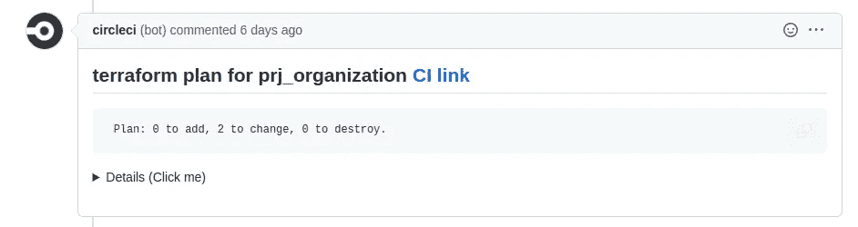
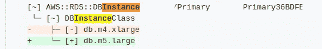
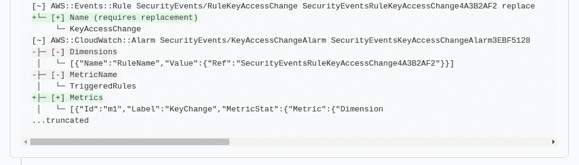
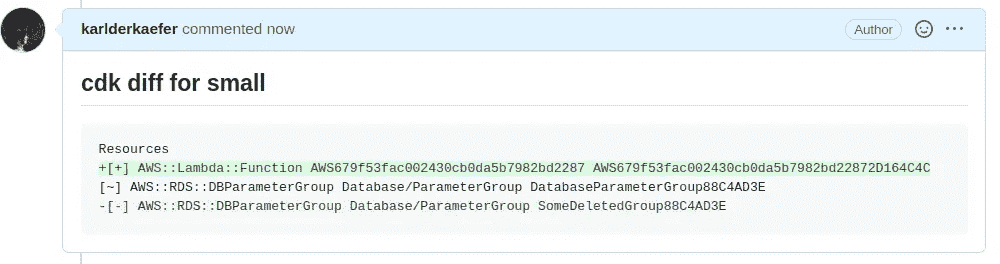
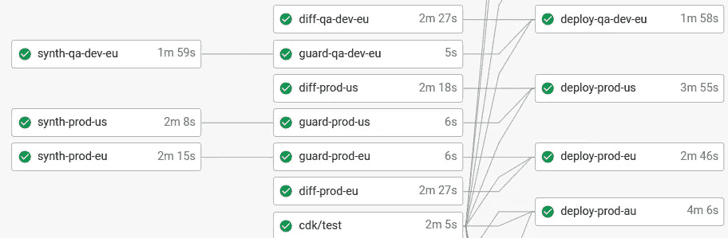

# 改善 AWS CDK 项目的拉动式请求体验

> 原文：<https://betterprogramming.pub/improve-your-pull-request-experience-for-aws-cdk-projects-1fd5adb08bb3>

## 看看 cdk 通知工具

由[安迪·赫尔曼万](https://unsplash.com/@kolamdigital?utm_source=medium&utm_medium=referral)在 [Unsplash](https://unsplash.com?utm_source=medium&utm_medium=referral) 上拍摄的照片

在本文中，我想谈谈一个小型 CLI 工具 [cdk-notifier](https://github.com/karlderkaefer/cdk-notifier) ，它可以帮助您改进 GitHub pull 请求的审查过程，并为您的 AWS CDK 堆栈的变更资源提供更多信心。AWS Cloud Development Kit 是一个工具，用于[将您的 AWS 基础设施配置为代码](https://enlear.academy/aws-cdk-a-beginners-guide-with-examples-424c600ac409)。

过去，我们一直使用 [TFNotify](https://github.com/mercari/tfnotify) 来预览 Terraform 项目中的变更，这确实改善了我们的工作流程。

一方面，审阅者可以更容易地访问 terraform 计划输出，以验证代码更改是否与预览相匹配。

另一方面，它确保您不会在没有注意到的情况下意外改变生产中的资源。

有时代码更改可能很复杂，很难审查。在这些情况下，在批准 PR 之前有第二个锚是很好的。

在我们公司，我们去年搬到了 CDK。但是，没有类似 TFNotify 的工具。所以受 TFNotify 的启发，我决定在 Golang 启动我们自己的工具。现已成功使用 5 个多月。因为我们以良好的测试覆盖率开始项目，所以我们不太需要在生产部署中引入手动批准步骤。但是，必须在工作流程中增加一个图层来可视化生产变更。

# CDK 通知程序如何工作

CDK 通知程序将使用`cdk diff`命令的输出。它将从文件中读入输出，然后[运行几个处理步骤](https://github.com/karlderkaefer/cdk-notifier#usage)，最后将 CDK diff to pull 请求作为注释发布。

CDK-通知程序将删除 ASCII 颜色有一个干净的输出。然后，它会将 CDK 添加和删除符号转换为 markdown diff 兼容文本`[+].. -> + ..`，以便我们可以在 GitHub 的原生 markdown diff 中突出显示添加或删除。[更多示例可在测试](https://github.com/karlderkaefer/cdk-notifier/blob/0d873d2fc7359c5517ceee365ae2052ba577cd7b/transform/transformer_test.go#L44-L64)中找到。

此外，我们希望确保消息不超过评论的文本限制。

# 如何使用

该工具的主要目的是在 CI 系统中运行，但是，从 CLI 进行测试可以是一个开始。

`cdk-notifier`专为 CircleCI 打造，因为这是我们的主要 CI 系统。CirlceCi 提供的环境变量会自动分配给所需的参数。在其他 CI 系统中，您需要手动映射，但是，我很乐意支持其他 CI，只需通过创建问题让我知道即可。

提供的 GitHub 令牌应该有`write:discussion`和`read:discussion`T7。首先生成日志文件

`[cdk-notifier](https://github.com/karlderkaefer/cdk-notifier)`如果有变更，会将 CDK 差异的处理日志发布到 PR。
如果`tag-id`的不同注释存在，且未检测到任何变化，则该注释将被删除。

参数`tag-id`用于识别您的 CDK 堆栈。如果管道中有多个 CDK 堆栈，则该参数是区分堆栈所必需的。此外，它还用于标识需要更新或删除的注释。如果一个堆栈中没有 CDK 差异，则不会发送任何注释，现有的注释将被删除。

这是一个例子，说明如果 GitHub 使用 CircleCI 提供的环境变量运行，diff 会如何使用 GitHub

# CircleCI 集成

我创建了一个 circle ci Orb[signa VIO/CDK-Orb](https://circleci.com/developer/orbs/orb/signavio/cdk-orb)用于部署我们的堆栈。这可能是另一篇文章来全面解释。然而， [cdk 通知器](https://github.com/karlderkaefer/cdk-notifier)也集成在那里。

每当我们在管道中运行`cdk diff`时，我们还将 diff 提交给 pull 请求，以便评审者可以验证将要投入生产的变更。

我们有跨区域和跨客户的多堆栈部署。到目前为止，cdk-notifier 增加了审查者的透明度和信心。如果您有复杂的 CDK 堆栈，这一点尤其重要。

我希望我能传播一些灵感。感谢阅读。