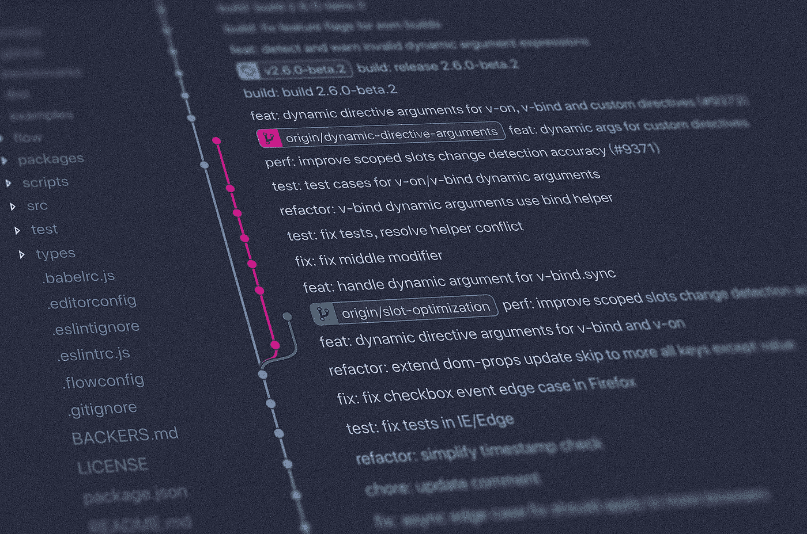
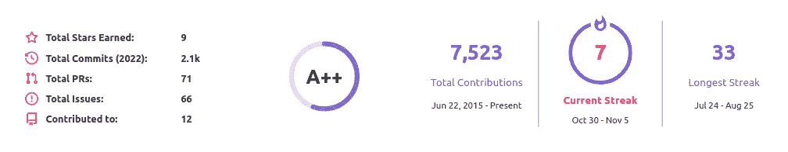
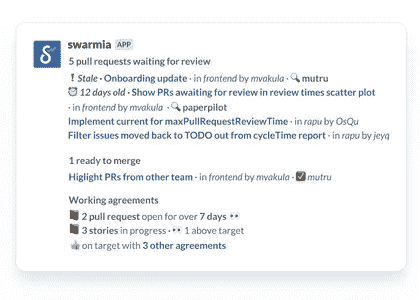

# 用 6 个简单的步骤改进你的拉取请求和代码审查

> 原文：<https://betterprogramming.pub/improve-your-pull-requests-and-code-review-in-6-easy-steps-ecf6dfa1c6d5>

## 提高代码贡献者和评审者技能的方法

Git 代码分支。照片由[扬西·敏](https://unsplash.com/@yancymin?utm_source=medium&utm_medium=referral)在 [Unsplash](https://unsplash.com/?utm_source=medium&utm_medium=referral) 上拍摄

# 什么是代码审查？

代码审查是审查他人代码的过程。作为过程的一部分，贡献代码的人将在 GitHub 或 GitLab 等平台上打开一个“拉”或“合并”请求。代码的所有者或另一个贡献者将审查这个请求。他们中的任何一个都可能建议对代码进行修改——为了整洁、风格和错误——或者批准代码，如果它已经准备好合并到项目中的话。

# 为什么要费心审查代码呢？

代码评审的一个重要方面是质量控制。评审人员可以确保逻辑是有意义的，没有非预期的错误被添加到代码中，它遵循项目其余部分的风格，并且对于没有编写它的人来说是有意义的。

然而，我认为虽然这是代码评审的主要任务，但是知识共享是这个过程中更重要的方面。当我开始作为贡献者参与代码评审时，我惊讶地发现我从评审者那里学到了很多。

# 我为什么要跟着你的脚步走呢？

作为 [ElementX](https://bit.ly/3Nz910p) 的工程经理，我对我们团队内部和外部为我们的客户创建的代码质量负责。

我的 2022 [GitHub](https://bit.ly/3WK8ahN) 统计

我在产品和服务领域都有工作经验，也为开源项目做出过贡献。希望我的 [GitHub](https://bit.ly/3WK8ahN) 能够证明我作为贡献者的技能——今年有 2k 次提交——以及作为评审者，自 2022 年 6 月 5 日以来有 265 次对拉请求的评审(在那之前还有更多)。

虽然我的代码审查有时很关键(我认为这是一种很好的教学方式)，但我最近很高兴听到 ElementX 的 CEO 讲了一个关于代码审查的故事。通过工程团队听到关于我的评论的笑话，他问我们的一个开发人员他们的想法，因为他想确定这个过程对企业来说是否值得。开发商向他保证这些笑话是开玩笑的。他很感激我们将代码审查作为我们过程的一部分，因为他看到自己作为开发人员在进步。

我发现下面的六个步骤帮助我改进了代码评审过程，我希望通过在你的过程中加入这些步骤，你也能看到好处。

# 六个步骤

## 作为贡献者

1.  **挑个好标题**

你会惊讶于拉取请求标题的重要性。为了更好地解释变化的关键细节，它应该简短而甜蜜。

> "计算机科学中只有两个难题:缓存失效和事物命名."—菲尔·卡尔顿

从评审者的角度来看，这是非常重要的，因为大多数项目会将您的代码`squash merge`到项目中。这意味着，通常情况下，合并将使用 pull 请求标题作为 git 提交，因此它对于特定的更改应该是有意义的。为了突出标题的重要性，我们来比较两个不同的标题(都是我之前作品中的例子):

> “快速修复”与“修复:允许被析构的变量是蛇的情况”

git 历史中的第一个例子没有告诉任何程序员实际上发生了什么变化——但是，您可以看到第二个例子告诉了您许多事情，例如 a)这是什么类型的变化，一个“修复”，以及 b)修复了什么。

另外，敏锐的观察者会注意到第二次提交遵循了[常规提交](https://bit.ly/3zKn51i)规范。不是所有的存储库都遵循这个惯例，但是我发现不管怎样这都是一个很好的格式，你可以很容易地去掉一个好标题的冒号。

**2。回顾你自己的代码**

每当我发出拉请求时，我总是第一个检查代码的人。大多数平台会向您展示您提交的代码与主 git 分支的对比。

这是这个过程中很重要的一部分，因为它给了你一点时间来检查错误和质疑你的代码的逻辑，然后说，“是的，这是准备好的，100%完美。”

审查您的代码。照片由[阿兰·纳瓦罗](https://unsplash.com/photos/68U5GBCtuEU)在 [Unsplash](http://unsplash.com/) 拍摄

老实说，我无法统计我审查过的拉请求的数量，我可以看到提交代码的人没有对他们的代码进行最终审查。这非常容易辨别。通常，会有拼写错误，调试遗留下来的`console.log("HERE");`或其他类似的“愚蠢”错误。

经常这样做会惹恼代码审查者，因为这表明你不尊重他们的时间。最终，他们会自动要求修改，并问:“你审阅过这个吗？”在他们开始审查之前。

## 作为评论者

**3。管理审核请求**

既然您已经晋升为审阅者，您必须首先开发一种方法来管理审阅请求的通知。

如果您不这样做，将会发生以下两种情况之一:a)您永远不会知道评审请求——这意味着代码可能会搁置数月，不会让您的客户的生活变得更好！或者 b)当您坐下来评审代码时，您将会收到 100 个通知，告知您已经有 100 个不同的项目要求您进行评审！

Swarmia 审查请求延期通知

有一些很棒的工具可以帮助你做到这一点。Swarmia 或 [GitHub Notifications](https://bit.ly/3fE4Pjt) 就是两个可以帮助你解决这个问题的例子。或者，您可以使用电子邮件和过滤器来完成这项工作。你需要找到最适合你的方法。最重要的事情是获得评审请求，评审代码，并解除团队的障碍。

**4。问自己问题**

*   这个变量名有意义吗？
*   此功能是否位于正确的文件夹中？
*   它存在于正确的文件中吗？
*   文件名是否正确？

作为一个评审者，这些都是你在评审另一个人的代码时应该问自己的问题。

很有可能，如果这对你没有意义，对其他人也没有意义。对于代码所有者来说，这是更重要的一步，因为如果你不能理解别人对你的代码库提出的代码，很有可能代码会更难维护，包含错误或安全漏洞。

**5。慢慢来**

当我开始审查代码时，我会漫无目的地上下滚动页面，懒得去理解发生了什么。不可避免地，我会批准拉取请求。幸运的是，我能够观察一些伟大的程序员，从他们身上，我学到了一个适用于生活中所有事情的小秘密:

> 慢就是顺，顺就是快。

在一个所有事情都被认为是即时和快速的世界里，放慢节奏比以往任何时候都更重要。在审查代码时，这应该没有什么不同。慢慢来；理解每一行。

**6。不要害怕问问题**

类似于慢慢来，如果你不懂一行代码，不要害怕向贡献者询问。如果他们不能给你一个满意的答案，很可能是逻辑太复杂，或者他们不明白自己在做什么。

我知道这对于一些人来说很难，但是拒绝以上的拉动请求是有效的。你会经常发现，人们会因为你质疑事物、坚持己见，以及对没有意义的事情说“不”而更加尊重你。未来的你也会感谢你这样做，当你不得不修复你之前检查过并理解的代码中的错误时。

# 怎么

那么，丹尼尔，我怎样才能参与到代码评审中来呢？最简单的参与方式之一是查看您在自己的代码中使用过的一些依赖项，访问 GitHub 上的知识库，看看是否有您可能能够帮助解决的`help-wanted`问题。

或者，如果你的工作场所确实进行代码审查，那就更积极地参与进来。要求成为代码的评审者。您可以向代码贡献者解释，您希望提高自己的技能，并向他们学习。

如果你的工作场所不做代码审查，问问他们为什么不做。然后让您的同事参考这篇文章，了解好处以及他们如何改进编程。