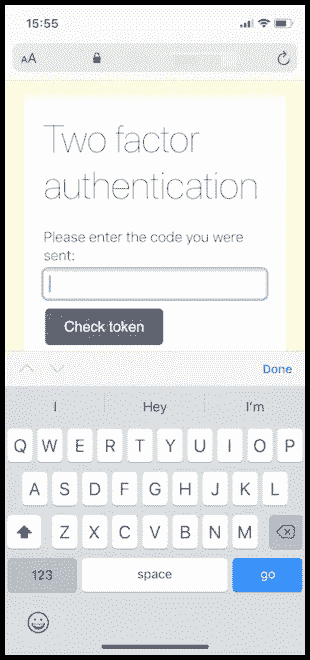
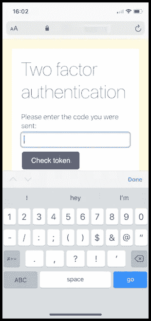
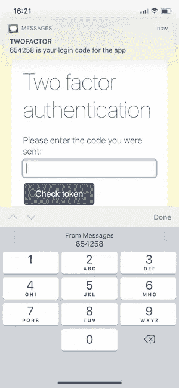
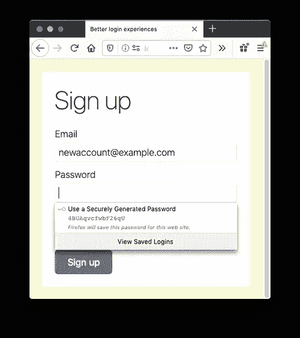

# 使用 HTML 属性改善用户的 2FA 体验

> 原文：<https://betterprogramming.pub/improve-your-users-2fa-experience-with-html-attributes-c4944daed1c6>

## 自动完成、合适的键盘等等


登录时，用户体验中有很多摩擦的机会，尤其是在输入双因素身份验证代码时。作为开发人员，我们应该构建支持帐户安全需求的应用程序，但又不降低用户体验。有时，感觉这些需求好像是在互相争斗。

在这篇文章中，我们将看看简单的`<input>`元素和 HTML 属性，它们有助于加快用户的双因素身份验证体验。

# 默认体验

当您为 web 应用程序实现双因素身份验证时，可能使用[Authy 双因素身份验证 API](https://www.twilio.com/docs/authy/api) ，您将需要一个表单供您的用户输入您将要发送给他们的一次性密码。您可能会创建类似于以下 HTML 的内容:

```
<form action="/sessions/check-2fa" method="POST">
  <div>
    <label for="token">Please enter the code you were sent:</label>
    <input type="text" name="token" id="token" />
  </div>
  <button type="submit">Check token</button>
</form>
```

这已经是很好的经历了。`<input>`有一个名字和一个惟一的 ID，`<label>`使用正确的`for`属性来显式地关联它，这对可访问性很重要。你也可以将`<label>`缠绕在`<input>`上，达到同样的效果。使用一点 CSS，这可能看起来像这样:



然而，我们可以通过增加一些属性来逐步增强这种体验。

# 获得合适的键盘

在带有屏幕键盘的手机或设备上，首先要注意的是我们展示的是完整的 alpha 键盘。一次性密码是由数字字符组成的，所以最好给用户提供一个数字键盘。

你可能认为将`<input>`的`type`从`"text"`切换到`"number"`是这里的解决方案:

```
<input type="number" name="token" id="token" />
```

不过，你错了。这确实在 iOS 上触发了一个不同的键盘，但它仍然包括一些无用的键。



更改字段类型也会更改浏览器解释该字段的方式。这也可能导致错误；如果双因素身份验证代码以零开始，数字字段可能会删除前导零。

# 输入模式

属性改变浏览器应该显示的键盘，而不改变字段收集的数据的含义。我们希望我们的`<input>`接收文本输入——但是来自数字键盘。因此，请添加`inputmode="numeric"`

```
<input type="text" name="token" id="token" inputmode="numeric" />
```

`inputmode`有许多其他值，包括代表电话号码的`"tel"`、`"email"`、`"decimal"`、`"url"`、`"search"`和`"none"`，以防您想要呈现自己的键盘。这篇关于 CSS 技巧的文章提供了不同的 `[inputmode](https://css-tricks.com/everything-you-ever-wanted-to-know-about-inputmode/)` [s](https://css-tricks.com/everything-you-ever-wanted-to-know-about-inputmode/) 所需的所有细节。

如今，浏览器对移动操作系统的支持很好，但几年前，它还处于无人问津的状态。对于老版本的浏览器，还有另外一个触发数字键盘的技巧，包括一点额外的免费验证。

# 模式

`pattern`属性允许您使用正则表达式来验证`<input>`的内容。使用模式`[0-9]*`告诉浏览器我们只接受字段中的数字，并在没有`inputmode`支持的浏览器中触发数字键盘。

我们的 HTML 现在看起来像这样:

```
<input
  type="text"
  name="token"
  id="token"
  inputmode="numeric"
  pattern="[0-9]*"
/>
```

键盘是更简单的数字输入:


让这个表单更容易填写的一个方法是自动填写一次性密码。

# HTML 自动完成

[根据 MDN 的说法，](https://developer.mozilla.org/en-US/docs/Web/HTML/Attributes/autocomplete)“Autocomplete 允许 web 开发人员指定[用户代理](https://developer.mozilla.org/en-US/docs/Glossary/user_agent)在填写表单字段值时提供自动协助，以及指导浏览器字段中预期的信息类型。”

在 macOS 上的 iOS 和 Safari 中，我们可以利用这一点让浏览器建议通过短信发送给设备的双因素验证码。添加值为`"one-time-code"`的`autocomplete`属性将触发这种行为。

```
<input
  type="text"
  name="token"
  id="token"
  inputmode="numeric"
  pattern="[0-9]*"
  autocomplete="one-time-code"
/>
```

至此，我们的`<input>`就完成了，用户的体验现在看起来是这样的:



# 其他有用的自动完成值

有许多可用的自动完成值，包括从姓名和地址到信用卡和其他账户信息。对于注册和登录，有几个自动完成值非常有用:`username`、`email`、`new-password`和`current-password`。

浏览器和密码管理器有很好的启发式方法来查找网页上的登录表单，但是使用`username`和`current-password`值会使它变得非常明显。如果您正在构建一个在不同页面上使用用户名和密码的登录表单，那么您肯定要考虑使用这些属性。

在注册表单中，确保使用`new-password`值——因为它会在一些浏览器中触发密码建议。



# 在其他浏览器中自动完成一次性密码

这种自动完成行为只存在于 iOS 和 macOS 上的 Safari 中，但 Chrome 团队正在研究类似的想法来简化这一过程。有一个关于命令式[短信接收 API](https://github.com/samuelgoto/sms-receiver) 的实验，它是以 [Android 的短信接收 API](https://developers.google.com/identity/sms-retriever/request) 为模型的。这将允许开发人员从 SMS 中提取一次性密码，并且因为它是用 JavaScript 编写的，所以可以立即提交表单，为用户节省更多时间。

在撰写本文时，这个 [API 是 origin 试用](https://developers.chrome.com/origintrials/#/view_trial/607985949695016961)的一部分，它允许你测试它并向 Chrome 团队提供反馈。如果您对此感兴趣，请注册并尝试一下 API。

# 通过 HTML 获得更好的体验

在本文中，我们已经看到，只需少量的 HTML 属性，我们就可以改善用户的登录体验，尤其是在移动设备上。

`[<input>](https://developer.mozilla.org/en-US/docs/Web/HTML/Element/input)`[元素](https://developer.mozilla.org/en-US/docs/Web/HTML/Element/input)是我们接触过的最有趣的 HTML 元素之一。根据属性的不同，它可以是一个文本字段、一个范围滑块、一个文件选择器、一个按钮或者[许多其他](https://developer.mozilla.org/en-US/docs/Web/HTML/Element/input)选项。

如果你正在寻找更好的双因素认证体验，那么看看[认证推送认证](https://www.twilio.com/docs/authy/api/push-authentications)，它完全消除了代码复制。
感谢阅读！