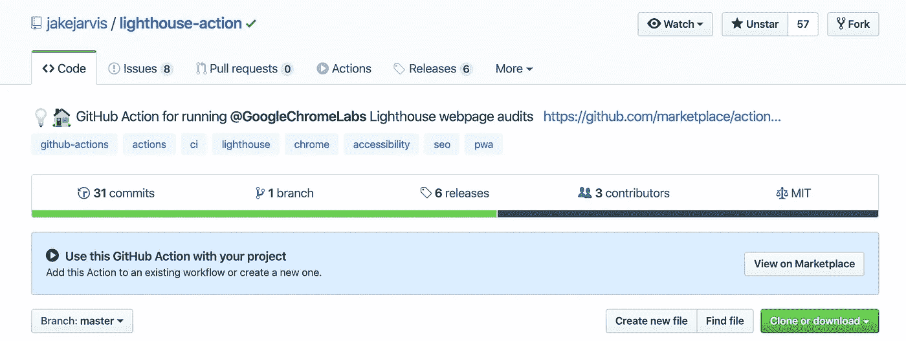
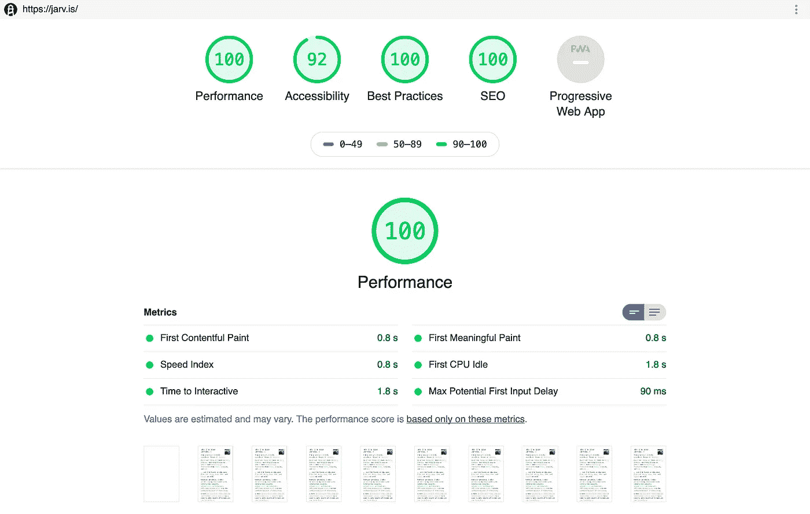
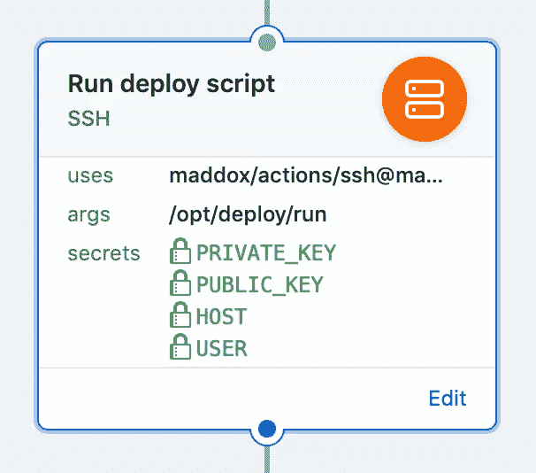
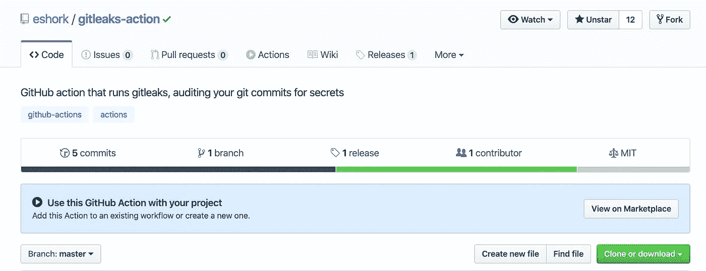
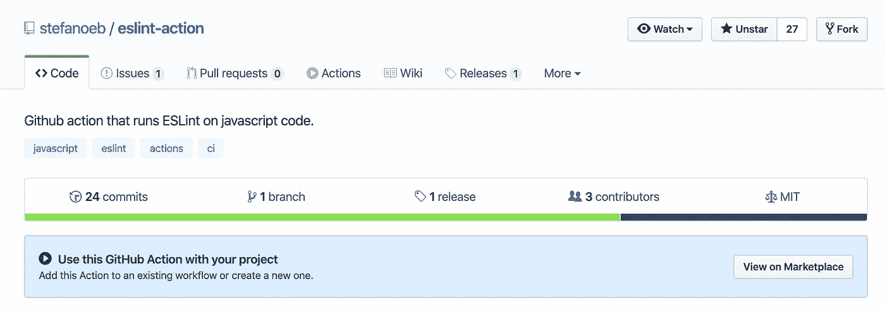

# 用这 4 个 GitHub 动作改善你的工作流程

> 原文：<https://betterprogramming.pub/improve-your-workflow-with-these-4-github-actions-7b2fbd29f752>

## 这里有 4 个有用的 GitHub 动作来改善你的工作流程


照片由[潘卡杰·帕特尔](https://unsplash.com/@pankajpatel?utm_source=medium&utm_medium=referral)在 [Unsplash](https://unsplash.com?utm_source=medium&utm_medium=referral) 拍摄

如果你在 GitHub 上托管你的代码，你可以利用 [GitHub 动作](https://github.com/features/actions)。您可以利用 GitHub 动作来完成这些任务，而不是手动运行所有的测试和 linters。

事不宜迟，这里有四个省时的 GitHub 动作，可以改善你的工作流程。如果你不确定 Github 动作是什么以及如何使用它们——我建议[先阅读这篇文章](https://medium.com/better-programming/github-actions-the-what-why-and-how-3868d5a86292)。

# 1.用谷歌浏览器的灯塔测试来审核你的网页

这一行动整合了谷歌对网页有益的 [Lighthouse 审计](https://developers.google.com/web/tools/lighthouse/)——特别是对性能、可访问性、最佳实践、SEO 和渐进式网络应用的测试。



Github 灯塔行动—[https://github.com/marketplace/actions/lighthouse-audit](https://github.com/marketplace/actions/lighthouse-audit)

现在，该操作将把五个分数(满分为 100)打印到输出中，并将报告的 HTML 和 JSON 版本作为工件上传。

在下一个版本中，该操作将允许您为每个测试指定阈值，如果没有达到阈值，则可以选择不执行该步骤。



Lighthouse 审计报告示例

## 使用

以下工作流对 [jarv.is](https://jarv.is/) 运行 Lighthouse 审计，在该步骤的输出中显示五个分数，并将`.html`和`.json`结果作为工件上传以供下载(如上所示)。

`workflow.yml`文件:

```
name: Audit live site
on: pushjobs:
  audit:
    runs-on: ubuntu-latest
    steps:
    - name: Audit live URL
      uses: jakejarvis/lighthouse-action@master
      with:
        url: 'https://jarv.is/'
    - name: Upload results as an artifact
      uses: actions/upload-artifact@master
      with:
        name: report
        path: './report'
```

当你在构建渐进式网络应用时，Lighthouse 非常有用。这个项目的灵感来自于 GoogleChromeLabs/lighthousebot。

# 2.使用 GitHub 操作运行 SSH 命令

该操作将通过 SSH 在您的$HOST 上运行所提供的参数作为命令。如果您想在每次提交或推送后在您的专用服务器上运行命令，这很有用。



宋承宪 GitHub 动作—[https://github.com/maddox/actions/tree/master/ssh](https://github.com/maddox/actions/tree/master/ssh)

## 使用

要使用该操作，只需在您的`.github/main.workflow`中添加以下几行:

```
action "Run deploy script" {
  uses = "maddox/actions/ssh@master"
  args = "/opt/deploy/run"
  secrets = [
    "PRIVATE_KEY",
    "HOST",
    "USER"
  ]
}
```

## 必需的参数

您将使用的参数是将通过 SSH 在您的服务器上运行的命令。

## 例子

*   `args = "/opt/deploy/run"`
*   `args = "touch ~/.reload"`

## 必需的秘密

您需要提供一些使用该操作的秘密。

*   `PRIVATE_KEY`:你的 SSH 私钥。
*   `HOST`:主机动作将 SSH 运行命令。比如`your.site.com`。
*   `USER`:SSH 命令将使用私钥对用户进行身份验证。

请参见 [GitHub 库](https://github.com/maddox/actions/tree/master/ssh)了解全部细节。

# 3.检测密钥泄漏—gitleaks—操作

使用 [gitleaks](https://github.com/zricethezav/gitleaks) 审计 Git 提交的秘密，作为 GitHub 动作。如果你使用`.env`文件，这个动作会通知你是否曾经不小心发布了秘密。



git leaks-action—[https://github.com/eshork/gitleaks-action](https://github.com/eshork/gitleaks-action)

## 使用

```
workflow "gitleaks my commits" {
  on = "push"
  resolves = ["gitleaks"]
}action "gitleaks" {
  uses = "eshork/gitleaks-action@master"
}
```

感谢 [zricethezav/gitleaks](https://github.com/zricethezav/gitleaks) 提供了复杂的位。

# 4.运行 ESLint 的 GitHub 操作



https://github.com/stefanoeb/eslint-action

该操作在指定的 JavaScript 文件上执行 [ESLint](https://eslint.org/) linter，而不需要任何先前的操作/构建步骤或 [Docker](https://www.docker.com/) 。

要执行该操作，必须在本地运行 ESLint。它将使用与本地相同的规则。ESLint 入门指南中的更多信息

## 使用

将以下任何示例添加到您的工作流文件`.github/main.workflow`中。

下面是一个让它工作的例子:

```
workflow "New workflow" {
  on = "push"
  resolves = ["ESLint"]
}action "ESLint" {
  uses = "stefanoeb/eslint-action@master"
}
```

默认情况下，它将通过项目中的所有文件运行 ESLint。但是您也可以在`args`上指定一堆文件，就像 ESLint:

```
workflow "New workflow" {
  on = "push"
  resolves = ["ESLint"]
}action "ESLint" {
  uses = "stefanoeb/eslint-action@master"
  args = "index.js src/**.js"
}
```

如果没有安装必要模块的前一步骤，该动作将自动执行`yarn install`或`npm install`。

# 结论

感谢阅读，我希望你学到了新的东西。如果您知道任何有用的 GitHub 操作，请告诉我们。保持好奇，快乐编码！