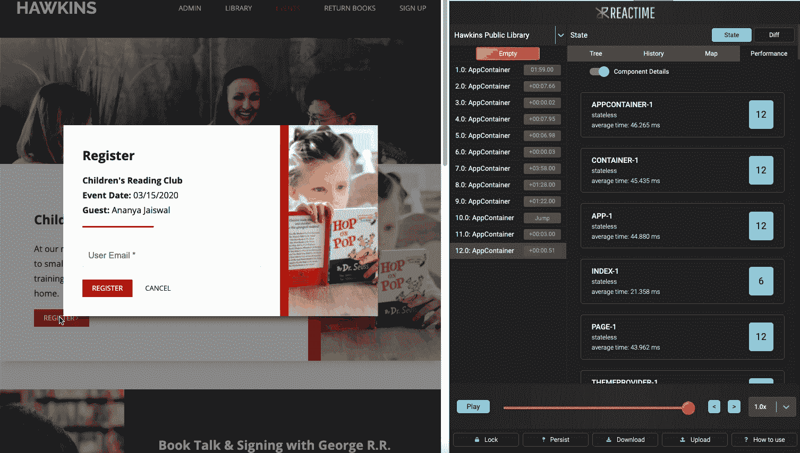
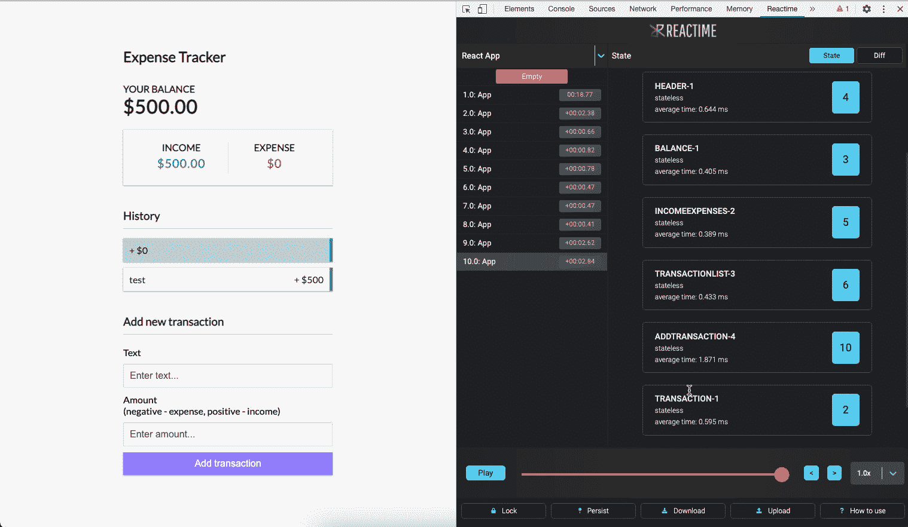

# 使用 Reactime V7.0 提高和优化 React 应用程序的性能

> 原文：<https://betterprogramming.pub/improving-and-optimizing-performance-of-react-apps-with-reactime-v7-0-737bdbdf1e0e>

## 了解 Reactime

图像 c

# 什么是反应时间？

当谈到 React 应用程序时，优化应用程序的最具挑战性的方面之一是状态管理调试。现在有很多方法来处理你的应用程序的状态——钩子、上下文 API、Redux 等等。—但是没有太多的工具可以完全兼容。

[Reactime](https://reactime.io/) 帮助集中复杂状态调试过程。Reactime 在 [2020 React 开源奖](https://osawards.com/react/)上被提名为生产力促进奖

在 Reactime v.7.0 之前，Reactime 被简单地称为 React 应用程序的时间旅行调试工具。在新的最新版本中，我们扩展了它的功能并提高了它的准确性。现在，Reactime 7.0 是 React 应用的性能工具，包括像 [Gatsby](https://www.gatsbyjs.com/) 和 [Next](https://nextjs.org/) 这样的框架。它不仅有助于管理和理解应用程序的状态，而且您现在还可以可视化组件的呈现频率。此外，Reactime 现在只在开发模式下运行，这允许您在不降低应用程序速度的情况下提高其速度。

让我们详细说明一下 Reactime 新版本中我们改进和增加了什么。

# Reactime v7.0 的新功能

*   新的渲染功能+每个组件的渲染时间
*   与 Gatsby 和 Next 的兼容性
*   在单页和多页应用程序上运行
*   全新的极简和直观的用户界面设计
*   性能选项卡时间复杂度的改进算法
*   仅在开发模式下工作，不会影响应用程序的速度

# 它是如何工作的

利用 React Fiber 协调，Reactime 记录并缓存每次应用程序状态更改时的快照，从而使您能够穿越以前的状态。它允许开发人员可视化状态变化的树形图，计算快照之间的差异，并有一个回放选项来帮助逐步识别状态的变化。此外，您可以使用我们的 performance 选项卡分析每个组件的渲染频率和速度。

# 它有什么帮助

你有没有想过为什么你的应用程序运行缓慢？影响 React 应用程序性能的最常见问题之一是不必要的渲染周期。通常，React 组件在其父级渲染时会重新渲染。调试和优化 React 应用程序可能会非常困难，尤其是如果您不是应用程序的构建者。通过快速的谷歌搜索，你可以看到无数关于 React 开发者如何查看组件渲染周期的文章。有一些很棒的 npm 包，工程师可以将它们整合到他们的开发过程中。一些例子包括 why-do-you-render、react-render-visualizer、rerendering-react-redux 和 react-updates。

不幸的是，这需要开发人员添加占用空间的包，并采取额外的步骤将它们的组件或道具包装在函数中，甚至更多的组件中。然而，通过 Reactime v7.0 的简单下载，您不再需要在代码库中占用不必要的时间和空间。

# 渲染优化器

Reactime 现在提供了一种可视化和跟踪每个 React 组件渲染的方法。在 Reactime 的 performance 选项卡上，您会发现一个切换按钮，可以在快照整体性能图和显示组件渲染次数的新渲染功能之间切换视图。

当您对应用程序进行状态更改时，渲染视图会实时更新。通过比较一个子组件和其余组件的呈现方式，简化调试过程。您可能会发现，无论您在何处更改状态，都有一个组件会重新呈现。Reactime 将立即获取这些信息，这样您就可以跳回到您的代码库并进行性能增强的更改。

渲染视图还显示组件是否有状态，以及组件渲染的平均时间。一些实验用户发现，Reactime 对他们应用程序的优化非常有帮助。使用这项新功能，一名开发人员得到通知，他们网站上的一幅图像在几秒钟内被渲染了 300 次。他们能够很容易地解决这个问题，并通过一次更改大大提高了他们网站的效率。

# 性能算法

除了新的渲染优化器，Reactime 的性能本身也在这个最新版本中得到了提升。虽然这些变化在扩展本身中看不到，但它通过改进的时间复杂性极大地改善了开发人员的体验。

# 用户界面/UX 设计

老用户会注意到这个扩展最大的变化之一是它更加直观和现代化的 UI/UX 设计。蓝色渐变、火红色按钮和附加图标使元素更容易找到，并引导您找到应用程序的最佳部分。在 component map 选项卡中，开发人员现在可以展开和关闭节点，这使得查看组件之间特定的父子关系变得非常容易。

# 如何与 Reactime 协作

由于 Reactime 是一个开源应用程序，我们很乐意让您测试这个应用程序，并提交您可能有的任何问题或贡献。我们总是对改进和听取您的想法感兴趣。请在下面告诉我们您的想法，或者前往 [GitHub](https://github.com/open-source-labs/reactime) 或 [reactime.io](https://reactime.io/) 了解更多信息。您可以在源文件夹中找到面向开发人员的自述文件。

# 更多资源

*   [反应纤维和反应时间](https://medium.com/@aquinojardim/react-fiber-reactime-4-0-f200f02e7fa8)
*   [Meet React ime——React 的时间旅行状态调试器](https://medium.com/@yujinkay/meet-reactime-a-time-traveling-state-debugger-for-react-24f0fce96802)
*   [使用 Reactime、并发 React_fiberRoot 和浏览器历史缓存深入杂草中](https://itnext.io/deep-in-the-weeds-with-reactime-concurrent-react-fiberroot-and-browser-history-caching-7ce9d7300abb)

***投稿人:*** [*贝卡·维恩*](https://github.com/rtviner) *，* [*陈凯琳*](https://github.com/caitlinchan23) *，* [*金湄阮*](https://github.com/Nkmai) *，* [*塔尼亚·林德*](https://github.com/lind-tania)