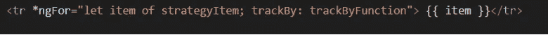
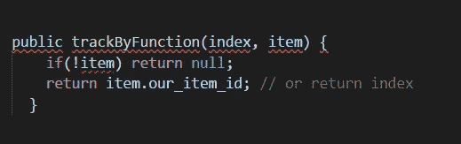

# 通过 trackBy 提高 Angular *ngFor 性能

> 原文：<https://betterprogramming.pub/improving-angular-ngfor-performance-through-trackby-ae4cf943b878>

## 了解和使用*ngFor

由[麦克斯·尼尔森](https://unsplash.com/@maxcodes?utm_source=unsplash&utm_medium=referral&utm_content=creditCopyText)在 [Unsplash](https://unsplash.com/search/photos/angular?utm_source=unsplash&utm_medium=referral&utm_content=creditCopyText) 拍摄的照片

# ***简介***

基本上，开发人员发出一个`GET http`请求来获取远程数据，然后通过*ngFor 结构指令将这些数据绑定到 HTML。

但是，你想过这个*ngFor 指令的方法论吗？

该指令将接收 iterable 项的数组作为输入，然后为该数组的每个项创建一个模板。

## ***ngFor 局部变量**

实际上，*ngFor 导出了一些局部变量用于您当前的迭代:

index:每个模板上下文的当前循环迭代。
first:布尔值，表示该项是否是迭代中的第一项。
last:布尔值，表示该项是否是迭代中的最后一项。
even:表示该项是否有偶数索引的值。
odd:布尔值，表示该项是否有奇数索引。

## **使用*ngFor without trackBy**

当将对象或元素的数组传递给*ngFor 时，该指令将元素绘制到 DOM。但是这里的问题是，当改变或修改这个数组的一些元素时，*这些元素被完全从头重新绘制到 DOM 中，这是一个非常昂贵和繁重的操作*

# **了解*ngFor 机制**

默认情况下，当您使用*ngFor 而不使用 trackBy 时，*ngFor 跟踪通过对象标识更改的对象数组。因此，如果对象数组的新引用被传递给指令，即使数组具有相同的值，Angular 也无法检测到它们已经被绘制并呈现在当前 DOM 中。相反，将移除旧元素，并重新绘制具有相同值的新集合。

我听到有人在问，“为什么 [Angular](https://angular.io/) 团队不把 trackBy 机制作为默认设置？”

事实上，Angular 团队已经对*ngFor 进行了大量改进。他们的回答基本上是，“这是*ngFor 通过对象标识的基本实现。如果您要修改(添加、更新、删除或重新排序)*ngFor 的任何元素，请通过向 trackBy 函数提供您的对象 id 来更新跟踪算法。

看看下面。

## 在以下情况下使用 trackBy:

*   迭代对象集合的大数组
*   您的业务逻辑可能需要通过重新排序、修改特定项目、删除项目或添加新项目来修改这些元素

## **识别跟踪——保持跟踪并提高*绩效**

默认情况下，trackBy 函数接受两个参数。这些参数是索引和元素本身。如果你是从[出身的](https://reactjs.org/)反应过来的，这就类似于 [*键*](https://reactjs.org/docs/lists-and-keys.html) *。*如果你来自一个有棱角的背景，那就是被跟踪的*。*

# **使用*ngFor:**

在 html 中:

英寸 ts:

## 参考资料:

 [## 角度文档

### 编辑描述

angular.io](https://angular.io/api/common/NgForOf)