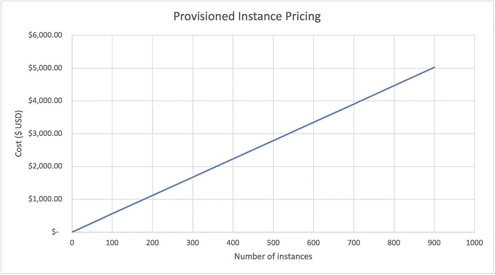
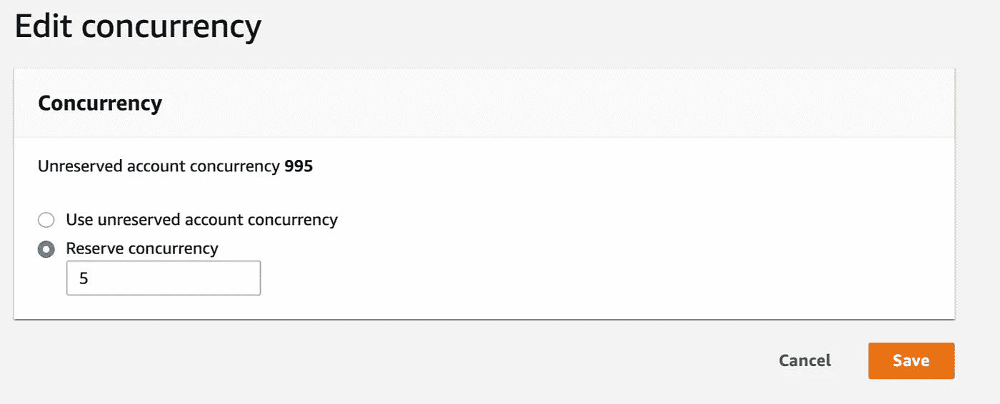
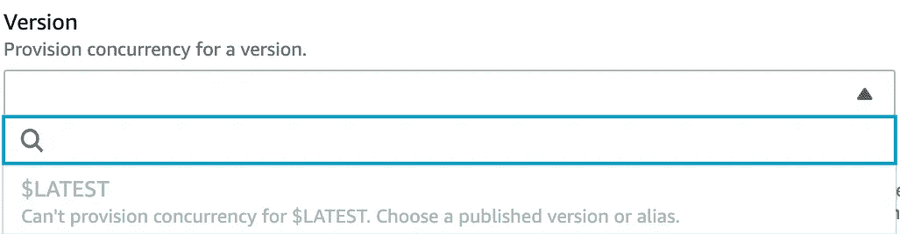
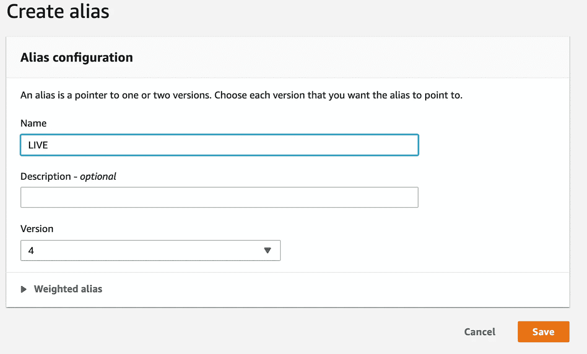
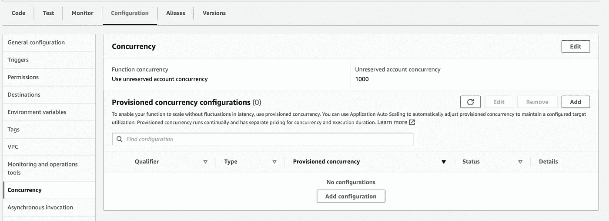
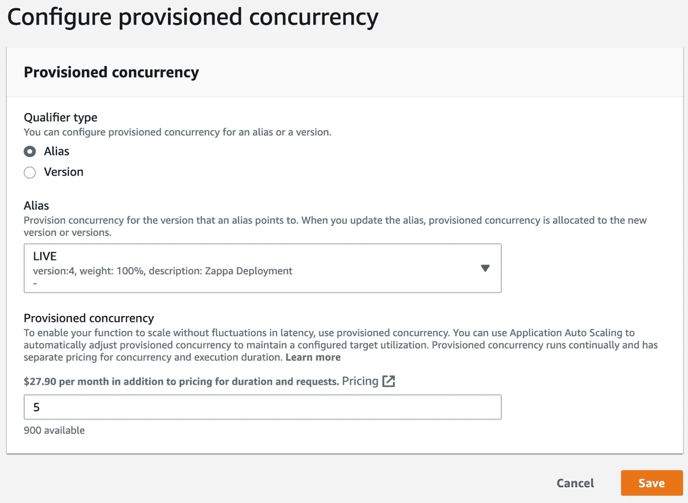
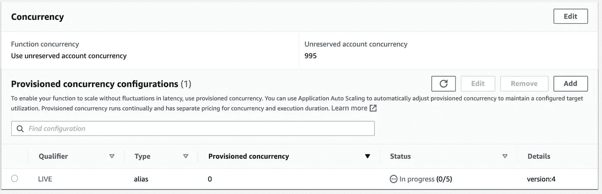
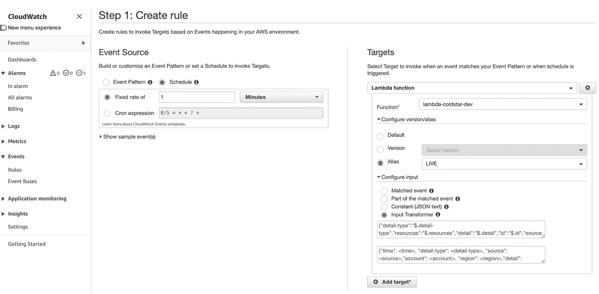

# 使用供应的并发性改进 AWS Lambda 冷启动时间

> 原文：<https://betterprogramming.pub/improving-aws-lambda-cold-start-times-using-provisioned-concurrency-803b090406c2>

## 为您的 web 应用程序配置供应的并发性


亚采克·迪拉格在 [Unsplash](https://unsplash.com?utm_source=medium&utm_medium=referral) 上的照片

AWS Lambda 是一款经济高效且高度可扩展的无服务器计算解决方案，无需部署或管理服务器即可轻松运行代码。因此，大量企业选择将他们的生产代码部署到 AWS Lambda，以便为他们的客户服务。这段代码的很大一部分是需要快速响应的 web 服务器应用程序(< 1 s)to user requests. AWS lambda cold starts can make it hard to hit this performance requirement.

This blog looks into solving cold start issues by using provisioned concurrency. The sections covered include:

*   What are cold starts?
*   What is provisioned concurrency?
*   Configuring Provisioned Concurrency using the Console
*   Configuring Provisioned Concurrency Programmatically. (useful for a CI/CD pipelined)
*   Using provisioned instances
*   Using cloud watch events

# What Are Cold Starts?

Despite AWS Lambda’s significant benefits, one of its main downsides is the [经典的冷启动](https://mikhail.io/serverless/coldstarts/aws/)问题)。

这是一个新的 Lambda 工作进程的第一个请求通常需要相对较长的时间来完成的地方，例如 3-20 秒。这是 AWS Lambda 或 Google Cloud 函数等无服务器功能工作方式的一个缺点，因为它们试图优化价格、可伸缩性和可维护性。通常，创建执行环境时的无服务器功能生命周期如下(根据 [AWS 文档](https://docs.aws.amazon.com/lambda/latest/dg/runtimes-context.html#runtimes-lifecycle-ib)):

1.  使用配置的资源创建或解冻执行环境，即分配运行应用程序代码所需的适当 CPU 和内存(初始化阶段)。
2.  下载 Lambda 函数使用的应用程序、扩展和层所需的任何代码(初始化阶段)。
3.  初始化扩展和运行时，以及主处理函数之外的任何应用程序代码(初始化阶段)。
4.  当一个请求被发送时，Lambda 调用运行核心业务逻辑的函数处理器(调用阶段)。Lambda 函数的第二次调用跳过了步骤 1、2 和 3，因此响应时间更快。
5.  如果在一段特定的时间后没有调用发生，比如最多 15 分钟，AWS Lambda 将关闭运行时，停止扩展，并删除环境。(关闭阶段)

正如你所看到的，在一个函数的生命周期中有三个主要阶段:初始化阶段、调用阶段和关闭阶段。init 阶段总是发生在新的实例被创建的时候，无论是在新的部署过程中还是在扩展 Lambda 函数的时候。在冷启动期间，初始化阶段和有时调用阶段是过程的瓶颈。

有几个要点需要注意:

*   向上扩展的过程并不一定意味着当平台上有多个用户时，如果您正在使用 javascript 前端运行一个 web 应用程序，通常会向后端并发发出多个请求，例如获取用户信息、获取用户配置等。如果在 Lambda 函数已经在处理前一个请求时收到这些请求中的一个，那么将创建一个新的 Lambda 实例，从而经历 init 和 invoke 阶段。即使平台上只有一个用户，只要该用户同时向后端发送多个请求，这种情况也会发生。
*   初始启动时，调用阶段可能会很慢。这是因为即使 Lambda 在 init 阶段在主处理程序方法之外初始化应用程序代码，有时应用程序代码也需要在内部初始化，即连接到适当的数据库、下载配置、执行健全性检查等(尤其是在 web 服务器上)。

# 什么是调配并发？

有几种方法可以减轻冷启动问题。[供应并发](https://aws.amazon.com/blogs/compute/new-for-aws-lambda-predictable-start-up-times-with-provisioned-concurrency/)就是武器库中的一个这样的工具。

通常，保持活动以处理传入请求的 Lambda worker 实例的最小数量取决于 Lambda 实例的最后一次调用。这意味着如果一个实例在一段时间内没有被调用，那么该实例将关闭，最终将没有可用的实例来处理新的请求。

供应并发所做的只是分配特定数量的 Lambda 实例，使其始终可用于处理请求。这些实例不会在调用完成时关闭，必须手动关闭。

创建预配实例时，它解决了与函数生命周期的 init 阶段相关的冷启动问题。但是，如果在调用阶段仍然需要额外的内部初始化，例如连接到数据库等。在新设置的实例上仍会遇到这种情况。

已处理请求的预配实例在后续请求中不会遇到此问题，直到实例被终止。要修复冷启动调用，云观察事件是有帮助的，但不是必需的，尤其是在 CI/CD 设置中部署新实例时。

## 成本考虑

需要注意的重要一点是，供应的并发性不是免费的，有相关的成本。成本是从所提供的实例开始到结束计算的，取决于分配给该功能的内存量以及所提供的实例数量。

例如，假设 us-east-1 区域中每个实例的内存为 512 MB1 个实例每月花费 5.58 美元，5 个实例每月花费 27.90 美元，50 个实例每月花费 279.02 美元，500 个实例每月花费 2790.22 美元，依此类推，下图显示了这一趋势。



如您所见，价格呈线性增长，因此在创建供应实例时要考虑到这一点。

## 提供的并发不是保留的并发

人们可能犯的一个错误是使用保留并发来解决冷启动问题。



设置保留并发设置，设置 Lambda 函数可以创建的最大实例数。例如，如果设置为 5，则意味着最多只允许 5 个实例，因此只能处理 5 个并发请求，任何溢出请求都将返回 5XX 错误。

# 从 AWS 控制台配置调配的并发性

## 别名和版本

在我们创建预配实例之前，需要对[别名](https://docs.aws.amazon.com/lambda/latest/dg/configuration-aliases.html)和[版本](https://docs.aws.amazon.com/lambda/latest/dg/configuration-versions.html)有一个基本的了解，因为它们决定了哪个代码库将被部署到预配实例中。

版本通常是自动递增的整数，其中最新的整数(例如 77)表示最后发布的版本。一个版本还有一个`$LATEST` 标签，它会自动映射到你的代码库的最后一个发布版本。可以通过两种方式访问 Lambda 函数；

1.  使用一个非限定的 ARN，例如`arn:aws:lambda:aws-region:acct-id:function:helloworld`，这个方法隐式地调用$LATEST 标签。
2.  使用一个合格的 ARN，例如`arn:aws:lambda:aws-region:acct-id:function:helloworld:<version|alias>`，其中`<version|alias>`可以是一个数字，例如一个版本的 42，或者一个特定的别名，并调用代码库的一个特定版本。

别名只是一个指向特定版本的指针，这使得更新应用程序代码变得容易，而不必更新上游服务，例如 API Gateway、Dynamodb 等。使用 lambda 函数的 ARN。

创建预配实例时，不能使用`$LATEST`版本标签，也不能使用指向`$LATEST`版本的别名。你需要陈述一个具体的发布版本。



## 创建别名

在决定使用别名还是版本时，最好使用别名而不是版本。这将简化 CI/CD 管道，尤其是在使用 API Gateway 和任何需要使用合格 ARN 的相关服务时。

要创建别名，请选择别名选项卡，然后选择添加别名按钮。应显示以下视图:



选择您的别名，然后选择该别名应该关联的版本。请注意，更新别名时，请始终检查加权别名，如果设置了加权别名，请将其更改为 0。然而，当以编程方式完成时，情况不应该是这样。

## 创建预配的实例

创建别名后，现在就可以创建调配的实例了。首先，选择 Configuration 选项卡，然后选择侧面导航中的 provisioned concurrency 链接，如下所示。



选择“添加配置”按钮将允许您选择预配实例的数量以及部署到预配实例的别名，如下所示。



对于该特定区域，您还将看到所调配实例的相关成本。最初，状态将是`In progress`，几分钟后，当所有实例都已被提供时，状态将变为`Ready`。



# 以编程方式配置调配的并发

从控制台创建调配的并发配置使我们能够看到创建它所涉及的步骤，但是，这在发布版本不断变化的生产环境中是不实际的。解决这个问题的一个方法是以编程方式创建一个预配的并发配置。

这部分代码是从 Django Zappa 包中的[问题注释](https://github.com/Miserlou/Zappa/issues/2047#issuecomment-599132143)中的`[alecl](https://github.com/alecl)`借用来的。它提供了关于如何更新活动版本和创建新实例的见解。修改后的脚本如下:

```
function_name=<my-function-name>
alias=LIVE
instances=5deployedversion=$(aws lambda list-versions-by-function --function-name $function_name --region $REGION --query "to_number(Versions[-1].[Version][0])" --no-paginate)echo "Resetting provisioned concurrency on alias LIVE"
aws lambda delete-provisioned-concurrency-config --region $REGION \
    --function-name $function_name \
    --qualifier LIVEecho "Updating alias LIVE to $deployedversion"
aws lambda update-alias \
    --function-name $function_name \
    --function-version $deployedversion \
    --name $aliasecho "Setting provisioned concurrency to $instances"
aws lambda put-provisioned-concurrency-config \
        --function-name $function_name \
        --qualifier $alias \
        --provisioned-concurrent-executions $instances
```

该脚本假设存在别名和已配置的实例，如果不存在，可以很容易地更新以考虑这种情况。上述脚本中指示的步骤如下:

1.  为函数名、别名和实例数设置变量。
2.  检索代码库的最新部署版本。
3.  删除使用实时别名的现有预配实例。如果没有提供实例，这将导致错误。
4.  将别名更新到最新部署的版本，如果没有别名，这应该是一个[创建别名](https://docs.aws.amazon.com/cli/latest/reference/lambda/create-alias.html)命令，而不是[更新别名](https://docs.aws.amazon.com/cli/latest/reference/lambda/update-alias.html)。
5.  最后，使用别名以及要创建的实例数量来创建已调配的并发配置。

# 使用预配的实例

一旦使用别名或版本创建了供应的实例。始终记住使用具有正确别名或版本号的合格 ARN，例如`arn:aws:lambda:aws-region:acct-id:function:helloworld:<version|alias>`。

使用未限定的 ARN，例如`arn:aws:lambda:aws-region:acct-id:function:helloworld`而不指定别名或版本号，这意味着将调用未部署到预配实例的`$LATEST`版本，因此会遇到冷启动问题。

# 使用云观察事件

如前所述，预配实例解决了问题的初始化阶段，但是如何解决调用阶段呢？为此，我们需要利用[云监控](https://aws.amazon.com/cloudwatch/)事件来实际调用我们的函数处理程序。

然而，熟悉冷启动问题的人可能会想，为什么需要创建预配实例，为什么不简单地使用云观察事件来预热实例呢？

这种方法的主要问题是云观察事件是同步的，计划事件中的最小时间间隔是 1 分钟。这意味着在不使用预配实例或别名的正常设置中，最多只能保持一个实例运行。

然而，通过提供别名，通过提供实例，这种一分钟一次的单一事件被随机地分布在多个提供的实例上，从而调用 Lambda 实例。

这仅在最初为预配实例创建执行环境时有用。一旦被调用，云监视事件就是多余的。这意味着这一步是可选的，但为了完整起见添加它。

为了创建[云观察](https://aws.amazon.com/cloudwatch/)事件，选择云观察服务，并在左侧导航中选择规则，如下所示。



选择 schedule 单选按钮，并定义事件的速率和目标。从下拉列表中选择函数、别名以及触发函数处理程序所需的输入转换器。

这应该会将事件随机发送到您提供的实例，因此，调用是基于预定的速率。如前所述，这一步不是必需的，但是可以确保您的函数在部署时能够快速响应请求。

# 结论

希望这篇博客能让你更容易地创建一个预配置的并发配置，以及如何使用和改进它。

如果您有任何问题或想安排一个简短的电话与我联系以澄清任何困惑，您可以通过[https://mbele.io/mark](https://mbele.io/mark)找到我

感谢阅读。

# 参考资料:

*   [AWS 新闻博客](https://aws.amazon.com/blogs/aws/new-provisioned-concurrency-for-lambda-functions/)
*   [AWS Lambda 冷启动:解决问题](https://lumigo.io/blog/this-is-all-you-need-to-know-about-lambda-cold-starts/)
*   [AWS Lambda 中的冷启动](https://mikhail.io/serverless/coldstarts/aws/)
*   [冷启动挑战无服务器架构](https://builtin.com/software-engineering-perspectives/cold-starts-challenge-serverless-architecture)