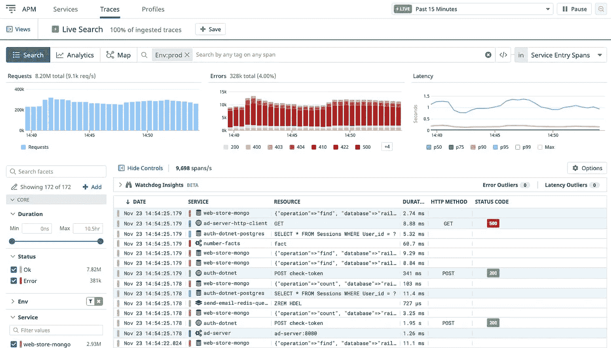

# 提高后端应用程序性能

> 原文：<https://betterprogramming.pub/improving-backend-application-performance-4e1b6c050ec8>

## 识别和提高后端应用程序性能的策略


NewRelic APM 仪表板

多年来，我使用了各种策略来提高后端应用程序的性能。从一天有几个用户流量的应用程序到数千并发用户的应用程序。

在我看来，无论有多少用户访问服务器，后端系统都应该以一种可伸缩和经济的方式设计。这是提供出色用户体验的关键，同时又不需要花费大量资金来运行基础架构。以下是一些对我很有效的策略。

*请注意，我不会讨论通过增加更多服务器进行水平扩展或通过增加更强大的系统硬件进行垂直扩展的策略。如果你有兴趣的话，可以看看我写的关于* [*系统设计*](https://medium.com/effective-programmer/introduction-to-system-design-for-web-and-mobile-applications-f00e94623ce4) *的帖子。*

好了，我们开始吧。

# 1.分析应用程序以建立基线

在其核心，应用程序性能改进工作围绕着测量您的应用程序的速度和资源使用。一个常见的误解是，剖析涉及昂贵和/或复杂的软件工具，这些工具不仅需要大量的工作来设置和使用。

虽然对于一些应用程序来说这可能不是完全不真实的，但根据我的经验，后端应用程序非常适合于简单的事情，例如在代码中添加开始到结束的时间报告，记录执行的不同阶段的内存使用情况，或者在终端上使用类似于 [Apache Bench](https://httpd.apache.org/docs/2.4/programs/ab.html) 或 Unix [time](https://linuxize.com/post/linux-time-command/) 命令的工具来获取数据。下面是一个使用 time 命令估计达到特定 API 端点所需时间的示例:

```
% time curl -s [https://api.coindesk.com/v1/bpi/currentprice.json](https://api.coindesk.com/v1/bpi/currentprice.json) -output removed for brevity-0.01s user 0.00s system 23% cpu 0.064 total
```

建立这些基线数字是非常重要的第一步。没有基线，就很难判断你正在进行的改变是在帮助还是让情况变得更糟。

此外，还有几个很棒的付费应用性能管理(APM)工具，如 [NewRelic](https://newrelic.com/) 、 [DataDog](https://www.datadoghq.com/) 和 [AppDynamics](https://www.appdynamics.com/) ，它们提供了对历史数据的详细洞察。



DataDog APM 仪表板

# 2.浏览一下代码

在注册一些复杂的——在某些情况下——昂贵的性能改进工具之前，我建议简单地阅读和分析您的代码。当很难进入实际环境时，这是非常有用的。在[冥界帝国](https://twitter.com/UWEmpire)的开发过程中，我们在游戏中的一个事件活动时遇到了性能问题。当然，我们不能在我们的开发环境中重现它，但是我们通过观察代码发现了它。当代码库非常大时，这可能很难做到，使用本文中的其他技巧来帮助您将重点缩小到相关部分。

# 3.用单个多获取替换多个获取，以提高 IO

IO 通常是性能下降的根本原因。一个简单而强大的技巧是使用同一方法的 multiple-get 函数。无论是处理文件 IO 还是远程数据源，多次获取数据都会增加很多开销。进行批量提取可以显著改善这种情况。查看 [Rich](https://medium.com/u/b36dd5ae4325?source=post_page-----4e1b6c050ec8--------------------------------) 在他的 [Redis get pipeline vs mget](https://medium.com/@jychen7/redis-get-pipeline-vs-mget-6e41aeaecef) 帖子中所做的基准测试，了解这一点。

# 4.后台处理、多线程和异步 IO

我将这些技术结合到一个技巧中。大体思路差不多；当您执行其他任务或并行启动多个后台任务并等待它们完成时，可以在后台完成的任何处理几乎总是比一个接一个地执行要快。请注意，多线程确实会带来一些与竞争条件相关的问题，这些问题可能会导致耗时的调试会话。明智地使用这一点，并且始终考虑线程安全，不仅是您自己的代码，还有您正在使用的库。

# 5.在应用程序级别缓存数据

换句话说，不要在你的代码中取两次。从磁盘或远程源获取的任何东西都应该保存到应用程序级的键值存储中，它可能只是一个简单的带有访问器的全局数组。如果使用一个全局变量以错误的方式困扰你，我不会感到惊讶。就我个人而言，当明智地使用包装器访问器时，我完全容忍它。

以下示例显示了一种可能的实现方式:

使用 app 进程内存进行缓存

# 6.在机器/服务器级别缓存数据

当处理运行应用程序的同一台机器上不存在的数据时，这种技术非常有用。任何现代集群环境都可以从中受益。这可以简单到使用本地缓存文件或类似 PHP 中的 [APCu](https://www.php.net/manual/en/book.apcu.php) 的东西，或者简单地使用本地文件。重要的是要明白，如果服务器被回收，您将丢失缓存数据。

# 7.使用外部缓存减少数据存储 IO

在这种策略中，像 [Memcache](https://memcached.org/) 和 [Redis](https://redis.io/) 这样的外部内存存储被用来保存数据，所以你不必再从数据库或存储器中获取数据。这通常被称为[缓存备用设计模式](https://blog.cdemi.io/design-patterns-cache-aside-pattern/)。我过去曾详细地谈论过 Redis。下面的代码示例展示了这一点:

使用 Redis 作为数据库缓存的代码示例

# 8.提高查询性能以减少数据存储负载

当使用关系数据库时，查询性能分析相对来说是一件简单的事情。大多数关系数据库都提供了这样做的方法。幸运的是，这里有一些古老的商业方法，在某些情况下，创建和使用正确的索引就足够了。如果你有兴趣，我推荐阅读阿里云团队的[如何优化 MySQL 查询的速度和性能](https://www.alibabacloud.com/blog/how-to-optimize-mysql-queries-for-speed-and-performance-on-alibaba-cloud-ecs_593872)作为起点。

对于非关系数据库，管理和创建自己的索引(可以使用键直接获取相关数据)比扫描查询要快得多。如果你对这个话题感兴趣，请在下面写评论，我很乐意解释。

# 9.通过使用压缩提高网络性能

当通过网络访问数据时，无论是客户端访问您的 web 服务器还是您访问数据库，网络拥塞都可能是延迟的主要原因。大多数服务器都提供此功能，但您可能需要打开它，并要求您的客户端请求它。如果你感兴趣，数字海洋团队有一个很棒的教程，关于如何在 Ubuntu 20.04 上使用 gzip 和 Nginx 提高网站性能

# 10.通过使用更快的协议提高网络性能

当两个服务器之间进行通信时，例如，在单个服务器无法实现所有功能的微服务的情况下，使用二进制或压缩技术，例如谷歌的 [Flatbuffers](https://google.github.io/flatbuffers/) 是一个适用于许多语言的伟大解决方案。

*我应该提一下，我们在让它为 PHP* 工作时遇到了麻烦。

# *资源*

*   [Apache Bench](https://httpd.apache.org/docs/2.4/programs/ab.html) 是一个用于压力测试 web 端点的命令行工具。
*   [NewRelic](https://newrelic.com/) 、 [DataDog](https://www.datadoghq.com/) 和 [AppDynamics](https://www.appdynamics.com/) 应用性能监控工具。
*   [Redis 基准数据](https://medium.com/@jychen7/redis-get-pipeline-vs-mget-6e41aeaecef)由 [Rich](https://medium.com/u/b36dd5ae4325?source=post_page-----4e1b6c050ec8--------------------------------) 用 multi-get 代替 Redis get。
*   用于在应用服务器上缓存数据的高级 PHP 缓存(用户)手册。
*   [Memcache](https://memcached.org/) 和 [Redis](https://redis.io/) :分布式缓存工具。
*   [缓存备用设计模式](https://blog.cdemi.io/design-patterns-cache-aside-pattern/)提高性能，帮助维护缓存和底层数据存储之间的一致性。
*   [MySQL 查询优化](https://www.alibabacloud.com/blog/how-to-optimize-mysql-queries-for-speed-and-performance-on-alibaba-cloud-ecs_593872)阿里云团队指导。
*   [NginX 压缩教程](https://www.digitalocean.com/community/tutorials/how-to-improve-website-performance-using-gzip-and-nginx-on-ubuntu-20-04)提升性能。
*   [Google Flatbuffers](https://google.github.io/flatbuffers/) 协议，用于更快的网络传输和解析。

# 进一步阅读

如果你想分享一个对你有效的策略，请在评论中告诉我。如果你对类似的话题感兴趣，你可能会有兴趣看我下面的帖子:

[](/background-processing-with-rabbitmq-python-and-flask-5ca62acf409c) [## 用 RabbitMQ、Python 和 Flask 进行后台处理

### 运行后台进程以提高 web 应用程序的性能

better 编程. pub](/background-processing-with-rabbitmq-python-and-flask-5ca62acf409c) [](https://effective-programmer.com/introduction-to-system-design-for-web-and-mobile-applications-f00e94623ce4) [## 网络和移动应用的系统设计介绍

### 网络和移动应用系统设计、性能和可扩展性初学者指南。

effective-programmer.com](https://effective-programmer.com/introduction-to-system-design-for-web-and-mobile-applications-f00e94623ce4) 

干杯！