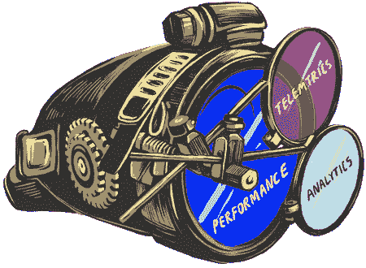
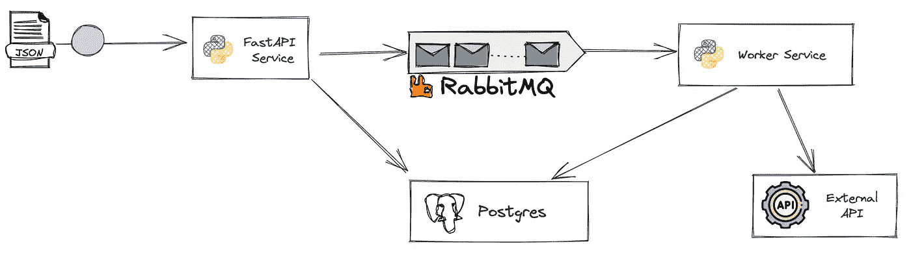
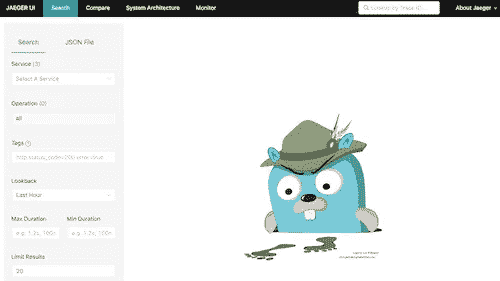
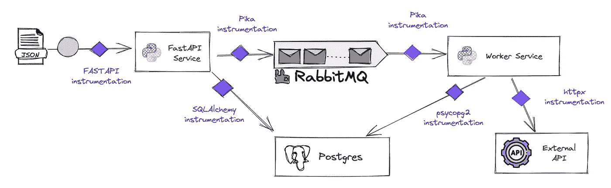
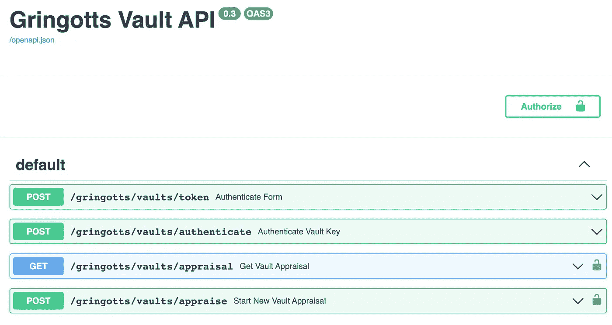
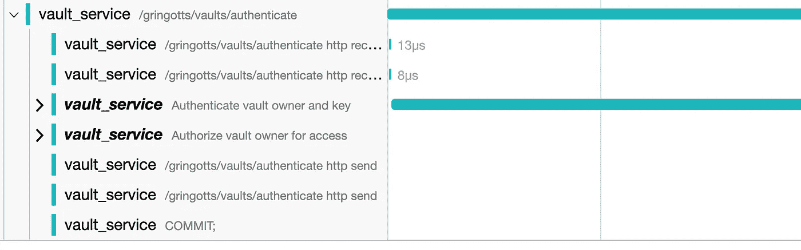
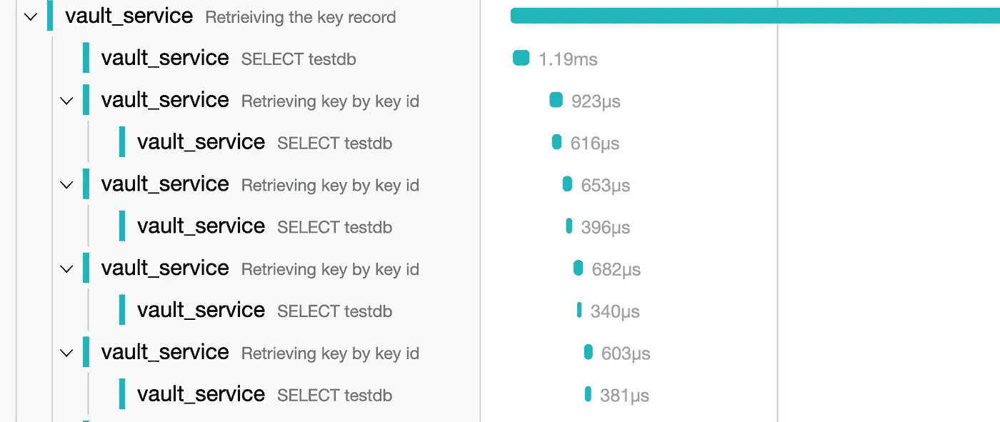
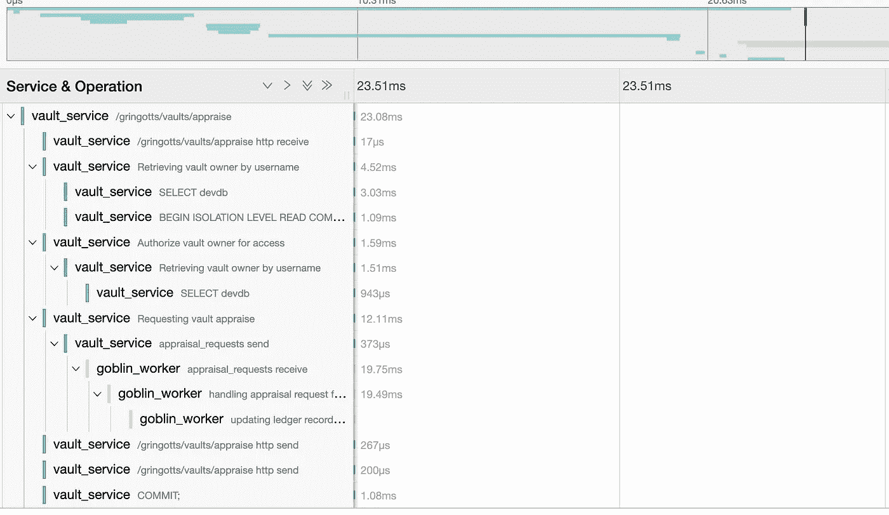
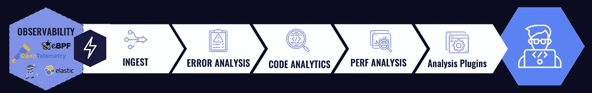
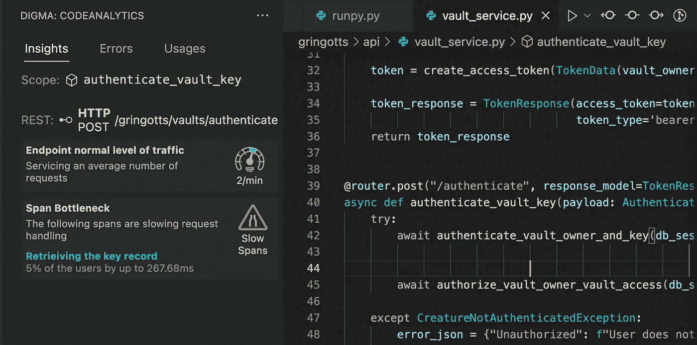

# 利用 OpenTelemetry 改进代码设计——实用指南

> 原文：<https://betterprogramming.pub/improving-code-design-with-opentelemetry-a-practical-guide-a08e6440c24d>

## 关于可观察性以及如何利用 OSS 工具使你的代码更好，每个开发者都需要知道什么



> 这是一个由三部分组成的系列文章的第二部分，该系列文章将回顾当今开发人员可用的一些可观察性技术，为什么它们使编码变得更好，以及它们可以提供哪些具体的见解。以下是第一部分 *的* [*链接，以防你错过。*](/the-observant-developer-part-1-1939d53fd5a4)

TLDR:在这篇文章中，我们将使用一些操作系统浏览一些真实世界的例子:

*   [打开遥测](https://opentelemetry.io/)
*   [耶格](https://www.jaegertracing.io/)
*   [Digma](https://github.com/digma-ai/digma)

# 我们是如何来到这里的

在上一篇文章中，我们讨论了可观察性在现代开发者堆栈中的作用。测量和研究运行时行为如何帮助验证我们的代码假设——以类似于测试的方式。

这一次，我们将把理论放在一边，专注于如何实现这一点。我将使用一个示例应用程序作为参考，但是这里讨论的内容都不是特定于应用程序或语言的。我也很想了解你对其他系统和工具的解释和应用。

# 不是另一个垃圾应用

为了演示更真实的场景，我寻找了一个超越简单 CRUD 实现和基本搭建的应用程序。事实证明，这一探索比我想象的要困难得多。看来，要找到具有真正领域逻辑深度的好样本，甚至是组合了更完整的工具和平台堆栈的应用程序，并不是那么容易的。

最终——也许是不可避免的——我被吸引，根据在网上找到的模板制作了自己的样品。你可以在这里找到原始的模板库。我选择了一个依赖于开源平台和库的基本设置:



我曾经制作了一个我喜欢的“货币转账”示例服务，主要是因为它能够添加一些逻辑、验证和额外的外部过程，使它变得有趣。对于这篇文章，我决定在我的原始样本中添加更多的字符。为了让这个练习不那么乏味，我们将为古灵阁巫师银行开发一个 API！


来源:[https://commons . wikimedia . org/wiki/File:古灵阁，_ 哈利 _ 波特 _ 工作室 _ 旅游 _(48538071011)。jpg](https://commons.wikimedia.org/wiki/File:Gringotts,_Harry_Potter_Studio_Tour_(48538071011).jpg)

这个主题提供了很多增加复杂性和障碍的机会，这会给我们的代码增加更多的内容。两个快速声明:第一，我不是惠普知识的专家，所以请原谅我的即兴发挥。第二，这个应用程序不应该是一个如何构建一个架构良好的应用程序的模型。恰恰相反，我们希望看到糟糕的设计决策如何反映在我们的观察中。

## 先决条件

*   克隆或派生[示例 Github repo](https://github.com/doppleware/gringotts-vault-api) :

```
git clone [https://github.com/doppleware/gringotts-vault-api.git](https://github.com/doppleware/gringotts-vault-api.git)
```

*   安装 Python 3.8 以上版本
*   确保安装了[对接器](https://docs.docker.com/get-docker/)和[对接器组合](https://docs.docker.com/compose/install/)。我们将使用它们来快速完成设置和配置。
*   如果可能的话，使用 [VS 代码](https://code.visualstudio.com/)，因为后面的一些例子将依赖于此。

## 通过两步快速打开代码可观察性

1.  我们希望启动我们将在示例中使用的可观察性工具。使用一点 docker-compose，这一步是微不足道的。我们将旋转几个容器:

*   一个[耶格](https://www.jaegertracing.io/)实例。我们将使用耶格来可视化我们的分布轨迹。我们将推出一个适合作为本地实例运行的一体化版本的 Jaeger。
*   开放式遥测采集器。你可以更简单地把这个组件想象成一个可观测路由器。使用收集器是可选的，但是它的好处是能够修改我们的可观察性源、目标和比率，而不需要修改任何代码。它有一个单独的配置文件，定义了收集器接收轨迹(从我们的应用程序)并将它们导出到 jaeger 实例的方式。
*   [Digma](https://github.com/digma-ai/digma) 持续反馈——我们将在这篇文章的结尾更详细地讨论 Digma。

要启动一切，只需从 repo 根文件夹运行以下命令:

```
docker compose -f ./observability/tracing/docker-compose.trace.yml up -d
docker compose -f ./observability/digma-cf/docker-compose.digma.yml up -d
```

一旦一切都启动并运行，访问`[http://localhost:16686/](http://localhost:16686/)`来检查 Jaeger 实例是否启动。以下是您将看到的内容:



就是这样。还没有数据，但是跟踪后端已经准备好了！

2.既然我们的跟踪后端已经启动并运行，现在是时候向我们的应用程序发送数据了。这就是我们从 OpenTelemetry 的广泛采用中获益的地方。这只是在代码中指定正确的包并激活工具的问题。这里的例子是一个 Python 栈，但是你会发现从 GoLang 到。NET、Java 或 Javascript。

在我们的例子中，我已经将下列包添加到项目需求文件中。这很难:

*   `opentelemetry-instrumentation-fastapi`
*   `opentelemetry-instrumentation-logging`
*   `opentelemetry-instrumentation-asyncpg`
*   `opentelemetry-instrumentation-pika`
*   `opentelemetry-instrumentation-httpx`



代码的自动检测

上图显示了通用平台和库提供的自动化工具的覆盖范围。每个紫色菱形代表一个微小的探测器，已经为 OpenTelemetry 安装了仪器，准备开始传输。有了这么多数据，获取运行时使用信息就变得不那么重要了，更重要的是如何使用这些信息来得出正确的结论。

## 配置 OTEL

打开所有这些仪器很简单。首先，我们添加一些基本的 OpenTelemetry 设置，包括指定一些关于我们正在跟踪什么以及我们希望如何导出数据的基本信息。我们将使用 OTEL 软件包中不同组件的标准普通实现。下面的代码配置 OTEL 将所有的可观测性数据发送到我们的“路由器”，我们之前在`localhost:4317`开始监听的收集器容器。

此外，您可以看到一些对不同的`instrument()`函数的调用，这些函数基本上打开了我们项目中包含的每个自动检测包。总而言之，相当标准的样板代码。

正如我在上一篇文章中提到的，深入探讨 OpenTelemetry 的设置和配置不在这篇文章的范围之内。OTEL 网站上有关于这个话题的很棒的文档。

# 那么…现在怎么办？

伟大的仪器带来伟大的可观察性。迈克尔·豪森布拉斯的推特

现在我们开始吧！我们的示例应用程序是一个简单的 API 服务，添加了一些逻辑来使事情变得有趣。API 为巫师们提供了一种现代化的方式来访问他们的金库，检查他们的“余额”，甚至命令对其内容进行评估。

我们来安装应用需求(建议使用虚拟 Python 环境。在这个例子中，我们将使用 venv):

```
python -m venv ./venv
source ./venv/bin/activate
pip install -r ./gringotts/requirements.txt
```

在 IDE 中打开应用程序，不要忘记[更改解释器](https://code.visualstudio.com/docs/python/environments#_select-and-activate-an-environment)以使用我们创建的 venv 环境。

为 IDE 或命令行启动应用程序，或者再次使用 docker-compose，使用以下代码让它运行:

```
docker compose --profile standalone -f docker-compose.yml -f docker-compose.override.standalone.yml up -d
```

运行以下代码，为应用程序植入一些我们可以使用的数据。我们可以直接运行`./seed/seed_data.py`或者只是从一个容器中启动它，如下所示:

```
docker compose -f ./docker-compose.seed.yml up --attach gt-seed-data
```

该脚本将导入并生成一些数据，这些数据也是基于我在网上找到的一个哈利波特数据集。

我们现在有了一个可以在`[HTTP://localhost:8238/docs](http://localhost:8283/docs)`使用的工作 API。



# 等等……可观测性在哪里？

它已经在那里了。其中大部分是由我们之前讨论过的自动检测提供的，并且我们已经在代码中添加了一些跟踪功能。OpenTelemetry 允许我们定义`Spans`。跨度表示将处理请求的整个过程逻辑分解成有意义的、粒度小的部分。

例如，在古灵阁认证客户时，流程可能包括首先检查他们的保险库密钥，认证他们的身份，然后根据记录验证客户请求访问的保险库号码确实属于他们。这些步骤中的每一步都可以表示为一个单独的`span`，理解和跟踪它的行为和性能是有意义的。

这是我们代码中 Span 声明的样子；`start_as_current_span`函数声明了一个名为‘验证保险库所有者及其密钥’的逻辑单元，我们现在可以跟踪它了。以非常类似于写日志消息的方式，我们可以逐渐在代码中添加越来越多的跟踪，从而提高我们跟踪其内部工作的能力。

让我们生成一些数据来看看是什么样的。我们可以触发一些 API 操作，比如通过 swagger 的‘authenticate’按钮登录(用户名:hpotter，密码:griffindoor)。

或者，我们可以运行一些已经生成大量数据的测试。我们可以使用 [Pytest](https://docs.pytest.org/en/7.1.x/) 命令行运行我们的测试，或者只是通过 docker-compose 启动测试套件。请注意，我们还在运行测试之前播种数据，以创建更真实的条件，并希望获得更好的数据。代码如下:

```
PYTEST_ARGUMENTS="--seed-data true" docker compose --profile test -f docker-compose.yml -f docker-compose.override.test.yml up --attach gt-vault-api --abort-on-container-exit
```

现在，让我们看看我们的可观测性是什么样子的。在`[http://localhost:16686](http://localhost:16686.)` [打开你的 Jaeger 实例。](http://localhost:16686.)在 Jaeger UI 中，我们可以选择‘vault _ service’服务和“/古灵阁/金库/令牌”或“/古灵阁/金库/认证”操作。



如果我们展开看起来花费时间最多的 span 行，我们会发现一个明显的问题，如下所示:



看起来像是由于次优实现导致的重复 SQL 调用。如果我们查看代码，很明显有人以最糟糕的方式实现了代码的这个特定部分。或许是工作保障？


哥布林工人进程。来源:[https://commons . wikimedia . org/wiki/File:Universal _ Studios _ Florida _(妖精)。jpg](https://commons.wikimedia.org/wiki/File:Universal_Studios_Florida_(Goblins).jpg)

如果我们过滤 Jaeger 接口来查看“评估”操作，我们将能够看到分布式跟踪实际上是如何连接不同应用程序组件之间的点的。我们可以检查请求生命周期的全貌。看看有多个微服务在异步和同步流中工作的复杂系统。下面，我们可以通过 RabbitMQ 队列看到 FastAPI 和‘goblin worker’服务之间的切换。



多服务流程跟踪

有了这些数据，就有可能开始度量和检查代码变更，并验证我们认为修复了问题的东西。不仅如此，正如我们将在本系列的下一篇文章中讨论的那样，我们可以将这些跟踪与实际的 CI/staging/production 数据进行比较，以确定趋势并衡量我们的修复在现实生活条件和数据下是否真正有效。

# 但是我实际上会用多久呢？

这是作为开发人员访问跟踪的主要问题。有丰富的信息，但很难知道什么时候去探索它，如何得出正确的结论。更有趣的见解实际上不是通过分析单个跟踪，而是在聚集和比较多个行为不同的相似跟踪时出现的。这有助于我们理解为什么一些用户会看到更多的错误或体验到糟糕的性能。

这就是持续反馈适合的地方。也就是说，使用底线类型的结论持续分析这些跟踪的能力，就像我们会参考我们的 CI 构建一样。如果我们可以自动收到多个查询被低效调用、随时间增长变慢或者整个请求的比例因子正在恶化(每次调用的性能)的警告，这将允许我们更好地优化代码。



# 输入 Digma

今天我想讨论和演示的最后一个工具也是我最关心的一个。充分披露:我是 [Digma](https://github.com/digma-ai/digma) 的创造者。早在去年九月，我就已经给[写了](https://levelup.gitconnected.com/ci-cd-cf-the-devops-toolchains-missing-link-b5c88caf6282)关于它的需求。我觉得在这里展示它很舒服，因为它是开源/免费的，而且还没有正式发布。此外，它确实概括了我自己对持续反馈的想法。

我还将在披露中添加一个免责声明:这是一个早期的预测试版本，所以不要在生产中运行它！

为了看到持续的反馈，我们可以从[市场](https://marketplace.visualstudio.com/items?itemName=digma.digma)安装 VS 代码插件。如果您还记得，我们之前已经将其后端部署为跟踪堆栈的一部分。

如果我们启用的 OpenTelemetry 包和库自动检测我们的代码，Digma 会自动吸收这些数据以产生见解。打开工作区后，我们现在可以为代码的任何功能或区域切换可观察性数据。例如，下面是它对我们之前讨论的“身份验证”功能的建议:



我们现在可以忽略一些更面向生产的见解(例如，流量水平)，但是即使这些简单的信息也使得生产、审查和发布代码变得更加容易。我们在这里有代码洞察，而不是比较跟踪或在不同的仪表板周围躲藏，因为它们与我们正在处理的代码相关。

# 接下来去哪里？

我们将在本系列的最后一篇文章中看到，当我们将额外的数据(生产、暂存和 CI)加入到组合中时，会发生什么。我们可以获得更相关和更客观的见解，用这些可观察性来源来检查我们的代码。我们将能够识别产品特有的现象，并测量和提高特性成熟度水平。

```
You can reach me on Twitter at @doppleware or here.
Follow my open-source project for continuous feedback at [https://github.com/digma-ai/digma](https://github.com/digma-ai/digma)
```