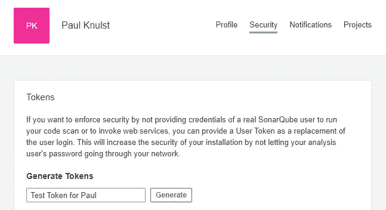
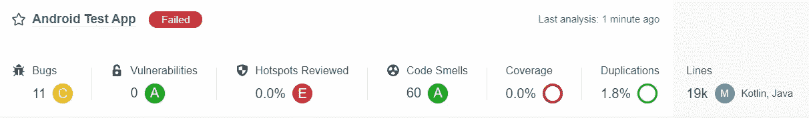

# 利用 SonarQube 和 Gradle Detekt 提高 Android 应用程序的代码质量

> 原文：<https://betterprogramming.pub/improving-code-quality-of-android-apps-with-sonarqube-and-gradle-detekt-d275765c2a11>

## 作为开发人员，您希望实现最佳的代码质量。有了这两个工具，你可以不费吹灰之力快速实现


照片由[布雷特·乔丹](https://unsplash.com/@brett_jordan?utm_source=unsplash&utm_medium=referral&utm_content=creditCopyText)在 [Unsplash](https://unsplash.com/?utm_source=unsplash&utm_medium=referral&utm_content=creditCopyText) 拍摄

代码质量非常重要，您应该始终尝试优化您的实现。本文展示了两种可以结合起来实现更好质量的工具，尤其是在 android 应用程序中。

# 概观

```
**1\. Introduction**
|
**2\. SonarQube**
|--- 2.1 Installation
|--- 2.2 Configuration
|--- 2.3Analyzing code quality with SonarQube **3\. Gradle Detekt** |
**4\. Combining both tools** |
**5\. Closing notes**
```

# 1.介绍

几周前，我发现了一个关于 SonarQube 的不错的教程。因为我非常喜欢提高我的代码质量或我正在从事的项目的质量，所以我自己创建了一个 sonar cube*的实例，并用它来检查和提高几个 android 应用程序的代码质量。*

*下面的文章展示了一个任何人都可以执行的操作方法，如果存在一个正在运行的 Docker 群[*(在这里了解如何创建一个)*](https://levelup.gitconnected.com/docker-swarm-in-a-nutshell-ed2a9c42cd7c) *。**

*最后，我还为本地开发提供了一个 docker 文件。*

# *2.索纳库贝*

*SonarQube 是什么？*

> *SonarQube 是 SonarSource 开发的一个开源平台，用于持续检查代码质量，通过静态分析代码来执行自动审查，以检测 20 多种编程语言上的错误、代码气味和安全漏洞。*

## *2.1.装置*

*以下 docker-compose.sq.yml 可用于在 Docker Swarm 中创建 SonarQube 实例*

*要启动 SonarQube，必须导出 docker-compose.sq.yml 中使用的环境变量:*

```
*$> export PRIMARY_DOMAIN=knulst.de*
```

*之后，可以部署堆栈*

```
*$> docker stack deploy -c docker-compose.sq.yml sonarqube*
```

*并且可以在 [https://sq.knulst.de](https://sq.knulst.de) 访问。*

*要运行 SonarQube，您需要使用以下命令增加内存限制。*

```
*sysctl -w vm.max_map_count=262144*
```

**(在 windows 中你必须启动 WSL shell:* `wsl.exe -d docker-desktop` *)**

## *2.2.配置*

*现在，您可以登录 web dashboard ( *默认用户/pass = admin/admin* )并开始配置过程。要在任何 android 应用程序中使用 SonarQube 实例，必须在用户配置文件中创建一个登录令牌，地址为 [https://sq.knulst.de](https://sq.knulst.de)*

**

*在 SonarQube 的管理菜单中生成一个用户令牌*

*创建此令牌后，必须调整三个文件:*

1.  *`build.gradle`(项目)*
2.  *`build.gradle` (app)*
3.  *`gradle.properties`*

*项目`build.gradle`中需要第一次添加。在根级别添加以下内容很重要:*

```
*plugins {
    id "org.sonarqube" version "2.8"
}*
```

*其次，应该在应用程序`build.gradle`中创建一个新块:*

*重要的是要知道，这个块是由一个用 Kotlin 编写的应用程序使用的，它有几种风格。要使用该代码块，必须调整`activeFlavor` 和`sonar.sources`。*

*此外，还需要在应用程序`build.gradle`中插入两行代码:*

1.  *将 SonarQube 包添加到依赖项:
    `implementation "org.sonarsource.scanner.gradle:sonarqube-gradle-plugin:3.3"`*
2.  *应用 SonarQube 插件
    `apply plugin: 'org.sonarqube'`*

*最后一步是将令牌、URL 和项目名称添加到`**gradle.properties**`中*

## *2.3.用 SonarQube 分析代码质量*

*在执行前面解释的步骤之后，可以在终端内(或在 android studio 中)运行分析:*

```
*$> gradle sonarqube*
```

*在 SonarQube 网站上的项目概述中，命令执行完成后应该有一个项目概述:*

**

*激活 SonarQube for 并测试 android 应用程序后，sonar cube 项目概述中的测试结果*

# *3.梯度检测*

*什么是`detekt`？*

> *detekt 是一个用于 Kotlin 编程语言的静态代码分析工具。它对 Kotlin 编译器提供的抽象语法树进行操作。*

**Detekt**可以在任何基于Kotlin 的 android app 中实现。它可以与自定义的规则集一起使用来检查应用程序。启用`detekt`非常简单，可以分四步完成:**

1.  **将 *detekt* 添加到项目`build.gradle`**

```
**dependencies **{ 
    [...]
**    classpath("io.gitlab.arturbosch.detekt:detekt-gradle-plugin:1.17.0")
**}****
```

**2.使用一组已定义的规则创建 detekt.yml。在此下载一个样本文件[并保存在`project_folder/detekt/detekt.yml`中](https://ftp.f1nalboss.de/data/sample-detekt.yml)**

**3.在 app `build.gradle`中应用 *detekt* 插件**

```
**apply plugin: "io.gitlab.arturbosch.detekt"**
```

**4.将 *detekt* 块添加到app `**build.gradle**`**

**现在可以通过执行以下命令生成一个`detekt` 报告:**

```
**$> gradle detekt**
```

# **4.结合两种工具**

**启用这两种工具后，可以将它们结合起来。要实现这一点，唯一要做的事情就是将以下代码行添加到 SonarQube 块中:**

```
**sonarqube {
    properties {
            [...]
            property "sonar.kotlin.detekt.reportPaths", "build/reports/detekt.xml"
            }
}**
```

**现在，通过执行以下命令，可以在 SonarQube 网站上创建一个信息性项目条目:**

```
**$> gradle detekt
$> gradle sonarqube**
```

**完成这两个命令后，可在[https://sq.knulst.de/projects](https://sq.knulst.de/projects)访问项目摘要，并将显示所有发现的问题！**

****

**此图显示了一个错误代码库的示例，如果与另一个概述相比，它显示了由于 detekt 报告而添加的几个更多的代码味道。**

# **5.结束语**

**我希望您喜欢阅读这篇文章，并且现在将使用这些工具来提高您的代码质量。请记住，高质量的软件更容易维护和增强！**

**对于本地开发，你可以使用[这个 docker-compose](https://ftp.f1nalboss.de/data/docker-compose.sonarqube.local.yml) 和[这些笔记](https://ftp.f1nalboss.de/data/sonarqube.local.md)来知道你要改变什么。**

```
****Want to Connect With the Author?**Here's my [GitHub](https://github.com/paulknulst) handle and [Personal blog](https://blog.knulst.de/).**
```