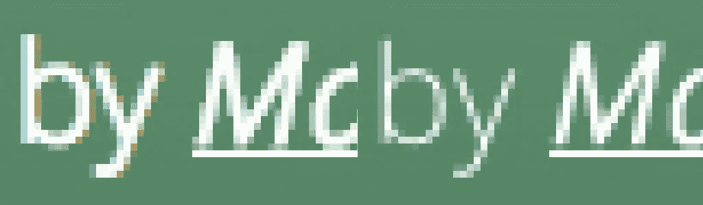
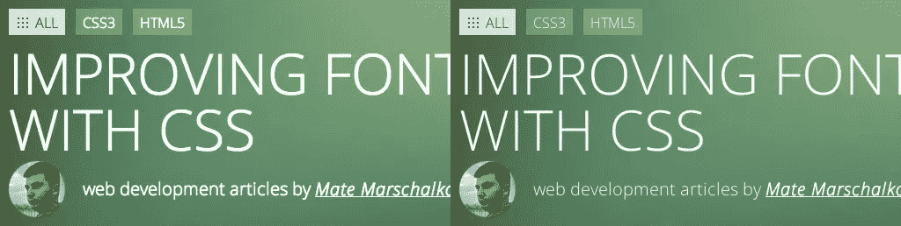
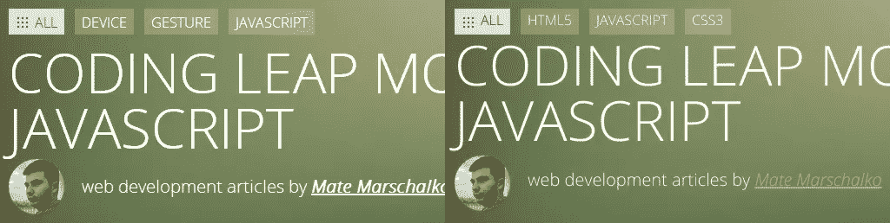

# 用 CSS 改进字体呈现

> 原文：<https://betterprogramming.pub/improving-font-rendering-with-css-3383fc358cbc>



我认为大多数前端开发人员已经接受了浏览器中的字体，尤其是那些大标题上的字体，看起来与我们在 Photoshop 中看到的非常不同。

PS 版的字体更薄、更光滑，总体来说也更好。我们不能真正改变字体在浏览器中的呈现方式，但对于其中一些字体，我们可以使用一个简单的 CSS 技巧来实现类似 Photoshop 的质量。在 WebKit 中，我们将使用 `-webkit-font-smoothing`属性。Firefox 也实现了一个类似的属性，名为`-moz-osx-font-smoothing`，从版本 25 开始可用。尝试将这些属性添加到标题标签或整个正文中:

```
-webkit-font-smoothing: antialiased;
-moz-osx-font-smoothing: grayscale;
```

让我们来看看这给 OSX 带来的巨大变化:



不使用和使用抗锯齿

这在麦金塔电脑上的 Chrome、Safari 和 Firefox 上都能很好地工作。如果你的文本在 WebKit 浏览器中有点太细太模糊(尤其是对容器应用 CSS 变换的时候)，可以尝试添加一些值低于半个像素的 `-webkit-text-stroke`。大约 0.15-0.45 像素应该可以。对于其他字体大小或颜色，添加一个类似的细`text-shadow`也可能有效。最后，对于一些字体，抗锯齿属性可能有点太戏剧化了，所以试试`subpixel-antialiased.`

```
-webkit-text-stroke: 0.45px;
// or
-webkit-text-stroke: 0.45px rgba(0, 0, 0, 0.1);
// or
text-shadow: #fff 0px 1px 1px;
```

这也将改善移动浏览器上的文本，但不幸的是，这些技巧在 Windows 上不起作用。在实际项目中使用这些技术之前，请记住这些只是变通方法和技巧。它们并不是跨浏览器的糟糕和不一致的渲染的实际解决方案。他们可能会在新版本中修复或更改您的文本呈现方式，因此您必须在未来关注该项目。另一方面，我在我所有的项目中使用`-webkit-font-smoothing`,用漂亮的字体来对待我所有的 Mac 访客。

# 改进 Windows 上的渲染

不幸的是，我们在不同的操作系统中也有同样的不一致性，不仅仅是浏览器。我第一次研究这个问题是当我的一个项目在质量控制期间被退回时，因为“字体看起来很块状，与 Photoshop 的设计非常不同。”QA 测试人员甚至质疑我是否使用了正确的字体。

我做了一些研究，发现在大多数情况下，Windows 并没有对文本应用多少抗锯齿功能。好消息是，在微软最新的浏览器中，情况看起来相当不错。与 Chrome 和 Firefox 相比，字体渲染要好得多。

有一个技巧可以解决 Windows 上的问题，我们需要使用 SVG 来解决这个问题。 **SVG 字体**具体来说。事实证明，实际上没有办法控制 EOT，WOFF 或 TTF 字体的抗锯齿。但是默认情况下，SVG 在两种操作系统上都是抗锯齿的！

以下是您的常规字体声明:

```
[@font](http://twitter.com/font)-face {
  font-family: ‘MyWebFont’;
  src: url(‘webfont.eot’);
  src: url(‘webfont.eot?#iefix’) format(‘embedded-opentype’),
       url(‘webfont.woff’) format(‘woff’),
       url(‘webfont.ttf’) format(‘truetype’),
       url(‘webfont.svg#svgFontName’) format(‘svg’);
 }
```

正如你所看到的，在声明的末尾有 SVG 字体。我们要强迫 Windows 使用它，唯一要做的就是将它添加到这个列表中。



左:Chrome/Win 7 中的 TTF 字体右:Chrome/Win 7 中的 SVG 字体

现在，这看起来不错，但不幸的是，正如预期的那样，有几个问题。这些问题是我决定不在我的项目中使用这种方法的原因。

首先，SVG 字体的文件很大，所以这是需要考虑的。每个文件可能高达 200kb。在改变字距或行距方面，这种字体也不像 TTF 那样灵活。最后，对于长正文文本，它的渲染性能可能太慢。

因此，尽管这可能不是大多数网站的理想方法，但绝对要记住。例如，这种解决方案可能非常适合网站围绕一个 80px 的大标题构建的项目，这是网站最重要的元素(2016 年平面网站的平均值)。如果你只是希望标题在尽可能多的浏览器和操作系统上看起来不错，并且不介意它增加的额外文件大小，这个解决方案将会起作用。或者，也许有一天你会在 Windows PC 上为 Chrome 开发一个 kiosk web 应用程序。