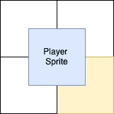
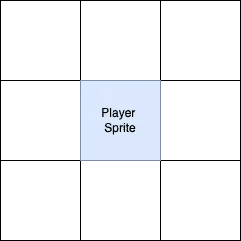
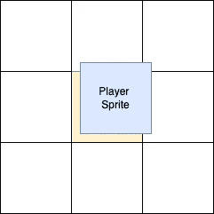
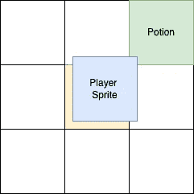
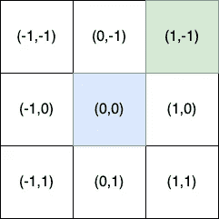
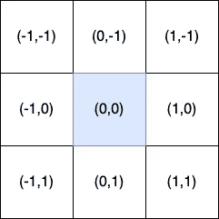
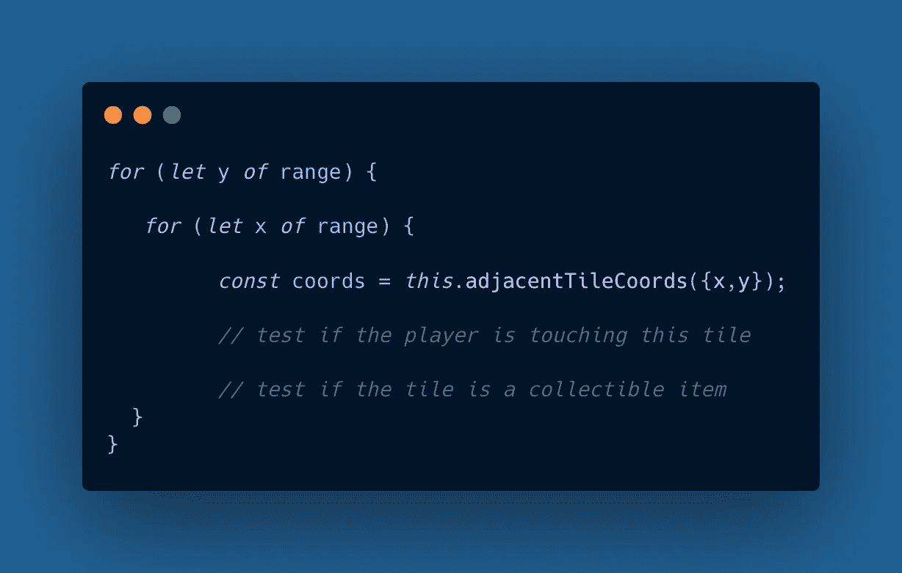
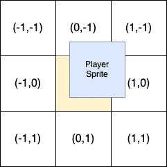

# 改进 JavaScript 游戏中的物品收集

> 原文：<https://betterprogramming.pub/improving-item-collection-in-a-javascript-game-2be45bafe01d>

## 让我们的碰撞检测精确到像素。


图片由 [pch.vector](https://www.freepik.com/author/pch-vector) 在 [freepik](https://freepik.com) 上

在过去的几个月里，我一直在逐步构建一个 JavaScript 地牢爬虫，它的特点是玩家在自动生成的洞穴迷宫中移动。当与敌人战斗时，玩家可以收集健康药水和武器——当危险发生时，玩家必须快速抓住它们。

帮助玩家尽可能快地抓取物品依赖于有效的碰撞检测。在早期版本中，玩家必须站在物品的正上方才能收集物品。

基于图块的碰撞检测

在改进代码后，我终于让游戏达到了玩家只需触摸一小部分就可以收集物品的地步。

像素级碰撞检测

本文主要讨论如何使用普通 JavaScript 提高基于图块的游戏中碰撞检测的准确性。

# 瓷砖的作用

游戏总是由瓷砖组成，虽然玩家可以在瓷砖之间顺利移动，但每个项目都与其所在的瓷砖完美对齐。在这里，我们利用这一点，检测玩家在什么牌上，以及这些牌上是否有物品。

游戏地图是数字代码的 2D 阵列。根据下面的按键，每个代码对应一个特定的瓷砖。

```
const WALL_CODE = 0;
const FLOOR_CODE = 1;
const POTION_CODE = 4;
const WEAPON_CODE = 5;
```

2D 数组中的每一项都有一个特定的索引，可以认为是它在平铺地图中的(x，y)坐标。在下面的示例中，用 0 表示的第一个墙砖位于坐标(0，0)处。第二个墙砖位于坐标(2，2)处。

```
(0,0)
  |
[[0,1,1]
 [1,1,1]
 [1,1,0] <-- (2,2)
```

在我最近的游戏中，每个方块的长度和宽度都是 32 像素。我将这个数字存储在一个名为`TILE_DIM`的常量中，我用这个常量在地图的图块索引和像素坐标之间进行转换。我们将在下一个例子中看到这是如何工作的。

# 找到玩家所在的牌

`player`对象是一个`coords`属性，它以像素为单位存储它的(x，y)坐标。我们可以使用下面的一个简单方法找到玩家最匹配的牌的数组索引。这被称为玩家的*当前牌。*

当前磁贴。

现在，一个玩家不能被均匀地放置在四张牌上吗？当然可以。在这种情况下，由于玩家的坐标向上舍入的方式，右下角的图块成为当前图块。



现在我们可以识别玩家所在的瓷砖，让我们看看如何让它检查与周围瓷砖的碰撞。

# 识别周围的瓷砖

在任何给定时间，玩家通常被八个其他牌包围。



玩家和周围的牌。

下面，玩家开始离开他一直停留的黄色方块。因为它仍然与这张牌重叠最多，所以游戏认为它是玩家的当前牌。



玩家开始离开当前的牌。

假设在玩家上方的右边有一个物品。



玩家用一个物品触摸一个方块。

这里的目标是检查玩家和物品之间的重叠。我们可以通过检查玩家周围的瓷砖来做到这一点。让我们给它们标上坐标



每个周围单幅图块的相对坐标。

因为这些坐标都是相对于玩家位置的，我们姑且称之为*相对坐标。*要获得相邻图块的数组索引，我们可以使用下面的方法`adjacentTileIndices`，该方法将一组相对坐标作为参数。

```
Player.prototype.adjacentTileIndices = function({x,y}) {
    let tile = this.curTileCoords(); tile.x += x;
    tile.y += y; return tile;
}
```

因此，为了获得右上角的图块的数组索引，我们调用以下方法:

```
player.adjacentTileIndices({x:1,y:-1})
```

因为游戏不存储物品的位置，所以最好在玩家移动时检查周围的物品。给定下面的相对坐标…



相对坐标

…我们可以想出一系列数字来在`x`和`y`轴上测试。

```
const range = [-1,0,1];
```

理论上，我们可以使用嵌套循环遍历所有九组图块坐标。



我们可以假设这样做。

但是等等！我们不应该检查所有的九张牌，因为玩家最多只能有四张牌。


玩家不在五张牌上。

因此，更有效的方法是识别玩家所在的图块，仅遍历这些图块，并查看每个图块上是否有项目。

为了实现这一点，让我们编写一些帮助器方法来检查一个玩家是否与它当前的图块完全对齐。如果它*没有*完全对齐，我们识别出它正在侵占哪些瓷砖。(如果这些牌有物品，则玩家收集该物品。)

# 查找与当前图块的距离

现在让我们使用我们所拥有的助手来找出这个层已经偏离它当前的图块有多远。

查找当前图块距离。

在上面的方法中，我们首先根据`axis`参数获得玩家的`x`或`y`坐标。

```
let coord = this.coords[axis];
```

然后我们除以`TILE_DIM`并取整得到它在游戏地图数组中的`x`或`y`索引。

```
let tileCoords = Math.round(coord / TILE_DIM);
```

现在，让我们将它乘以`TILE_DIM`以获得图块的`x`或`y`坐标，单位为像素。

```
let pixelTileCoord = tileCoord*TILE_DIM;
```

完成后，我们找到玩家位置和瓷砖位置之间的像素差异。

```
const diff = coord - pixelTileCoords;return diff;
```

## 你站在哪一边？

对于每个轴，我们可以调用下面的这个助手来查看玩家在瓷砖的哪一侧。如果像素数不为零，这意味着玩家正漫游到相邻的图块上。

```
Player.prototype.tileSide = function(axis) {
    let dist = this.curTileDist(axis); return (dist == 0) ? dist : Math.round(dist/Math.abs(dist));
}
```

让我们仔细看看上面的方法。首先，我们得到玩家与其当前图块的距离。

```
let dist = this.curTileDist(axis);
```

因为除以零将是灾难性的，如果它是零，我们简单地返回`dist`。如果它不是零，我们根据它的符号使它成为`1`或`-1`。

```
return (dist == 0) ? dist : Math.round(dist/Math.abs(dist));
```

所以对于`x`轴，`tileSide`方法将返回三个值之一:

*   `-1`如果玩家重叠了左边的牌
*   `0`如果玩家与其当前牌水平对齐
*   `1`如果方块与右边的方块重叠

对于`y`轴，`tileSide`将返回以下内容之一:

*   `-1`如果玩家重叠了上面的牌
*   `0`如果玩家与其当前牌垂直对齐
*   `1`如果图块与下面的图块重叠

然后在下面的方法中使用这个`tileSide`方法，该方法获取玩家相对于一个图块的位置，并添加我们应该检查的图块的相对坐标。

如果玩家没有在给定的轴上对齐其牌，此方法会添加一个坐标 1 或-1。

对于`x`和`y`，变量`arr`从包含`0`开始，因为我们应该总是检查相对坐标`(0,0)`，它是玩家所在的区块。

```
let arr = [0];
```

注意`tileSide`的返回值是`sideVal`。

```
let sideVal = this.tileSide(axis);
```

*   在`x`轴上，`sideVal`为左，`-1`为右。
*   在`y`轴上，`sideVal`在上方，`-1`在下方。

现在让我们看看`tilePositions`是如何被用来检查玩家的相邻牌的。

# 检查周围的瓷砖

然后在下面的“大图”函数中使用`tilePositions`方法，找到玩家所在的方块并检查上面的物品。注意，它被调用了两次——每个轴一次。

checkSurround 方法

让我们把这个分解一下。首先，我们得到玩家的瓷砖坐标。

```
const cur = this.curTileCoords();
```

然后我们定义一个`range`对象，它存储每个轴要检查的位置。

```
let range = {
        x:this.tilePositions('x'),
        y:this.tilePositions('y')
};
```

如果玩家完全对齐，那么`range`就是`{x:[0] ,y:[0]}`，因为只有一张牌需要检查。

但是如果玩家在下面的位置…



…对`tilePositions`的两次调用产生的`range`对象如下所示:

```
{
   x:[0, 1],
   y:[0,-1]
}
```

结果，只有玩家所在的四个牌被检查:`(0, 0)`、`(1, 0)`、`(1, -1)`和`(0, -1)`。

在进入循环之前，我们先建立应该在 2D 地图数组中检查的物品代码的类型。

```
const itemCodes = [POTION_CODE, WEAPON_CODE];
```

然后，我们可以设置嵌套循环:

```
for (let y of range.y) { for (let x of range.x) {

       // check the tile at (x,y)
       // if it's an item, collect it }
}
```

在循环中，我们得到被检查的瓷砖的数组索引。

```
const coords = this.adjacentTileIndices({x,y});
```

然后，我们在`game`地图中识别图块。

```
let tileCode = game.map[coords.y][coords.x];
```

还记得`itemCodes`阵吗？

```
[POTION_CODE, WEAPON_CODE];
```

如果`tileCode`包含在`itemCodes`数组中，我们调用一个`grabItem`函数并收集它。这会增加玩家的生命值

```
if (itemCodes.includes(tileCode)) {
       grabItem(tileCode, coords);
}
```

关于`grabItem`你只需要知道它会改变玩家的属性，并从游戏地图中移除物品。如果是健康药剂，玩家的生命值会一直上升，直到达到最大值。如果是武器，玩家获得它。

你可以在这个[演示](https://roguelike-smooth.netlify.app/demo-10-items/index.html)中看到这个逻辑在起作用。

# 概述

以下是你需要记住的一些要点:

*   `TILE_DIM`常量允许我在 2D 数组索引和像素坐标之间切换。
*   玩家通常被八个牌包围。
*   我们构建了一些小的辅助函数来计算玩家在哪个方块上。
*   使用一个`range`对象，我们收集要检查的图块的坐标。
*   如果这些瓦片中的任何一个变成了一个项目，该项目将被收集。

对于与瓷砖完美对齐的物品，我们可以利用玩家的瓷砖对齐程度来确定应该检查的瓷砖。这有助于保持高效的冲突检测。

[](/creating-a-game-loop-in-javascript-4b4d51c18f67) [## 用 JavaScript 创建游戏循环

### 让我们用一个循环的过程来平滑玩家的移动。

better 编程. pub](/creating-a-game-loop-in-javascript-4b4d51c18f67)