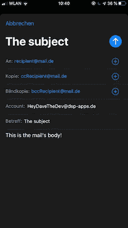

# 改进 iOS 应用程序中的邮件发送

> 原文：<https://betterprogramming.pub/improving-mail-delivery-in-an-ios-app-fcab74e6274>

## 苹果 MFMailComposeViewController 的替代产品

图片来自 [Pixabay](https://pixabay.com) 的 [ribkhan](https://pixabay.com/users/ribkhan-380399/)

无论你是想收集反馈还是为你的用户提供一种联系你的方式，在很多情况下，让用户在你的应用内发送电子邮件是一个好主意。

最简单的方法是使用苹果的`MFMailComposeViewController`，它是`MessageUI`框架的一部分。

在本文中，我将向您解释如何设置和显示这个视图控制器。此外，我们将看到它的一些缺点，以及如何使用发送电子邮件的替代方式。

# 使用 MFMailComposeViewController 发送邮件

什么是`MFMailComposeViewController`？

它是一个显示电子邮件内容的视图控制器。它可以由开发人员预先填充，但用户可以更改任何值，并需要手动发送。

`MFMailComposeViewController in iOS 13.`

下面是我们如何展示这样一个视图控制器:

创建并呈现 MFMailComposeViewController。

`// 1`需要导入`MessageUI`才能使用`MFMailComposeViewController`。

`// 2`由于您的用户可能没有邮件帐户，我们需要检查是否可以发送邮件。

这可以通过使用方法`canSendMail`来完成。如果用户的设备没有设置为发送电子邮件，您可以显示一个警告或使用`mailto`打开一个 URL，但是在本例中，我们将只打印一条错误消息。

`// 3`接下来，我们需要创建`MFMailComposeViewController`，它将被呈现。这样做时，我们可以定制邮件的每个方面。我们可以设置其主题，添加收件人列表、抄送和密件抄送。

电子邮件的正文可以设置为 HTML 或普通文本。要将数据作为附件添加，需要数据、附件的标题和 mime 类型。

可以在这里找到可能的 mime 类型的详细列表[。我们甚至可以将用户的电子邮件地址设置为首选发送地址，这样用户就不需要在电子邮件准备好后再去处理它了。](https://gist.github.com/AshvinGudaliya/6f9cfb2e7c90453161cfc3adfa758819)

我们还需要设置一个`mailComposeDelegate`来处理这个`MFMailComposeViewController`上的事件。

`// 4`最后我们可以展示一下`MFMailComposeViewController`。

一旦用户完成，代理将被通知，因此呈现视图控制器的方法`mailComposeController(_:didFinishWith:error:)`将被调用。

在这里，我们可以检查用户是否确实发送了电子邮件，电子邮件是否被保存以便稍后发送，或者发送是否被取消或失败。在大多数情况下，您可能只是想取消当前的`MFMailComposeViewController`，因为不再需要它了。

实现 mfmailcompositeviewcontrollerdelegate。

尽管您可以提供自己的 UI 让用户输入收件人、主题和文本，但您仍然需要提供这个额外的视图控制器，因为如果不这样做，Apple 就无法发送电子邮件。

在许多情况下，这可能不是最佳解决方案，并且可能有一些缺点，这取决于您的使用情况。

最大的缺点是你向你的用户公开了一切。他们可以看到整个邮件、每个可能附加的文件以及收件人的电子邮件地址。

此外，用户需要在他们的设备上设置一个邮件帐户，否则他们将无法发送任何邮件。此外，由于用户明确需要确认发送邮件，他们通过应用程序的流程并不像它应该的那样方便。

但是，幸运的是，还有另外一种发送邮件的方式。

# 使用 Mailjet 发送邮件

Mailjet 是一种允许你通过 HTTP 请求发送电子邮件的服务。

有许多类似的服务，但 Mailjet 很容易设置，并有一个慷慨的免费计划，每月可以发送多达 6000 封电子邮件，每天 200 封电子邮件，无需付费。

由于电子邮件是通过 HTTP 请求发送的，您可以提供您的邮件地址作为收件人，而不会向您的用户透露。此外，用户无法接触到关于邮件的任何详细信息。

那么，让我们来看看你需要做什么。

第一部分是创建你的邮件。这可以通过定义一个 JSON 字符串并将所有数据嵌入其中来实现。

该字符串包含以下部分:

*   `From`部分:发件人的邮件地址和发件人的姓名。重要的是，发件人的邮件地址是您在 Mailjet 注册的邮件地址，否则邮件将不会被发送！
*   `To`部分:邮件地址和收件人姓名列表。
*   `Cc/Bcc`部分:电子邮件地址和抄送/密件姓名列表。
*   `Subject`:邮件的主题。
*   `TextPart/HTMLPart`:普通文本或 HTML 格式的邮件正文。
*   `Attachments`:内容类型(或 mime 类型)、名称和内容为 base64 编码字符串的附加文件。

在这里，您可以看到这样一个字符串是如何构造的示例:

创建您的邮件内容。

设置好邮件数据后，您就可以请求发送邮件了。

正在向 Mailjet 发送请求。

`// 1`为了对 Mailjet 进行授权，我们将使用提供给我们的登录数据。您可以在创建帐户后显示的示例中找到它。

我们将秘密密钥附加到 API 密钥上，由`:`分隔，并将它们转换成 base64 编码的字符串。这个登录数据被添加到我们将在下一步创建的请求中。

`// 2`现在我们创建实际的请求，它将被发送到显示的 URL。我们指定一个`httpMethod`，添加所需的`httpHeaderFields`，将之前创建的 JSON 字符串设置为`httpBody`，并添加我们在第一步中准备的登录数据。

`// 3`最后，这个请求可以发送了。在闭包中，我们可以检查响应并确保没有任何错误。

当你不想让你的用户看到和改变邮件的每一个细节时，Mailjet 是一个优雅的选择。

# 资源

*   [Mailjet](https://www.mailjet.com) 网站。
*   用于将数据附加到`MFMailComposeViewController`的 mime 类型及其标识符的[扩展列表。](https://gist.github.com/AshvinGudaliya/6f9cfb2e7c90453161cfc3adfa758819)