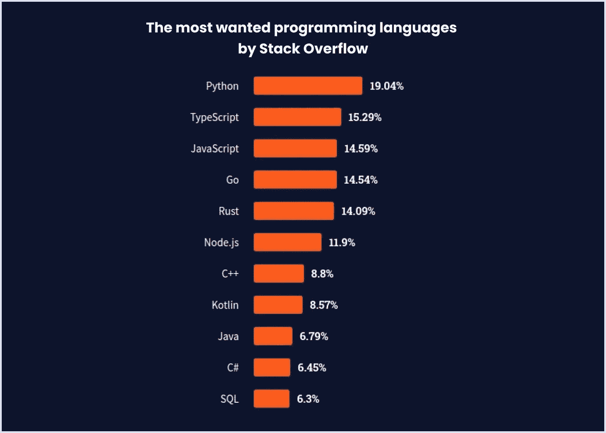
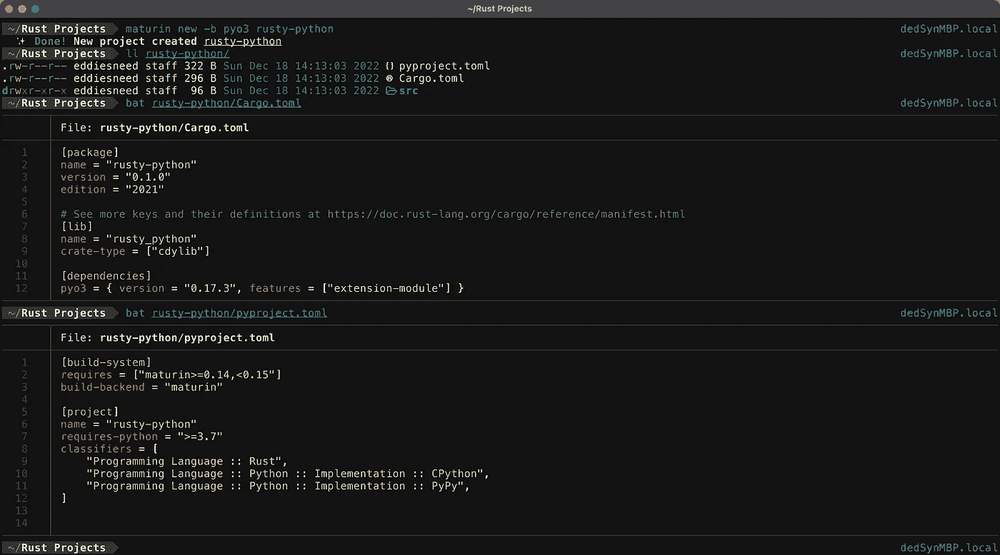
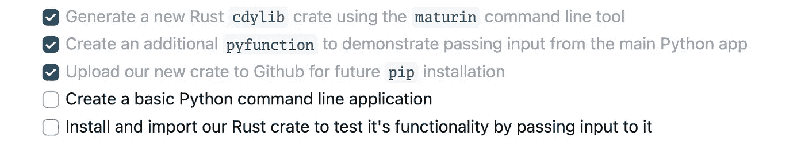
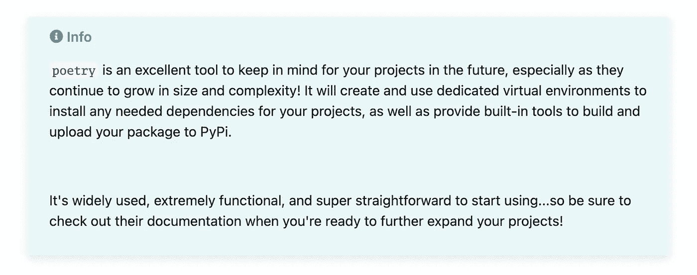
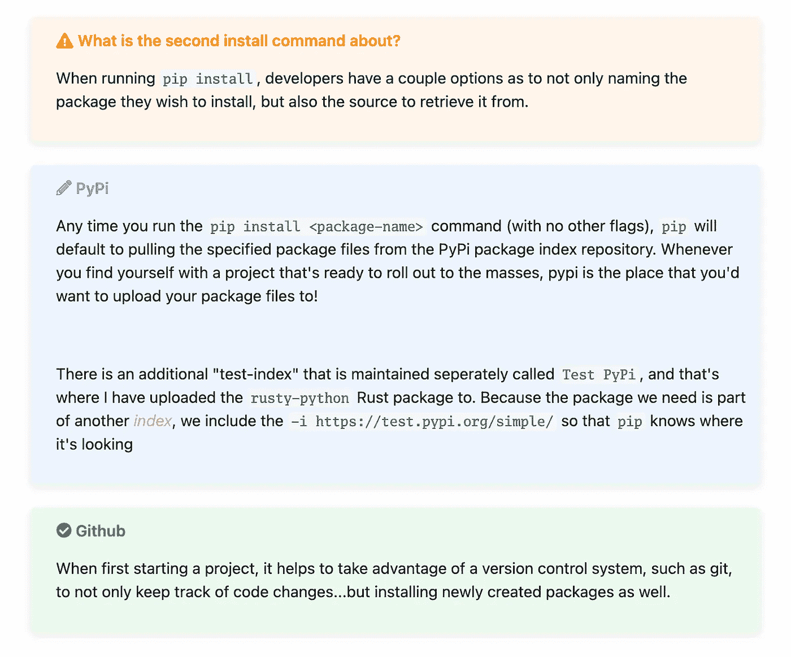
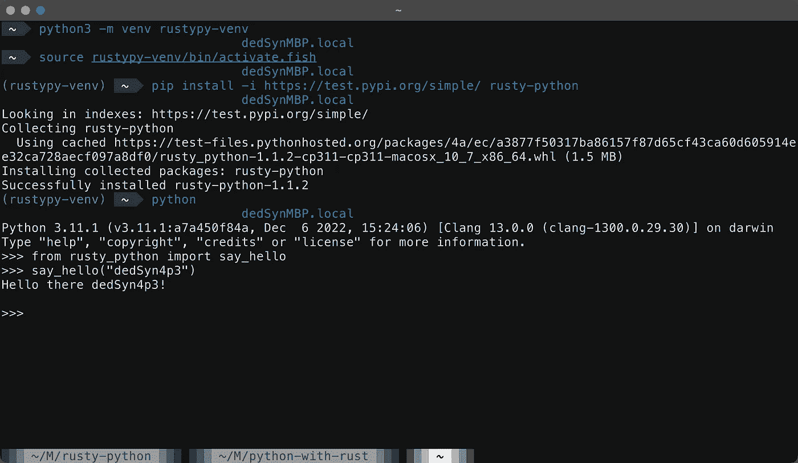

# 用 Rust 改进 Python

> 原文：<https://betterprogramming.pub/improving-python-with-rust-ed12bffd2ca4>

## 通过在 Rust 中创建自己的包，为您的 Python 代码增加一点本机速度和内存安全性


詹姆斯·哈里逊在 [Unsplash](https://unsplash.com?utm_source=medium&utm_medium=referral) 上拍摄的照片

Rust，有时被称为 Rustlang，是许多程序员最喜欢和钟爱的语言…尽管事实上它在 Mozilla 的出现仅仅是十年前的事情！

有些读到这里的人可能偶尔会看到一些文章或 YouTube 视频，宣传这种新的、令人难以置信的表演语言，但它到底是什么呢？

> *Rust 是一种静态类型的编程语言，旨在提高性能和安全性，尤其是安全并发和内存管理。它的语法类似于 c++……因为 Rust 没有持续运行的垃圾收集器，它的项目可以通过外部函数接口被其他编程语言用作库。这是现有项目的理想场景，在现有项目中，确保高性能同时维护内存安全至关重要*

更令人印象深刻的是，根据 Stack Overflow 民意调查，Rust 连续六年保持了"*最受社区欢迎的*"语言！

# 永恒的最爱

另一方面，Python 在过去几年中一直保持在搜索次数最多的语言的前三名。虽然有些人坚持认为 Python 有点被高估了，也许不应该在顶级排名中，但我(以及无数其他人)认为它绝对应该有这样的地位！

下面的图表来自另一个堆栈溢出民意调查，它只是几个显示类似趋势的图表之一，概述了 Python 的持续流行:



民调依然强劲！

# 挥之不去的问题

因此，我们已经确定 Python 是一种非常受欢迎且(仍在)增长的语言，但这就是故事的全部吗？不，不尽然…尽管 Python 3.11 的最新版本给这种语言带来了显著的速度提升(而且是显著的！)，房间里还有一头巨大的大象，许多经验丰富的程序员在解释为什么他们不只用 Python 写所有东西时会指出:*这是一种解释语言，往往缺乏大量、低级的性能能力。*

然而，作为一种解释型语言，*无论如何也不会让它变坏！*Python 作为一种真正受欢迎的、易于使用的语言继续保持其统治地位是有原因的(嗯，有几个原因)。

但问题是，因为它是一种解释语言，所以在运行时必须通过目标系统上的`just in time`编译器来运行。这使得它的效率略低于其他语言，如 Rust、Go 和 C/C++，这些语言都编译成本机代码二进制，系统可以立即运行*而不需要*中间程序。

# 切实可行的解决办法

我敢肯定，你们中的许多人，包括我自己，都希望利用 Python 提供的出色的可读性、灵活性和包容量……同时在需要执行密集的低级任务时实现 Rust 提供的更高的性能提升。想要鱼与熊掌兼得并没有错！毕竟，如果你连蛋糕都吃不下，那吃蛋糕又有什么意义呢？！

正如所发生的那样，有一个很好的选择可以让我们实现这两个目标！

在本文的剩余部分，我们将看到一个名为`pyo3`的优秀包，它允许我们使用 Rust 编写和发布自己的 Python 包。之后，我们可以使用`pip` *将它们安装并导入到我们的 Python 项目中，就像我们对任何其他模块所做的那样*...很简单！

像这样的项目的现实需求可能来自许多不同的场景:

*   您有一个团队，他们在创建基于 Python 的命令行应用程序方面更加熟练，但是需要合并一些密集的 I/O 任务，这些任务需要更高效、更低级的语言(如 Rust)来实现
*   您已经使用 Python 开发了一个项目，但是希望将来的代码添加用 Rust 编写，以便利用它的性能和资源安全性
*   Python 的*直截了当的语法*和大量第三方*包*使其成为构建终端应用程序的绝佳选择……结合一些针对低级任务的本地 Rust 代码，您就拥有了一个可供您使用的框架！

不管您需要这样的混合项目结构的原因是什么，目标都是一样的:

> 将这两种语言的精华结合在一起，创建出高性能、内存安全、外观漂亮的程序。

在将这个小项目的各个部分放在一起之后，如果您想要或需要使用 Rust 来改进基于 Python 的应用程序，您应该对可用的可能性有一个相当好的理解！

# 入门指南

我们将在这里创建的整个项目将由两个子部分组成:

*   由我们的 Python 应用程序将导入和调用的测试函数组成的 Rust crate(第 1 部分)
*   一个 Python 应用程序，它将作为我们命令行界面的主要基础(第 2 部分)

从表面上看，这似乎需要做很多工作，但实际上，开发和扩展起来都相对简单明了。

如果您想下载项目这一部分的示例代码，请在 GitHub 上访问并克隆它的 repo！

[](https://github.com/dedSyn4ps3/rusty-python) [## GitHub - dedSyn4ps3/rusty-python

### 这个机箱是为了测试 python-with-rust 命令行应用程序而编写的，而这个项目绝不是…

github.com](https://github.com/dedSyn4ps3/rusty-python) 

# 建造我们的锈箱

首先，如果你还没有安装 Rust 和它的软件包管理器，你可能想尽快安装。

*   在 Unix 上，在您的 shell 中运行`curl https://sh.rustup.rs -sSf | sh`。这将下载并运行`[rustup-init.sh](https://static.rust-lang.org/rustup/rustup-init.sh)`，它将依次下载并运行适用于您的平台的正确版本的`rustup-init`可执行文件。
*   在 Windows 上，下载并运行`[rustup-init.exe](https://static.rust-lang.org/rustup/dist/i686-pc-windows-gnu/rustup-init.exe)`

为了给我们的新板条箱打基础，我们将使用两个重要的工具，`pyo3`和`maturin`...后者将允许我们轻松地生成导出 Rust 代码以用于 Python 所需的框架。安装最后这些要求非常简单，根据您的操作系统，可以通过以下方式实现:

*   macOS 用户可以通过运行`brew install maturin`使用自制软件进行安装
*   所有人都可以选择使用`pip install maturin`进行全局安装
*   推荐的方法是使用`pipx`在隔离的虚拟环境中安装`maturin`

解决了这个问题后，继续前进并导航到您想要创建项目的位置，然后使用您喜欢的 shell 运行以下命令:

```
maturin new -b pyo3 rusty-python && cd rusty-python
```

这将生成我们的基本项目结构，包括必要的`Cargo.toml`文件，我们将向其中添加我们需要的依赖项，以及一个`pyproject.toml`文件 Python 将在适当的时候使用它来构建和安装我们的包。`-b pyo3`标志告诉`maturin`我们将使用那个框架来创建我们的新模块。



我们的新项目

# 积木

你会注意到`maturin`也为我们创建了一个`src/lib.rs`文件。这是我们板条箱的所有代码和功能将驻留的地方。

它已经包含了一些简单的样板文件，展示了我们如何创建函数导出供 Python 应用程序使用:

```
use pyo3::prelude::*;

/// Formats the sum of two numbers as string.
#[pyfunction]
fn sum_as_string(a: usize, b: usize) -> PyResult<String> {
 Ok((a + b).to_string())
}

/// A Python module implemented in Rust.
#[pymodule]
fn rusty_python(_py: Python, m: &PyModule) -> PyResult<()> {
 m.add_function(wrap_pyfunction!(sum_as_string, m)?)?;
 Ok(())
}
```

我们的 crate 由不同的函数定义组成，这些函数定义用`pyfunction`属性进行了注释。为了使用这些函数，我们定义另一个用`pymodule`属性注释的函数体，然后使用`add_function`实现`pyfunction(s)`:

```
/// Says hello.
#[pyfunction]
fn say_hello(name: &str) {
 println!("Hello there {name}!");
}

/// Runs several test loops
#[pyfunction]
fn run_loops() {
 logger::info("Running test loops...");
 let mut _count: u32 = 0;  
 for _ in 0..1000 {
  for _ in 0..100 {
   _count += 1;
  }
 } 
 print!("\n");
 logger::debug("Process Finished");
}

#[pymodule]
fn rusty_python(_py: Python, m: &PyModule) -> PyResult<()> {
 m.add_function(wrap_pyfunction!(sum_as_string, m)?)?;
 m.add_function(wrap_pyfunction!(say_hello, m)?)?;
 m.add_function(wrap_pyfunction!(run_loops, m)?)?;
 Ok(())
}
```

样板文件本身为我们提供了一个用 Python 进行测试的工作解决方案，但是出于演示的目的，我们将继续创建一个额外的`pyfunction`,它使用一些提供的输入来打印 Hello 消息。你可以在上面的*代码信息*中看到如何做这件事:

*   使用`pyfunction`属性声明两个新函数
*   将新创建的`pyfunctions`添加到我们的`rusty-python`模块中

# 上传我们的板条箱

为了方便地安装我们的新 Rust crate 并将其导入到未来的 Python 项目中，我们必须将它上传到一个版本控制系统，如`Github`或`Gitlab`(或任何其他您可能使用的服务)。

对于那些不熟悉创建存储库并将我们的代码推送到存储库的过程的人来说，这里有一个简短的纲要:

*   登录到您的 GitHub/Gitlab 帐户，创建一个新的空存储库
*   切换回您的终端，从项目目录的根目录运行`git init`
*   初始化完成后，您需要将它链接到您的远程存储库，这样您就可以将所有新的更改推送给它。只需运行以下命令:

```
git remote add origin https://github.com/<username>/<repo-name>.git
git branch -M main
git add .
git commit -m "First Commit"
git push -u origin main
```

简单回顾一下，下面是我们需要为 Rust-Python 混合应用程序准备的内容:



如果您想继续了解项目这一部分的代码，请访问 GitHub repo 并克隆它！

[](https://github.com/dedSyn4ps3/python-with-rust) [## GitHub-dedsyn 4 PS 3/python-with-rust

### 虽然这是一个非常简单的例子，但这个应用程序是为用 rusty-python 测试箱进行测试而编写的…

github.com](https://github.com/dedSyn4ps3/python-with-rust) 

# 构建我们的 Python 应用

现在是时候完成我们项目的最后一站了！如果你现在还没有注意到，我们需要安装 Python 来完成工作！

*   对于 Linux 用户，只需打开终端，运行`sudo pacman install python3`、`sudo apt install -y python3`等。这取决于您的软件包管理员。您的系统应该已经安装了 Python，但是我强烈建议至少安装`v3.8+`(最好安装`3.11`，这样会快很多)。
*   在 Windows 和 macOS 上，您可以从 python.org 下载安装程序可执行文件

为了把这个小例子放在一起，我们将只使用少数几个包来提供一个可以扩展并用于其他项目的工作代码库。



# 积木

为 Python 应用程序创建一个新的项目文件夹，并创建几个示例文件进行测试:

```
├── api
│   ├── __init__.py
│   └── update.py
└── cmd.py
```

`api`模块目录只包含几个函数，我们可以在主命令行应用程序中使用它们来模拟典型的应用程序导入:

```
import time
from rich.progress import track

def checkVersion(name):
 version = "1.0.0"
 getUpdate(f"Fetching current version for {name}...")
 print(f"\n[+] All Good! You're using the most recent of {name} --> {version}\n")

def getUpdate(description):
 for i in track(range(100), description=description):
  time.sleep(.1) # Simulate work being done
```

如果您注意到引用了`rich`的 import 语句，并且不熟悉这个库，[请查看一下！](https://github.com/Textualize/rich)我一直喜欢将 Python 终端应用程序放在一起的最大原因之一是因为它为寻求创造伟大事物的开发人员提供了大量的灵活性和库选项！

主`cmd.py`文件是我们命令行应用程序的逻辑所在之处:

```
#!/usr/bin/env python
import argparse
from api import update
import rusty_python as rp

d = """
API test application using a combination
of pure Python functions and additional
helper modules written in Rust.
This application uses several Python libraries to
create a colorful commandline app with example
functionality implemented in Rust
"""

def cli():
 parser = argparse.ArgumentParser(
  description=d
 )

 parser.add_argument(
  "-n", "--app-name",
  action="store",
  required=False,
  help="App name to use for update download simulation"
 )

 parser.add_argument(
  "-l", "--loop",
  action="store_true",
  required=False,
  help="Run some test loops!. Uses `run_loops` implemented in Rust"
  )

 parser.add_argument(
  "-r", "--rust-arg",
  action="store",
  required=False,
  help="""
  Tell us your name! This `string` value gets passed
  to the `say_hello` function implemented in Rust. The function also runs
  multiple `async` requests
  """
 )

 args = parser.parse_args()

 if args:
  if args.app_name:
   update.checkVersion(args.app_name)
  if args.loop:
   rp.run_loops()
  if args.rust_arg:
   rp.say_hello(args.rust_arg)
   rp.begin_request_test()
 else:
  parser.print_usage()  

if __name__ == '__main__':
 cli()
```

# 快速分解

尽管上面的代码非常简单，但是随着项目复杂性和规模的增加，它与您将在未来项目中使用的结构类型完全相同。组装`CLI`应用程序时，设计遵循相同的标准指南:

*   安装并导入`argparse`库，以便在程序执行期间定义和读取输入参数
*   定义我们的主`cli`函数来处理所有的程序逻辑
*   创建并实例化一个新的`parser`对象，并定义应用程序将接受的不同标志和参数

# 把所有的放在一起

现在终于到了测试这个项目并利用我们在 Rust 上一篇文章中实现的定制包的时候了！然而，在您跳到前面运行`cmd.py`之前，请记住导入到我们的应用程序中的几个模块不能立即供 Python 使用！

请记住，我们包含了`rich`库，以帮助我们的应用程序看起来更好，并随着项目的扩大提供额外的功能。我们还添加了 import 语句，允许我们从 Rust 中实现的包中调用函数。

为了把最后的部分放好，我们只需要运行几个`pip`命令来安装缺失的依赖项:

```
$ pip install rich
$ pip install -i https://test.pypi.org/simple/ rusty-python
```



安装完最后的依赖项后，我们终于可以运行新的小命令行应用程序并测试一些东西了！与大多数 CLI 应用程序一样，除了`-h`或`— help`之外，在没有任何参数的情况下开始运行代码通常是一个好主意，以验证我们的使用信息是否为我们的用户打印出来:



到目前为止一切顺利！之后，我们可以通过向应用程序传递参数来测试常规的 Python 函数… *，然后对来自 Rust 包*的函数做同样的事情。如果一切顺利，不应该有任何意外的错误或崩溃…输出应该就像任何其他正常的函数调用。

# 包裹

在经历了各种步骤之后，达到这一步可能看起来有点乏味，但实际上，您已经成功地将 Rust 中实现的功能整合到 Python 应用程序中，并在其中使用它……从这一点开始，您的选择几乎是无限的！