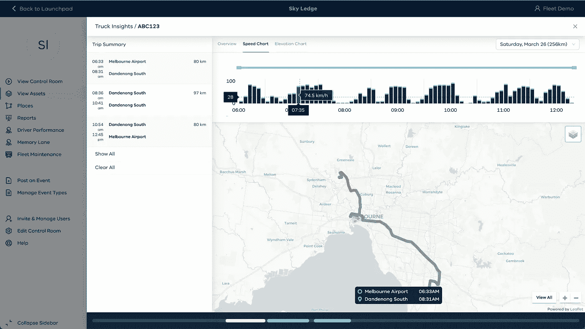
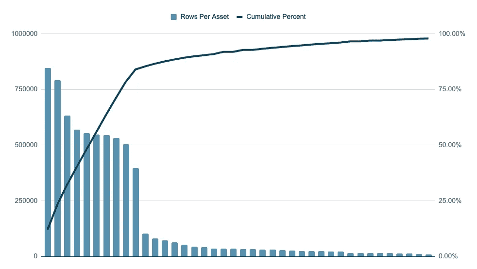
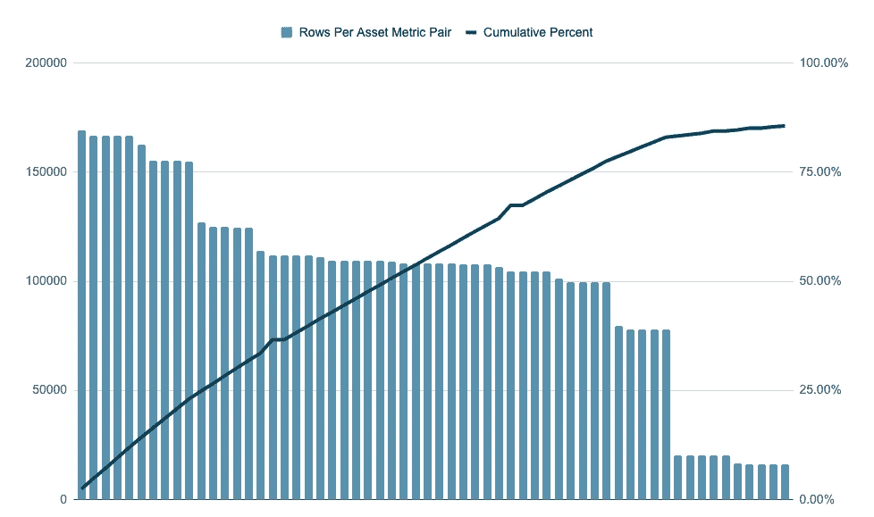
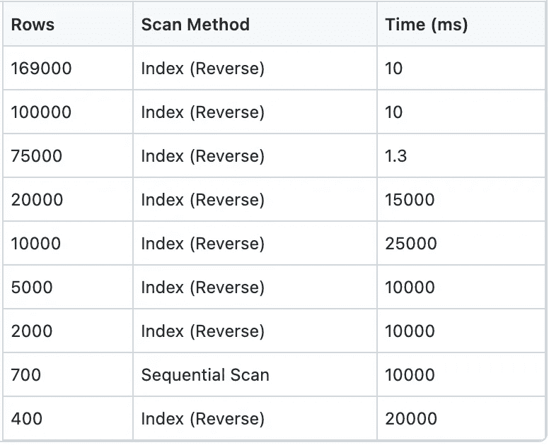
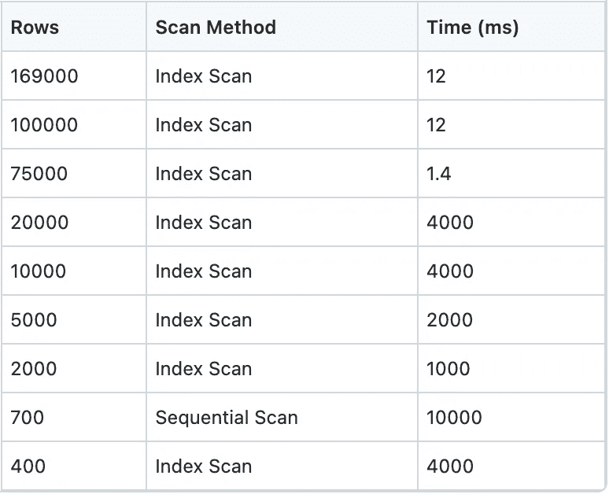
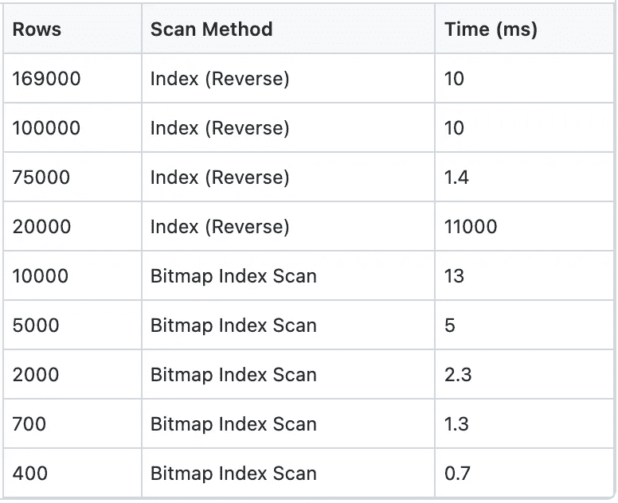
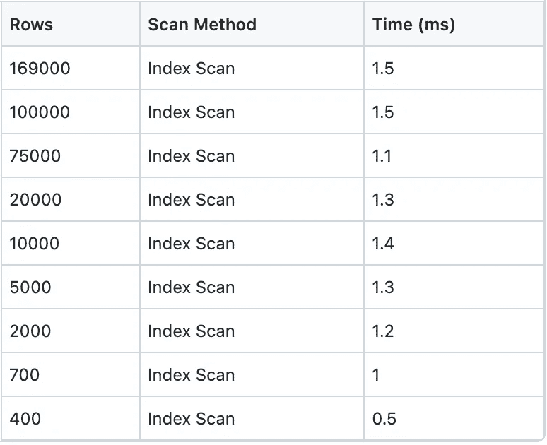

# 将查询性能提高 10000 倍

> 原文：<https://betterprogramming.pub/improving-query-performance-by-10000x-79b84c80fbaf>

## 提高系统速度


照片由[你好我是尼克](https://unsplash.com/@helloimnik?utm_source=medium&utm_medium=referral)在 [Unsplash](https://unsplash.com?utm_source=medium&utm_medium=referral)

注意到当系统中的数据越来越多时，您的应用程序变慢了吗？你并不孤单。虽然我们都听说过关于过早优化的警告，但在某些时候，您将需要花一些时间来研究如何提高系统的性能。

我们最近在 Sky Ledge 遇到了这样的情况。在我们的暂存环境中，一个检索时间序列数据的简单查询花费了 30 秒。这些是对感兴趣的列进行索引的简单查询。我们希望这些请求能在<1 second, not 30 seconds.

We pride ourselves on a good user experience. Waiting 30 seconds for a graph to render makes for very poor UX, so it was time for sleuthing and database optimization.

# The Problem

## Context

[中完成，Sky Ledge](https://skyledge.com) 是一个平台，可以帮助用户快速创建控制室体验，以深入了解他们的操作。

Sky Ledge 的基础部分之一是我们的资产 API，它使跟踪和可视化真实世界中对象的数据变得非常容易。资产是天空中代表真实世界对象(例如车辆)的实体。指标是与资产相关的数据流。度量的例子有速度、高度、温度等。每个指标都使用相关的时间戳跟踪资产的单个值。



活动中的天空壁架

我们的指标数据库如下所示(我们使用 AWS RDS，运行 Postgres):

```
create table asset_metric
(
  asset_id.     uuid not null,
  metric_name   text,
  timestamp     timestamptz,
  value         double precision
);
```

我们在`asset_metric`表上也有一个索引:

```
create index on asset_metric (timestamp, asset_id, name);
```

## 问题是

当我在我们的试运行环境中为一个客户创建演示时，出现了这个问题。作为演示的一部分，我在 Sky Ledge 平台中显示了资产的温度数据。

为了检索温度数据，我们对数据库进行以下查询:

```
select * from asset_metric
where 
asset_id = 'abc123' and metric_name = 'speed'
order by timestamp desc
limit 1000;
```

该查询一直需要 30 多秒才能完成。这是一个简单的查询，我知道我们在这个表上有一个索引。原因还不清楚。

# 调查

## 连接到数据库

第一步是连接到数据库。我们非常重视安全性，因此我们的暂存和生产数据库都被锁定在 AWS 上的一个私人 VPC 中，无法访问公共互联网。

我设置了一个 SSH 跳转框来连接临时数据库。[关于如何做到这一点的更多细节请参见这里的](https://aws.amazon.com/premiumsupport/knowledge-center/rds-connect-using-bastion-host-linux/)(我不建议将这种方法用于生产数据库)。

## 我们的数据是什么样的？

接下来，我想探究数据分布是否会导致这个问题。我们在试运行阶段进行了其他演示，没有出现任何问题，因此速度下降仅限于特定的资产。

在`asset_metrics`数据库中有 700 万行。虽然不是很小，但我期望比我们看到的更好的性能。700 万行分布在 106 个不同的资产中。还有 710 个资产/度量对(速度、温度、海拔等。).

```
Rows:                     7,050,951  
Unique assets:                  106  
Asset / metric pairs:           710
```

接下来，我运行了几个查询来理解数据分布。84%的数据仅与我们暂存环境中的 10 项资产相关联。数据集非常不准确。



按资产分布数据库行



按资产/指标对分布数据库行

## 测试不同的资产/指标对

我没有在单个资产/指标对上测试查询，而是编译了 9 个资产/指标对的列表。这将给出一个全面性能的良好指示。这些是:

```
+-------+-------------+--------+
| Asset |   Metric    |  Rows  |
+-------+-------------+--------+
|     1 | speed       | 169000 |
|     2 | speed       | 100000 |
|     3 | speed       |  75000 |
|     4 | speed       |  20000 |
|     5 | speed       |  10000 |
|     6 | speed       |   5000 |
|     7 | speed       |   2000 |
|     8 | temperature |    700 |
|     9 | speed       |    400 |
+-------+-------------+--------+
```

从更新非常频繁的指标到更新非常不频繁的指标，我们有一个很好的分布。这将有助于告知问题是全面发生还是仅在特定情况下发生。

## 我如何衡量查询性能

当我通过跳转框连接到数据库时，网络延迟会影响往返查询时间。相反，我使用`explain analyse`来测量数据库执行查询所花费的时间。这允许我直接在数据库中测量性能，而不用担心网络的可变性。

# 结果

## 当前查询

我对九个资产/指标对中的每一个进行了查询，以获得一个基线。



结果令我吃惊。在 9 个案例中的 8 个案例中，查询规划器使用了反向索引扫描。由于所花费的时间，我认为这将是一个连续的扫描。直觉是伟大的，但是确认你的直觉是值得的。我现在知道问题在于指数的性能，而不是浪费时间去探究为什么没有使用指数。

它唯一一次使用顺序扫描是为了温度度量。速度比温度度量快几个数量级，所以这可能是原因。

它已经在使用索引扫描，而且索引扫描很快**，那么为什么除了最频繁的指标之外，其他指标的结果都很慢呢？**

## **取消索引反转**

**第一个观察结果是数据库正在执行反向索引扫描。对于多列索引，向后扫描可能比标准索引扫描要慢(这就是我们所拥有的)。**

**考虑到我们几乎总是查询最新的数据(用`order by timestamp desc`)，用时间戳降序排列索引似乎是合乎逻辑的。所以，我创建了一个新的索引:**

```
create index on asset_metric(timestamp desc, asset_id, metric_name)
```

**并重新运行查询。**

****

**温度指标没有变化(仍然是顺序扫描),但其他地方都有进展！通过改为前向索引扫描，我们大大提高了其他慢速资产/指标对的查询性能…**

**…但还是很可怕。4 秒比 25 秒好，但是对于我们的需求来说还是太慢了。我们都致力于为我们的客户建立良好的体验，而不得不为一个简单的图形加载等待几秒钟不是这样。**

## **简化索引**

**也许索引太复杂，给查询规划器带来了问题？我通过创建一个新的索引来测试这个假设，只使用了指标名称和资产 id:**

```
create index on asset_metric (metric_name, asset_id)
```

**我认为这将使找到每个资产/指标对的相关数据变得容易。**

****

**果然，结果看起来棒极了！我们从 4 秒钟缩短到不到 10 毫秒，提高了 400 倍！**

**除了一个资产/指标对仍然花费了 11 秒来返回查询。我多次运行该查询，以确保它不是一个奇怪的怪癖，但它始终需要 10 多秒钟。**

**查询规划器仍然使用更频繁的资产/指标对的原始索引(此时我已经删除了未反转的索引，所以我一次只测试一个变量)。**

**对于不太频繁的配对来说，情况并非如此。这里，它使用了位图索引扫描，并结合了原始索引和新索引。**

**有没有一种方法可以消除这种恼人的边缘情况，并获得全面的优异性能？**

## **改进的索引—更改列顺序**

**之前的索引给出了一个重要的线索——通过资产 id 和指标名称搜索不太频繁的对是有益的。**

**多列索引的列顺序重要吗？确实如此。**

**典型的例子是电话簿。就像电话簿先按姓氏排序，然后按名字排序一样。多列索引按第一列、第二列、第三列等排序。**

**就像您不能在电话簿中只通过名字来查找某人一样，您也不能使用多列索引通过第二列或第三列来查找一行。**

**我们总是通过考虑资产 id 和指标名称来寻找指标数据；这些应该是索引中的第一列，这似乎是合乎逻辑的。我创建了以下索引:**

```
create index on asset_metric (metric_name, asset_id, timestamp desc)
```

**这里，我们都改变了列的顺序，以确保索引按照`metric_name`和`asset_id`排序。根据我们之前的结果，我们也将`timestamp`改为下降。让我们看看这是如何执行的:**

****

**不错！全线表现优异。所有查询都在不到两毫秒的时间内持续运行。**

# **结论**

**在最坏的情况下，我们设法将查询速度提高了 15，000 倍！我们上面采取的步骤没有什么革命性的。这是在现实世界中必须进行的数据库优化的典型例子。现代数据库可以处理数量惊人的数据。**

**对数据库工作原理的基本理解会带来很大的不同。对于这个用例，我们的表现在应该能够扩展到数亿行，而不是被 700 万行阻塞。我花了不到 2 个小时就找到了瓶颈并修复了它。只需要对我们的指数做一个简单的调整。**