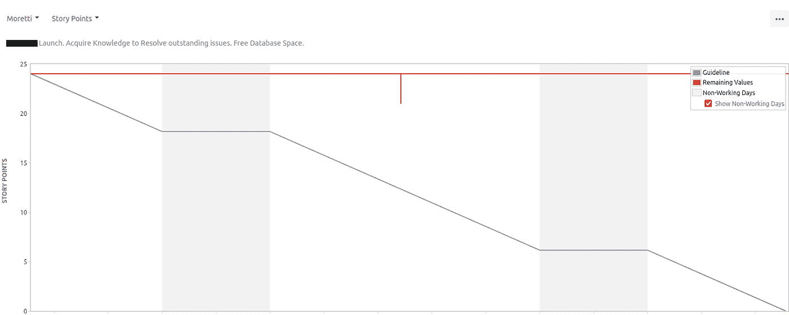
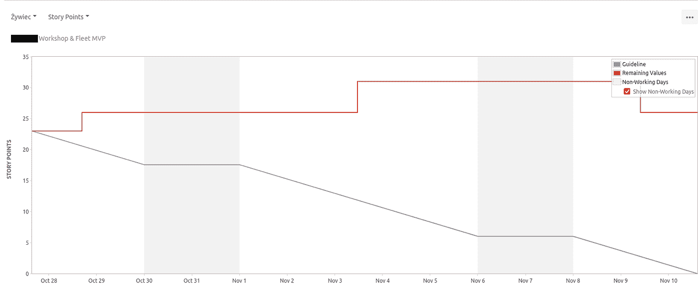
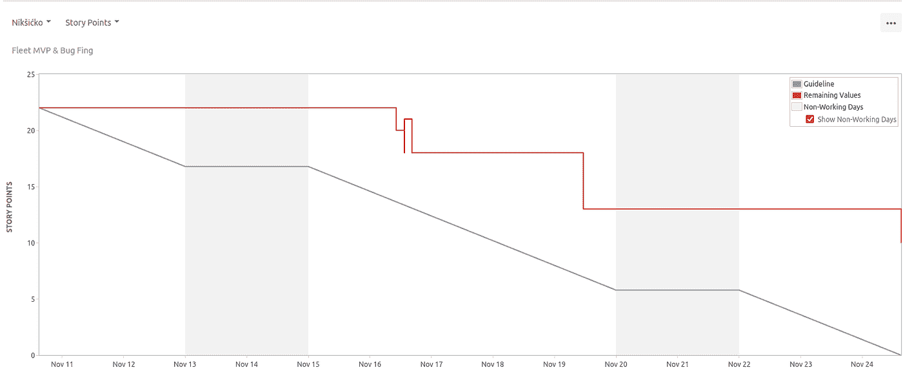
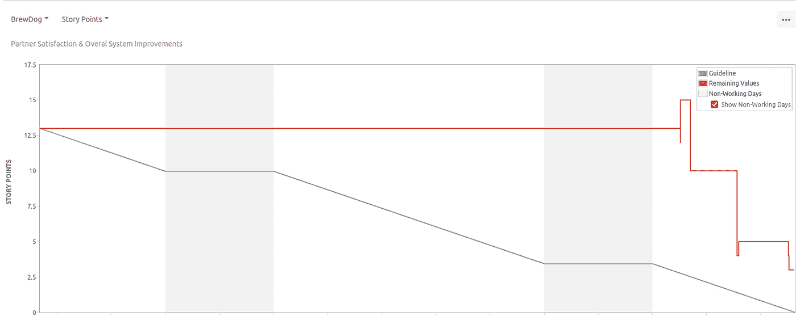
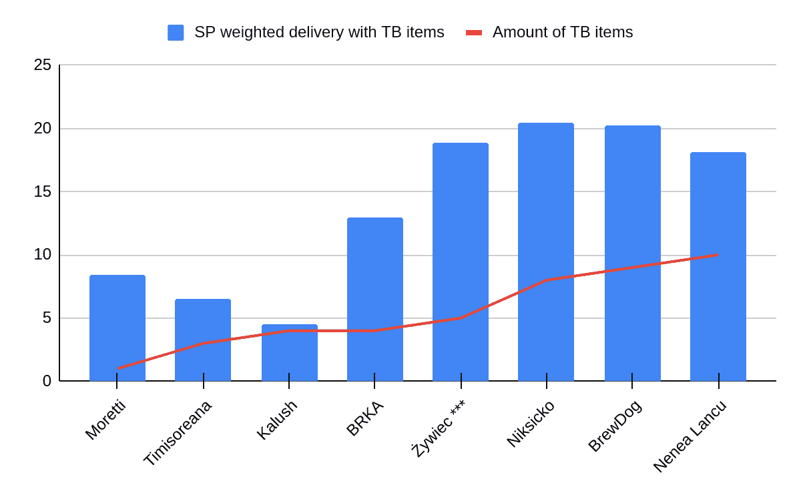
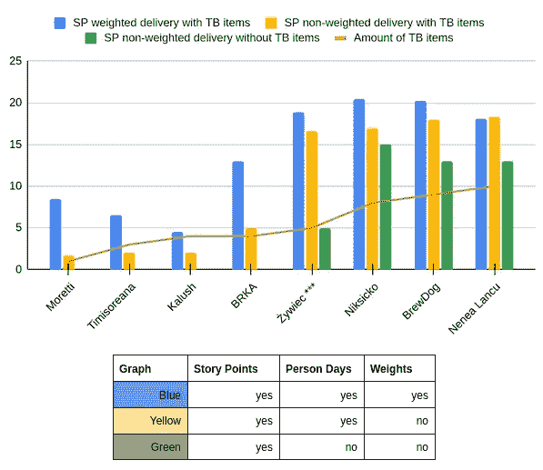

# 提高敏捷 Scrum 中冲刺的可预测性

> 原文：<https://betterprogramming.pub/improving-sprint-predictability-in-agile-scrum-611e2d1081ad>

## 了解敏捷 Scrum 如何提供稳定的结果和可靠的可预测性


[拉拉·阿兹利](https://unsplash.com/@lazizli?utm_source=medium&utm_medium=referral)在 [Unsplash](https://unsplash.com?utm_source=medium&utm_medium=referral) 上的照片

# 介绍

在“[揭秘 t 恤尺寸项目估算](https://medium.com/@bchmura/demystifying-t-shirt-size-estimations-6484d92ebe61?source=your_stories_page----------------------------------------)”中提到的框架成功应用后，我们在另一个团队中使用了该方法。经过几次冲刺，团队的冲刺可预测性有了相当大的提高。

在前四次冲刺中，团队的平均成绩(每次冲刺的故事点数)是 0/8/20——完全交付、部分交付、承诺交付。

是的。你没看错**。**四次冲刺，什么都没有完成，总的来说，门票还不到一半。

在接下来的四次冲刺中，团队改进以实现:11/19/18——完全交付，部分交付，承诺。而在最后两次冲刺中，服务点的承诺量和完全交付量完全匹配。

团队不仅实现了他们承诺的目标。他们交付了更多。

这篇文章描述了我们在几个为期两周的冲刺过程中的一些考虑和观察到的总体进展。

# 说服我继续读下去

如果一张图片的字数超过 1000 字，那么这里有 4000 多字可以说服你花几分钟来阅读:

在与团队讨论变更之前，示例 sprint 燃尽图:



燃尽图示例—sprint“more tti”



燃尽图示例—sprint“żywiec”

在我们讨论了变化之后的第一次 sprint 中的示例 sprint 燃尽图:



示例烧毁图表—sprint“Nik sicko”



燃尽图示例—sprint“brew dog”

# 怎么，什么，为什么？

就个人而言——写这篇文章感觉很奇怪，因为一些发现和经历似乎来自“显而易见队长”迷因。

显而易见的事情，人们甚至不需要解释。但是，它们确实发生了。人们可能知道原理，但仍然面临困难，他们可能看不到更好的解决方案。

这不是第一次，也不是最后一次。我们决定分享我们的见解，因为你可能会认识到你正在努力应对的一些情况和问题，也许你会看到一些更好的方法，至少，你会有一些论据，可以用来解释为什么不以某种方式做事。

让我们深入研究这些问题和建议的解决方案。

## 为什么

我们对提高团队承诺的可靠性感兴趣。在几次冲刺之后，团队没有交付承诺的东西，合作的业务团队由于缺乏可预测性而变得越来越沮丧，紧张的气氛越来越浓。事情需要改变。

## 什么

团队已经对 Scrum 有了很好的理解。仪式已经安排妥当，人们也相应地出席了。这些故事正在被计划、提炼和评估。该团队希望交付这些项目，并致力于这些项目。齿轮和传动装置都在那里，显然是按照计划制作的。然而，不知何故，在说了这么多，做了这么多之后——这一切并没有像它应该的那样一起工作。

这个问题由几个部分组成，所有这些部分都相互交织在一起:

*   在这次冲刺中，团队期望交付多少故事点？
*   冲刺阶段应该带多少张票(哪种票)？
*   团队应该如何计算速度？
*   如何处理带时间框的物品？
*   如何报告结果？
*   没吃完的票怎么算？
*   如何处理 sprint 期间进来的“紧急”项目——sprint 的范围应该改变吗？
*   如何处理估算不准确的问题？

基本的 Scrum 原则描述了这些主题的处理。然而，根据与同事们就他们过去和现在的经历进行的讨论，这些原则似乎在相当多的情况下没有得到成功的应用。

一个简单的例子是“无评估”支持者的运动([见这里的视频示例](https://www.youtube.com/watch?v=QVBlnCTu9Ms&t=905s))。本文并不打算具体支持或反对评估——其目的是展示如何使用它们以便它们能够工作。

在与同事的讨论中，一些有趣的评论反映了应用 Scrum 的问题，比如:

> “H *aving 成功了……与敏捷和 Scrum 相处的这些年教会了我一件事——它从来没有真正成功过。这不是一门精确的科学。*

先把重点放在这一条评论上。因为事实是——敏捷 Scrum 可以像我们希望的那样成为“精确的科学”。

## 怎么

那么，怎样才能让 Scrum 成为“一门精确的科学”呢？首先，Scrum 实际上和科学有什么共同之处？

让我们比较一下 Scrum 和科学的核心原则是如何重叠的:

*   Scrum: [“以持续改进为中心，这是敏捷的核心原则”](https://www.atlassian.com/agile/scrum)
*   科学方法:科学方法是一个迭代的、循环的过程，通过这个过程信息被不断地修正。人们普遍认为，通过以下要素以不同的组合或贡献来发展知识进步……

简而言之，人们可以假设敏捷 Scrum 只是在 IT 项目管理中应用科学方法的一种方式。

一个人如何应用科学方法？

1.  做一个假设，
2.  预测结果，
3.  测试结果，
4.  分析结果并改进假设，
5.  重复这个过程，直到达到期望的结果(理解水平/准确度)。

听起来很像 Scrum 循环，不是吗？

主要区别在于优化的是什么。

# 谈正事

那我们就把手弄脏吧。让我们阐明几个假设。其中一些我们将用作基础——未被证明并且被认为是真实的(公理)——但是，为了清楚我们还没有证明它们，我们将把它们列为假设。

我知道，这听起来可能很无聊。然而，这是一个值得做的练习——首先说一下预期会发生什么。人们认为事物是如何工作的？
之后我们会看到这有多少被证明是真的…

## 第一个假设:

> "*通过应用基于科学方法的一致框架，可以提高短跑成绩。*

幸运的是，我们之前已经和另一个团队测试过这个假设。结果在博客文章“[揭秘敏捷 t 恤尺寸](https://medium.com/@bchmura/demystifying-t-shirt-size-estimations-6484d92ebe61?source=your_stories_page----------------------------------------)”中进行了描述。这使得说服第二队的任务变得容易多了。

## 假设(公理)

> 花费在高不确定性项目上的努力，如峰值和 bug，应该有时间限制。”

我们决定将获取必要信息的努力限制在一两个人日(PDs)内。

一旦有时间限制的工作“耗尽”，团队决定获得的知识是否足以估计剩余任务的复杂性。如果仍然不可能——可以采取另一种时间限制的努力(然而，不是以突破 sprint 交付为代价)。不超过几次(比如三次)的尝试被认为是合理的。
显然，所有其他情况都有两个极端:

*   带时间框的项目在时间框期间被解析，并且可以被关闭。
*   无论迭代多少次，有时间限制的项目永远无法解决。

## 假设(公理)

> Scrum 适用于中等不确定性的项目，而看板更适合于大不确定性的项目

如果项目的不确定性太大——主要是尖峰、错误，或者在几次(比如五次)冲刺后评估的质量不稳定——考虑转换到看板。也许这个项目实际上并不在 Scrum 的适用性范围之内？

## 假设

> "*保持清晰的工作流程转换规则有助于改进测量。*

像`In progress ⇒ In review`这样的状态之间的转换必须有明确的条件。

例如——开发人员已经完成了他的分支工作，编写了提供 X%覆盖率的单元测试，主要功能看起来正在工作，等等。这些规则可能相当简单，本身也有待改进。

这里的线索是——**不要伪造信息**——这是因为任何事情都可能基于虚假信息而隐含**([见此处](https://en.wikipedia.org/wiki/Vacuous_truth))。******

> ******事情做好了就做好了。
> **可测试**——可测试时。
> **可审查** —当另一个开发人员只能交付最终润色时。
> **进行中**——当有人实际上正在做的时候。
> **——当某人可以真正开始实施，而不必问一大堆问题。********

******如果受理人因为其任务无法执行而必须将票证返还给前一个受理人，则表明过渡没有以明确的方式进行。这可能会导致进一步的错误——在 sprint 结果中。******

******如果一个人想要一致的、可靠的结果，他必须基于真实可靠的信息。******

## ******假设******

> ******未完成的项目应在冲刺阶段计算，而不是多次冲刺的平均值******

******我们建议使用一个简单的方法，完成百分比随着工作流程的每一步线性增长。比如说:******

```
******To Do** = 0%, 
**In progress** = 25%, 
**In review** = 50%, 
**Testing** = 75%, 
**Done** = 100%.****
```

******这样——即使 sprint 失败了，或者有些项目溢出了——团队仍然可以看到进展。******

******这打破了一个恶性循环，团队成员看不到他们做太多努力的意义，因为 sprint 无论如何都会失败。******

******使用这种方法，信息应该可以从一个 sprint 到另一个 sprint 获得。否则，我们将冒着在几次冲刺中稀释信息的风险。对多次冲刺求平均值将意味着给计算增加不必要的复杂性。******

## ******假设******

> ******"*对后验值的计算更准确。*******

******最初的估计会有很高的误差——团队只是不知道解决方案会有多复杂。改进估计、报告和预测的一个方法是在完成后重新估计问题。******

******它实际上是变相的科学方法:其中*初始估计=预测*，其中*实施和重新估计=测量*。估计值越接近重新估计值，整个过程就越好。自然，人们不应该期望这些值完全一致，有些差异是可以预料的。然而，如果没有改进的迹象——这可能是一个信号，表明项目不在 Scrum 的适用范围内。******

# ******一致的框架******

******为了获得可靠的结果，除了拥有可靠的信息，我们还需要一个可靠的工作方法——一个一致的框架。
再一次，请原谅我重复那些显而易见和基本的东西，但它们是必不可少的。******

1.  ******准备票证，以便清楚地了解它—它的附加值是什么，接受票证完成所需满足的最低标准是什么。******
2.  ******决定使用 t 恤故事大小或故事点(SPs)来估计门票的复杂性。既然我们的团队决定使用 SPs，我们将继续只讨论这些。******
3.  ******使用 sprint-poker 估计票证复杂性。专家投票越多越好。讨论极端结果。这让团队提高了对任务的理解。谁对谁错不重要，消除一些不确定性才重要。******
4.  ******计算团队可用于 SP 核算项目的人-天数量。
    取人数，乘以天数，扣除计划缺勤等。，扣除计划时间框项目的时间。******
5.  ******稳扎稳打，但不要停滞不前。确保在一个小的时间缓冲内计划，比如不超过 10%的能力。只有当燃尽图显示的速度比预期的要快时，才将问题引入冲刺阶段。总的来说，在计划冲刺的时候——宁可少拿一张票，也不要多拿一张。有不可预测的外部因素。如果风险没有出现——把它看作一个机会并利用它，如果风险出现了——那么你已经准备好了。******
6.  ******sprint 之后，重新评估票据的复杂性。这提供了一个反馈回路来改进估计。******
7.  ******使用重新估算的值计算输送速度。******
8.  ******衡量最初计划的和实际交付的服务点之间的差异。这提供了一个反馈回路来提高冲刺能力。******

# ******测量结果******

******下图显示了几次短跑的数据。******

*   ******蓝色的列表示以故事点度量的总交付量，根据描述的线性尺度加权，包括时间范围内的工作。******
*   ******红线描述了给定 sprint 中有时间限制的项目的总量。******
*   ******标有(***)的 sprint 是我们在 sprint 计划期间应用变更的时候。******
*   ******在此期间，团队规模没有变化，只有团队能力出现了典型的波动，如病假等。******

************

******调整方法前后的几次冲刺的交付结果。******

## ******假设验证******

******我们将列出上面张贴的假设。公理将被省略，因为它们被认为是应用方法的基础。******

> ******"*通过应用基于科学方法的一致框架，可以提高短跑成绩。*******

******很容易被上图所示的结果所证实。******

> ******"*保持清晰的工作流转换规则导致度量的改进。*******

******在这一点上，可以推断这个假设是很有道理的。******

> ******"*未完成的项目应该在冲刺阶段计算，
> 而不是在多次冲刺中求平均值*"******

******使用更详细的图表(如下)进行了肯定的验证。该图表比较了交付项目的不同会计方法:******

************

******三种 sprint 交付会计方法的比较。******

******a)反对“绿色”图表的一个显而易见的论点是，团队在前四次冲刺中付出的努力与他们在图表中缺乏可见性之间存在明显差异。******

******b)“蓝色”允许对交付物进行更详细的冲刺阶段进度跟踪。显然，根据 Scrum 原则，所有项目都应该在 sprint 结束时交付，因此“黄色”图应该足够了。然而，不进行冲刺阶段的进度核算可能会引入一个恶性循环，团队永远无法达到这种状态。******

> ******"*对后验值的计算更加准确。*”******

******可以通过观察没有进行重新估计的 sprints 与引入重新估计的 sprint(Nikisicko、BrewDog、Nenea Lancu)之间结果的稳定性来验证。这个论点对我们来说是有意义的，因为如果团队规模没有显著的变化，团队速度也没有显著的变化，那么总的结果应该是稳定的。这也可以作为会计项目“黄色”和“蓝色”方式之间的争论之一。******

******我们希望能让你相信敏捷 Scrum 不仅是一种可行的方法，而且是一种可靠的方法，提供稳定的结果和可靠的可预测性。******