# 使用 SwiftLint 提高 Swift 代码的可读性

> 原文：<https://betterprogramming.pub/improving-swift-code-readability-with-swiftlint-a3459e968c4b>

## 使用 SwiftLint 轻松实施 Swift 代码样式规则


在 [Unsplash](https://unsplash.com?utm_source=medium&utm_medium=referral) 上由 [Clément Falize](https://unsplash.com/@centelm?utm_source=medium&utm_medium=referral) 拍摄的照片

我们应该在[闭包](https://docs.swift.org/swift-book/LanguageGuide/Closures.html)中使用速记参数名吗？还是应该在[闭包](https://docs.swift.org/swift-book/LanguageGuide/Closures.html)声明中声明参数列表？

```
let evenNumbers = [0, 1, 2, 3, 4, 5, 6].filter { $0 % 2 == 0 }
```

或者

```
let evenNumbers = [0, 1, 2, 3, 4, 5, 6].filter { number in
    number % 2 == 0
}
```

像这样的讨论在从事共同项目的 iOS 开发人员中很常见。用不同的风格编写代码会造成混乱，使代码更难阅读。开发人员通常会遵循并坚持一套代码风格指南，以试图保持一致的代码风格。Raywenderlich 的 swift 代码风格指南是最受欢迎的指南之一。

然而，可以有许多规则。当审查彼此的代码时，很难记住所有这些规则。那么，有没有更好的方法来检查和警告没有被遵循的指导方针呢？是的，当然有！

[SwiftLint](https://github.com/realm/SwiftLint) 是一款 swift 代码风格分析工具，帮助您标记代码中的风格错误。它可以通过将构建标记为失败或在不遵循样式时显示警告来帮助您实施这些样式。

在本教程中，我将向您展示如何设置 [SwiftLint](https://github.com/realm/SwiftLint) ，配置它并在 Xcode 构建过程中使用它。

我想你已经对开发 iOS 应用程序和 Swift 相当熟悉了。

*在撰写本文时，我使用了 Swift 5.5.2 和 Xcode 13.2.1。*

# 入门指南

在本节中，我们将从安装 [SwiftLint](https://github.com/realm/SwiftLint) 开始。然后我们将对它进行配置，告诉它要检查哪些规则。接下来，我们将配置 Xcode 在构建阶段运行 [SwiftLint](https://github.com/realm/SwiftLint) 。最后，我们将学习如何禁用代码片段甚至整个文件的规则。

以下是步骤:

1.  安装[雨燕](https://github.com/realm/SwiftLint)
2.  配置 [SwiftLint](https://github.com/realm/SwiftLint)
3.  在 Xcode 构建过程中运行 [SwiftLint](https://github.com/realm/SwiftLint)
4.  禁用一段代码和整个文件的规则

## 1.安装[雨燕](https://github.com/realm/SwiftLint)

安装 [SwiftLint](https://github.com/realm/SwiftLint) 有多种方式。然而，在本教程中，我们将使用[自制软件](https://brew.sh)来安装 [SwiftLint](https://github.com/realm/SwiftLint) 。

[家酿](https://brew.sh)是一个软件包管理系统。对于 macOS 来说，它是一个非常受欢迎的工具。如果您还没有安装它，那么继续这样做。遵循[家酿](https://brew.sh/)在其网站 [brew.sh](https://brew.sh/) 上的安装说明。


一旦[自制软件](https://brew.sh/)安装完毕，让我们安装 [SwiftLint](https://github.com/realm/SwiftLint) 。在终端中运行以下命令:

```
brew install swiftlint
```

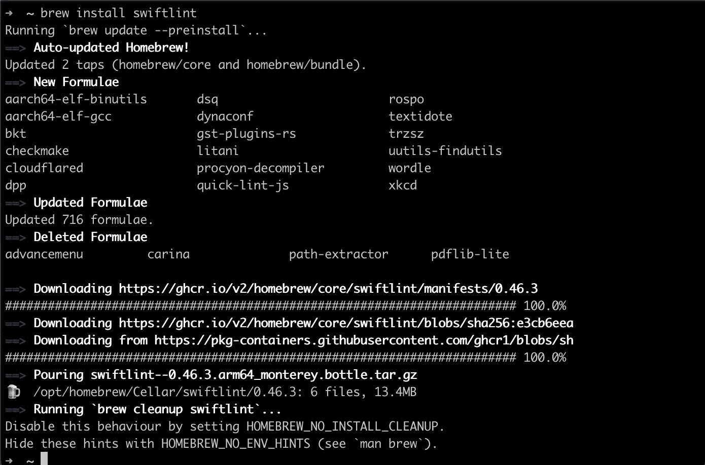

SwiftLint 在终端的安装

您现在可以在终端中运行 [swiftlint](https://github.com/realm/SwiftLint) 。在项目的根目录下，运行以下命令:

```
swiftlint
```

我在我的一个[教程项目](https://github.com/anuragajwani/SaladMaker)中运行了 [swiftlint](https://github.com/realm/SwiftLint) :

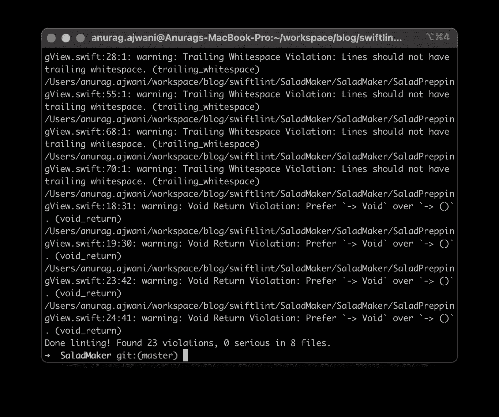

默认情况下， [SwiftLint](https://github.com/realm/SwiftLint) 正在应用 [Raywenderlich 的 Swift 风格指南](https://github.com/raywenderlich/swift-style-guide/blob/master/com.raywenderlich.swiftlint.yml)。但是如果我们想禁用某些规则呢？或者启用未启用的规则？或者甚至从头开始我们的风格指南？

## 2.配置 [SwiftLint](https://github.com/realm/SwiftLint)

为了[配置 swiftlint](https://github.com/realm/SwiftLint#configuration) ，我们必须在项目的根目录下创建一个配置文件。该文件必须命名为`.swiftlint.yml`。 [SwiftLint](https://github.com/realm/SwiftLint) 有一套基于 [RayWenderlich 的 swift 风格指南](https://github.com/raywenderlich/swift-style-guide#using-swiftlint)的默认规则。但是我们可以:

*   禁用规则
*   选择加入非默认规则
*   仅指定要启用的规则(忽略所有默认规则)

让我们看看如何实现它们的例子。

对 [**禁用规则**](https://github.com/realm/SwiftLint#configuration) 将以下内容添加到您的`.swiftlint.yml`:

```
disabled_rules:
- void_return
- trailing_whitespace
- line_length
```

再次运行 [SwiftLint](https://github.com/realm/SwiftLint) 现在不会返回关于 [SaladMaker 项目](https://github.com/anuragajwani/SaladMaker)的错误:

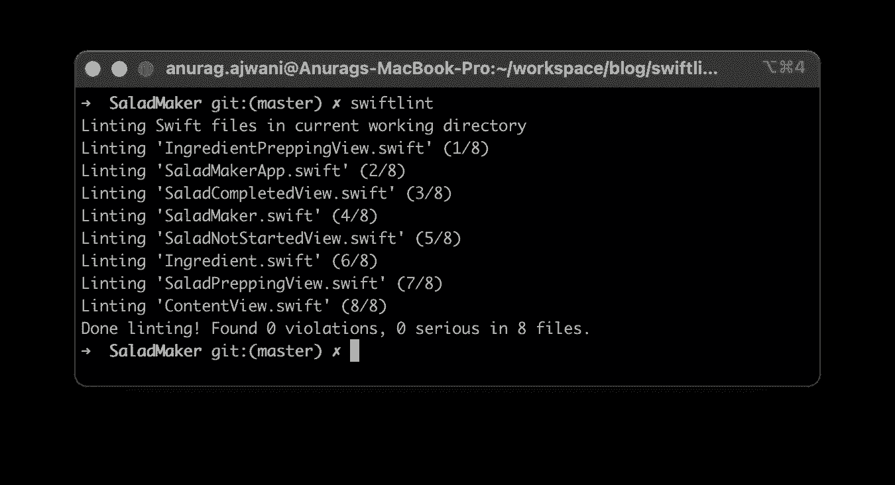

有些规则在 [Raywenderlich Swift 风格指南](https://github.com/raywenderlich/swift-style-guide)中没有规定，但是 [SwiftLint](https://github.com/realm/SwiftLint) 可以检查其他规则。例如，默认情况下 [SwiftLint](https://github.com/realm/SwiftLint) 不会执行隐式退货规则:

```
// Explicit return
var id: String { return UUID().uuidString }
// Implicit return
var id: String { UUID().uuidString }
```

向 [**规则**](https://github.com/realm/SwiftLint#configuration) 中加入以下内容:

```
opt_in_rules:
- implicit_return
```

现在 [SwiftLint](https://github.com/realm/SwiftLint) 将执行隐式退货规则。

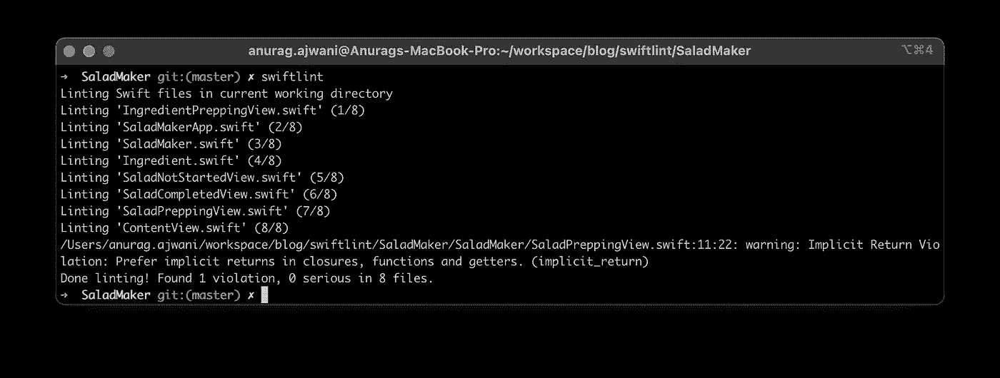

最后，你可以完全忽略 Raywenderlich 的 Swift 风格指南，从头开始创造你自己的风格。

为了[创建您自己的规则](https://github.com/realm/SwiftLint#configuration)删除`.swiftlint.yml`的内容，并替换为以下内容:

```
only_rules:
- implicit_return
```

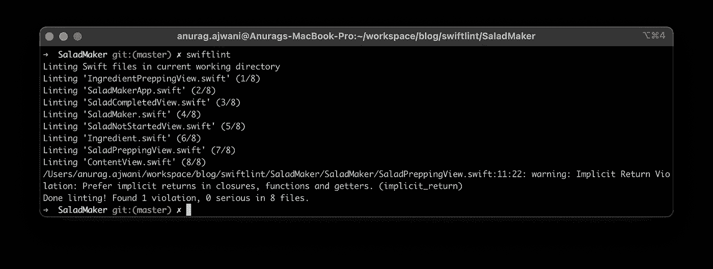

再次运行 [SwiftLint](https://github.com/realm/SwiftLint) 将在本例中产生与之前相同的效果，但是现在 [SwiftLint](https://github.com/realm/SwiftLint) 将不会执行默认设置，只有**会根据我们的配置文件应用`implicit_return`。**

如果您想了解更多关于 [SwiftLint](https://github.com/realm/SwiftLint) 规则以及它们是否被强制执行的信息，请运行以下命令:

```
swiftlint rules
```

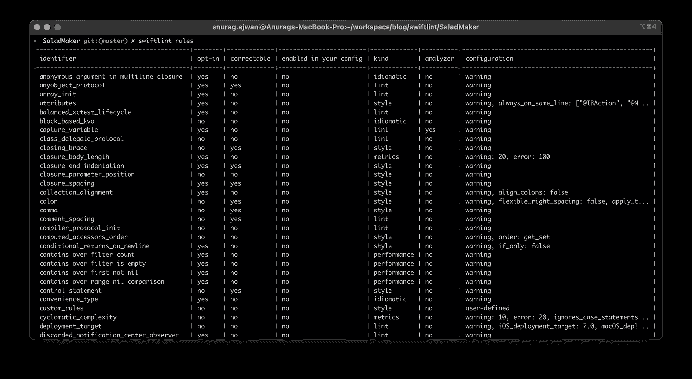

swiftlint 规则命令

## 3.在 Xcode 构建过程中运行 [SwiftLint](https://github.com/realm/SwiftLint)

直到本教程的这一点，我们一直在通过终端运行 [SwiftLint](https://github.com/realm/SwiftLint) 。开发人员必须记住运行`swiftlint`命令。开发人员可能会忘记运行该命令，从而提交代码违反规则的拉请求/合并请求。

为了防止这种情况，我们可以运行 [swiftlint](https://github.com/realm/SwiftLint) 作为 [Xcodebuild 过程](https://github.com/realm/SwiftLint#xcode)的一部分，从而在开发过程中通知开发人员违规情况。

让我们在 Xcode 编译过程中运行`swiftlint`。打开您的项目，导航到您的项目设置，然后选择您的应用目标，最后选择构建阶段选项卡(项目设置>应用目标>构建阶段)

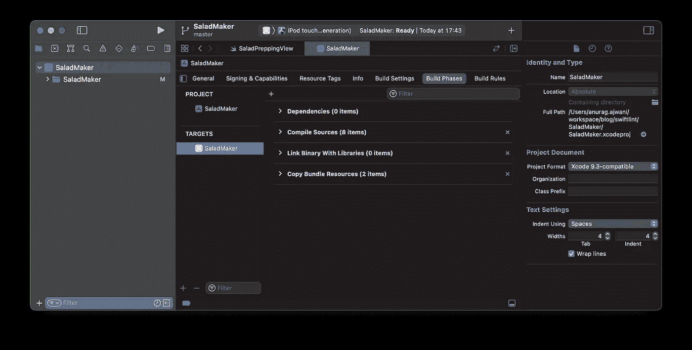

点击“+”按钮，然后选择“新运行脚本阶段”。将运行脚本阶段命名为“Run SwiftLint ”,并粘贴以下代码:

```
export PATH="$PATH:/opt/homebrew/bin"

if which swiftlint >/dev/null; then
  swiftlint
else
  echo "warning: SwiftLint not installed, download from https://github.com/realm/SwiftLint"
fi
```

最后，将“运行 SwiftLint”阶段移到“编译源代码”阶段之后。

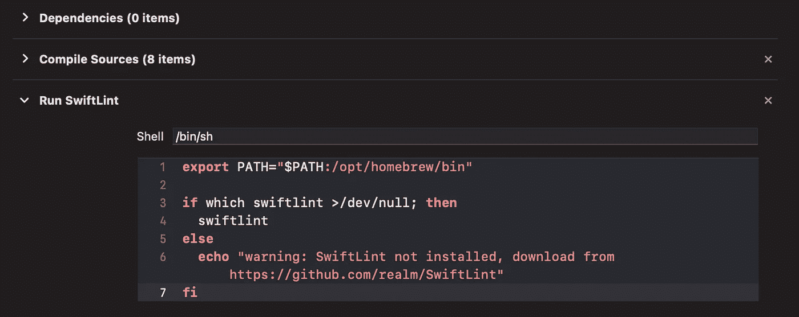

接下来从菜单中选择*产品* > *构建。*

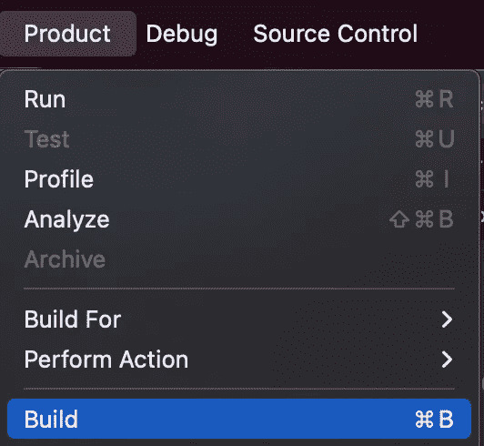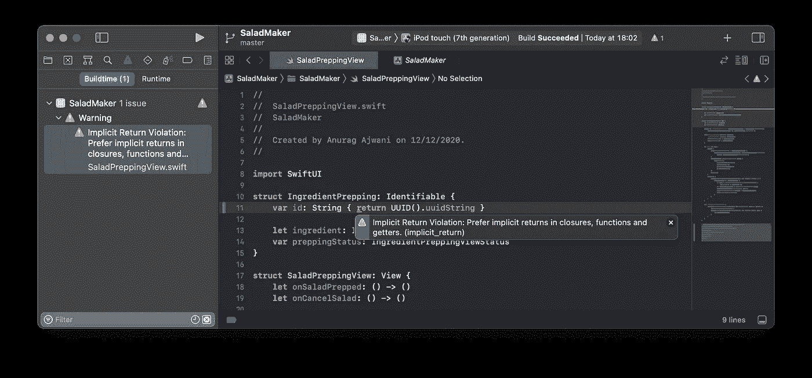

Xcode 会警告开发者任何违反 Xcode 的行为。

## 4.禁用一段代码和整个文件的规则

在某些情况下，我们可能希望在某些行、代码段(即函数)或文件中禁用林挺。对于所有这些场景，我们可以通过在相关代码前添加注释来禁用林挺，如下所示:

```
// swiftlint:disable implicit_return
```

这将禁用该行后面的`implicit_return`规则，直到添加注释重新启用它，或者直到文件结束。要重新启用该规则，我们可以添加以下内容:

```
// swiftlint:enable implicit_return
```

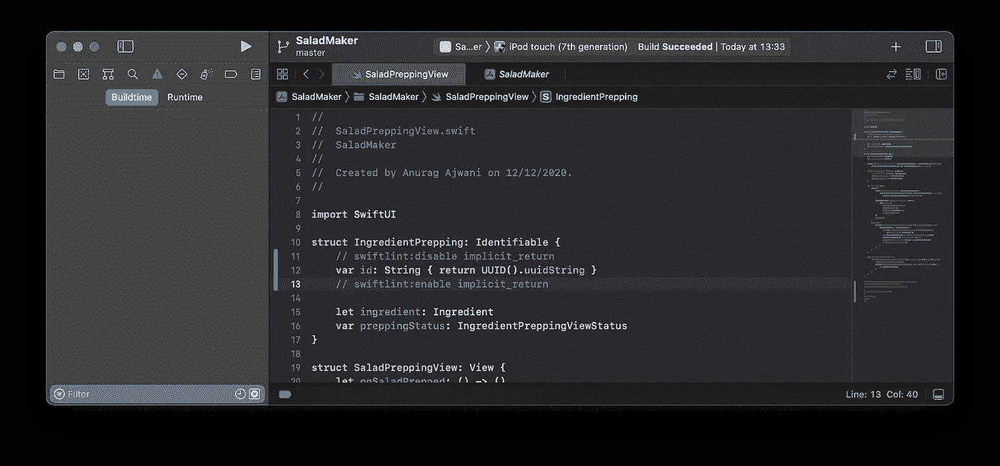

SwiftLint 不再警告隐式返回

我们也可以通过在`.swiftlint.yml`文件中包含以下内容来忽略来自林挺的整个文件:

```
excluded:
- SaladMaker/SaladPreppingView.swift
```

**注意**:排除整个文件或目录会使它们不受所有林挺规则的约束。如果你想禁用某些规则，我建议你使用禁用评论的方法。

# 摘要

在这篇文章中，我们了解到:

*   为什么你应该 lint 你的代码
*   如何设置 [SwiftLint](https://github.com/realm/SwiftLint)
*   如何配置 [SwiftLint](https://github.com/realm/SwiftLint)
*   在 Xcode 中运行 [SwiftLint](https://github.com/realm/SwiftLint)
*   如何在我们需要从规则中豁免某些代码的情况下禁用规则

# 最后的想法

一致的代码样式对于可读性非常重要。然而，在涉及多个开发人员的项目中，维护一致的代码成为一个挑战。在这篇文章中，我介绍了如何在本地使用 [SwiftLint](https://github.com/realm/SwiftLint) 来解决这个问题。也就是在开发过程中通知开发者违规。然而，没有什么能阻止开发人员提交代码。

因此，检查为拉请求或合并请求提交的所有代码是否有任何违规是很重要的。您可以通过在提交代码时自动构建和测试来做到这一点。自动检查提交的代码的实践被称为持续集成。我将在以后的文章中介绍 iOS 的持续集成。

```
**Want to Connect?**For more on iOS development follow me on [Twitter](https://twitter.com/anuragajwani?source=post_page---------------------------).
```