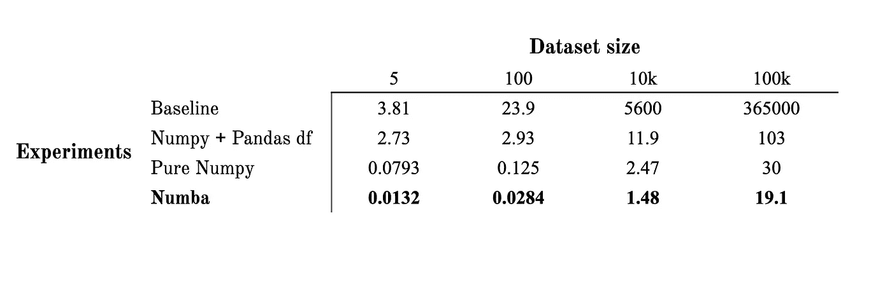
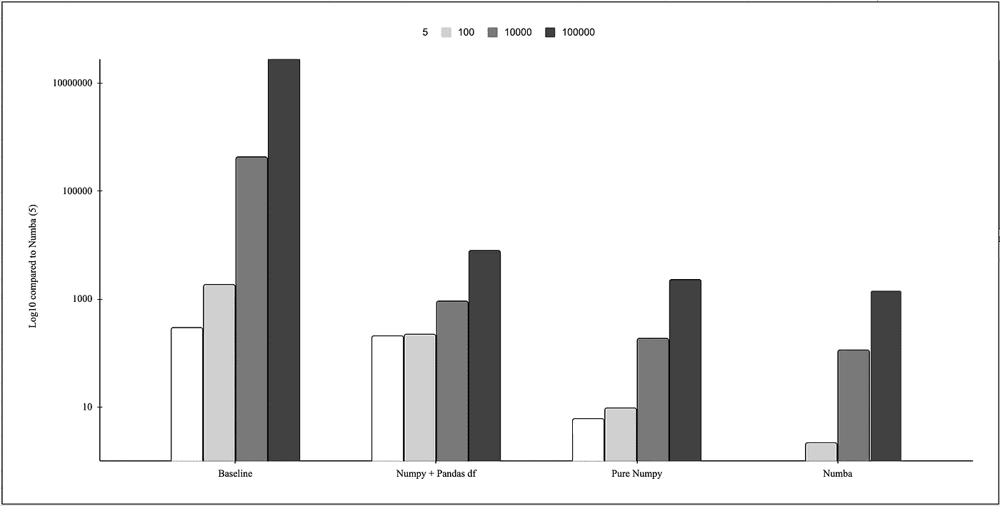
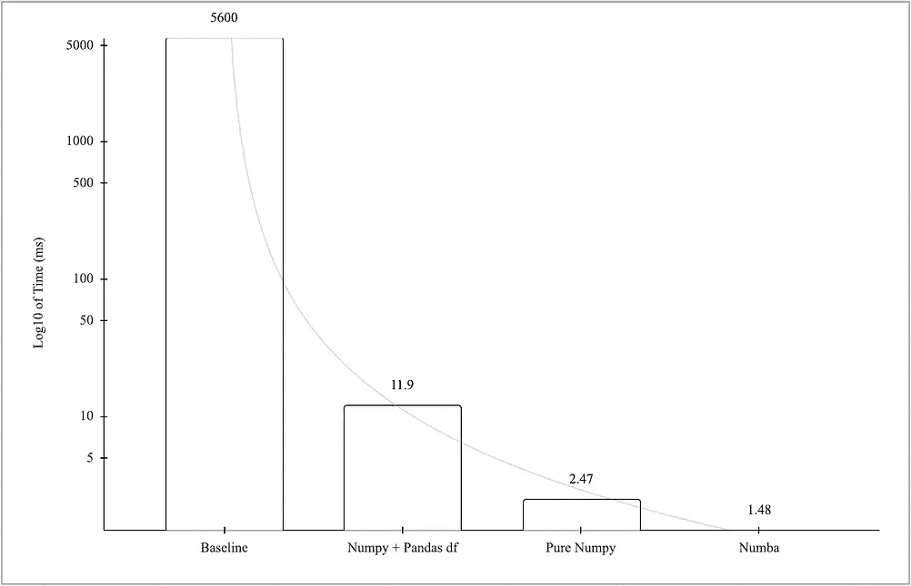
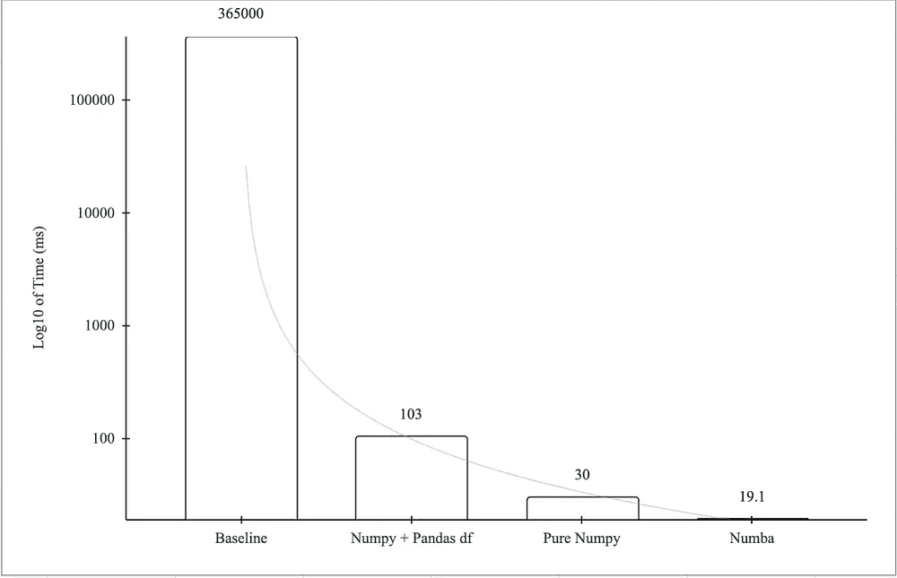

# 提高 NumPy 码的性能

> 原文：<https://betterprogramming.pub/improving-the-performance-of-numpy-code-d8a339a484d9>

## NumPy 代码运行时的实验


作者图片

在最近的一个项目中，我们决定使用`AUC-Recall@K`作为评估我们模型的主要指标。我们将其定义为我们的模型所达到的理想`Recall@k`曲线下的面积比例。

我的第一个实现使用了 NumPy 的函数，性能一点也不差，但这让我想知道我还能做得多好..以及有多糟糕。

```
Table of ContentsThe AUC-Recall@k Metric[The BaseLine Implementation](#17ff)[Replacing the for-loop with NumPy’s functions](#eaf9)[Removing the Dataframe](#0139)[Using Numba](#bea9)
```

## 更新

> 4.11.22:添加代码表

# AUC-Recall@k 指标

我们选择的度量标准计算了我们的模型达到的`Recall@k`曲线下的理想区域的比例。

```
AUC Recall@k = Area under Recall@k / Area under Ideal Recall@k
```

这需要两个计算:理想的`recall@k`曲线，当然，还有我们模型的`recall@k`曲线。我们先定义一下什么是`Recall@k`。

## 回忆@k

这是评估推荐系统的一个流行指标，通常是排名，通常与`Precision@k`一起计算。

> `Recall@k`回答问题:
> 
> 在所有正确的建议中，有多少出现在您的模型的前 k 名建议中？

```
Recall@k = # correct recommendations in the top k / # total correct
```

很明显，随着 k 的增加，`Recall@k`也增加，当`k`等于文档总数时，最终达到值`1`。请注意，对于较小的`k`，它也可能到达`1`。

## 计算召回@k 曲线

现在我们有了计算`Recall@k`的方法，为了得到曲线，我们为从 0 到推荐总数的每个`k`计算`Recall@k`。

```
Recall@k Curve = [Recall@0, Recall@1, Recall@2, Recall@3, ..]
```

## 计算理想召回@k 曲线

理想`Recall@k`曲线背后的直觉是，在理想世界中，每个相关文档的排名都会高于不相关的文档。结果会是这样的排名顺序:

```
[1, 1, 1, ... 1, 0, 0 ... 0]
```

每次我们增加`k`，我们总是在考虑多一个相关的文档。一旦我们覆盖了所有相关的文档，我们的`recall@k`就已经点击了`1`。在那之后，它保持不变，因为没有更多的相关文件影响我们的召回。

```
Ideal Recall@k = k / total relevant documents
                       (when k <= # relevant docs)
               = 1
                       (when k > # relevant docs)
```

更简洁地说，

```
Ideal Recall@k = min(1, k / total relevant documents)
```

由于我们对理想的`recall@k`曲线感兴趣，我们将对每个`k`进行外推。

## 计算 AUC-召回@k

现在我们有了两条曲线——回忆@k 和理想回忆@ k——AUC 分数就是它们的面积比。

```
AUC-Recall@k = Area under Recall@k / Area under the ideal Recall@k
```

# 基线实施

让我们从一个基本的实现开始，来欣赏后续版本中的性能改进。请注意，这种实现故意很慢，只是作为糟糕的代码的代表。

## 数据框架

我们将首先创建我们的模型的置信度得分和目标的数据框架，其中`1`代表相关文档，而`0`代表不相关文档。

## 实现召回@k 曲线的计算

为了计算你的模型的`recall@k`，迭代排名列表并计算每个点的`recall`。

## 实现理想召回率@k 曲线的计算

正如我们在上一节中所定义的，理想的 Recall@k 曲线是一个分段函数。我们将使用 NumPy 的`numpy.minimum`函数来实现它。

## 完整的实现

现在我们有了两条曲线，我们将计算它们的面积比，以获得最终的 AUC-Recall@k 指标。我们将使用 NumPy 的`numpy.trapz`来计算这个。

```
# Computing the final metric by getting the proportion of areas
return np.trapz(recall_at_k) / np.trapz(ideal_recall_at_k)
```

整个实现如下所示:

# 用 NumPy 函数替换 for 循环

提高代码速度的最好方法之一是消除循环。当我们使用它的优化函数时，NumPy 的性能改进是有效的。

## 计算召回@k 曲线

例如，为了计算我们模型的`Recall@k`曲线，我们可以使用 NumPy 的`cumsum`函数。

让我们首先将我们的排名存储为一个 NumPy 数组。回想一下`conf_df`是我们的数据框架，它包含了预期的预测和我们的模型分配给它们的置信度分数。

```
ranking = conf_df["expected"].to_numpy()
```

`cumsum`逻辑可以这样实现。在我们的例子中，由于`1`代表一个相关的文档，我们可以通过简单地计算前 k 个等级中的`1`的数量来计算`recall`。

```
recall_at_k = (ranking == 1).cumsum() / (ranking == 1).sum()
```

## 计算理想召回@k 曲线

虽然理想曲线的整体实现在这里不会改变，因为我们已经在使用 NumPy 的函数，我们不再需要使用`conf_df`，因为我们已经在 NumPy 数组中有了我们的排名(`ranking`)。

我们将把`ranking`替换到现有的实现中。

## 完整的实现

我们的函数现在看起来像这样:

# 移除数据框

在我们之前的方法中，虽然我们从数据帧开始，但最终我们使用了 NumPy 数组。移除数据帧应该会给我们一个不错的改进。

如果我们看看创建数据框架的主要原因，它只是根据我们模型的置信度对预测进行排序。这可以使用 NumPy 轻松实现。我们需要做的就是使用一个数组的排序索引来重新排序另一个数组。

在我们的例子中，我们将像以前一样对置信度得分数组进行降序排序，然后使用这些索引对我们的文档数组进行重新排序。

让我们称文档数组为`y_true`，置信度数组为`y_conf`。排序可以结合 NumPy 的`argsort`和索引来完成。

```
ranking = y_true[np.argsort(y_conf)[::-1]]
```

## 完整的实现

# 使用 Numba

在运行这些实验时，我很好奇是否有更简单的方法来获得额外的性能提升。我遇到了 Numba，根据他们的说法是:

> Numba 是一个开源的 JIT 编译器，它将 Python 和 NumPy 代码的子集翻译成快速的机器代码。

他们的快速入门指南《Numba 5 分钟指南》提到 Numba 最适合循环和 NumPy 代码，但不适合熊猫。因为我们已经在前面的方法中专门使用了 NumPy，所以尝试一下似乎是个好主意。

虽然我还没有探索 Numba 提供的所有功能，但我发现了他们的`jit`装饰器，它可以优化任何用。

所以，我们最后的 Numba 方法需要简单地在我们之前的函数上添加 Numba 的`jit`装饰器。

# 结果呢

我们将在四种数据集规模上比较这些方法的性能:

*   5 份文件
*   100 份文件
*   10k 文档
*   100k 文档

## 原始值

为了运行这些实验，我使用了`timeit`这个神奇的命令。

例如，在 100k 数据集上，基线方法的性能是这样计算的:

```
%timeit -o auc_recall_at_k_np_no_df_numba(np.random.randint(0, 2, 100000), np.random.rand(100000))
```

最终原始时间(毫秒)为:



运行时间(毫秒)—越小越好

## 相对性能

让我们首先来看看我们所有实验的相对性能，并与时间最少的实验进行比较——在五个数据点上的 Numba。在下面的图表中，我们可以看到，从使用 for 循环的基线方法到使用 Numba 性能提升的方法，我们的实验的相对性能有了显著的提高。



5 个数据点上 Numba 的对数标度相对性能—越小越好

**重点观察**

> 一旦我们承诺使用 NumPy(从第二个实验开始)，我们就会看到性能的显著提升。随着我们进一步提高，我们得到的回报越来越少。

## 在 10k 和 100k 文档上

如果我们放大到 10k 和 100k 的数据集大小，趋势就更容易可视化了。随着数据集大小的增加，基线实现的性能下降最多。另一方面，添加 Numba 的性能提升使我们的实现速度提高了 30–40 %,考虑到我们所要做的只是在函数顶部添加四个字母，这还不算太差。

图中的数据标签是下面的原始时间(毫秒):



10k(左)和 100k(右)文档的对数级性能—越小越好

# 参考和示例代码

## 密码

[](https://github.com/Polaris000/BlogCode/tree/main/NumpyOptimization) [## blog code/num 优化主极化 000/BlogCode

### 示例代码来自我在 Medium 和我的个人网站上的博客文章。—主页面上的博客代码/数字优化…

github.com](https://github.com/Polaris000/BlogCode/tree/main/NumpyOptimization) 

# 参考

*   https://numpy.org/
*   Numba 的五分钟指南:【https://numba.readthedocs.io/en/stable/user/5minguide.html 
*   the time it magic:[https://ipython . readthedocs . io/en/stable/interactive/magics . html # magic-time it](https://ipython.readthedocs.io/en/stable/interactive/magics.html#magic-timeit)

# 结论

本文并不打算成为编写更好代码的全面指南。相反，这是为了展示什么是可能的。虽然我确信这里还有进一步改进的空间——例如，通过进一步探索 Numba 或将任何重复的函数调用存储在变量中——但很明显用 NumPy 的内置函数替换循环会产生多大的不同。

如果没有别的，我希望读者看到如此琐碎的事情是如何为你节省时间的。