# 使用 UIKit 和 Swift 实时预览改进您的工作流程

> 原文：<https://betterprogramming.pub/improving-your-workflow-with-uikit-swift-previews-97ad5cdde742>

## 结合 Playgrounds、UIKit 和 SwiftUI 实现惊人的快速开发

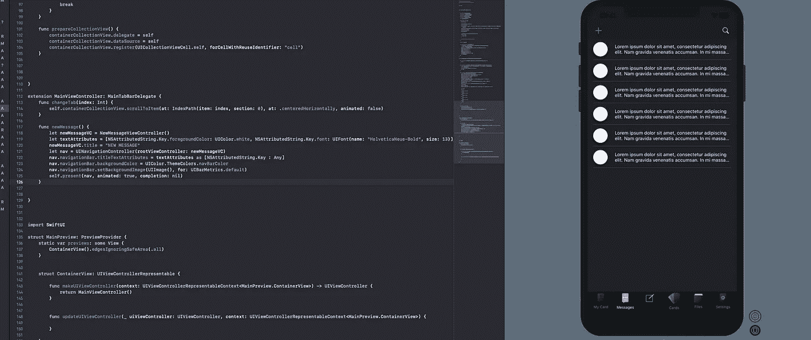

在构建 UI 的时候，我经常和其他很多 iOS devs 一样，陷入修改一些代码的怪圈，按Cmd + R，等待…

等待中…

应用程序启动…

“呃…需要更多的左侧填充。”

然后我回到代码中，将前导锚常量从 12 改为 16，接着是Cmd + R，然后再等待一段时间。

无论是哪种情况，对我来说都是低效的，但是我们都已经习惯了:编译和运行，只是为了看到基本的 UI 变化。

然后苹果宣布 [SwiftUI](https://developer.apple.com/xcode/swiftui/) 和 [Swift 预览](https://gist.github.com/mattt/ff6b58af8576c798485b449269d43607)，这改变了游戏。在实施 SwiftUI 等新技术的同时与客户合作可能会很困难。尽管 SwiftUI 令人惊叹，但它并没有生产级稳定性的最长历史，而且说服客户使用这样的新框架有时可能是一项艰巨的任务。

但是作为一名自由职业者，我可以使用 UIKit ，同时仍然拥有快速预览的优势。这有助于提高我的效率，同时也给了我实时 UI 渲染的满足感。

# **视图控制器**

让我们从视图控制器开始:

然后我们需要给文件提供一个`PreviewProvider` **。这将告诉 Xcode 我们想要看到一个预览。**

我们的`PreviewProvider`将由`VCPreview`来代表。

为了避免 Xcode 对我们发火，我们需要在预览中添加一个视图。我们可以用`SwiftUI`添加一些文字。

现在，您应该会在右侧看到一个预览。如果没有，请继续选择。“编辑器”->“画布”(Alt + Command + Enter)。

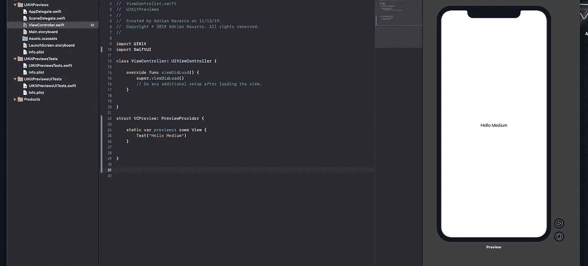

列表中的下一步是使用`UIViewControllerRepresentable`为预览提供一个表示我们的视图控制器的视图。在我们的`VCPreview`里面加上下面的`struct`:

```
struct VCContainerView: UIViewControllerRepresentable {}
```

Xcode 会告诉你:

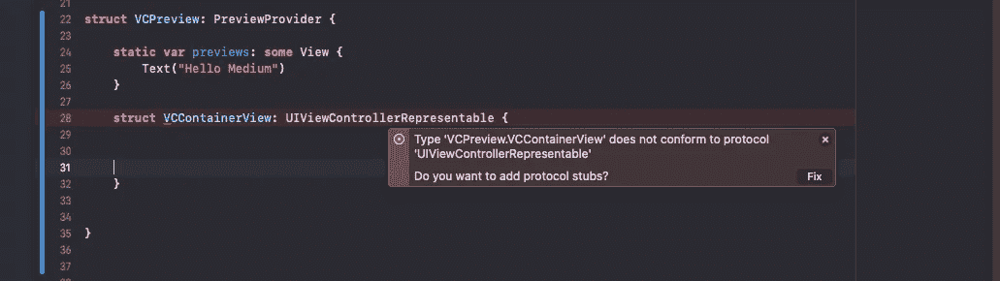

Xcode 希望您为`UIViewControllerType;`提供一个`typealias`，在我们的例子中，它只是`UIViewController`。

```
struct VCContainerView: UIViewControllerRepresentable {typealias UIViewControllerType = UIViewController}
```

继续并选择“修复”这将添加方法`makeUIViewController`和`updateUIViewController`。

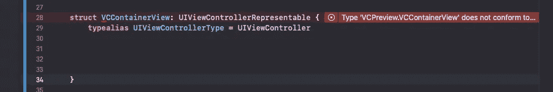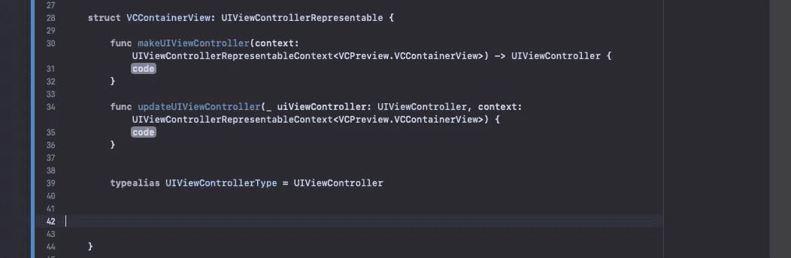

在我们的`makeUIViewController` 方法中，应该有一个`UIViewController`的返回类型，这就是我们设置的`typealias`的类型。简单地返回我们的视图控制器的名称，在我们的例子中是`ViewController()`，并删除`updateUIController`方法中的占位符:

```
func makeUIViewController(context: UIViewControllerRepresentableContext<VCPreview.VCContainerView>) -> UIViewController {return ViewController()}
```

现在，还记得我们添加的那段文字吗，“你好，灵媒？”

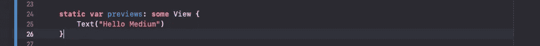

让我们把它去掉，换上我们的`VCContainerView`。

```
static var previews: some View {VCContainerView()}
```

就是这样！现在，我们对视图控制器所做的任何 UI 更改都将反映在预览中。让我们从背景色开始:

```
class ViewController: UIViewController {override func viewDidLoad() {super.viewDidLoad()view.backgroundColor = .blue// Do any additional setup after loading the view.}}
```

默认情况下，预览会考虑安全区域，所以要扩展您的`ViewController`预览，我们只需告诉`VCContainerView`忽略预览的安全区域:

```
static var previews: some View {VCContainerView().edgesIgnoringSafeArea(.all)}
```

这就是了。我们可以像往常一样使用 UIKit 在视图控制器上工作，我们的更改将反映在预览中。

如果试听暂停，请按“继续/再试一次”

下面是最终的代码:

小预告:

像往常一样使用 UIKit，现在预览中反映了更改。

# 带有子类视图的预览

如果你像我一样，你子类化你的视图和单元。我们可以使用`UIViewRepresentable`以同样的方式查看预览。

## 1.创建视图

我们可以为任何 UIView 创建实时预览。在我们的例子中，我们将使用一个`UITableViewCell`。

让我们从表格视图单元格开始。我们就叫它`CustomTableViewCell`。

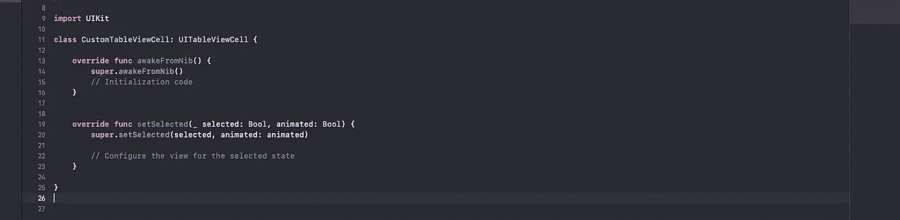

让我们重写初始化器:

## 2.预览提供者

现在让我们导入 SwiftUI，并在我们的`CustomTableViewCell`下创建我们的`PreviewProvider`。我们就叫它`CustomCellPreview`。

```
struct CustomCellPreview: PreviewProvider {}
```

让我们添加一个文本视图。

您应该会再次在右侧看到预览:

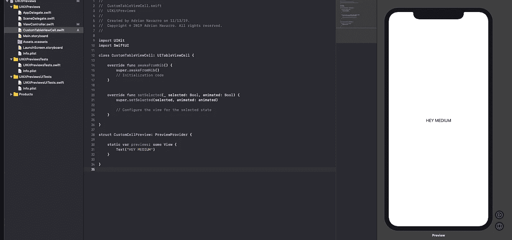

## 3.uiviewerepresentable

现在，使用`UIViewRepresentable`，我们可以得到一个`UITableViewCell`的预览。姑且称之为`CellPreviewContainer`:

```
struct CustomCellPreview: PreviewProvider {static var previews: some View {Text(“HEY MEDIUM”)}struct CellPreviewContainer: UIViewRepresentable {}}
```

## 4.Typealias

Xcode 现在希望我们为`UIViewType`提供一个`typealias`。

因为我们只想预览我们的单元格，所以这次我们的`typealias`将是类型`UITableViewCell`。

```
struct CellPreviewContainer: UIViewRepresentable {typealias UIViewType = UITableViewCell}
```

## 5.makeUIView

选择修复:

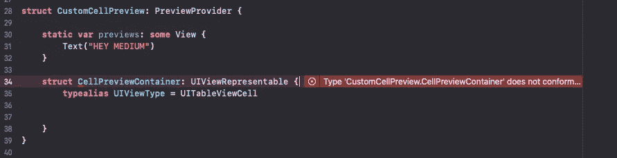

这影响了我们的方法`makeUIView`和`updateUIView`，使得我们的返回类型为`UITableViewCell`的`makeUIView`。


在`makeUIView`中，让我们返回单元格的名称(`CustomTableViewCell`)并删除`updateUIView`中的占位符:

```
struct CellPreviewContainer: UIViewRepresentable {func makeUIView(context: UIViewRepresentableContext<CustomCellPreview.CellPreviewContainer>) -> UITableViewCell {return CustomTableViewCell()}func updateUIView(**_** uiView: UITableViewCell, context: UIViewRepresentableContext<CustomCellPreview.CellPreviewContainer>) {}typealias UIViewType = UITableViewCell}
```

## 6.将视图添加到预览

让我们删除“Hello Medium”文本，并替换为我们的`CellPreviewContainer()`，更改如下:

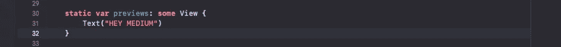

对此:

```
static var previews: some View {CellPreviewContainer()}
```

## **7。给视图一个框架**

让我们给我们的`CellPreviewContainer`一个框架和对齐，否则它会占据整个预览屏幕。

```
static var previews: some View {CellPreviewContainer().frame(width: UIScreen.main.bounds.width, height: 50, alignment: .center)} 
```


## 8.瞧

像往常一样用`UIKit`构建您的单元格，并在预览中观察您的更改生效。

让我们从改变初始化程序中的背景颜色开始:

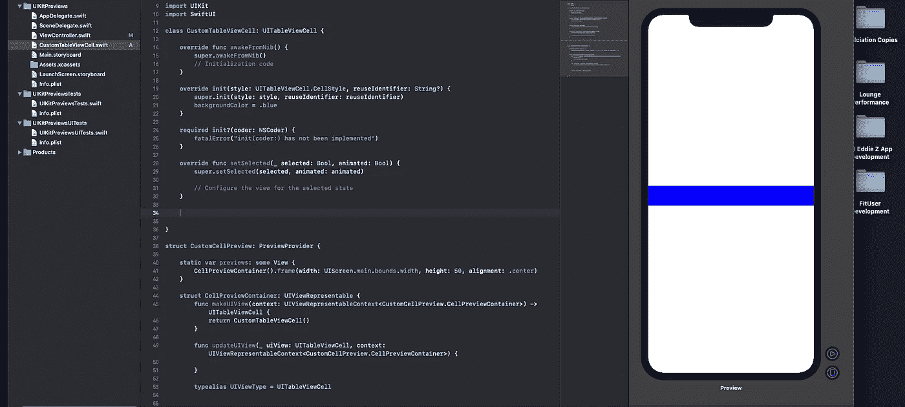

只需一点点设置，您就可以使用 UIKit 极大地改善您的工作流程！

下面是该项目的源代码。