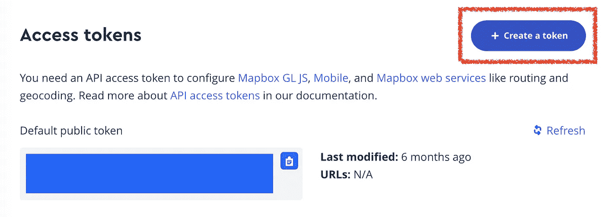
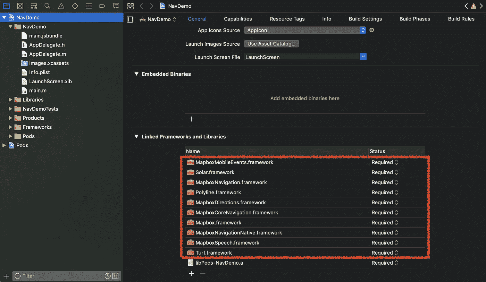
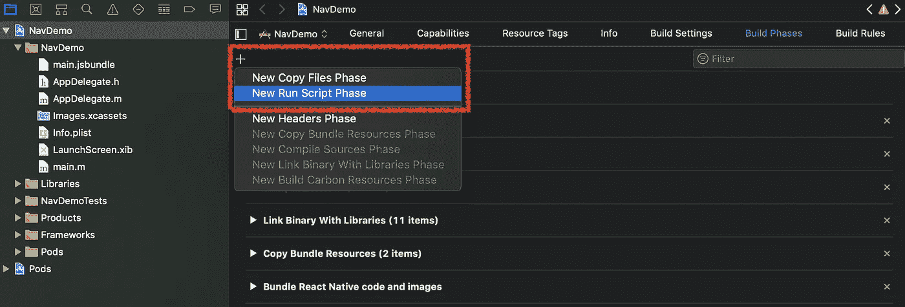
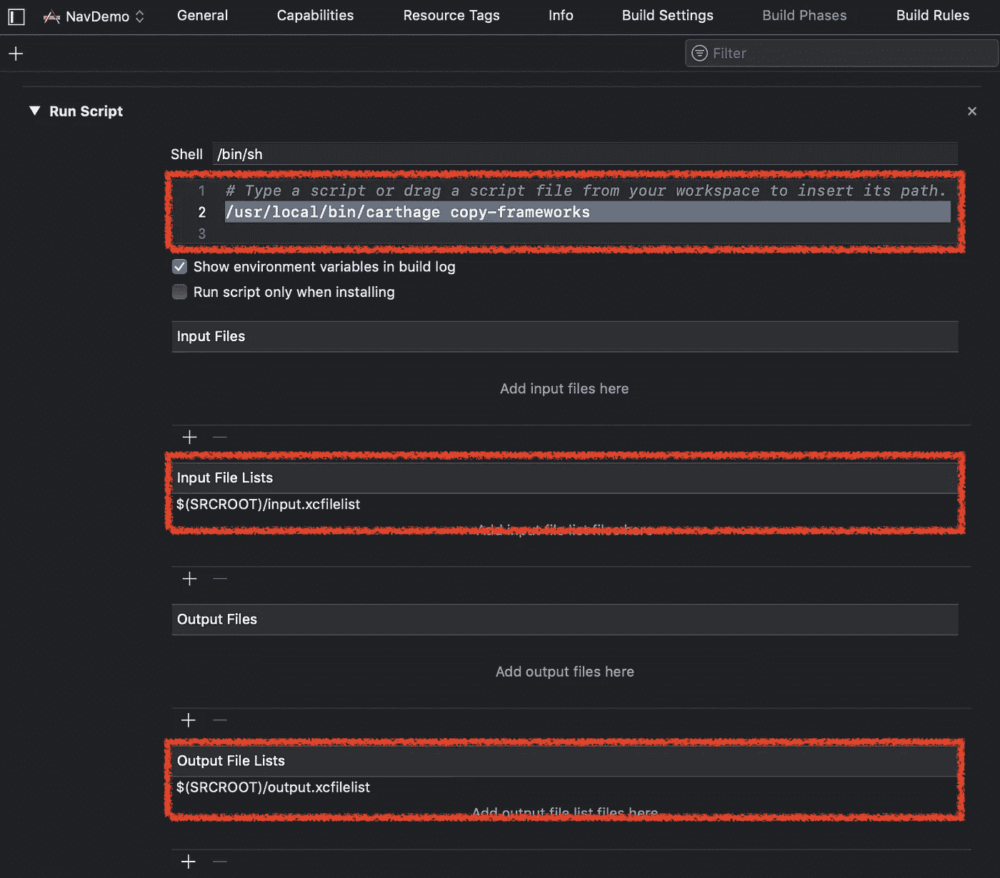
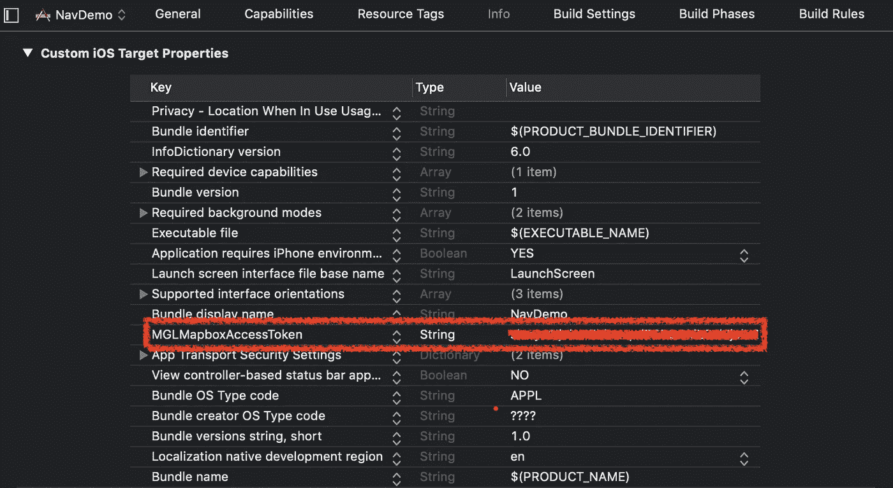
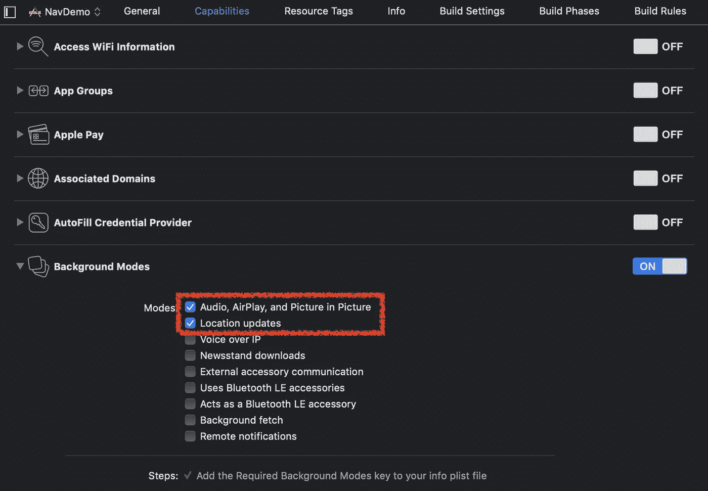
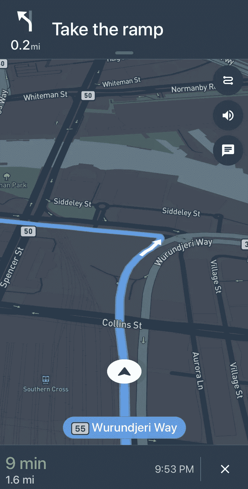

# React Native 中的应用内地图框导航

> 原文：<https://betterprogramming.pub/in-app-mapbox-navigation-in-react-native-c8b541eee5ab>


照片由[捕捉人心。](https://unsplash.com/@dead____artist?utm_source=unsplash&utm_medium=referral&utm_content=creditCopyText)开启[防溅](https://unsplash.com/search/photos/map?utm_source=unsplash&utm_medium=referral&utm_content=creditCopyText)

# 为什么反应原生？

作为一名 iOS 开发知识有限、JavaScript 经验丰富的数据科学家，我一直在探索将应用内地图导航功能纳入我的一个项目的各种选项。令我惊讶的是，我在寻找一个可以快速实现的解决方案时遇到了困难。

为了帮助其他可能面临类似挑战的人，我编写了一个简单的例子来演示如何有效地构建应用内导航，而不需要在学习复杂的原生 iOS 开发方面进行大量投资。

在本文中，我们将介绍:

1.工具/先决条件
2。设置一个 React 本地项目
3。为 iOS 安装 Mapbox 导航 SDK
4。创建本机模块，并将其暴露给 React
5。调用 React 中的本机类并运行应用程序

# 1.工具/先决条件

开始之前，确保已经设置了以下先决条件:

*   [地图框访问令牌](https://account.mapbox.com/)
*   [反应原生](https://facebook.github.io/react-native/)
*   Xcode
*   [迦太基](https://github.com/Carthage/Carthage)
*   [椰子](https://cocoapods.org/)

获取 Mapbox 访问令牌是一个简单的过程，可以通过 Mapbox 帐户页面完成。此令牌对于在项目中访问 Mapbox 的地图和位置服务至关重要。以下步骤概述了获取地图框访问令牌的过程:

1.  登录您的地图箱帐户。
2.  导航到帐户页面。
3.  找到标有“访问令牌”的部分。
4.  单击“创建令牌”按钮。
5.  为令牌提供描述性名称。
6.  为您的项目选择必要的范围。
7.  点击“创建”按钮。



# 2.设置反应本地项目

在继续将 Mapbox 集成到您的项目中之前，我们需要首先初始化项目，并安装项目的`package.json`文件中指定的所有必要的模块和依赖项。以下是完成此任务的命令示例:

```
export RNAPP=NavDemo
export RN_VERSION=0.60.5react-native init $RNAPP --version $RN_VERSION
cd $RNAPP
npm install --save
```

通过执行上面的命令，所有必需的模块和在`package.json`文件中指定的依赖项将被安装，确保您的项目拥有所有必需的组件。

在初始化项目并安装必要的模块和依赖项之后，下一步是更新并安装`Podfile`中列出的 pod。该文件通常由 React Native 在项目初始化过程中自动生成。但是，如果它不存在，您可以运行运行`pod init` 来生成它。

生成`Podfile`后，通过执行以下命令更新并安装指定的 pod:

```
cd ios/
pod repo update && pod install
```

接下来，我们将使用 Carthage 将 Mapbox SDK for iOS 添加到我们的项目中。

# 3.为 iOS 安装 Mapbox 导航 SDK

要将地图框导航集成到您的项目中，您需要创建一个`Cartfile`，将地图框导航作为依赖项，然后构建依赖项并获取预编译的框架。以下代码概述了完成此任务的过程:

```
echo 'github "mapbox/mapbox-navigation-ios" ~> 0.36' > Cartfilecarthage update --platform iOS
```

预编译的框架将保存在`Carthage/Build/iOS`目录中。

在这个项目中，我们利用 Carthage 来安装 Mapbox SDK，而不是 CococaPods。这是因为我们使用了 Mapbox 的预编译框架，目前，CococaPods 不支持使用`use_frameworks!`作为 pod 的一部分。有关此问题的更多信息，请参考相关文档。

要链接所有预编译的框架，请在 Xcode 中打开 iOS 项目(`NavDemo.xcworkspace`)，并导航到“常规”设置选项卡下的“链接的框架和库”部分。所有必要的预编译框架都将被链接起来，确保 Mapbox SDK 无缝集成到您的项目中。



导航到 Xcode 中的“构建阶段”标签，将运行脚本添加到项目中。此运行脚本可用于执行各种任务，如运行测试、构建第三方库或任何其他需要在项目编译前执行的操作。



并添加以下脚本:

```
/usr/local/bin/carthage copy-frameworks
```

要指定项目中所需的框架，您需要在`ios`文件夹下创建一个新文件，并将其命名为`input.xcfilelist`。打开`input.xcfilelist`文件，添加所需框架的路径。在这种情况下，您需要添加所有 Mapbox 相关框架的路径。Xcode 使用该文件来确保必要的框架包含在构建过程中，并且可以在您的项目中使用。

input.xcfilelist

要指定项目中需要的复制框架，您需要在`ios`文件夹下创建一个新文件，并将其命名为`output.xcfilelist`。打开`output.xcfilelist`文件，添加复制框架的路径。在这种情况下，您需要添加之前复制到`ios`文件夹中的所有框架的路径。

output.xcfilelist

要在 Carthage 构建脚本中包含`input.xcfilelist`和`output.xcfilelist`，需要更新脚本的“输入文件列表”和“输出文件列表”部分。

1.  导航到“构建阶段”选项卡。
2.  找到迦太基运行脚本，并点击它进行编辑。
3.  在“输入文件列表”部分，添加`input.xcfilelist`文件。
4.  在“输出文件列表”部分，添加`output.xcfilelist`文件。



# 4.创建本机模块，并将其公开为 React Native

为了能够将本机模块集成到 React 本机环境中，我们必须在 Swift/Objective-C 和 React 组件之间建立一座桥梁。

为此，在 Xcode 项目文件夹中创建一个新的 swift 文件，名为 nav demo . Swift。Xcode 将自动提示创建一个相应的桥接头文件 NavDemo-Bridging-Header.h，以方便 Swift 和 Objective-C 之间的通信。

值得注意的是，单个桥接头文件足以用于整个项目，并可用于任何其他 Swift 文件。

在 NavDemo.swift 文件中，创建一个名为 NavDemo 的类，它是 NSObject 的子类。类和函数 renderNaviDemo 之前的@objc 声明使它们可以从 Objective-C 代码中访问。

NavDemo.swift

在`NavDemo-Bridging-Header.h`文件中，更新代码以包含`RCTBridgeModule`协议。React Native 中的本机模块是一个 Objective-C 类，它实现了`RCTBridgeModule`协议，为在头文件中注册桥模块提供了一个接口。缩写`RCT`代表 React。

nav demo-桥接-Header.h

在新创建的 Objective-C 文件中更新以下代码，`NavDemo.m`。我们利用`RCT_EXTERN_MODULE`来公开 NavDemo 类，利用`RCT_EXTERN_METHOD`来公开`renderNaviDemo`函数，以及它的预期输入。这允许我们使`NavDemo`类和函数可用于 React JS。

NavDemo.m

为了完成 Xcode 中 Mapbox 的集成，我们需要添加我们之前获得的 Mapbox 访问令牌。这可以通过在项目设置的“信息”标签中的“自定义 iOS 目标属性”部分下添加自定义 iOS 目标属性`MGLMapboxAccessToken`来完成。将访问令牌值分配给该属性。



此外，在项目的“功能”标签的“背景模式”部分启用“音频、AirPlay 和画中画”和“位置更新”选项也很重要。这将确保我们的应用程序可以在后台运行，并在导航时利用必要的功能。



# 5.调用 React 中的本机类并运行应用程序

最后，为了完成集成，我们需要调用 React 本机项目中的本机模块。为此，请打开 React 本机项目，并修改 JavaScript 代码以调用本机模块。出于演示的目的，我将从`app.js`文件中调用它。

在下面的部分，您可以指定导航的起点和目的地。

app.js

最后，返回 Xcode 环境，构建并运行应用程序。您应该观察到在应用程序中启动的地图框导航，如下所示:



# 接下来…

总之，我们已经详细描述了将地图框导航整合到 React 原生项目中的步骤。这包括设置 React 原生项目，安装 Mapbox 导航 SDK，创建原生模块，桥接 Swift 和 Objective-C 之间的通信，最后调用 React 中的模块。添加基本输入后，导航功能能够接受不同的起点和目的地。

这为将应用内导航集成到现有 React 原生项目或与您选择的其他地图服务提供商一起复制该流程奠定了基础。

附带的源代码可以在 [GitHub](https://github.com/ivanliu1989/Mapbox-Navigation-React-Native) 上找到，如果你想进一步探索的话。