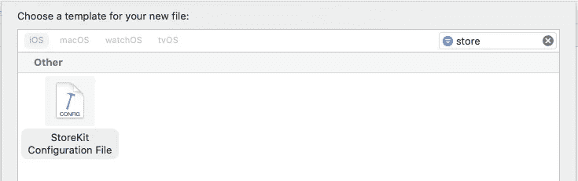
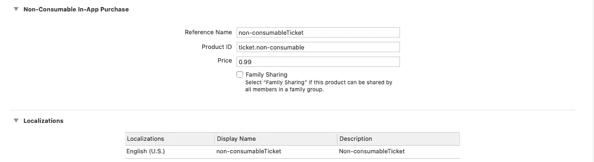
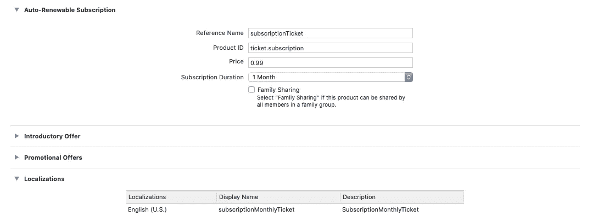
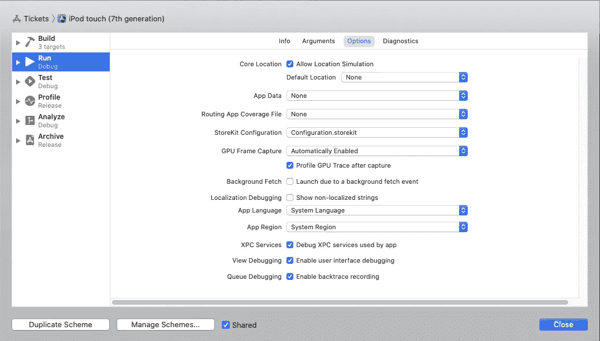
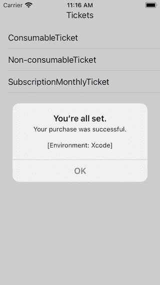
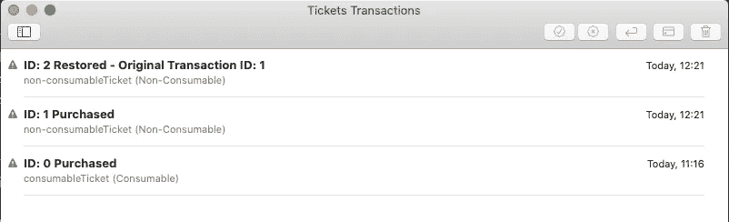

# iOS 14 中的应用内购买和商店工具包

> 原文：<https://betterprogramming.pub/in-app-purchases-and-storekit-in-ios-14-aed2c3e58966>

## 在 StoreKit 中实现新功能


图片由[克拉克街商业](https://unsplash.com/@mercantile?utm_source=medium&utm_medium=referral)在 [Unsplash](https://unsplash.com?utm_source=medium&utm_medium=referral) 拍摄。

在你阅读这篇文章之前，请注意这里有一个更新的版本。

[](https://medium.com/better-programming/subscriptions-receipts-and-storekit-in-ios-14-16194eb93963) [## iOS 14 中的订阅、收据和商店工具包

### 应用内购买和订阅的黄金标准

medium.com](https://medium.com/better-programming/subscriptions-receipts-and-storekit-in-ios-14-16194eb93963) 

WWDC2020 上的大部分讨论都集中在 SwiftUI 2.0 和 ARKit 上，所以你应该原谅自己错过了 StoreKit 框架的重大变化——这一变化将使你作为应用程序开发人员的生活更加轻松。

如果你读了我的文章[设置你的 SwiftUI 应用程序支持应用内购买](https://medium.com/better-programming/set-up-your-swiftui-app-to-support-in-app-purchases-ef2e0a11d10c)，那么你已经知道了事情的一半。后半段不变，但是苹果用 iOS 14 给前半段加了一些新规则。万一你是新来的，让我们把整个事情过一遍，以便全面了解情况。

在我看来，苹果做出的巨大改变是给了你，开发者，在本地模拟器中实现应用内购买的能力。能够在没有开发者账户的情况下完全实现应用内购买让你可以离线完成所有测试。显然，如果你想挣钱，你需要在某个时候转向更传统的路线。但是现在仅仅是让球滚动起来就容易多了。

我将从画一幅我想要建造的东西开始。我想举例说明你可以进行的三种应用内购买:

*   消耗品(只要你运行应用程序，它就会一直存在)
*   不可消耗的(理论上，将永远持续)
*   订阅(自行续订)

我也想让事情尽可能简单，所以我打算把我的应用程序建立在电子票的简单想法上。你可以买一张可消费的票，一张永不过期的通行证(非可消费的票)，或者一张门票订阅。

我们编码吧。您需要从创建一个项目开始。使用 SwiftUI 作为用户界面。创建完成后，向其中添加另外两个文件。一个简单的 Swift 和一个符合名称`StoreKit Configuration`的模板文件:



Xcode 中应用内购买的配置文件模板。

将这两个文件添加到您的项目后，单击配置文件本身，它会有一个加号，您可以通过它添加一个或多个不同类型的应用内购买:

*   消费品
*   非消耗品
*   自动续订订阅

每种类型添加一个，并完成如下所示的详细信息:


一张可消费的票(一日票)。



一张不可消费的票(永不过期)。



订阅(每月自动续订票)。

请特别注意您为这些项目输入的产品 id。您的 id 必须是唯一的。Apple 建议您使用反向域符号来确保您符合这个标准。

现在编辑您的附加 Swift 文件，将其重命名为`IAPManager.swift`，并向其中添加一个包含您刚刚在配置中定义的产品 id 的集合:

```
private let allTicketIdentifiers: Set<String> = [
"ticket.consumable",
"ticket.non-consumable",
"ticket.subscription"
]
```

定义了我们的应用内购买后，让我们开始填写模板代码，我们将需要与 Apple StoreKit 框架联系:

这里定义了三种方法。第一个将查询您的“本地”配置中可用的产品，而第二个和第三个将检查您在请求购买时是否在请求产品。现在，当您将它复制并粘贴到您的项目中时，您将会得到一个错误，因为您不能设置请求类型的委托，直到您符合`SKProductRequestDelegate`协议。您可以通过对该类的扩展来做到这一点:

我们还没有做到这一点，因为我想定义一个可观察对象，我可以在其中填充我的应用内数据项:

现在已经定义了 IAP 应用程序的框架，我们可以实现一个简单的 SwiftUI 接口来使用它。为此，我们创建了一个视图，可以在 SwiftUI 接口的标准`ContentView()`中调用该视图:

这将呈现单词 Tickets。如果点击，它将填充一个列表，其中包含您可以购买的三种类型的门票。注意，这个调用还需要一个`State`变量。为了完整起见，下面是代码:

现在，如果您只是编译并运行它，什么也不会发生，因为您需要告诉 Xcode 您想要使用 StoreKit 的新本地配置文件。您可以通过在 Xcode 中编辑运行方案来实现。在 Xcode 12 中，您会找到选择您想要引用的`StoreKit Configuration`文件的选项。您可以在项目中创建多个配置文件(这也是一个有用的选项)。



显示新 StoreKit 配置下拉菜单的方案菜单。

完成所有这些之后，您应该准备好运行测试了。试一试。运行应用程序，点击票证文本，然后点击列表中显示的耗材票证。假设你成功完成了，你会得到一个提示，告诉你购买成功了。


StoreKit 交易记录的确认对话框。



StoreKit 交易记录的确认对话框。

看起来不错，但还会更好。试着购买一张不可消费的票。你第一次会成功，第二次也会成功。但是等等！第二次，您会得到不同的提示:


StoreKit 交易记录的确认对话框。

现在在 iTunes connect 下，你会被锁定在这次购买上。在新的本地 XCode 管理下，您可以通过单击图标访问管理 StoreKit 事务管理器(该图标看起来有点像圆圈中的灯泡)来编辑事务:


用于编辑 StoreKit 交易的新图标(在票证的最右侧)。

点击后，我可以看到发生了什么交易日志，并通过右键单击或使用右上角的菜单编辑交易本身:



StoreKit 的事务日志。

尝试通过删除您的购买来编辑门票，然后返回模拟器再试一次。不存在任何记录，你可以重新购买一张(理论上)永远不会过期的票。我还可以在事务日志中做其他事情，比如将事务标记为退款。

您还完全支持家长控制选项以及中断购买，在这种情况下，用户需要对其帐户采取一些行动。也就是说，我不想让这篇文章太长，我也不打算在这里重复。您应该在新的 StoreKit 上观看 [WWDC2020 视频，了解全部细节。这是我这篇文章的基础。](https://developer.apple.com/videos/play/wwdc2020/10659/)

说到这里，我将结束这篇文章。我希望你能像我写这篇文章时一样，学到一些新东西。

保持冷静，继续编码。