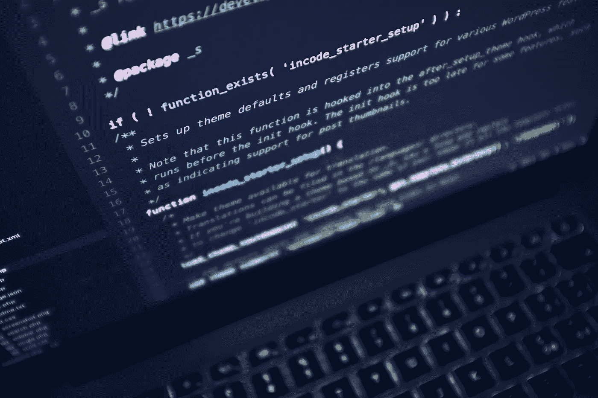

# 在我们信任的代码中

> 原文：<https://betterprogramming.pub/in-code-we-trust-c6eee2cd1600>

## 多测试，很重要

由 [StockSnap.io](https://stocksnap.io/photo/A28WZDTYEY) 的 [Luca Bravo](https://stocksnap.io/author/22748) 拍摄的照片

尽管我们尽了最大努力，我们程序员仍然是不完美的存在。时间限制、被误解的问题集、有限的测试和技术冲突都会导致我们构建的应用程序出现错误。

在最好的情况下，这些错误对用户来说只是小麻烦。在更严重的情况下，它们会使我们的程序无法使用。在这两种情况下，问题都是显而易见的，可以通过修改来纠正。

然而，还有一种更危险的错误，在某些情况下有可能造成严重伤害；系统性的失败。

代码中的系统故障是应用程序的逻辑或算法中的错误。这些错误悄无声息地发生，产生的输出虽然不正确，但却是准确的。

用户信任我们的系统。当他们点击一个按钮，在他们的会计软件中找出他们一个月的利润时，他们期望并相信结果是正确的。

计算中的一个错误对小企业主来说可能是灾难性的。他们可能会持有更多库存，或者错误地认为自己手头的现金比实际情况多，从而提前支付账单。

在一个更极端的例子中，考虑在医院内部运行的软件。我们是程序员，不是医疗保健专业人员，所以我们对起作用的变量的固有理解是有限的。这非常危险。

看似很小的代码错误，如混淆用户 ID 或数据库交易失败，可能会导致患者得到错误的药物、错误的治疗或被喂食他们过敏的东西。说生命危在旦夕一点也不夸张。

# 信任但核实

作为程序员，我们有责任确保我们的代码像宣传的那样运行。太多时候，如果我们的代码编译或执行并产生输出，我们假设它是正确的。

如果没有闪烁、哔哔声或闪光，那么我们很满意我们已经解决了问题。

我怀疑这源于我们的逻辑天性。我们倾向于相信我们构建的系统的逻辑部分，认为 UI 和连接线程只不过是支持性的，所以我们很少仔细检查那个逻辑。

我们必须验证我们构建的应用程序的所有部分都正常运行，而不仅仅是我们看到的部分。

# 测试

测试是开发过程中不可或缺的一部分，也是经常被忽略的一部分。花费在测试上的时间应该与你正在构建的程序的复杂性相称，并且从那里开始扩展，这取决于手头的风险。

可能不值得花三个月的时间来测试您的表单处理器脚本，以确保没有人输入错误的电子邮件地址，但是如果您的程序必须计算胰岛素剂量，您最好继续测试，直到您完全确定它是正确的。

我不仅仅是指一遍又一遍地运行程序。当计算非常重要的时候，我经常回到纸笔上，手工计算一些数字，以确保我有完美的公式。

# 值得信赖

最终，在大多数情况下，用户会信任你的应用程序。这是我们的天性，软件在日常生活中无处不在，以至于大多数人很少再考虑它的准确性。

作为程序员，我们有责任无愧于这种信任，尤其是在结果具有真实世界后果的情况下，这意味着—测试。

很多很多，通常令人麻木的重复测试。

在所有情况下，在你的过程中要勤奋和留心，你的项目将从中受益。现在养成这些习惯，你将享受到更少的重构和代码修改带来的额外好处，以及更喜欢你的应用程序的用户。