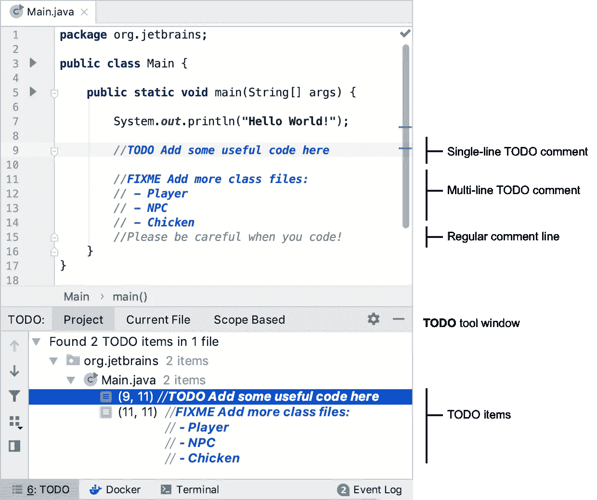
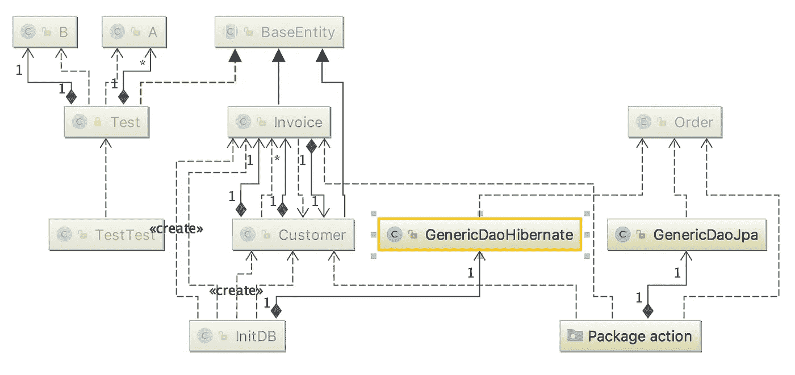
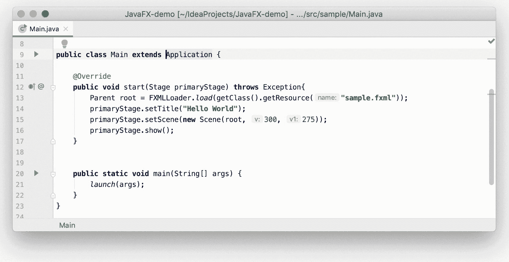

# 在 VS 代码世界中捍卫 JetBrains IDEs

> 原文：<https://betterprogramming.pub/in-defense-of-jetbrains-ides-in-a-vs-code-world-2b9f2d867d11>

## 看看它们最有用的特性

Jetbrains

前几天，我和我的同事再次讨论我们选择的集成开发环境。

自从我大学毕业后的第一份工作中那位了不起的高级开发人员向我介绍了 [IntelliJ IDEA](https://www.jetbrains.com/idea/) (向 [HTTP 请求](https://medium.com/u/6a83dcfda860#)

自己写请求，添加请求模板，或者粘贴您的一个卷发。然后，通过左侧的绿色小箭头发送请求，响应将显示在*运行*选项卡中。

您还可以查看已发送请求的历史记录，甚至查看一些示例。

# 待办事项视图

如果你像我一样，你不会第一次就把所有东西都编码好。也许你正在处理的问题的解决方案取决于你同事的公关被合并。

[待办支持](https://www.jetbrains.com/help/idea/configuring-keyboard-and-mouse-shortcuts.html)

在这种情况下，一个合适的待办事项会提醒你未来的自己(这个故事的真正英雄)。但是很容易忘记要做的事情，并且不得不去寻找它们是很乏味的。

不要害怕，我的同伴，JetBrains 在这里。不仅包含待办事项的注释行被特别突出显示以便于查看，还有一个方便的专用视图列出了项目中所有剩余的待办事项。

# 图表

一些 JIDEs，比如 IDEA，可以自动生成你的项目的类层次图(右击一个脚本，然后从上下文菜单中选择 Diagrams > Show Diagrams)。

[UML 图](https://www.jetbrains.com/help/idea/configuring-keyboard-and-mouse-shortcuts.html)

你可以调整你想在里面看到多少信息。这是退一步做一个高层次的双摄的完美特征。另外，你可以用它向你的同事展示你所做的事情。

# 测试跑步者

为了工作一定要写单元测试吗？你喜欢证明你的代码是有效的吗？你有兴趣让你的同事、领导和你自己相信你的代码不会引入回归吗？

[测试变得简单](https://www.jetbrains.com/help/idea/configuring-testing-libraries.html)

你现在正在培养你灵魂中与某些与传送门相关的恶棍产生共鸣的那部分吗？或者测试只是你的事情？无论如何，JIDEs 使编写、运行、评估和调试测试变得轻而易举。

# 结论

这只是 JIDEs 拥有的所有特性中的一小部分。我鼓励每一个阅读这篇文章的人至少检查一下它们——在它们的设置、菜单和(写得非常好的)文档中可以找到更多的工具。

JetBrains 在他们的产品中投入了大量的工作和思想，这是显而易见的。

除了它们的特性集，jide(IMHO)看起来也非常优雅和漂亮。最棒的是，其中一些是完全免费的。那么，你还在等什么？去提高你的生产力吧！

# 资源

*   [JetBrains](https://www.jetbrains.com/)
*   [IntelliJ IDEA](https://www.jetbrains.com/idea/)
*   [附加条款](https://www.jetbrains.com/rider/)
*   [颤振插件](https://plugins.jetbrains.com/plugin/9212-flutter)
*   [CodeGlance 插件](https://plugins.jetbrains.com/plugin/7275-codeglance)
*   [Docker 插件](https://plugins.jetbrains.com/plugin/7724-docker)
*   [IDE 功能训练器插件](https://plugins.jetbrains.com/plugin/8554-ide-features-trainer)
*   [关键启动子 X 插件](https://plugins.jetbrains.com/plugin/9792-key-promoter-x)
*   [年进度条插件](https://plugins.jetbrains.com/plugin/8575-nyan-progress-bar)
*   [电源模式二插件](https://plugins.jetbrains.com/plugin/8251-power-mode-ii)