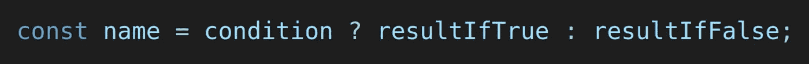
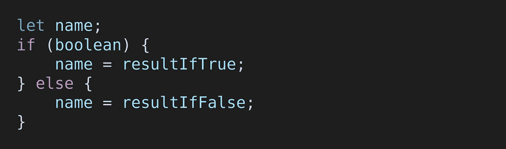
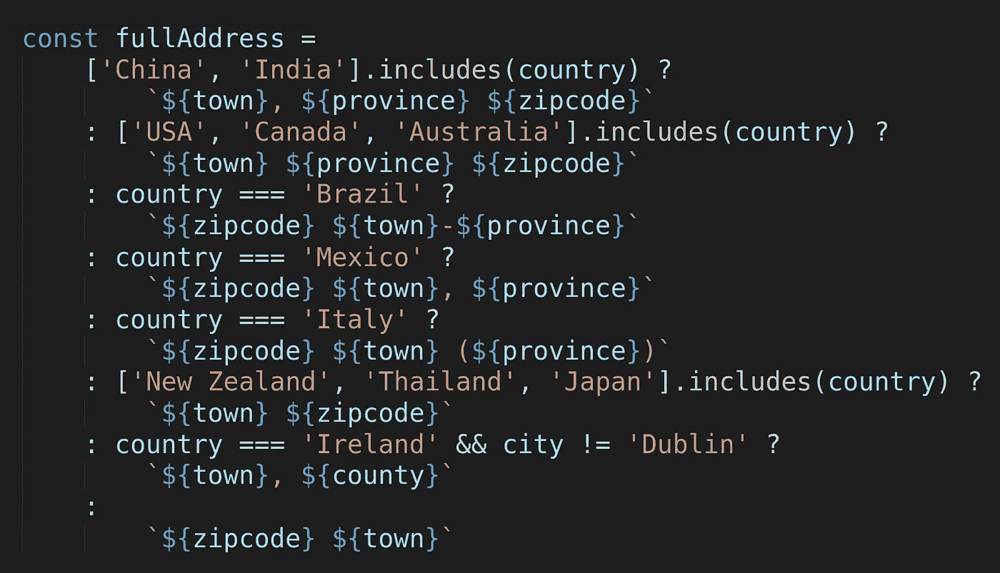

# 为三元算子辩护

> 原文：<https://betterprogramming.pub/in-defense-of-the-ternary-operator-22834dab7521>

## 采用不可变的功能性编码风格


由[市政府](https://unsplash.com/@lamunix?utm_source=medium&utm_medium=referral)在 [Unsplash](https://unsplash.com?utm_source=medium&utm_medium=referral) 拍摄的照片

Ternaries 有时名声不好。它们经常被描述为难以阅读，通常是因为它们的语法比散文式的 if-else 更抽象。然而，一旦你开始熟悉它们，它们会比它们的替代品有一些独特的好处。

如果你还不是 100%确定三元运算符是如何工作的，可以看看我的文章[初学者三元运算符](https://kasvtv.medium.com/ternary-operators-for-beginners-4472424a238c)。在那篇文章中，我们查看了以下三元语句的 JavaScript 示例:



三元表达式的一个基本例子

和一些使用 if-else 的等效代码:



与前面的代码片段相同的逻辑，使用 if-else 编写

我们现在将深入探讨为什么三元运算符是更好的选择，以及在什么情况下应该或不应该使用它。

# 三元运算符的优点

## 短暂

首先，三进制示例是一行，其中 if-else 等价于六行，尽管这可能根据您喜欢的编码风格而有所不同。

语法在多方面客观上更简洁。首先，if-else 版本的标识符`name`重复了三次，而三元版本只有一次。我们还可以看到发生了两次赋值，而不是一次。最后，三进制版本不需要读者查看任何范围和缩进，而 if-else 版本需要。

## 不变

三元运算符的另一个巨大优势是能够编写更多不可变的代码。我们可以看到，在三进制版本的代码中，变量被定义并立即赋值。它不再被进一步修改。相比之下，在 if-else 版本中，变量首先在一行中声明，只有在稍后的另一行中，变量才会被修改，从而被赋予正确的值。

因为变量被立即赋予了正确的值，所以我们可以使用`const`，而在 if-else 中，我们被迫使用`let`。JavaScript 中的关键字`const`防止我们再次重新分配变量。许多其他语言有类似的关键字做类似的事情。

那么，用`const`代替有什么了不起的呢？这使得读者可以放心地假设该变量永远不会在代码中的其他地方被重新赋值。这减少了下面代码行中可能发生的事情的范围。这反过来又使代码更容易预测，因此更容易阅读和思考。

## 公式

三元运算符的第二个和第三个操作数(上例中的`resultIfTrue`和`resultIfFalse`)只能是表达式。这与上面演示的 if-else 版本形成对比，在该版本中，代码块可以包含 if 或 else 语句之后的任何代码。这使得三元运算符比 if-else 更容易预测。读者可以确信`resultIfTrue`或`resultIfFalse`将是结果，因此不必在代码的任何其他部分进行搜索。

这使得在几分之一秒内从心理上解析代码变得更加容易。它还确保了变量的定义和它的赋值不会在以后添加更多代码时意外地“偏离”。

因为三元运算符也是一个表达式，所以它可以方便地用作更大定义的一部分、对象文本中的值、函数参数、数组文本中的项，或者您可能会得到以下场景:

```
const response = {
    body: data,
    status: error ? error.status : 200
}
```

这可以使更大的对象定义更容易阅读，因为读者可以直接在对象定义中看到键值，而不是在其他地方的变量中声明。

# 不足之处

## 更抽象

当然，三元运算符更抽象，读起来不像真正的语言。这对那些不熟悉它的人来说是一个缺点。一个完全的初学者可能仅仅凭直觉就能理解简单的 if-else 赋值，但是如果没有任何文档或教程，他们不太可能理解三元运算符。

然而，只有当你写的代码是针对初学者的教育目的时，这才是重要的。对于任何为业余爱好者或专业人士编写的代码，这都不是问题。

## 小空间

也许一个更相关的缺点是三元运算符没有给表达式留下太多空间。在下一节中，我们将研究一种允许每个操作数有单独一行的样式。但是，如果不能很容易地将每个操作数写成单个表达式，三元运算符一般不是正确的选择。

## 不太灵活

就像三元运算符只接受表达式可能是一个优点一样，这使得三元运算符不太灵活。对于非常复杂的条件逻辑，通常首选 if-else。

# 有效造型

因为三元运算符看起来很抽象，所以样式很重要。你如何把它们分成几行，以及它们是如何缩进的，这就决定了清晰简洁的代码和过于复杂的谜题之间的区别。

## 单行上的每个操作数

如果您想使用三元运算符，但整个三元表达式不能放在一行中，这是最常用的样式:

```
const result = someBooleanFunction(arg1, arg2, arg3)
    ? aPrettyLongResultFunction(arg4, arg5, arg6)
    : anEvenLongerResultFunction(arg7, arg8, arg9)
```

这很容易习惯阅读，因为每个操作数都在一行上，很容易看出哪个是哪个。

## 多行操作数

也许一行对于部分或全部操作数是不够的。在这种情况下，您可以将操作数放在多行中。但是在这种情况下，您将希望通过确保每个操作数都被包含在括号或大括号中，来特别清楚每个操作数的开始和结束位置，即使从技术上讲代码编译并不需要这样做。这使得读者更容易立即识别操作数，而不会产生歧义。例如:

```
const result = someCondition
    ? (
        // multiline expression here
    )
    : (
        // another multiline expression here
    )
```

在 JavaScript 中，这种风格允许您在完全不可变的条件下添加现有对象:

```
const result = someCondition
    ? {
        ...baseObject,
        extraProperty1: 'a',
        extraProperty2: 'b',
    }
    : {
        ...baseObject,
        extraProperty3: 'c',
        extraProperty4: 'd',
    }
```

请注意，这里的表达式没有被包装在`()`中，因为它们已经被包装在`{}`中，这让读者清楚每个操作数的开始和结束位置。

## 筑巢三角巢

嵌套三元表达式在开发人员中颇有争议。事实上，很多例子都存在于极难阅读的嵌套三元表达式中，但情况并非如此。

有一个非常有效清晰的嵌套三元表达式的窍门！你只需要把一个三元表达式作为这个三元表达式的最后一个操作数。更简单地说，您希望`?` s 和`:` s 总是交替出现，这样就不会有两个`?` s 中间没有`:`。然后缩进以获得以下格式:

```
const result =
    question1 ?
        answer1
    : question2 ?
        answer2
    : question3 ?
        answer3
    :
        defaultAnswer;
```

理解这种嵌套的三元样式的关键技巧是把每个条件看做一个问题(它甚至以一个问号结尾！).然后在下面一行，问题的“答案”是缩进的。这读起来非常自然，因为在非编码领域，也使用这种缩进格式。

想象一个真实的例子，我们想要定义一个特定于国家的地址行，它看起来像这样:



非常简洁，完全不可变！如果需要的话，你可以在每个`:`前加一个新行。

# 结论

虽然三进制表达式对于没有受过训练的人来说看起来有点危险，但是很容易习惯它们并开始收获它们的好处。一旦您熟悉了三元表达式的工作方式，并尝试寻找最佳的样式，它们就允许您编写优雅的代码。

它还帮助您采用更不可变的，因此也是功能性的编码风格。有了更少的可变性和更多的`const`，混乱和错误的空间就更小了。

# 关于 Python 的一个简短说明

在 Python 中，三元运算符看起来有点不同。这里有一个例子:

```
name = expressionIfTrue if condition else expressionIfFalse
```

它的功能本质上与`?:`样式相同，尽管认识到参数的顺序不同是很重要的。条件是在中间而不是在开头。

这样做的好处是读起来更像英语句子，因此更容易凭直觉理解。缺点是两个表达式不再相邻，而是被条件分开。这种语法不允许它们像`?:`那样很好地嵌套。

因此，我建议在 Python 中嵌套三元运算符时要更加小心。相反，你可以使用`match case`语法。它肯定会更冗长，但可读性会更好，这种权衡可能是值得的。另一种选择是将所有逻辑提取到一个单独的函数中，并使用`if elif else`语句，每个语句后面紧跟着一个`return`。

如果你知道一种让嵌套 ternaries 在 Python 中可读的风格，请在评论中告诉我们！