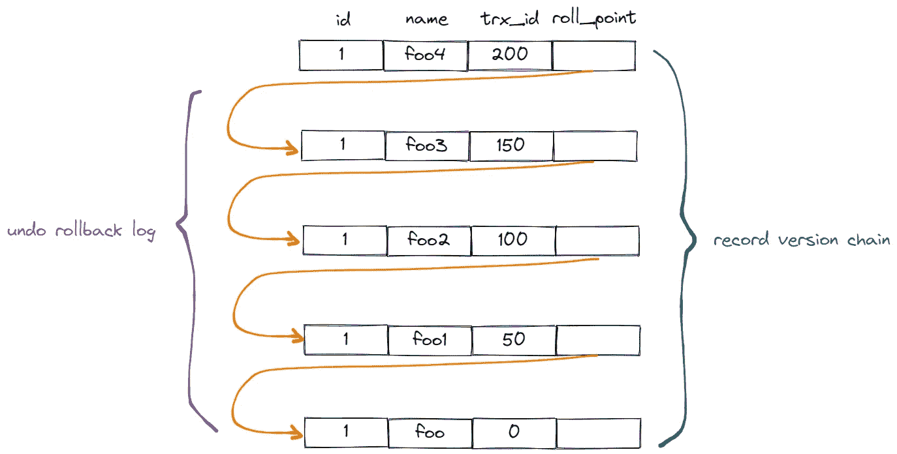
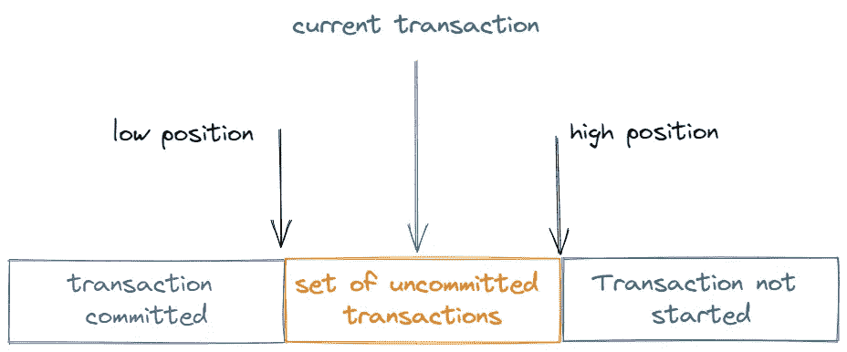
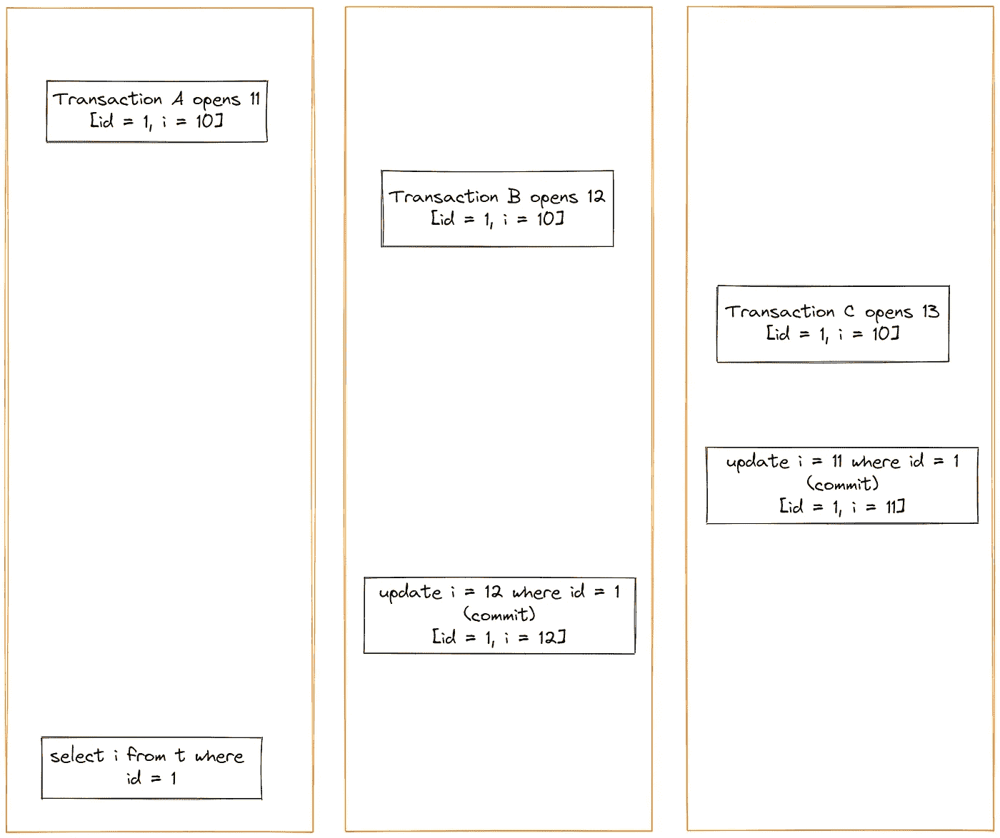
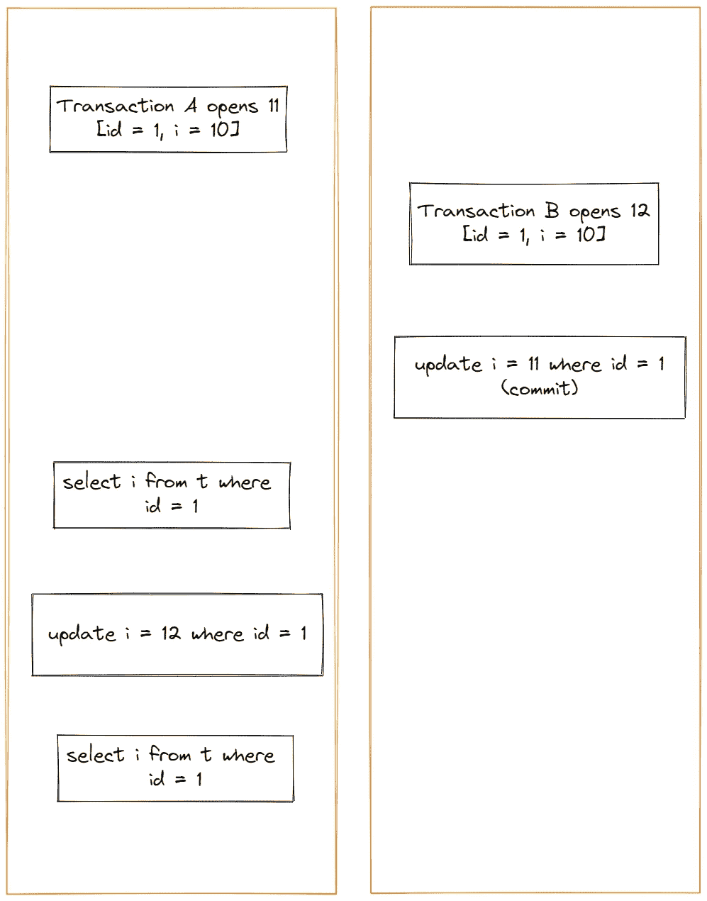

# MySQL MVCC 原理的深入分析

> 原文：<https://betterprogramming.pub/in-depth-analysis-of-the-mvcc-principle-of-mysql-c4a5529e4f5>

## MySQL 和 MVCC


照片由[莉安娜·米卡](https://unsplash.com/@lianamikah?utm_source=medium&utm_medium=referral)在 [Unsplash](https://unsplash.com?utm_source=medium&utm_medium=referral) 上拍摄

当多个事务对同一行数据进行操作时，会出现各种并发问题。MySQL 通过四个隔离级别解决了这些问题。

read uncommitted 隔离级别是最松的，基本上不做隔离，所以实现起来非常简单。

读-提交隔离级别是每次执行一条语句(包括查询和更新语句)，都会生成一个一致的视图，以确保当前事务可以看到其他事务提交的数据。

可重复读取隔离级别的实现是每个事务在打开时都会生成一个一致的视图。提交其他事务时，不会影响当前事务中的数据。为了保证这一点，MySQL 是通过多版本控制机制 MVCC 来实现的。

可序列化隔离级别的隔离级别比较高，是通过锁来实现的，所以 MySQL 有一套锁机制。

读提交和可重复读隔离级别都依赖于 MVCC 多版本控制机制的实现。今天我们将讨论 MySQL 中的 MVCC 多版本控制机制。

# MVCC 多版本控制机制

MVCC 机制使用了`read-view`机制和`undo log`版本链比较机制，使得不同的事务会根据数据版本链比较规则读取版本链上相同数据的不同版本。

## ***撤销日志版本链***

交易开通时，会先申请一个交易 id: `transaction-id`

当事务修改一行数据时，Mysql 会保留修改前数据的撤销回滚日志，并将 transaction id: transaction id 赋给版本记录中的字段`trx_id`。

将这些撤销日志串联起来，形成一个历史版本链，如图所示:



图片来源:作者

注意，这里记录的版本并不是真实的物理存在。真实物理存在的只有最新的记录，其他历史记录都来源于回滚日志。

## ***阅读-查看机制***

可重复读取隔离级别和提交读取隔离级别是通过生成一致的视图(即读取视图)来实现的。

什么是一致的观点？



图片来源:作者

当一个事务启动时，InnoDB 为该事务构建一个数组，以存储该事务启动时所有活动的事务 id。活动意味着它已启动，但尚未提交。

数组中 id 的最小值为低位，最大值+ 1 记录为高位，这是一致性视图。

每个事务在进行查询时，会根据一致性视图的可见性规则，推导出撤销日志版本链中相应的数据。

# ***一致视图的可见性规则***

*   如果当前事务`id`落在紫色部分，说明这个版本是提交的事务或者是当前事务自己生成的，这个数据是可见的。
*   如果当前事务`id`落在蓝色部分，说明这个版本是未来开始的一个事务生成的，肯定是看不见的。
*   如果当前交易`id`属于橙色部分，则包括两种情况:

A.如果行`trx_id`在数组中，说明这个版本是由一个还没有提交的事务生成的，不可见。

B.如果行`trx_id`不在数组中，意味着这个版本是由提交的事务生成的，可见。

# **案例 1**



图片来源:作者

图中交易 A 查询的`i`是什么？先来分析一下。

按照从上到下打开事务的顺序，每一个事务对应的一致性视图如下:

`transaction A [11]`的一致性视图数组

`transaction B [11,12]`的一致性视图数组

`transaction C [11, 12, 13]`的一致性视图阵列

当查询事务 A 时，撤销日志版本链是:

```
{trx_id=11,id=1,i=10,roll_pointer=0}>>>{trx_id=13,id=1,i=11,roll_pointer=1}>>>{trx_id=12,id=1,i=12,roll_pointer=2}
```

`{}`代表版本记录。

`>>>`代表回滚日志 undo log。

查询交易 A 时，交易 B 和交易 C 属于未来交易，对交易 A 不可见。

所以交易 A 查询的数据是通过最新的数据记录:`i = 10`按照`undo log`连续前滚和回滚得到的数据。

# **案例二**



图片来源:作者

交易 A 查询 1 的结果是什么？

交易 A 查询 2 的结果是什么？

根据一致性视图可见性规则分析，对于事务 A，事务 B 是未来事务，对事务 A 是不可见的，所以查询结果 i=10。

查询 2 的结果是`i = 12`，为什么？我们先来看两个概念。

在可重复读取隔离级别中，通过回滚日志来查找相应版本记录的读取方法是一致读取。

而不是回滚，你只需要读取记录的最新版本就是当前读取的。

如果事务中有 update 语句，update 语句以当前读取模式读取版本记录中的最新数据，然后执行更新操作，所以上图中的查询结果是`i = 12`。

以下两种查询方法也是当前读取的:

```
select k from t where id=1 lock in share mode;

select k from t where id=1 for update;
```

以上是 MVCC 机制。根据其规则，该机制仅在可重复读取隔离级别和读取提交隔离级别下可用。

*感谢您阅读这篇文章。*

*敬请关注。*