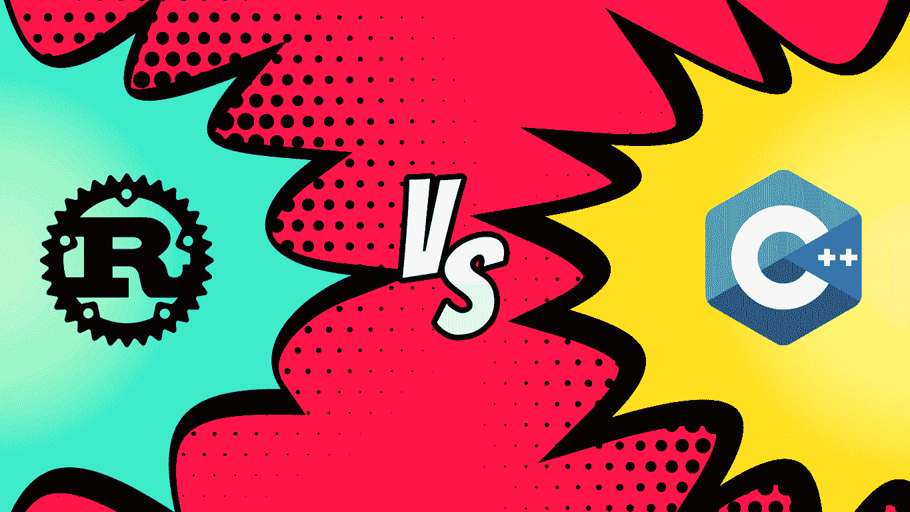

# Rust 和 C++的深入比较

> 原文：<https://betterprogramming.pub/in-depth-comparison-of-rust-and-cpp-579b1f93a5e9>

## 基准、权衡等等

Rust 和 C++对比| [Photo](https://i0.wp.com/www.onmsft.com/wp-content/uploads/2019/07/Rust_versus_C.png) by [OnMSFT](https://www.onmsft.com/)

上个月，我写了两篇关于 T4 语的文章。写一门特定语言的问题是，我还没有真正提出一个案例来说明为什么我喜欢的这门语言优于其他语言，而这正是我今天想要做的。

我的编程历史始于我六岁的时候，有一天我叔叔把我拉到一边，非常严肃地问我，我是否想学他做的事情。

我诚恳地回答是，然后他马上开始安排我学习 C 语言。很快，C 变成了 C++，然后，我迷上了 Python。我对 Python 的兴趣一直困扰着我。

与 C++之类的东西相比，Python 的语法感觉完全陌生，直到今天，我仍然不知道是什么驱使我去学习它，但这是我一直坚持的东西。(讽刺…)

然而过了一段时间，Python 变成了 Java，Java 变成了 JavaScript，JS 变成了 C#。然后，在我回到 C++的旅途中，我遇到了一种新的语言:Rust。

现在我们已经了解了一些我的背景，让我们从生态系统开始比较。

# 生态系统

当你比较编程语言时，你必须比较它们背后的生态系统。仅仅看原始的统计数据是不够的，你必须更深入地观察语言背后的生态系统。

开发和积极维护的库的数量让你知道你能从语言和围绕它的开发人员社区中得到什么。

具体来说，比较 Rust 和 C++，C++显然是赢家。Rust 提供了一套强大的库和框架，但是 C++有更多可供选择的，而且它背后的社区中有更多活跃的开发人员。

为了节省时间，我们将看三个类别:web、游戏和 UI 开发。

## **网页**

像 [Rocket](https://rocket.rs/) 、 [Actix](https://crates.io/crates/actix-web) 或 [Nickel](https://crates.io/crates/nickel) 这样的箱子允许用 Rust 语言快速开发小规模甚至大规模的 web 应用程序。像这样的板条箱是 Rust 背后的社区的黄金标准，尽管还有相当多的其他选项，如 [Warp](https://crates.io/crates/warp) 和 [Gotham](https://crates.io/crates/gotham) 。

C++在这个部门有几个选项，比如 [CppCMS](https://github.com/artyom-beilis/cppcms) 和 [Wt](https://www.webtoolkit.eu/wt/) 。还有更多，但这是我能想到的两个。

## **游戏**

游戏开发是一个热门话题，原因有很多，C++是游戏开发中最流行的语言之一，如果不是最流行的话，主要是因为它的低级、高性能方面。

Rust 在游戏开发中并不那么受欢迎，主要是因为它是一种更新的语言，对框架等的选择更少。然而，最近一段时间，对 Rust 进行游戏开发的兴趣激增，因为对 Rust 作为一种语言的兴趣激增。

在 C++中有很多用于游戏开发的库选项。每一个都有它的优点，尽管有些在不止一两个方面比其他的好。一个这样的选项是 [Godot](https://github.com/godotengine/godot) 。Godot 是一款游戏引擎，与《统一 T21》和《虚幻 23》没有什么不同，尽管没有那么完美。它是开源的，就像许多 C++选项一样。

然而，Rust 是一个不同的故事。Rust 语言的游戏开发选项并不多，主要是因为该语言及其社区的不成熟。

Rust 里的游戏引擎有两个大牌:[活塞](https://www.piston.rs/)和[紫水晶](https://amethyst.rs/)。这些引擎和 Godot 一样，都是开源的，在 GitHub 上有存储库。

## **用户界面**

UI 开发是另一个受欢迎的领域。C++通常不是 UI 开发的首选，因为这种语言固有的底层特性，Rust 也是如此。

然而，对于那些倾向于花额外的时间使用这些语言提供的额外的低级控制的人来说，用户界面有相当多的选择。

C++的一个例子是 [GTKmm](https://www.gtkmm.org/en/) ，它是流行的 [GTK+ C 库](https://www.gtk.org/)的现代 C++接口。该库维护得很好，并且以 GNU 的方式开放源代码。

Rust 领域的一个例子是 [Azul](https://azul.rs/) ，一个开源的即时模式 GUI 框架。比较新，但是更新频繁，背后有活跃的社区。

关于生态系统，有一个明显的赢家，C++中的。它只是总体上比 Rust 更广泛，尽管两者都有活跃、热情的用户基础。

接下来，我们将深入了解每种语言的技术细节，并对两者进行比较。

# 技术比较

当比较两种编程语言时，人们往往最关注的是它们背后的技术细节，比如性能基准等等。

在像 C++这样的动态类型语言中，很容易忽略代码中的问题。Rust 可以被描述为一种静态类型的语言，因为它的代码验证过程比 C++严格得多。

Rust 对安全性和代码质量的要求比 C++更严格，这是支持 Rust 的最大理由之一。

例如，为了防止数据竞争，Rust 的所有权系统确保没有两个线程可以引用相同的数据而不借用或获取它的所有权，这使得它对任何其他线程都不可用。

## 内存安全

系统级语言的标准是没有自动内存管理，因为像垃圾收集器这样的特性会损害性能。

因此，为了保持速度，C++绝不是内存安全的。所以，Rust 这种系统级语言怎么可能是内存安全的呢？

如前所述，Rust 有一个所有权系统，它强制执行许多内存安全保证。这种所有权系统消除了手动内存管理过程的需要，而这是 C 或 C++的基本要求。

最近，C++实现了一些 RAII(一种编程习语:*资源获取是初始化*)特性，消除了一些手动内存管理的需要。然而，这些特性并没有真正涵盖 C++在内存安全方面的所有问题。

## 易用性

几乎所有使用 Rust 的人都可以说，由于定义良好的语义和防止不必要的行为，用这种语言编程更容易。在 C++中，开发人员在试图避免未定义的行为时会遇到更多问题。

扩展上述内容，与 Rust 相比，C++是一个深海，因为 C++有如此多的特性和实现机会，以至于跟踪它会变得很有挑战性。

然而，Rust 并不是为初学者设计的简单语言。就像 C++一样，它是一种复杂的系统级语言，可以帮助你理解机器在引擎盖下的工作方式。

## 抽象

在 C++或 Rust 中，人们通常更喜欢使用代码复制而不是虚拟方法调用，因为它们的性能成本很高。然而，每种语言都提供了零成本的抽象特性，这在很大程度上解决了这个问题。

## 两颗北极指极星

*指针*是包含内存地址的变量的一般概念。该地址引用或“指向”一些其他数据。

大多数低级语言都有某种形式的指针，它们通常与语言的其他特性结合使用。

*另一方面，智能指针*是数据结构，不仅充当指针，还具有额外的元数据和功能。

C++有类似于`std::shared_ptr`和`std::unique_ptr`的类型，它们充当具有特殊功能的指针。在 Rust 中，标准库中定义的不同智能指针提供的功能超出了引用所提供的功能。

一个例子是*引用计数*智能指针类型。该指针通过跟踪所有者的数量，使您能够拥有多个数据所有者，并在没有所有者时清理数据。

Rust 和 C++都大量使用对象形式的智能指针，如 Rust 中的`String`或 C++中的`std::string`。它们为开发人员提供了他们多年来一直期待的特性，并且在大多数工作中非常有用。

## 原始数字

Rust 没有任何特殊的功能使它变得更快，也不同于 C 和/或 C++。它比 C++安全得多，因为它遵循的保护机制原则上在 C++中也是可行的(使用`std::unique_ptr`和`std::shared_ptr`)。

为了实现 Rust 所拥有的同样的安全性，我们必须明确地这样做，并制定标准和强制模式，以增加开发工作。使用 Rust，使它更安全的主要部分是编码错误不会产生运行时错误——它会产生编译错误。

当 Mozilla 谈论他们可以从 Servo 的渲染引擎中获得比地球上其他浏览器多多少的性能时，这不是因为 Rust 正在做一些用 C++不可能做到的事情，而是因为 Rust 使它可以用更少的显式编程工作更安全地实现。

这意味着，Rust 中的性能之所以会发生，是因为有了这些保证，开发人员可以更放心地探索更高性能的方法。

## 曼德尔布罗特

*   C++ — 1.51 秒
*   生锈— 1.7 秒

## 法斯塔

*   C++ — 1.46 秒
*   生锈— 1.51 秒

## 皮迪格茨

*   C++ — 1.89 秒
*   生锈— 1.75 秒

## n 体

*   C++ — 7.7 秒
*   生锈— 5.98 秒

请记住，这些数字是任意的，也取决于许多不同的变量。对于那些对更详细的性能指标评测信息感兴趣的人，下面提供了一个性能指标评测的链接。

# 结论

Rust 比 C++好还是 c++比 Rust 好，这个问题很难不带偏见地回答。

给定这些数字，Rust 对于某些任务来说更好，但是在基准测试中肯定有误差的空间，并且你在上面看到的数字可以根据不同的变量而改变，比如硬件设置等等。

感谢您的阅读。

# 资源

*   [基准测试:Rust 与 C++](https://benchmarksgame-team.pages.debian.net/benchmarksgame/fastest/gpp-rust.html)
*   [为什么要学 Rust](https://medium.com/better-programming/why-rust-d52516e70ab8)
*   [为什么要学习 C++](https://medium.com/@karrighan/why-should-you-learn-cpp-f5863969ad69)