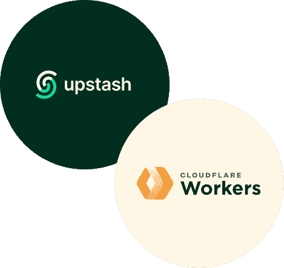
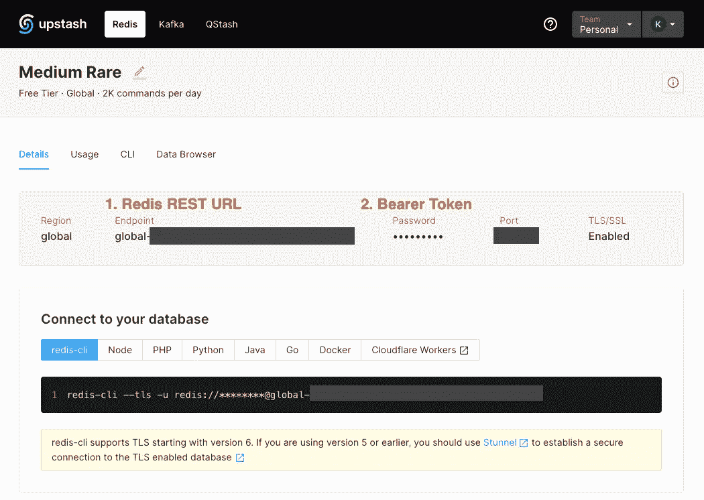
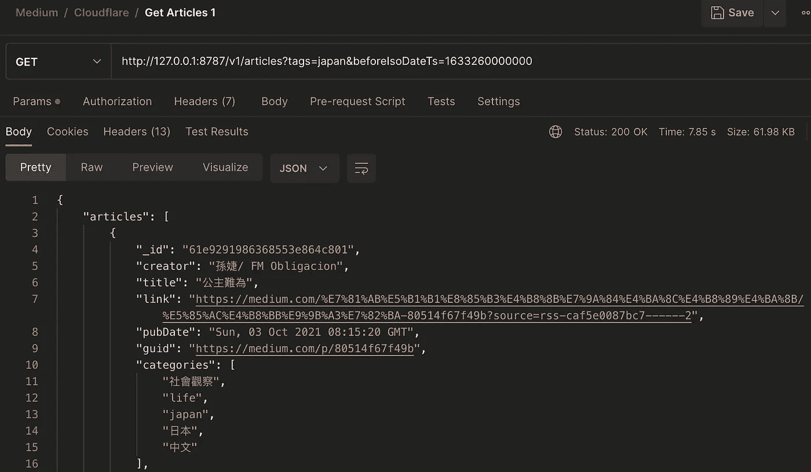
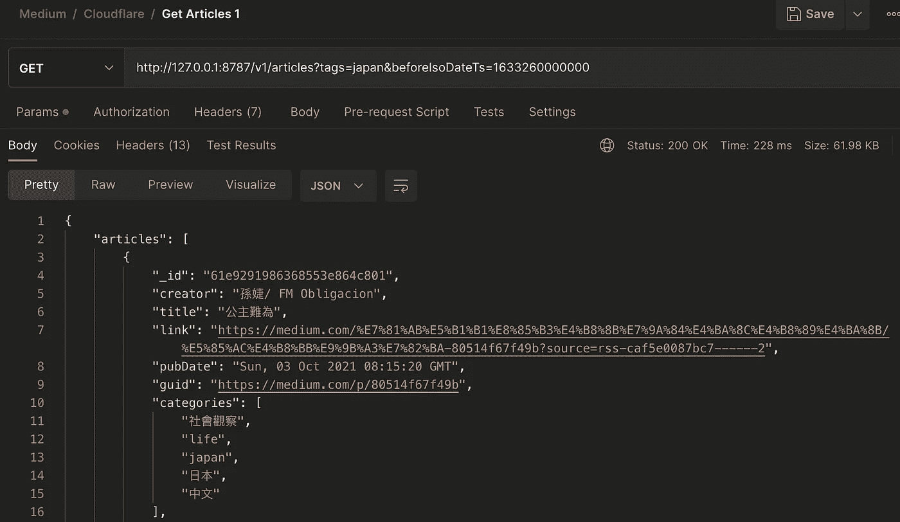

# 面向 Cloudflare 工作人员的内存数据库

> 原文：<https://betterprogramming.pub/in-memory-database-for-cloudflare-workers-b9c61810ef37>

## 使用 Upstash 无服务器 Redis - Cache 计算结果来加速您的 Cloudflare Workers API！



Cloudflare | [Upstash](https://upstash.com/cloudflareworkers) 的无服务器数据

> 第 1 部分:[将 Node.js 应用从 Heroku](/migrating-a-node-js-app-to-cloudflare-workers-from-heroku-62c679552af)
> **迁移到 Cloudflare Workers 第 2 部分:** **使用 Upstash**
> 的 Cloudflare Workers 内存数据库第 3 部分:在 Cloudflare Workers 中使用 [Cloudflare KV](https://developers.cloudflare.com/workers/learning/how-kv-works/) 数据存储(进行中)
> 第 4 部分:Cloudflare Workers 的调试和日志管理(进行中)

> [中稀有](https://medium-rare.vercel.app/)就是我们这里举例的 app。MR 是一个在媒体平台上索引和分发中文文章的网络应用。

## 前言

在第 1 部分中，我们讨论了将 Node.js 应用程序[迁移到 Cloudflare workers](/migrating-a-node-js-app-to-cloudflare-workers-from-heroku-62c679552af) 。我们了解到 [CF Workers 的策略是支持可以通过 HTTP](https://blog.cloudflare.com/workers-adds-support-for-two-modern-data-platforms-mongodb-atlas-and-prisma/) 连接的数据库以及 MongoDB 数据 API 的使用。其实适用于 MongoDB 的，同样适用于 Redis！虽然 CF Workers 确实有自己的 [Workers KV 服务](https://developers.cloudflare.com/workers/runtime-apis/kv/)，但是让我们在这里探索一下如何使用 Upstash，我们将在下一篇文章中研究一下如何使用 KV。

## 目标

在这一章中，我们将逐步向查询 MongoDB 文章的 API 添加缓存功能。在缓存之前，文章 API 大约需要 4-8 秒。而在添加缓存后，在我们的例子中，它减少到 0.5-1 秒！

事不宜迟，以下是步骤:

```
1\. Create a free Upstash account and grab the REST URL and token
2\. Implement a cache service
3\. Modify the API
```

## 1.在这里创建一个新账户

并获得您的 Redis REST URL 和不记名令牌



并将其保存在您的`wrangler.toml`中:

```
UPSTASH_REDIS_REST_URL = "<your-redis-rest-url>"
UPSTASH_REDIS_REST_TOKEN = "<your-bearer-token>"
```

在本地使用之前，记得`wrangler publish`将其同步到 CF！

## **2。为 CF Workers 实现一个 Upstash HTTP 服务**

[Upstash REST API 遵循与 Redis 协议相同的约定](https://docs.upstash.com/redis/features/restapi#api-semantics)。例如，如果我们想要`SET articles "[{"title":"Using Upstash in CF Workers!"}]"`，我们可以向路径`/set/articles`发出一个`POST`请求，以文章数组作为请求负载。

一次又一次地编码`fetch`逻辑可能是重复的。为什么不创建两个可重用的方法- `cache.get`和`cache.set`？

## **3。修改文章 API**

[在第 1 部分](/migrating-a-node-js-app-to-cloudflare-workers-from-heroku-62c679552af)中，我们的 Articles API 直接在 MongoDB 上查询文章。我们先修改一下，看看有没有缓存。如果有缓存，只需返回缓存。如果没有，执行相同的逻辑来查询 MongoDB。

我们在步骤 5 中使用了`context.executionCtx.waitUntil`，这样我们就不需要`await`来完成缓存保存。如果我们跳过`await`而不使用`waitUntil`，那么 [CF Workers 就有可能在我们返回`articles` JSON 之后终止缓存保存逻辑](https://developers.cloudflare.com/workers/runtime-apis/fetch-event/#waituntil)。注意`context.executionCtx.waitUntil`是一种 [hono](https://honojs.dev/docs/api/context/#cexecutionctx) 的东西。你可以在这里找到原生 CF 工人 [waitUntil](https://developers.cloudflare.com/workers/runtime-apis/fetch-event/#waituntil) doc！

# 庆祝一下！

这是我们添加缓存层之前的响应时间。大约需要 7.8 秒



这是之后的响应时间，不到 0.5s！



# 收场白

Upstash 是一个惊人的数据基础设施平台，专门用于无服务器和边缘运行时。如果您正在使用(或计划使用)多个无服务器和边缘运行时，这是一个很好的选择。或者您希望减少对 CF 供应商的依赖。

然而，如果你想更多地了解 CF 的产品。CF [Workers KV service](https://developers.cloudflare.com/workers/runtime-apis/kv/) 提供了与 KV 的高度集成，并拥有更大的自由层(每天高达 100，000 次读取操作和 1，000 次写入、删除、列表操作)，而 Upstash 的自由层每天高达 10，000 次命令。在下一章中，让我们和我们的员工一起探索 KV 的使用。