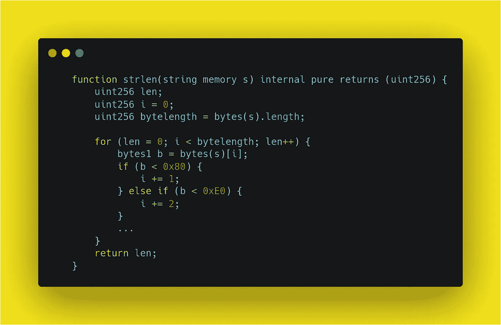
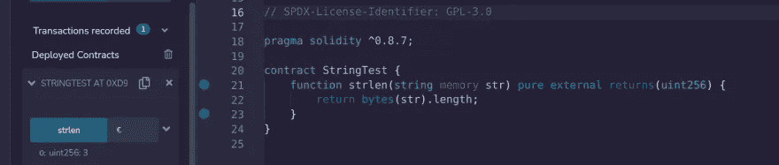
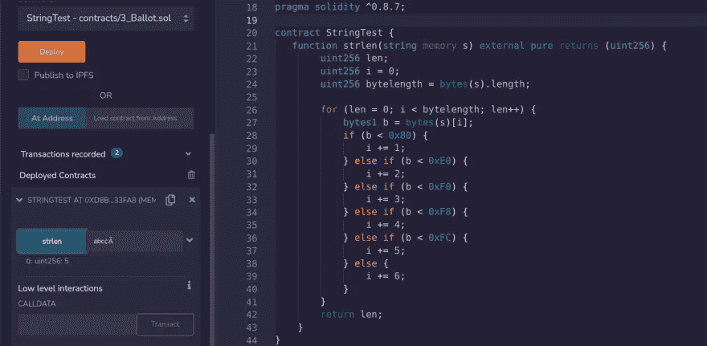

# 如何在固体中找到绳子的长度——从“ens”的智能合同谈起

> 原文：<https://betterprogramming.pub/in-the-world-of-javascript-finding-the-length-of-string-is-such-an-easy-thing-just-do-str-length-4b4b33dbed09>

## *为什么字节(str)。长度不足以获得 Solidity 中字符串的长度——让我们从 ens* 的契约中理解 strlen 方法



求绳子的长度

在 Javascript 的世界里，找到字符串的长度是一件非常简单的事情
只要做`str.length`就可以了。

但是字符串在 Solidity 中工作就不那么友好了。

在 solidity 中，字符串是存储在数组中的一组字符，以字节存储数据。

**字符串类型中没有长度方法。**

我浏览了 Buildspace 的 [build-polygon-ens](https://buildspace.so/p/build-polygon-ens) 项目，找到了`[StringUtils.sol](https://gist.github.com/AlmostEfficient/669ac250214f30347097a1aeedcdfa12)`的链接

我知道如何确定字符串的长度，我们可以把字符串转换成字节，然后确定它的长度。所以这应该和做`bytes(str).length;`一样简单，但是这个 util 文件中的方法有点不同:

```
// SPDX-License-Identifier: MIT
// Source:
// https://github.com/ensdomains/ens-contracts/blob/master/contracts/ethregistrar/StringUtils.sol
pragma solidity >=0.8.4;library StringUtils {
    /**
     * @dev Returns the length of a given string
     *
     * @param s The string to measure the length of
     * @return The length of the input string
     */
    function strlen(string memory s) internal pure returns (uint256) {
        uint256 len;
        uint256 i = 0;
        uint256 bytelength = bytes(s).length; for (len = 0; i < bytelength; len++) {
            bytes1 b = bytes(s)[i];
            if (b < 0x80) {
                i += 1;
            } else if (b < 0xE0) {
                i += 2;
            } else if (b < 0xF0) {
                i += 3;
            } else if (b < 0xF8) {
                i += 4;
            } else if (b < 0xFC) {
                i += 5;
            } else {
                i += 6;
            }
        }
        return len;
    }
}
```

它有一个我无法理解的奇怪的代码循环。

所以，我的开发人员谷歌了一下，但是我看到的所有文章都是为了找到字符串的长度`bytes(str).length;`我在 Stackoverflow 上找到了一些类似的代码，但是没有人真正解释里面发生了什么。

```
for(len = 0; i < bytelength; len++) {
            bytes1 b = bytes(s)[i];
            if(b < 0x80) {
                i += 1;
            } else if (b < 0xE0) {
                i += 2;
            } else if (b < 0xF0) {
                i += 3;
            } else if (b < 0xF8) {
                i += 4;
            } else if (b < 0xFC) {
                i += 5;
            } else {
                i += 6;
            }
  }
```

经过 3 个小时的自我探索，我自己能够弄明白了(有点慢，但我做到了)。

所以我想让我们把它写下来，这样对所有像我一样的人(对比特、字节 0️⃣1️⃣).不是很有经验)会有帮助

# 所以现在，让我们试着解开/解码这个

## How 字节(str)。长度工程

当我们将字符串转换成字节时，Solidity 就是这样做的:

```
// if we do bytes("xyz"), solidity converts it as 
xyz -> 78 79 7a // 78=x, 79=y, 7a=z
ABC -> 41 42 43 // 41=A, 42=B, 43=C
```

注意:使用这个[网站](https://onlinestringtools.com/convert-string-to-bytes)将字符串转换成字节。

如果你看到每个字符产生 1 个字节。这就是为什么当我们做字节("")的时候？我们得到了绳子的长度，

但是有些字符的生成字节数不止一个。例如:

```
€ -> e2 82 ac
```

对于欧元的符号，生成的字节是 3。

因此，如果我们试图找出包含欧元符号的字符串长度，那么`bytes(str).length`返回的长度将不会返回该字符的正确字符串长度，因为 **€** 生成了 3 个字节:



这就是我们在上面看到森林循环来拯救我们的时候了。

让我们遍历这个`e2 82 ac`字节数组，并检查循环内部发生了什么:

```
for(len = 0; i < bytelength; len++) {
            bytes1 b = bytes(s)[i];
                        // b = e2 for first iteration
            if(b < 0x80) {
                i += 1;
            } else if (b < 0xE0) {
                i += 2;
            } else if (b < 0xF0) {
                i += 3;
            } else if (b < 0xF8) {
                i += 4;
            } else if (b < 0xFC) {
                i += 5;
            } else {
                i += 6;
            }
  }
```

对于第一次迭代`b=e2`,下面一行有一个条件:

```
if(b < 0x80) {
     i += 1;
}
```

我们来解码一下。这种情况基本上会比较这些十六进制字符的十进制值:

```
0x80 -> 128
// our b is e2 at the moment, decimal value for e2 = 226
0xe2 -> 226
```

对于常规字符，其十六进制字符的十进制转换将是`< 128`，像对于`a`，它是 97

所以，如果我们像这样检查所有条件:

```
for(len = 0; i < bytelength; len++) {
            bytes1 b = bytes(s)[i];
            if(b < 0x80) { //0x80 = 128 => 226 < 128 ❌
                i += 1;
            } else if (b < 0xE0) { //0xE0 = 224 => 226 < 224 ❌
                i += 2;
            } else if (b < 0xF0) { //0xF0 = 240 => 226 < 240 ✅
                i += 3;
            } 
                        ...
  }
```

所以，现在我们的`i is 3`，

因此，for 循环中的条件将是`3<3`，这是假的，循环将中断

`len will be 1`此刻

> *仅此而已，就是字符串长度的正确值****【€】***

*如果你想尝试更多像“ **€** ”这样的字符串，这里有一个占用超过 1 个字节的字符列表:*

```
*€ -> e2 82 ac 
à -> c3 83
¢ -> c2 a2*
```

*例如，创建一个类似于`abc¢Ã`的随机字符串，并进行测试。*

*哒哒！现在成功了。*

**

```
***Want to Connect?**Connect with me on [Twitter](https://twitter.com/pateldeep_eth): [@pateldeep_eth](https://twitter.com/pateldeep_eth) Linkedin: [Linkedin](https://www.linkedin.com/in/patel-deep-dev/)Originally published at [https://pateldeep.xyz/](http://pateldeep.xyz/)*
```