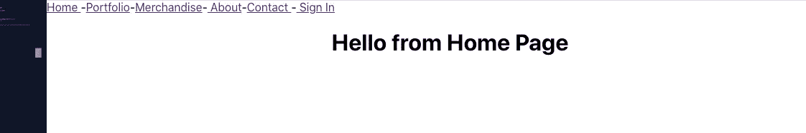
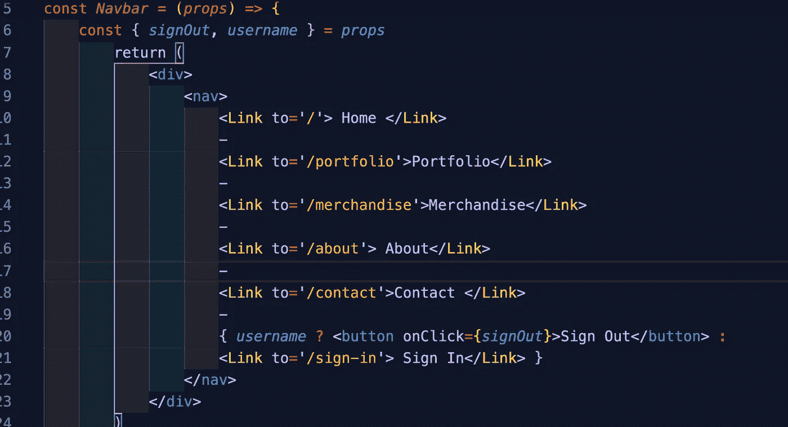
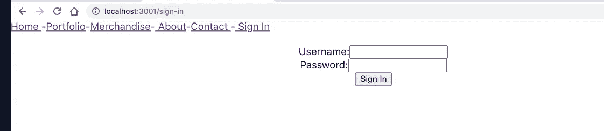
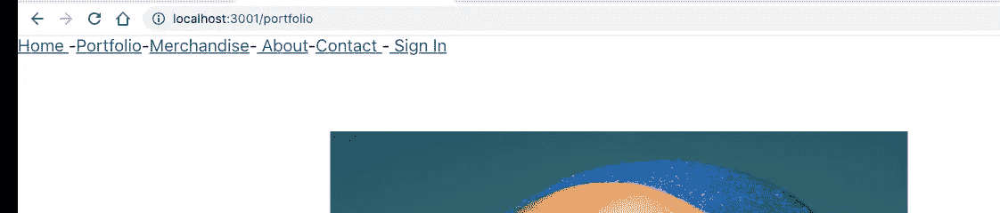
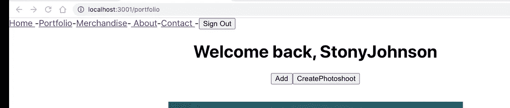
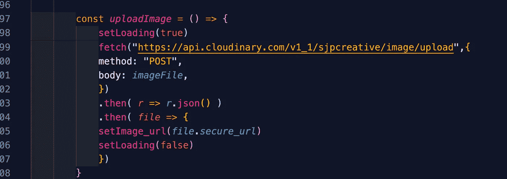

# 你应该以什么顺序开始你的前端？

> 原文：<https://betterprogramming.pub/in-what-order-should-you-start-your-frontend-1bd2fcfeecff>

## 您是从设计还是组件功能入手？

由[沙哈达特·拉赫曼](https://unsplash.com/@hishahadat?utm_source=medium&utm_medium=referral)在 [Unsplash](https://unsplash.com?utm_source=medium&utm_medium=referral) 上拍摄的照片。

# 1.创建骨架组件

用最少的资源创建一个框架组件，如下图所示:

# 2.创建并测试组件路由(可能是一个导航条)

# 3.创建一个登录表单并测试身份验证

确保您将令牌存储在`localStorage`中，这样当您刷新时，您的用户状态不会回到默认的清除状态。

# 4.将它们分为授权组件和未授权组件

# 5.根据用户是否被授权创建条件呈现

对于我的 mod 5 项目，我希望管理员只有在登录时才能看到执行 CRUD 操作的按钮:

如果您没有登录，您将看不到任何按钮:

现在管理员登录了，你可以清楚地看到两个按钮:一个用于创建照片，另一个用于向你的文件夹添加图像。此外，注销按钮仅在有人登录时才呈现。

# 6.如果一个组件变得太复杂，继续前进，稍后再回来

对我来说，上传功能很复杂，需要很长时间。在某些时候，我不得不转到联系页面，然后回来上传。你最不想做的事情就是在一个问题上浪费时间。接受我的建议:继续前进，然后带着全新的视角回来。真的很有帮助！

如果你和我一样，你会离开 CSS 直到你完成所有的核心功能。对我来说，最后做所有的 CSS 是有意义的。

我希望这能帮助那些想开始一个完全堆叠的 web 应用程序，但不确定如何构建前端的人。