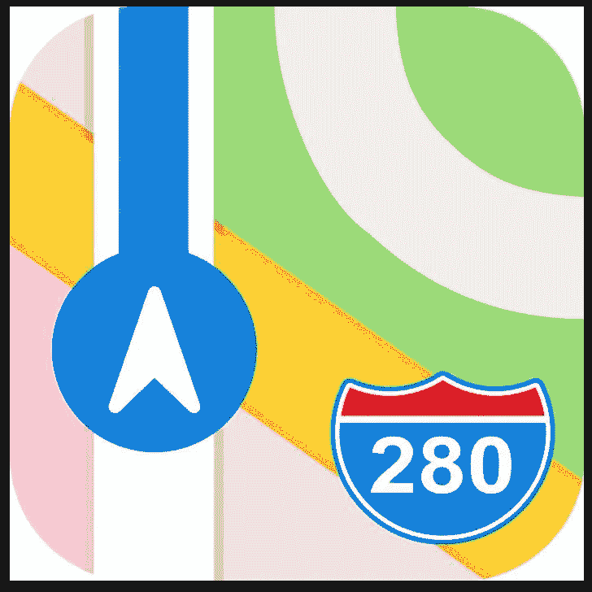

# 在 React 原生应用程序中整合苹果地图和自动完成功能

> 原文：<https://betterprogramming.pub/incorporating-apple-maps-with-autocomplete-in-a-react-native-application-31b56befef3>

## 如何找到你在哪里，你要去哪里



地图做了一件很棒的工作，以可视化的方式给用户一种感觉，让他们知道自己在哪里，下一步想去哪里。通常情况下，提供定位服务的应用程序会在屏幕上显示地图，让用户获得更具互动性的体验。要在 React Native 开发的 iOS 应用程序中为您自己的用户提供相同的体验，请遵循以下步骤！

# 步骤 1:安装工具

本教程将使用 Xcode 项目的 CocoaPods 包管理器。要安装 CocoaPods，请运行:

`sudo gem install cocoapods`

# 步骤 2:安装地图库

在您的终端中，导航到您的项目目录并运行以下命令:

`npm install react-native-maps --save`

这将允许您在应用程序中使用 React 原生地图，如果需要的话，还支持 Google Maps。

# 步骤 3:创建 pod 文件并安装 pod

Podfile 允许您轻松地列出并安装您希望在项目中使用的不同依赖项，类似于 Ruby 中的 Gemfile。在 React 本地项目的`ios/`文件夹中创建一个 Podfile，并使用下面的示例开始:

一旦用正确的依赖项创建了 Podfile，用您的项目名替换`_YOUR_PROJECT_TARGET_`,回到您的终端，导航到您的项目的 iOS 目录(您创建 Podfile 的地方),运行命令`pod install`。

这个命令将安装所有的 pods 并创建一个新的`.xcworkspace`文件，您可以使用它在 Xcode 中构建您的项目。或者，通过移回根目录并运行`cd ..`导航回根目录并运行`react-native run-ios`运行应用程序来开始构建。

# 步骤 4:添加地图

添加完所有依赖项后，我们就可以为您的应用程序添加地图了！将以下导入语句添加到地图组件的顶部:

```
import MapView from 'react-native-maps';
```

将以下代码片段添加到渲染方法中，以显示具有固定初始位置的地图:

你可能会注意到你的地图不见了。这与样式有关，所以继续添加这些静态样式，以便在包装容器的视图中使用:

这些样式将使您在屏幕顶部加入自动完成组件。如果在您的用例中不需要它，您可以在这里停下来，将您的样式组件简化为:

```
const styles = StyleSheet.create({
  map: {
    ...StyleSheet.absoluteFillObject,
  },
});
```

您可能希望允许显示的位置发生变化。在状态中维护地图坐标将允许您灵活地执行以下操作:

在整合了这些零碎的东西之后，您的组件看起来将非常像这样:

希望您的地图加载成功并导航到旧金山的一个区域！

# 第五步:添加标记

标记使用户可以直观地精确定位他们在地图上的位置。您可能已经注意到，我们当前的地图不包括这样的功能，所以让我们继续添加一个。

# 步骤 6:安装地点自动完成

为了让用户与地图更紧密地交互，我们希望使用一个自动完成功能，该功能获取一个地址，并将其转换为在地图上呈现该地址所需的坐标。安装`react-native-google-places-autocomplete`将使这种集成更加容易。

要安装，导航回您的终端并在您的项目的根目录下运行:`npm install react-native-google-places-autocomplete --save`。

# 步骤 7:添加自动完成组件

现在我们已经安装了 React Native Places Autocomplete，让我们将它添加到地图中。

将以下内容添加到组件中:

确保获取您的 [Google Places API 键](https://developers.google.com/places/web-service/get-api-key)，并将其添加到组件的`query`参数中。

您将会注意到模拟器屏幕顶部有一个输入框——继续并开始键入地址，然后观察将会根据您的输入生成的建议！上面的实现不处理地址选择，但是添加 onPress 方法将允许您获取所选的地址，并将其作为参数传递给呈现地图的 MapView。这一调整将允许您看到地图上呈现的所选地址。

这就是将苹果地图整合到您的应用程序中所需要的一切！