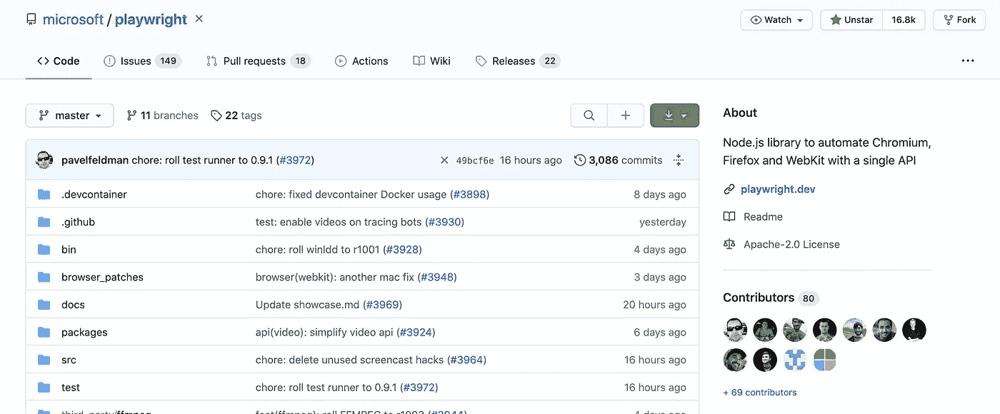
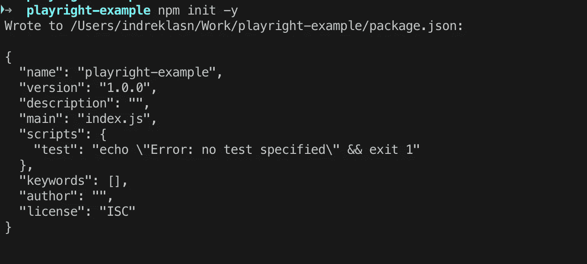
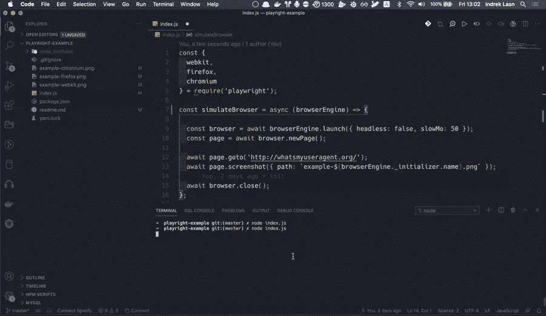
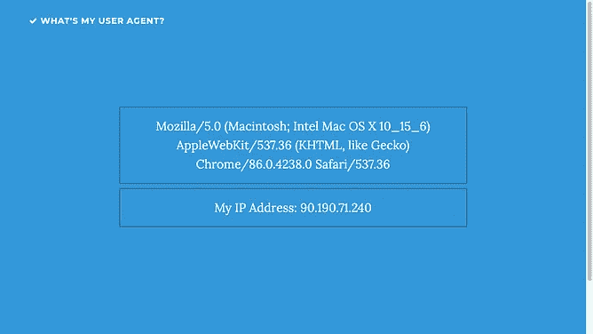
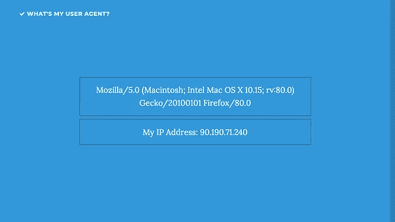
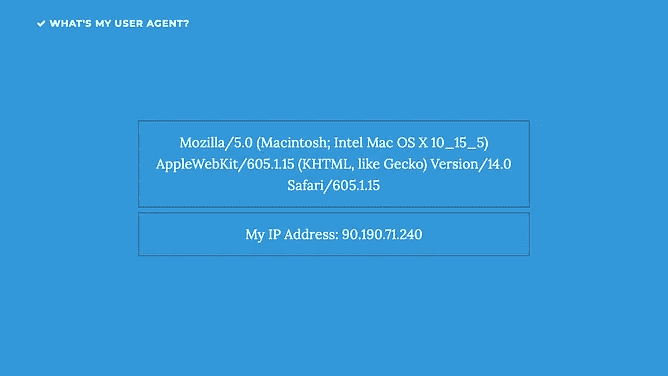

# 使用 Node 和剧作家，通过自动化浏览器测试提高您的工作效率

> 原文：<https://betterprogramming.pub/increase-your-productivity-with-automated-browser-tests-using-node-and-playwright-e904962b83a0>

## 当用一个无头浏览器和 Node.js 测试你的应用程序时，什么、为什么和如何


照片由 [Richy Great](https://unsplash.com/@richygreat?utm_source=medium&utm_medium=referral) 在 [Unsplash](https://unsplash.com?utm_source=medium&utm_medium=referral) 上拍摄

无头浏览器擅长快速执行 JavaScript 代码，并在不同设备上模拟点击或悬停页面上的元素。在测试网络活动、模拟网络请求和测试不同的地理位置时，无头浏览器也非常有用。

你想做以上所有事情的原因是，在你把你的代码投入生产之前，要确保所有的事情都按照预期的那样工作。

您可以编写 UI 测试并将其集成到您的构建过程中，而不是手动浏览每个页面并检查错误。

您为交互编写代码，比如单击或悬停在页面上的元素上。无头浏览器在后台自动运行，并在整个过程的不同点生成截图。

# 无头浏览器很快

无头浏览器通常比真正的浏览器更快。因为您没有启动浏览器 GUI，所以您可以跳过真正的浏览器加载 CSS 和 JavaScript 以及呈现 HTML 的时间。

# 何时不使用无头浏览器

以下是您可能不决定使用无头浏览器的几个原因。

*   你需要模仿真实的用户。当你运行无头测试时，你并没有真正模仿真实的用户体验。你只需点击鼠标，确保代码按预期运行。
*   您的最终用户或客户没有使用无头浏览器。你不会想关注那些只发生在无头模式下的错误。
*   如果您需要进行大量的浏览器调试，那么无头模式对于调试来说是一个很大的挑战。

编写无头浏览器测试有多种解决方案。今天我们要去看看[剧作家](https://github.com/microsoft/playwright)图书馆。

# 为什么要用剧作家？

剧作家是一个 Node.js 库，用一个 API 来自动化 [Chromium](https://www.chromium.org/Home) 、 [Firefox](https://www.mozilla.org/en-US/firefox/new/) 和 [WebKit](https://webkit.org/) 。剧作家库是为了实现跨浏览器的 web 自动化而构建的，它经久不衰、功能强大、可靠且快速。



剧作家是一个无头浏览器测试库—[https://github.com/microsoft/playwright](https://github.com/microsoft/playwright)

剧作家让你自动化和测试单页应用程序和渐进式网络应用程序使用的广泛和不断增长的网络浏览器功能。

# 以下是剧作家库中包含的内容

*   测试跨多个页面、域和 iframes 的场景
*   自动等待元素准备就绪后再执行操作(如单击、填充)
*   拦截网络活动以阻止和嘲弄网络请求
*   模拟移动设备、地理位置、权限
*   通过阴影穿透选择器支持 web 组件
*   鼠标和键盘的本机输入事件
*   测试文件上传和下载按预期工作

# 入门指南

让我们假设您已经安装了节点。(如果没有也没关系，去[官方 Node.js 网站](https://nodejs.org/en/)下载安装。)

接下来，让我们为项目创建一个文件夹，并在文件夹中初始化一个新的节点项目。

```
mkdir playright-example && cd playright-example && npm init -y
```



创建新的节点项目

一旦我们建立了节点项目，让我们开始编写无头浏览器测试。为了做到这一点，我们需要安装剧作家库并创建一个名为`index.js`的文件，我们在其中编写测试代码。

```
touch index.js && npm i -D playwright
```

这将为 Chromium、Firefox 和 WebKit 安装剧作家和浏览器二进制文件。安装后，您可以导入剧作家库。

# 编写无头浏览器测试

为了简单起见，对于我们的第一个无头浏览器测试，我们转向`whatsmyuseragent.org`并截取页面截图。

`whatsmyuseragent.org`是一个显示你的用户代理版本和数据，以及你的 IP 地址的网站。


[**我的用户代理是什么？**](http://whatsmyuseragent.org/#page-top)

这里有一个代码示例，展示了我们如何自动化访问网站和制作屏幕截图的过程。

`[Browser](https://playwright.dev/#version=v1.4.1&path=docs%2Fapi.md&q=class-browser)`指的是 Chromium、Firefox 或 WebKit 的一个实例。剧作家脚本通常以启动浏览器实例开始，以关闭浏览器结束。

浏览器实例可以在 headless(没有 GUI)或 headful 模式下启动。

```
const { chromium } = require('playwright');  // Or 'firefox' or 'webkit'.
```

注意我们如何使用所有三个主要的浏览器引擎:WebKit、Firefox 和 Chromium。

# 运行无头浏览器测试

为了执行测试，我们需要做的就是用 Node 执行文件。在终端中运行以下代码。

```
node index.js
```



使用 Node.js 运行无头浏览器测试

一旦您运行测试，您应该看到三个浏览器弹出，然后，不久，关闭。如果是这样的话，测试运行成功。

注意三个新文件是如何出现在项目中的。这三个文件是每次浏览器测试的截图:`example-chromium.png`、`example-webkit.png`和`example-safari.png`。


运行测试时，制作了三个屏幕截图

如果测试运行成功，我们应该会看到如下截图。



每个浏览器引擎及其用户代理的屏幕截图

每个浏览器引擎在呈现 HTML 和在屏幕上绘制 CSS 方面都有自己的特点。想象一下，当我们想要确保应用程序布局在所有设备和不同浏览器上都能工作时，自动化浏览器测试会有多有用。

如果你好奇的话，[这里是示例的源代码](https://github.com/indreklasn/playwright-example)。