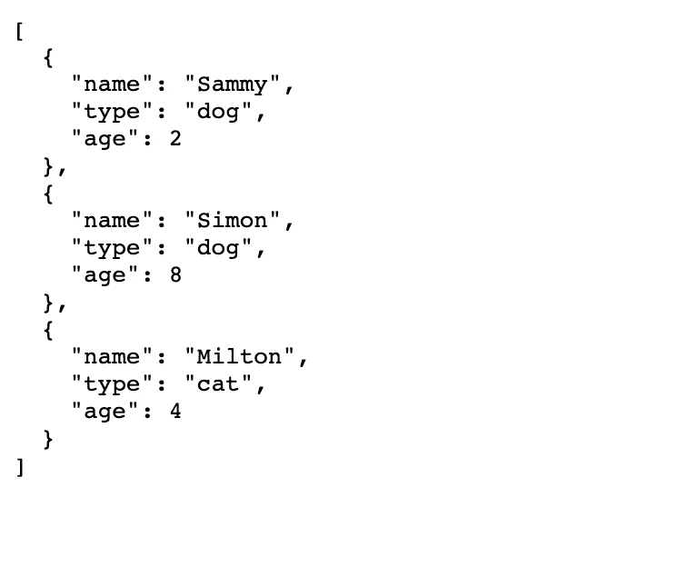
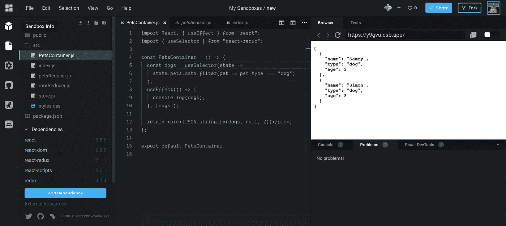
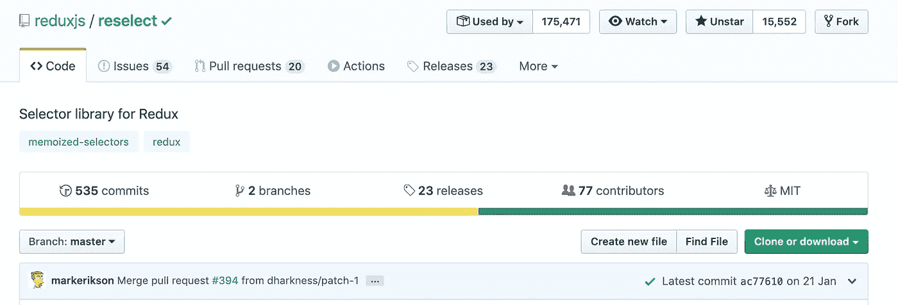
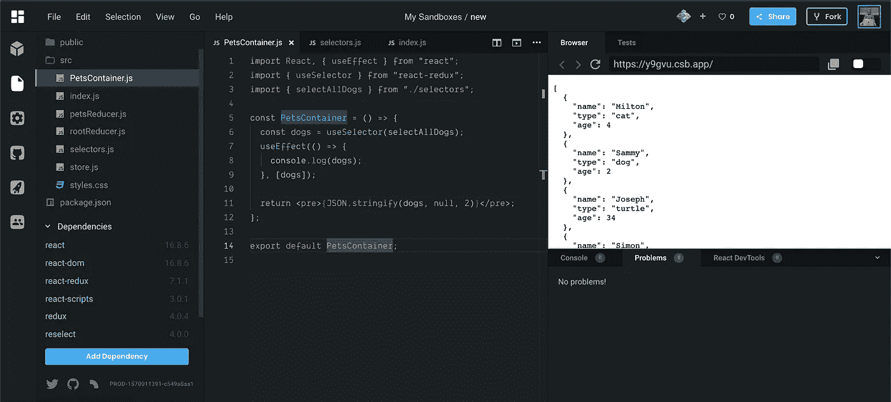
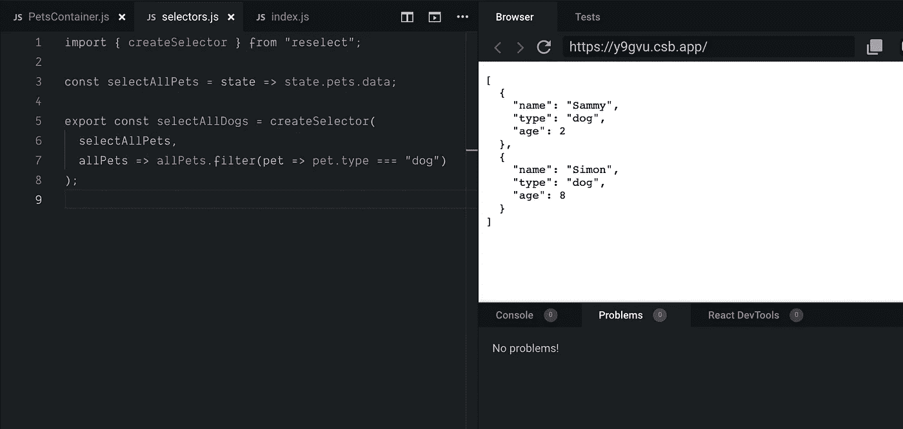
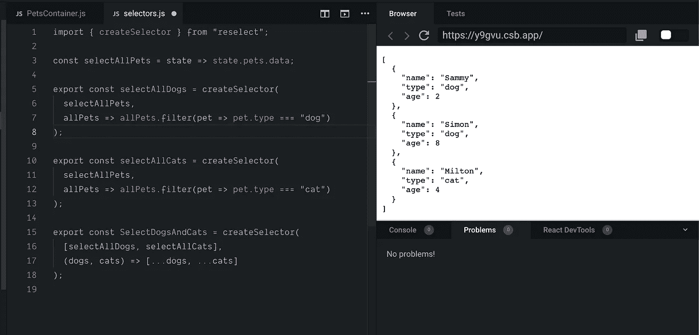
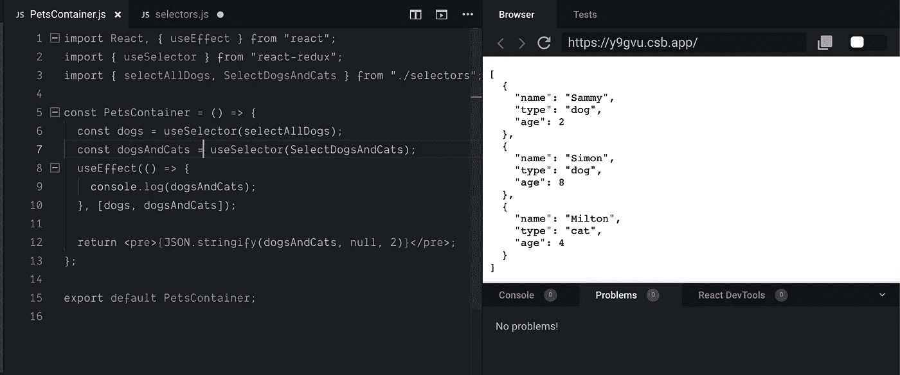

# 使用重新选择库提高 React + Redux 应用程序的性能

> 原文：<https://betterprogramming.pub/increase-your-react-redux-application-performance-with-reselect-library-3f4d632a08c5>

## 使用选择器从 React 和 Redux 应用程序中获得更多性能



在 Redux 商店中选择我们州的所有猫狗

选择器是从 redux 存储中“选择”状态的便捷方式。Redux 存储保存了我们所有的应用程序逻辑和数据；选择器用于从存储中挑选出特定的状态片段。

如果您正在使用 React 和 Redux 构建应用程序，您可能会从选择器中受益。

# 选择器长什么样？

在我们深入了解为什么选择器如此方便以及如何使用它们之前，让我们看看没有它们的应用程序是什么样子。我已经创建了我们需要的最基本的东西——一个基本的 Redux 设置:

*   我们有`rootreducer`,它目前保存着我们动物的所有数据:

```
const initialState = {
  data: [
    {
      name: "Milton",
      type: "cat",
      age: 4
    },
    {
      name: "Sammy",
      type: "dog",
      age: 2
    },
    {
      name: "Joseph",
      type: "turtle",
      age: 34
    },
    {
      name: "Simon",
      type: "dog",
      age: 8
    }
  ]
};

export default (state = initialState, action) => {
  switch (action.type) {
    default: {
      return { ...state };
    }
  }
};
```

*   我们的`rootreducer`被传递给商店，商店被传递给`<Provider>`
*   最后，`PetsContainer.js`连接到商店，挑选动物，在数据中找到所有的狗，并将它们呈现在屏幕上。

好吧，假设我们想从商店里选择所有的狗，并把它们呈现在屏幕上，我们该怎么做呢？一种简单的方法应该是这样的:



从商店中挑选状态，过滤并找到所有的狗。

注意到什么奇怪的事了吗？我们在`useSelector`回调中进行过滤。如果我们这样做不止一次，我们的应用程序会大大降低速度。更不用说这不是一段好看的代码。如果你熟悉 Redux，你会知道我们有 reducers 来改变和存储状态，动作来触发状态改变。第三个缺失的谜题是选择器。选择器非常适合这里的情况，因为我们需要一种有效的方式从我们的存储中获取数据并呈现它。

注意:我们在这里结合 Redux 使用 React 钩子。如果`useSelector`挂钩对你来说是新的，不要担心！这里有一篇关于它的文章。

[](https://itnext.io/how-to-use-redux-with-react-hooks-5422a7ceae6e) [## 如何将 Redux 与 React 挂钩一起使用

### React Redux 发布了 7.1.0 版本的钩子。这意味着我们可以使用 React 的最新最佳实践。

itnext.io](https://itnext.io/how-to-use-redux-with-react-hooks-5422a7ceae6e) 

# 添加重新选择库

Reselect 是 Redux(以及其他)的一个简单的“选择器”库，灵感来自于[核](https://github.com/optimizely/nuclear-js.git)中的 getters、[订阅](https://github.com/Day8/re-frame#just-a-read-only-cursor)中的[重组](https://github.com/Day8/re-frame)以及 [speedskater](https://github.com/speedskater) 中的[提议](https://github.com/reduxjs/redux/pull/169)。



重新选择 Github 页面—[https://github.com/reduxjs/reselect](https://github.com/reduxjs/reselect)

下面是为什么在 React 和 Redux 应用程序中使用选择器是有意义的:

*   选择器可以计算派生的数据，允许 Redux 存储最小可能的状态。
*   选择器是高效的。除非选择器的一个参数发生更改，否则不会重新计算选择器。
*   选择器是可组合的。它们可以用作其他选择器的输入。

# 正在安装重新选择库

安装重选库很简单。您可以像安装任何其他 NPM 软件包一样安装它:

```
yarn add reselect
```

现在我们有了库，让我们创建一个名为`selectors.js`的新文件——这是我们存储所有关于选择器的逻辑的文件。接下来，从重新选择库中导入`createSelector`方法:

```
import { createSelector } from "reselect";
```

太好了！现在我们可以使用`createSelector`方法。

# 创建您的第一个选择器

选择器很容易理解。`createSelector`需要多少参数就拿多少，关键是要明白最后一个参数是用来做过滤/选择的。假设我们想挑选所有的狗，这是我们传递给选择器的信息。

*   将所有宠物作为第一个参数传递给选择器，这些是依赖项。
*   最后一个参数始终是一个回调函数，参数作为之前传递的依赖项。

下面是代码的样子:

```
import { createSelector } from "reselect";

const selectAllPets = state => state.pets.data;

export const selectAllDogs = createSelector(
  selectAllPets,
  allPets => allPets
);
```

现在，如果我们回到`PetsContainer`，我们可以导入`selectAllDogs`选择器并将其传递给`useSelector` redux 挂钩:



将选择器传递给 useSelector 钩子

请注意，我们现在正在让所有的宠物返回。这是因为这正是我们在选择器中所做的。为了返回所有的狗，我们需要在选择器中应用过滤逻辑:



对选择器应用过滤逻辑

注意我们现在得到了所有的狗。我们只是渲染狗，而不是在组件内部进行过滤。这是减轻组件负担的好方法。请记住，React 组件擅长呈现标记，其他一切都应该在其他地方完成，以减少代码混乱和关注点分离。

我们甚至可以将选择器作为参数传递给其他选择器。我们如何从商店里挑选所有的狗和猫呢？



像热土豆一样传递选择器

*   首先，我们得到所有的宠物。
*   一旦我们有了所有的宠物，我们就可以过滤找到所有的狗和猫。
*   一旦我们选择了所有的狗和猫，我们就通过将选择器作为参数传递来将它们合并到一个选择器中。



渲染猫和狗

这就对了——漂亮而简单的 React 组件。请记住，选择器结果是记忆的，这意味着结果存储在内存中，并且将始终返回相同的结果，除非结果发生变化。这极大地提高了性能。如果你对结果是如何被记忆的感到好奇，[阅读这篇 StackOverflow 帖子](https://stackoverflow.com/a/53070891/5073961)进行深入分析。

[](https://stackoverflow.com/a/53070891/5073961) [## Redux 重选记忆化是如何工作的？

### 所以我们有这个选择器来获取 VisibleTodoList 组件的状态:const mapStateToProps = (state，props) => {…

stackoverflow.com](https://stackoverflow.com/a/53070891/5073961) 

如果你想进一步优化你的代码，[看看我以前的 React 性能技巧](https://medium.com/better-programming/5-react-performance-tips-f6e65295fba5)。

[](https://medium.com/better-programming/5-react-performance-tips-f6e65295fba5) [## 这些技巧将提升 React 代码的性能

### 从 2500 毫秒到 1500 毫秒的等待时间会对你的 UX 和转化率产生巨大的影响

medium.com](https://medium.com/better-programming/5-react-performance-tips-f6e65295fba5) [](https://developer.mastercard.com/blog/common-reselect-gotchas) [## 常见的重选陷阱

### Reselect 是一个经常和 Redux 一起使用的记忆库。如果你不熟悉这些库的基础知识，我会…

developer.mastercard.com](https://developer.mastercard.com/blog/common-reselect-gotchas) 

如果你想玩选择器，这里有代码沙箱和源代码。

如果你是 JavaScript 新手，想学习这门语言，我建议你从阅读书籍和构建东西开始。从《 [*一种更聪明的学习 JavaScript 的方法*](https://amzn.to/2LOkzjj) 》一书开始，这里有一个有趣的应用程序列表，可以用来构建。

感谢阅读，编码快乐。