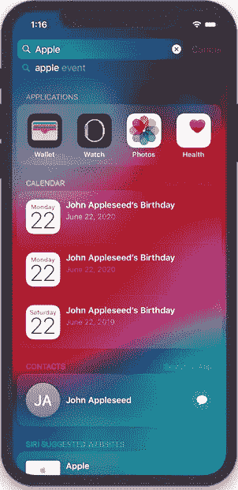
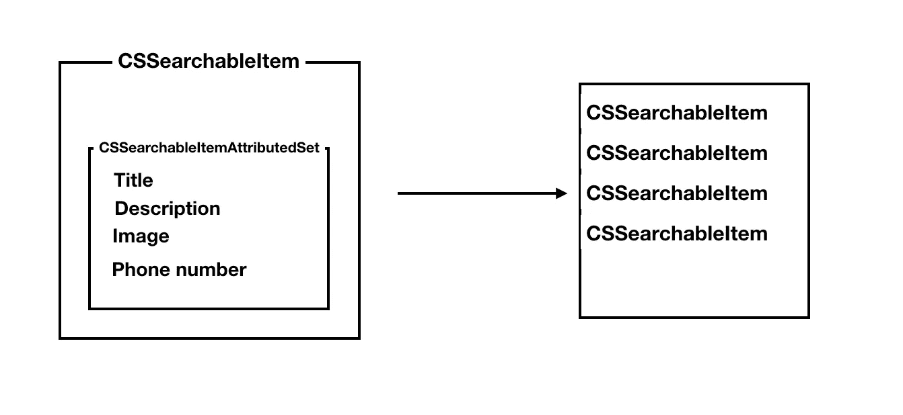
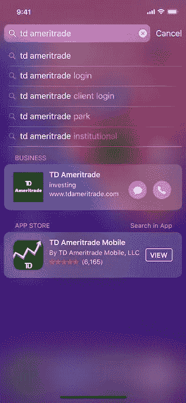
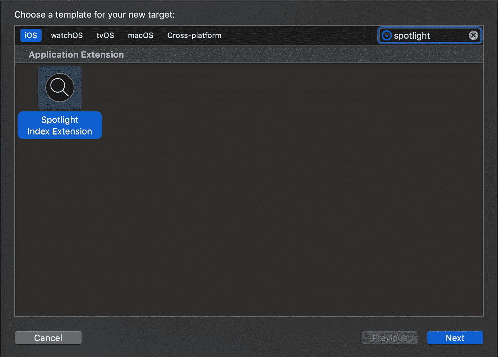

# 使用 Core Spotlight 索引您的应用内容

> 原文：<https://betterprogramming.pub/index-your-app-content-with-core-spotlight-def31cbb7736>

## 不费吹灰之力增加您的应用程序展示

照片由[塞缪尔·泽勒](https://unsplash.com/@samuelzeller?utm_source=unsplash&utm_medium=referral&utm_content=creditCopyText)在 [Unsplash](https://unsplash.com/search/photos/catalogue?utm_source=unsplash&utm_medium=referral&utm_content=creditCopyText) 拍摄

# **为什么实施搜索 API 很重要？**

大多数应用程序都包含内容，或者由用户创建，或者由应用程序本身创建。iOS 包含一个名为 *Spotlight* 的伟大搜索引擎，它在你的设备上扮演着谷歌的角色。

Spotlight 搜索您的设备内容、应用程序，甚至网站。让您的应用程序内容存在于 Spotlight 中非常容易，并且可以暴露您的内容，即使对于没有安装您的应用程序的用户也是如此。

# **利用您的应用程序存在**

Apple 提供了三个主要的 API 来使您的应用程序更容易被发现:

*   核心聚焦:在用户的设备上为你的内容建立秘密索引。
*   NSUserActivity:通过跟踪用户的活动和状态，并将其同步回 Apple，使您的内容在设备上和对公众都可以被发现
*   Web Markups:索引与应用相关的网页(本教程不讨论)。

这三个 API 使用起来都很快很简单，只需一点点努力，你就可以让你的用户从你的应用程序中检索搜索结果，有时甚至当他们没有安装你的应用程序时。

# 使用 Core Spotlight 索引您的数据

核心 Spotlight 框架旨在索引您的数据，我所说的“数据”是指您想要的任何东西——无论是用户文档、相关联系人、地址，甚至是图像。

将项目添加到 Spotlight 索引有三个步骤:

1.  定义项目属性—标题、描述、电话号码、图像等。
2.  根据我们刚刚设置的属性，为索引创建一个项目。
3.  将项目添加到 Spotlight 索引。

内容索引的工作原理

让我们复习一下步骤:

# **定义项目属性—CSSearchableItemAttributeSet**

这是索引内容的第一步，也是最重要的一步:定义内容的属性。

我们创建一个`CSSearchableItemAttributeSet`实例，然后开始填充它的属性。

当我们初始化实例时，我们需要传递它的内容类型。内容类型需要是字符串类型的某种 UTI。

在实例化属性集之后，您可以开始填充它的属性，比如主题、标题、描述、创建者种类等等。

该类有几个扩展，例如:

*   `CSSearchableItemAttributeSet_Places`
*   `CSSearchableItemAttributeSet_Events`
*   `CSSearchableItemAttributeSet_Documents`
*   还有更多。

它们拥有对象的不同属性集。

尝试填充尽可能多的属性—丰富的属性集将更好地转化为搜索结果和更好的用户体验。此外，苹果使用的搜索算法会优先搜索更丰富的结果。

一些属性与电话号码、地址和位置相关。

这意味着，每当搜索结果包含具有这些属性的项目时，呼叫/导航操作按钮将出现在搜索项目结果的旁边，并让您的用户获得对搜索结果的快速响应。

# **创建搜索项**

这是一个单行步骤。创建一个搜索条目(`CSSearchableItem`)非常容易，您只需要传递三个参数:条目标识符、域标识符和我们在前面的集合中创建的属性集合。

*   项目标识符有两个作用——一个是给项目一个唯一的 ID，这样你就可以在以后删除或修改它，第二个是当用户点击项目并打开你的应用程序时，你可以根据传递的标识符加载相关屏幕。
*   域标识符是一个可选参数，用于对用户的搜索结果进行分组。它还可以帮助您非常容易地删除特定域中的项目。

可搜索项目的另一个属性是截止日期。默认情况下，项目的到期日期是一个月，但是您可以随时覆盖该属性。

# **使用 CSSearchableIndex 索引可搜索项目**

为了索引一个条目，我们将它添加到`CSSearchableIndex`中。

`CSSearchableIndex`有一个叫*的独生子默认*。这个方法有一个名为`indexSearchableItems`的方法，它有一个参数，这个参数是要索引的项目的数组。

您现在应该明白，最佳实践是将您的数据映射到可搜索的项目，然后将它们一起索引，而不是一个一个地索引。

`CSSearchableIndex`有额外的方法，如删除索引中的所有项目，按标识符删除项目，或按域删除项目。

# 使用 NSUserActivity 索引您的用户活动

另一种给用户带来相关搜索结果的方法是使用一种叫做`NSUserActivity`的东西。

`NSUserActivity`是为了跟踪用户状态，然后将其同步到其他 Apple 设备，以实现切换和连续性。但是，跟踪用户活动也可以帮助 Spotlight 带来更好、更准确的搜索结果。

通过跟踪应用程序的用户活动，你可以在搜索引擎中检索项目。记住— `CSSearchableIndex`反映了你的应用有什么，`NSUserActivity`反映了你的用户对你的内容做了什么。

就像`CSSearchableItem`一样，创建一个活动简单明了:

使搜索结果更加丰富的另一种方法是将`CSSearchableItemAttributeSet`对象附加到用户活动中。是的，就是我们用来索引`CSSearchableItem`的那个类。

# 向世界展示流行的活动

这里有一点需要注意。有一个属性叫做`isEligibleForPublicIndexing` **。**

这意味着此搜索结果也可以显示给其他用户，即使他们没有安装您的应用(！idspnonenote)。).所以，千万不要把这个属性设置为`true`，除非你确定这不是私人用户内容。

# **在后台索引您的内容**

您可以在后台索引您的内容，以使您的内容在搜索结果中保持最新。

为此，您需要创建一个 Spotlight 索引扩展**。**

该扩展有三个作用:

1.  当用户从备份或数据恢复中恢复您的应用时，重新索引您的数据。
2.  对即将过期的数据进行重新索引(当然，如果需要的话)。
3.  通过拖放操作(在 iPad 上)将收到的新项目编入索引。

这听起来像是一个小问题，但是如果你想完全维护你的索引，这可能是一个理想的方法。

# **搜索最佳实践**

以下是一些关于 iOS 搜索的最佳实践:

1.  尝试将`CSSearchableItemAttributeSet`用于图片，让您的搜索结果引人注目。
2.  在`NSUserActivity`中使用关键词，每项活动使用三到五个关键词。
3.  通过移除和更新项目来更新您的可搜索项目索引，以使您的结果相关。
4.  最好是创建一个可以为项目提供一个`CSSearchableItemAttributeSet`的服务。这不仅有利于测试，而且您还可以为`NSUserActivity`和`CoreSpotlight`重用代码。
5.  试着理解什么时候索引你的内容。它可以在应用程序加载时、数据更改时或与服务器同步后进行。
6.  注意有效期。为了让你的内容在搜索结果中活跃起来，确保你设置了一个很远的过期日期，重新索引它。
7.  如果你建立了一个搜索扩展，与主应用程序共享索引代码。

# **总结**

与您从中获得的好处相比，为您的搜索内容建立索引是多么容易，这令人惊讶。

加入 Spotlight 可以增加你对应用程序的参与度。