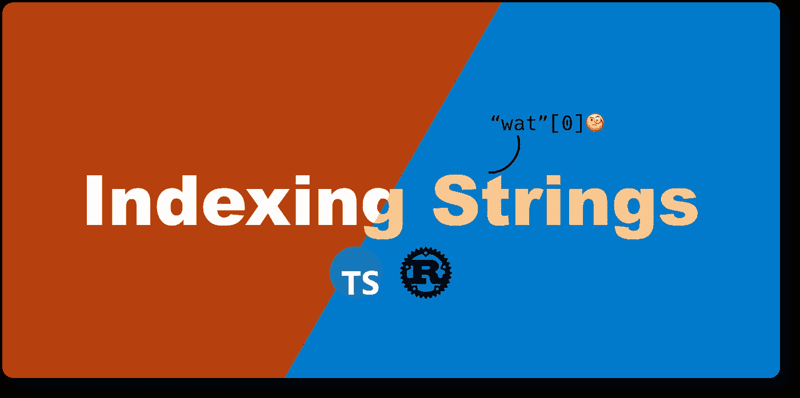

# Rust 和 TypeScript 中的索引字符串:字符串的案例研究

> 原文：<https://betterprogramming.pub/indexing-strings-in-rust-and-typescript-a-case-study-of-strings-805b351ca4d6>

## Rust 和 JavaScript 如何处理字符串，以及如何处理字形甚至表情符号等细微差别。



作者图片

# TL；速度三角形定位法(dead reckoning)

*   🪢访问带索引的字符串中的字符在 Rust 中是不可编译的。
*   🎸我们将讨论 Rust 如何看待字符串。
*   🤖我们将讨论 JavaScript 如何处理字符串。
*   🧑‍🔬我们将比较 Rust 和 TypeScript 中的一个经典算法`is_palindrome`。

文本在编程语言中是必不可少的。String 是 Rust 和 JavaScript 的定义，用于处理世界各地书面语言中的文本。通过字符串索引的简单概念，我们将讨论 Rust 和 JavaScript 如何处理字符串，以及它们如何处理字符串中的细微差别，如字形，甚至表情符号。

让我们用一个经典算法`is_palindrome`来介绍一下字符串索引的概念。

# `is_palindrome`在生锈

一个[回文](https://en.wikipedia.org/wiki/Palindrome)，用一种非常一般的方式来解释，就是一个前后读起来一样的字符串。” **Ana** 是回文，“**一条狗！宝塔里的恐慌！**"是回文，甚至" **02/02/2020** "也是回文。

出于本文的目的，我们将使用一个更窄的定义来保持算法简单。这里的回文被定义为“没有空格的小写 ASCII 字母字符的连续序列”。

一种直观的方法是使用两个指针。一个从给定字符串的开头开始向末尾移动，另一个从末尾向开头移动。移动指针时，比较指向字符。如果所有的比较都相等，那么给定的字符串就是一个回文。像这样:

如果你试着编译这个程序，你会注意到 Rust 编译器不允许我们通过索引访问字符。这是一个非常有趣的约束，因为像 JavaScript、Go 和 Python 这样的许多语言都提供了这个特性。

随着我们深入挖掘，标准库中有一些字符串方法可以访问字符串中的字符，比如`[chars()](https://doc.rust-lang.org/stable/std/string/struct.String.html#method.chars)`。`chars()`返回字符串切片的`char`上的迭代器。所以我们必须遍历一个字符串片，通过索引来访问字符。像这样:

```
let left = str.as_str().chars().nth(lp).unwrap();
```

访问字符串中一个字符的简单任务的时间复杂度是`O(n)`而不是`O(1)`。

这是为什么呢？

# Rust 的字符串是 Unicode 和 UTF 8 编码的

我们可以从[官方锈书](https://doc.rust-lang.org/book/)中找到锈弦的[内参](https://doc.rust-lang.org/book/ch08-02-strings.html#internal-representation)。

> 字符串是 Vec < u8 >上的包装器。

对于 [ASCII 码](https://en.wikipedia.org/wiki/ASCII)中的字符串，每个字符由在 [UTF-8](https://en.wikipedia.org/wiki/UTF-8) 中编码的 1 个字节表示。然而，对于其他书面语言中的字符串，如 Rust book 中的梵文脚本中的[“नमस्ते”,每个字符都以 UTF-8 编码，具有多个](https://doc.rust-lang.org/book/ch08-02-strings.html#bytes-and-scalar-values-and-grapheme-clusters-oh-my) [Unicode 值](https://en.wikipedia.org/wiki/Unicode)(代码单元)。

所以在锈书里，它说:

> *对字符串进行索引通常不是一个好主意，因为不清楚字符串索引操作的返回类型应该是什么:字节值、字符、字素簇还是字符串片段。*

这也是 Rust 编译器不允许直接访问字符串中的字符的原因之一。我真的推荐你在[锈书](https://doc.rust-lang.org/book/ch08-02-strings.html)里多看看。非常好读，很有见地。

# 校正`is_palindrome`

我们可以对[字节](https://doc.rust-lang.org/stable/std/string/struct.String.html#method.bytes)进行迭代，并将字符串的前半部分与反转的后半部分进行比较。如果它们相等，这是一个回文:

时空复杂度:

*   O(n) time，其中 n 是字符串的长度。
*   O(1)空间。

空间复杂度是`O(1)`，因为每个迭代器创建一个指针和一个计数器。

另一种方法是使用 [DoubleEndedIterator](https://doc.rust-lang.org/std/iter/trait.DoubleEndedIterator.html) 特征，并用`[zip()](https://doc.rust-lang.org/std/iter/fn.zip.html)`组合前向和后向迭代器:

时空复杂度:

*   O(n) time，其中 n 是字符串的长度。
*   O(1)空间。

[Reddit](https://www.reddit.com/r/programming/comments/rr9dlw/indexing_strings_in_rust_and_typescript_a_case/)上建议采用这种方式。非常感谢！

# 在打字稿中

JavaScript 允许字符串索引。所以我们实际上可以翻译 rust 中没有编译的双指针算法。

时间和空间复杂度为:

*   O(n) time，其中 n 是字符串的长度
*   O(1)空间。两个指针的恒定空间。

或者只是向前和向后比较字符串:

时空复杂度:

*   O(n) time，其中 n 是输入字符串的长度
*   O(n)空间，其中 n 是输入字符串的长度

这在 JavaScript 中相当容易。这是否意味着 JavaScript 对待字符串的方式与 Rust 不同？

# JavaScript 字符串是 UTF-16 编码的

我们可以在 [ECMAScript 标准](https://tc39.es/ecma262/#sec-terms-and-definitions-string-value)中找到字符串原始值的定义:

> *原始值，即零个或多个 16 位无符号整数值的有限有序序列*
> 
> *字符串值是字符串类型的成员。序列中的每个整数值通常表示 UTF-16 文本的一个 16 位单元。*

换句话说，每个 JavaScript 字符用两个字节的 Unicode 表示，用 UTF-16 编码。

让我们来看一些例子。我们可以使用一个或两个代码单元来创建一个角色:

```
const s1: string = '\u00E1' // á
const s2: string = '\u0061\u0301' // á
```

`s1`和`s2`组成一个`á`。如果我们检查两根弦的长度:

```
console.log(s1.length) // 1
console.log(s2.length) // 2
```

即使它们都表示相同的字符，长度也是不同的。让我们用字符串索引查看字符串内部，找出字符串中的元素:

```
console.log(s1[0]) // á
console.log(s1[1]) // undefinedconsole.log(s2[0]) // a
console.log(s2[1]) //  ́
console.log(s2[2]) //  undefined
```

我们可以看到`s2`是由两个独立的元素`a`和`́`组成的。

仅仅是看到同一个字符可以用不同的方式表示，很明显 JavaScript 中的字符串索引也不可靠。

让我们检查是否相等:

```
console.log(s1 === s2) // false 🧐
```

更有趣的是，还有另一种方法来组合角色`á`:

```
const s3: string = 'a\u0301' // á
```

在`s3`中，我们将代码单元`\u0061`替换为其代表字符`a`。让我们做一些检查:

```
console.log(s3.length === 2) // true
console.log(s2 === s3) // true 🧐
console.log(s1 === s3) // false
```

到目前为止，我们看到的是，有多个代码单元组合来表示同一个字符。相等性是由代码单元组合定义的。

这非常不方便，所以 JavaScript 引入了一个字符串方法`[normalize()](https://developer.mozilla.org/en-US/docs/Web/JavaScript/Reference/Global_Objects/String/normalize)`来返回给定字符串的 Unicode 范式。让我们用`s1`、`s2`和`s3`来试试:

```
console.log(s1.normalize() === s2.normalize()) // true
console.log(s1.normalize() === s3.normalize()) // true
```

让我们来看看`á`的规范化形式:

```
// `escape` is deprecated.
escape(s1.normalize()) // '%E1'
escape(s2.normalize()) // '%E1'
escape(s3.normalize()) // '%E1'
```

注意`[escape()](https://developer.mozilla.org/en-US/docs/Web/JavaScript/Reference/Global_Objects/escape)`已经从 ECMAScript 标准中删除。

由于标准化，现在处理字符串更加容易预测。

JavaScript 实际上提供了官方的[编码 API](https://developer.mozilla.org/en-US/docs/Web/API/Encoding_API) 。我们可以使用 [TextEncoder](https://developer.mozilla.org/en-US/docs/Web/API/TextEncoder) 和 [TextDecoder](https://developer.mozilla.org/en-US/docs/Web/API/TextDecoder) 来处理字符串编码和解码。

# 综上

字符串很复杂。Rust 提供了一个健壮的系统来处理字符串，并提供了一个严格的编译器来鼓励我们提前考虑字符串处理。另一方面，JavaScript 提供了方便的 API 来处理像 ASCII 这样的简单用例。在幕后，它们都实现了 Unicode 标准和编码，以支持国际性的书写语言。

# 参考

*   [ASCII 码](https://en.wikipedia.org/wiki/ASCII)
*   [Unicode](https://en.wikipedia.org/wiki/Unicode)
*   [UTF-8](https://en.wikipedia.org/wiki/UTF-8)
*   [UTF-16](https://en.wikipedia.org/wiki/UTF-16)
*   [回文](https://en.wikipedia.org/wiki/Palindrome)
*   [Rust 编程语言](https://doc.rust-lang.org/book/)
*   [Rust 的字符串内部表示](https://doc.rust-lang.org/book/ch08-02-strings.html#internal-representation)
*   [锈弦法](https://doc.rust-lang.org/stable/std/string/struct.String.html#method.chars) `[chars()](https://doc.rust-lang.org/stable/std/string/struct.String.html#method.chars)`
*   [锈弦法](https://doc.rust-lang.org/stable/std/string/struct.String.html#method.bytes) `[bytes()](https://doc.rust-lang.org/stable/std/string/struct.String.html#method.bytes)`
*   [锈弦法](https://doc.rust-lang.org/std/iter/fn.zip.html)
*   [锈弦性状](https://doc.rust-lang.org/std/iter/trait.DoubleEndedIterator.html)
*   [ECMAScript 2022 语言规范](https://tc39.es/ecma262/#sec-terms-and-definitions-string-value)
*   [JavaScript](https://developer.mozilla.org/en-US/docs/Web/JavaScript/Reference/Global_Objects/String/normalize)
*   [JavaScript](https://developer.mozlla.org/en-US/docs/Web/JavaScript/Reference/Global_Objects/escape)
*   [JavaScript 编码 API](https://developer.mozilla.org/en-US/docs/Web/API/Encoding_API)
*   [JavaScript TextEncoder](https://developer.mozilla.org/en-US/docs/Web/API/TextEncoder)
*   [JavaScript TextDecoder](https://developer.mozilla.org/en-US/docs/Web/API/TextDecoder)
*   [每个 JavaScript 开发人员应该知道的 Unicode 知识](https://dmitripavlutin.com/what-every-javascript-developer-should-know-about-unicode/)

这篇文章最初发布在[道智的网站](https://dawchihliou.github.io/articles/indexing-strings-in-rust-and-typescript)。