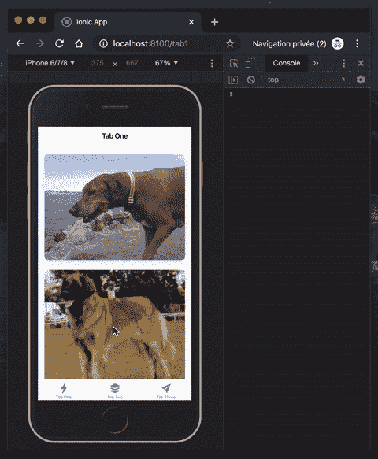

# 无限卷轴与离子起反应

> 原文：<https://betterprogramming.pub/infinite-scroll-with-ionic-react-dc3e5e63b56e>

## 如何用 Ionic 和 React 实现无限滚动，用钩子实现滤镜


由[罗宾·沃拉尔](https://unsplash.com/@robin_rednine?utm_source=unsplash&utm_medium=referral&utm_content=creditCopyText)在 [Unsplash](https://unsplash.com/s/photos/scroll?utm_source=unsplash&utm_medium=referral&utm_content=creditCopyText) 上拍摄

今年早些时候推出了[Ionic React](https://ionicframework.com/blog/announcing-ionic-react/)，本周四我将在我们当地的 [Meetup](https://www.meetup.com/fr-FR/Ionic-Zurich/events/265767496/) 上介绍它的一些特性。其中之一是一个无限滚动器的实现，我将在下面的帖子中与你分享。

# 开始之前

要实现该解决方案，我们需要一个 Ionic + React 应用程序。

如果您还没有，或者您只是想创建一个示例来遵循本教程，请查看文档齐全且易于遵循的官方[文档](https://ionicframework.com/docs/react)，或者使用以下命令启动一个示例:

```
$ ionic start infiniteScroll tabs --type react
```

# 入门指南

Ionic 用来创建新应用程序的入门套件包含三个选项卡，三个页面，它们本身就是 React 功能组件。出于方便的原因，我们将在第一个选项卡中实现我们的解决方案，分别在文件`./src/pages/Tab1.tsx`中。

由于我们要实现无限滚动，因此要显示一个列表，我们要做的第一件事是添加一个应该包含我们的项目的有状态值。

为此，我们使用了`[useState](https://reactjs.org/docs/hooks-reference.html#usestate)` React 钩子。此外，我们使用卡片来呈现它们，并添加了另一个状态，这将帮助我们在没有什么可迭代的时候停止滚动。

```
import {
  IonContent, IonHeader, IonPage,
  IonTitle, IonCard, IonToolbar} from '@ionic/react';
import React, {useState} from 'react';const Tab1: React.FC = () => { const [items, setItems] = useState<string[]>([]); const [disableInfiniteScroll, setDisableInfiniteScroll] = 
        useState<boolean>(false); return (
    <IonPage>
      <IonHeader>
        <IonToolbar>
          <IonTitle>Tab One</IonTitle>
        </IonToolbar>
      </IonHeader>
      <IonContent>
        {items.map((item: string, i: number) => {
           return <IonCard key={`${i}`}>
                  </IonCard>
        })}
      </IonContent>
    </IonPage>
  );};
```

# 获取 API

项目列表也意味着数据列表。在我们的特定示例中，我们将使用 [Dog API](https://dog.ceo/dog-api/) 来获取信息，它已经成为我在教程中最喜欢的 API。

这个 API 是免费的、开源的，不需要任何令牌，并且支持 CORS 请求。

```
async function fetchData() {
  const url: string = 'https://dog.ceo/api/breeds/image/random/10';

  const res: Response = await fetch(url);
  res
      .json()
      .then(async (res) => {
        if (res && res.message && res.message.length > 0) {
          setItems([...items, ...res.message]); setDisableInfiniteScroll(res.message.length < 10);
        } else {
          setDisableInfiniteScroll(true);
        }
      })
      .catch(err => console.error(err));
}
```

注意，这个例子不包含任何分页，而您真正的解决方案会包含分页。它会随机取出 10 只狗。当然，由于这个原因，我们的列表中可能会有重复项。

# 加载初始数据

Ionic 提供了我们可以在应用中使用的多个生命周期事件。我非常欣赏的一点是，他们不仅为标准组件提供这样的事件，也为功能组件提供这样的事件。

为了在页面显示时获取数据，我们可以挂接在`ionViewWillEnter`上，当组件路由将要以动画形式出现在视图中时，会触发该事件。

```
import {useIonViewWillEnter} from '@ionic/react';const Tab1: React.FC = () => {useIonViewWillEnter(async () => {
    await fetchData();
  });};
```

# 无限卷轴

让我们切入正题，我们现在要添加我们的无限滚动条。首先，我们添加了一个新的函数，它将帮助我们获取新的数据，并停止告诉 scroller 操作已经完成。

```
async function searchNext($event: CustomEvent<void>) {
    await fetchData(); ($event.target as HTMLIonInfiniteScrollElement).complete();
}
```

最后，我们导入离子无限卷轴组件。

```
import {IonInfiniteScroll, IonInfiniteScrollContent}
       from '@ionic/react';
```

在我们的内容中呈现如下:

```
<IonInfiniteScroll threshold="100px"
    disabled={disableInfiniteScroll}
    onIonInfinite={(e: CustomEvent<void>) => searchNext(e)}>
    <IonInfiniteScrollContent
        loadingText="Loading more good doggos...">
    </IonInfiniteScrollContent>
</IonInfiniteScroll>
```

# 全代码

我将上述步骤中的代码进行了拆分，以使实现更容易理解(我希望如此)，但是完整的代码放在一起，你可以在 [GitHub](https://github.com/peterpeterparker/infiniteScroll/blob/master/src/pages/Tab1.tsx) 上找到。

# 试验

如果一切按计划进行，一旦您用命令行`ionic serve`运行我们的应用程序，您应该能够用您最喜欢的浏览器浏览无限的狗列表。



这么多狗

# 过滤

显示经过过滤的项目列表可能和无限滚动条一样常见。

因此，让我们以新状态的形式向我们的实现中添加一个过滤器，并修改`fetch`函数，以便在应用过滤器的情况下重置项目并只查询指定的品种。

```
const [filter, setFilter] = useState<string | undefined>(undefined);async function fetchData(reset?: boolean) {
  const **dogs**: string[] = reset ? [] : items;
  const url: string = filter ?
        `https://dog.ceo/api/breed/${filter}/images/random/10` : 
        'https://dog.ceo/api/breeds/image/random/10';

  const res: Response = await fetch(url);
  res
      .json()
      .then(async (res) => {
        if (res && res.message && res.message.length > 0) {
          setItems([...**dogs**, ...res.message]);

          setDisableInfiniteScroll(res.message.length < 10);
        } else {
          setDisableInfiniteScroll(true);
        }
      })
      .catch(err => console.error(err));
}
```

# 用 React 钩子获取和刷新数据

为了观察应用于过滤器的变化并刷新数据，我们现在要用一个`useEffect` React 钩子替换之前使用的`useIonViewWillEnter`生命周期。

这样做，当我们进入页面时，数据仍然会被加载，而且在状态更新时也会被获取。

```
import React, {useState, useEffect} from 'react';const Tab1: React.FC = () => { useEffect( () => {
      fetchData(true);
  }, [filter]);};
```

我们进口离子按钮和标签。

```
import {IonButton, IonLabel} from '@ionic/react';
```

并且最终使用这些组件来触发只有腊肠狗的狗列表的过滤。

```
<IonButton onClick={() => setFilter('dachshund')}>
    <IonLabel>Filter</IonLabel>
</IonButton>
```

# 演示解决方案

我已经在我上传到 [GitHub](https://github.com/peterpeterparker/infiniteScroll/blob/master/src/pages/Tab2.tsx) 的演示解决方案的第二个选项卡中实现了这个过滤器示例。

# 试验

如果您再次运行该应用程序，您现在应该能够过滤列表中只有腊肠犬。


这么多腊肠狗

# 蛋糕上的樱桃

无限滚动只是 Ionic + React 的精彩特性之一，也是我在 Meetup 实现的原型中使用的特性之一。

此外，我构建的小应用程序是免费和开源的，在 [Wooof](https://wooof.ch) 上试试吧。

到无限和更远的地方，

大卫