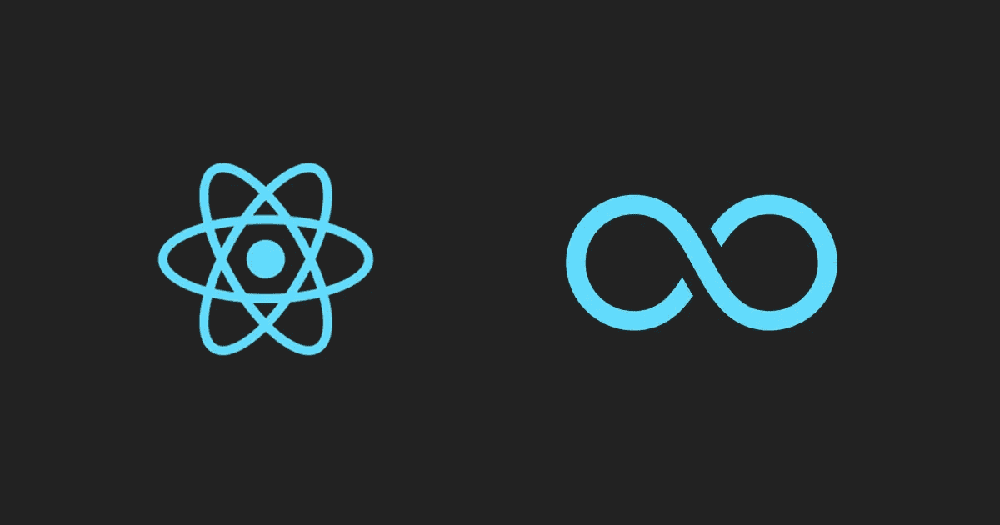
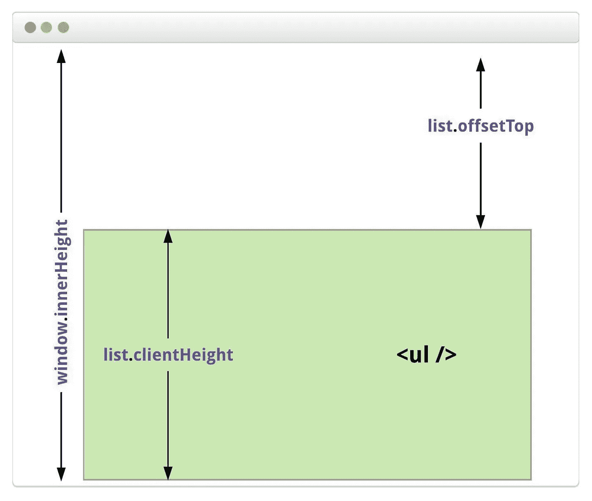

# 带反应钩的无限卷轴

> 原文：<https://betterprogramming.pub/infinite-scroll-with-react-hooks-and-context-api-b622b4f9c43f>



无限列表(*滚动*)功能已经存在一段时间了。这是增强应用程序 UX 的好方法。

有许多第三方库可用，但是如果你像我一样喜欢挑战自己，我们将在这篇文章中使用钩子从头开始探索实现。

让我们快速编写一个简单的应用程序组件。我们初始化一个空状态，并将对`state`和`setState`的引用传递给我们的`InfiniteList`组件。

`InfiniteList`组件将返回从[狗 API](https://dog.ceo/dog-api/) 获取的狗图像的无序列表。

一旦我们的请求成功，我们就将图像推送到父代的状态。我们将确保不覆盖先前的状态，因为我们将多次使用`getData()`函数来获取更多的图像。所以，点点点点`. . .`

到目前为止，这显示了前 15 幅图像。

现在我们需要在用户向下滚动到视窗的最底部时监听事件，并获取更多图像，再次调用`getData()`。

但是我们如何确定底部范围呢？我希望这张图片能帮助你理解。



1.  `window.innerHeight`—静态，用户浏览器窗口的高度。
2.  `window.scrollY` —动态属性，当前滚动位置。
3.  `list.clientHeight` —静态，容器的高度(`ul`元素)。
4.  `list.offsetTop` —从页面顶部开始的容器缩进(如果有)，静态。

好的，如果 1+2===3+4，我们知道一个用户在页面的底部，我们需要获取。

但是如果我们希望`ul`是一个固定的高度呢？我们需要获得 ul 的属性:

1.  `element.scrollHeight` —静态值，可滚动的总高度。
2.  `element.scrollTop` —动态值，当前滚动顶端位置。
3.  `element.clientHeight` —静态值，元素的当前高度(不包括溢出)。

因此，1===2+3 将表示用户已经到达容器的底部。现在我们可以通过设置`scrollable`属性有条件地告诉组件它是否是固定高度的。

让我们把这些都放到新的`useEffect`钩子里。

还有最后一个解决办法。让我们初始化一个状态，然后，一旦满足上面的条件，我们切换状态，通过使我们的第一个钩子依赖于状态的值，给它一个获取更多的信号。

```
const [loadMore, setLoadMore] = useState(false);useEffect(() => {
  setLoadMore(false);
  getData();
}, [loadMore]);
```

我们还可以在等待 API 响应时，有条件地在底部呈现一个 loading spinner，方法是用某个真值初始化一个新状态，然后在请求完成后重置它。

此外，为了避免潜在的错误，我们可以在组件卸载时从窗口对象中移除事件监听器，方法是在`useEffect`中添加一个返回语句，如下所示:

# 资源

[现场演示](https://infinite-scroll.olegakan5326.now.sh) | [回购](https://github.com/aleckan53/infinite-scroll)

感谢您的阅读和快乐编码！